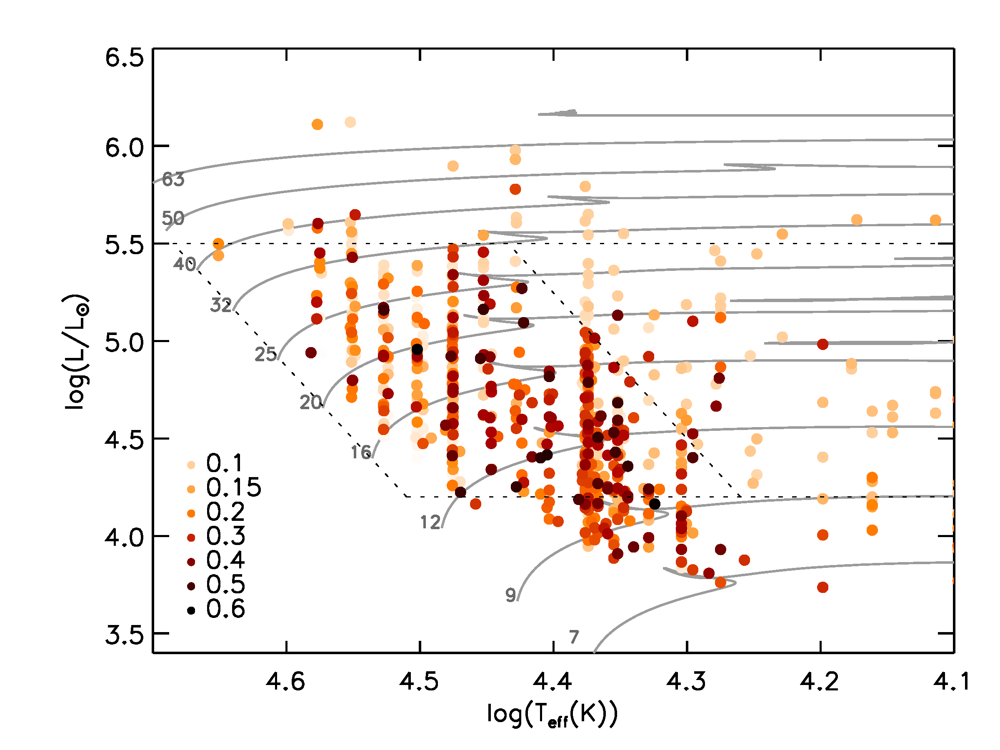
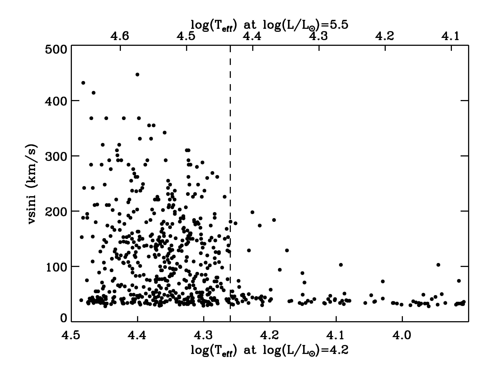

$\newcommand{\ensuremath}{}$
$\newcommand{\xspace}{}$
$\newcommand{\object}[1]{\texttt{#1}}$
$\newcommand{\farcs}{{.}''}$
$\newcommand{\farcm}{{.}'}$
$\newcommand{\arcsec}{''}$
$\newcommand{\arcmin}{'}$
$\newcommand{\ion}[2]{#1#2}$
$\newcommand{\textsc}[1]{\textrm{#1}}$
$\newcommand{\hl}[1]{\textrm{#1}}$
$\newcommand{\footnote}[1]{}$
$\newcommand{\kms}{{km s}^{-1}}$
$\newcommand{\teff}{T_\mathrm{eff} }$
$\newcommand{\logg}{\log g }$
$\newcommand{\vt}{\varv_{\rm{t}}}$
$\newcommand{\Msun}{M_\odot}$
$\newcommand{\Lsun}{L_\odot}$
$\newcommand{\Rsun}{R_\odot}$
$\newcommand{\Tsun}{T_\odot}$
$\newcommand{\vsini}{\varv\sin i}$
$\newcommand{\vsinift}{\varv\sin i_{\rm FT}}$
$\newcommand{\vsinifwhm}{\varv\sin i_{\rm FWHM}}$
$\newcommand{\ve}{\varv_{\rm{esc}}}$
$\newcommand{\vcrit}{\varv_{\rm{crit}}}$

# Binarity at LOw Metallicity (BLOeM)$\thanks{Based on observations collected at the European Southern Observatory under ESO program ID 112.25R7}$  : Projected rotational velocities

<mark>Appeared on: 2025-12-16</mark> -  _16 pages, 18 figures. 3 tables are only available in electronic form. Submitted to Astronomy and Astrophysics_

D. J. Lennon, et al.

**Abstract:** The Binarity at LOw Metallicity (BLOeM) survey is an ESO large programme designed to obtain multi-epoch spectroscopy for 929 massive stars in the Small Magellanic Cloud (SMC).It will provide binary fractions and orbital configurations of binary systems, and search for dormant black-hole binary candidates (OB+BH).Here we present projected rotational velocities ( $\vsini$ ) of all sources and, using the multiplicity properties presented in previous papers, we derive the $\vsini$ distributions of apparent single stars, single lined spectroscopic (SB1) binaries, and SB2 systems.We identify a locus in the Hertzsprung-Russell diagram where rotational velocities decrease significantly; we interpret this feature as broadly corresponding to the terminal-age main sequence.The main sequence cohort is distinguished by a broad range of $\vsini$ values, but with a strong peak in the distribution in the range 30--60 $\kms$ , close to the resolution limit of $\sim$ 30 $\kms$ .Sources in this low $\vsini$ peak are distributed throughout the main sequence, and are also present in the SB1 sample, though less prominent than in the single star distribution.A preliminary analysis of the lowest $\vsini$ cohort, that includes SB1 systems, implies that roughly one third may be nitrogen rich and we speculate that this cohort is a mix of pristine single stars, long period binaries, and merger products.The SB2 systems appear to be mostly short period binaries in synchronous rotation and have $\vsini$ estimates distributed around a mean value of $\approx$ 140 $\kms$ .Higher $\vsini$ sources are also present in the single and SB1 systems, all of which have tail to higher $\vsini$ values, consistent with tidal and mass-transfer effects.The supergiants, with a few exceptions, have low $\vsini$ , the bulk of these systems being essentially unresolved at current spectral resolution ( $\sim$ 30 $\kms$ ).

**Figure 17. -** HRD of the BLOeM OB sources colour-coded according to the ratio $\vsini$/$\vcrit$ as indicated in the inset. Stellar parameters are taken from [Bestenlehner, et. al (2025)](https://ui.adsabs.harvard.edu/abs/2025MNRAS.540.3523B) and the evolutionary tracks, for illustration, are those of [Schootemeijer, et. al (2019)](https://ui.adsabs.harvard.edu/abs/2019A&A...625A.132S) assuming $\alpha_{\rm ov}=0.33$ and $\alpha_{\rm sc}=10$. Tracks are labeled with their initial mass, in solar units. The large trapezium bounded by diagonal dashed lines between luminosities 4.2 and 5.5 indicates the approximate extent of the fast rotators and main sequence, as discussed in section \ref{demographics}. (*fig:hrd*)

**Figure 4. -** Distribution of $\vsini$ as a function of distance from the ZAMS as indicated by $\teff$ as defined by the lower and upper luminosity boundaries illustrated in Fig. \ref{fig:hrd}.
    The vertical dashed line indicates the TAMS at these luminosities as defined by the approximate position of the decrease in the $\vsini$ distribution. (*fig:vsinidrop*)

**Figure 5. -** The $\vsini$ distributions of non-OBe main sequence (MS) systems together with single, SB1 and SB2 systems. Sample sizes as indicated by the insets. In the SB2 panel, lower right, the $\vsini$ distribution of the eclipsing systems (ECL) in BLOeM is also shown (dashed line). The histogram bin size is 20 $\kms$. The total of main-sequence sources is greater than the sum of single, SB1 and SB2 as some main-sequence sources have unclear multiplicity designations, as discussed at the beginning of section \ref{results}.  (*fig:hist_binaries*)

