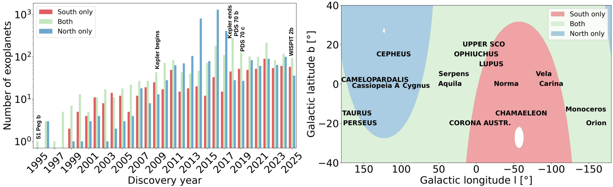

$\newcommand{\ensuremath}{}$
$\newcommand{\xspace}{}$
$\newcommand{\object}[1]{\texttt{#1}}$
$\newcommand{\farcs}{{.}''}$
$\newcommand{\farcm}{{.}'}$
$\newcommand{\arcsec}{''}$
$\newcommand{\arcmin}{'}$
$\newcommand{\ion}[2]{#1#2}$
$\newcommand{\textsc}[1]{\textrm{#1}}$
$\newcommand{\hl}[1]{\textrm{#1}}$
$\newcommand{\footnote}[1]{}$
$\newcommand$
$\newcommand$
$\newcommand$
$\newcommand$
$\newcommand$
$\newcommand{\bibfont}{\footnotesize}$

# Why the Northern Hemisphere Needs a 30--40 m Telescope\ and the Science at Stake.\ How do Planetary Systems Form?

<mark>Appeared on: 2025-12-18</mark> -  _White Paper submitted to "ESO Expanding Horizons: Transforming Astronomy in the 2040s"_

I. Mendigutía\thanks{\texttt{imendigutia@cab.inta-csic.es}}, et al. -- incl., <mark>M. Benisty</mark>, <mark>G. Chauvin</mark>, <mark>R. v. Boekel</mark>

**Abstract:**            The detection and characterization of protoplanets in protoplanetary disks around young stars is emerging as a transformative field that will redefine our understanding of how planetary systems form. While current facilities have revealed the diversity of mature exoplanets and the complex structures of disks, we still lack the crucial observational link between them: a statistically meaningful census of planets caught in the act of formation. This white paper argues that such a breakthrough requires access to the nearest and most informative star-forming regions, roughly half of which are poorly accessible or entirely unreachable from Cerro Armazones. Although the ELT alone will strongly impact our knowledge of planet formation, its location prevents Europe from fully exploiting the necessary parameter space. A 30-40 m telescope in the northern hemisphere is therefore essential for obtaining diffraction-limited imaging of protoplanets and disks across the entire sky, enabling robust demographics, exploiting synergies with ngVLA, Gaia, and other facilities covering the north, and ensuring that Europe remains at the forefront of the planet-formation revolution in the coming decades.         

**Figure 1. -** \small**(Left)** Exoplanet discoveries through the years (from the Encyclopaedia of exoplanetary systems; \href{https://exoplanet.eu}{https://exoplanet.eu/}). **(Right)** Galactic coordinates of the main star forming regions. The closest ones partially or totally located at distances $\leq$ 300 pc are indicated with capital letters. **(Both)** The colour code indicates whether the sources can be observed only from the South (declination $\delta$$\lesssim$ -31$^{\circ}$), only from the North ($\delta$$\gtrsim$ 35$^{\circ}$), or from both hemispheres. The Cerro Armazones and La Palma observatories are taken as reference, assuming that a source cannot be observed for elevations $<$ 30$^{\circ}$. Roughly half of the exoplanets and protoplanetary disks can be better or only covered from the North. (*fig:exoplanet_and_SFR_coverage*)

