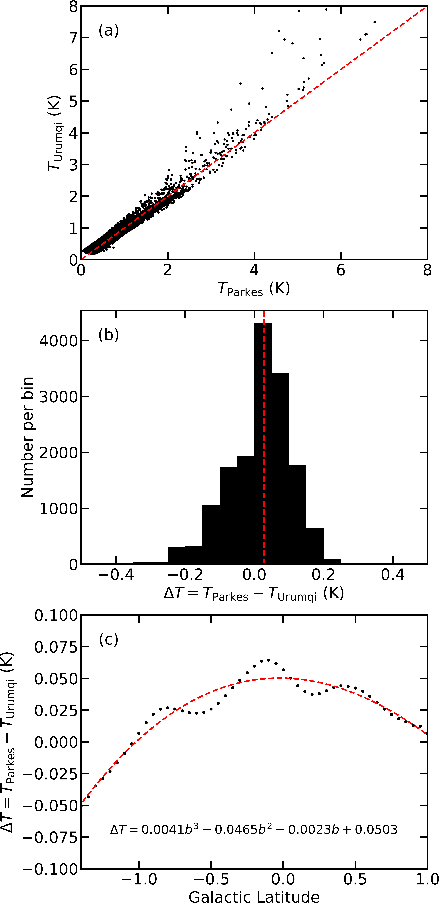

$\newcommand{\ensuremath}{}$
$\newcommand{\xspace}{}$
$\newcommand{\object}[1]{\texttt{#1}}$
$\newcommand{\farcs}{{.}''}$
$\newcommand{\farcm}{{.}'}$
$\newcommand{\arcsec}{''}$
$\newcommand{\arcmin}{'}$
$\newcommand{\ion}[2]{#1#2}$
$\newcommand{\textsc}[1]{\textrm{#1}}$
$\newcommand{\hl}[1]{\textrm{#1}}$
$\newcommand{\footnote}[1]{}$
$\newcommand{\Teff}{T_{\rm{eff}}}$
$\newcommand{\kms}{km s^{-1}}$
$\newcommand{\Wmq}{Wm^{-2}}$
$\newcommand{\ergps}{erg s^{-1}}$
$\newcommand{\mum}{ \mum}$
$\newcommand{◦ee}{^{\circ}}$
$\newcommand{\Msun}{M_{\odot}}$
$\newcommand{\Lsun}{L_{\odot}}$
$\newcommand{\Msunyr}{ M_{\odot}yr^{-1}}$
$\newcommand{\OI}{[O I]}$
$\newcommand{\SII}{[S II]}$
$\newcommand{\NII}{[N II]}$
$\newcommand{\CaII}{Ca II}$
$\newcommand{\HeI}{He I}$
$\newcommand{\LiI}{Li I}$
$\newcommand{\nodata}{...}$
$\newcommand{\accunit}{M_{\odot} yr^{-1}}$
$\newcommand{\rev}{ }$
$\newcommand{\newrev}{ }$
$\newcommand{\newnewrev}{\bf }$
$\newcommand{\fig}{Fig.}$
$\newcommand{\Mjup}{M_{\rm{Jup}}}$
$\newcommand{\Mdotacc}{\dot M_{\rm{acc}}}$
$\newcommand{\gisela}[1]{{\bf \color{black}[#1]}}$

# A global view on star formation: The GLOSTAR Galactic plane survey: XII. Effelsberg's continuum view and data release

<mark>Appeared on: 2025-12-18</mark> -  _19 pages, 18 figures, accepted for publication in A&A_

Y. Gong, et al. -- incl., <mark>H. Beuther</mark>

**Abstract:** Extended radio continuum emission and its linear polarization play a key role in probing large-scale structures of synchrotron and free-free emission in the Milky Way. Despite the existence of many radio continuum surveys, sensitive and high-angular-resolution single-dish surveys of extended radio continuum emission remain scarce. Our objective is to deliver a Galactic plane survey of extended radio continuum emission within the frequency range of 4--8 GHz, achieving an unprecedented angular resolution of $\lesssim$ 3 $\arcmin$ . As part of the GLObal view of STAR formation (GLOSTAR) survey, we will also crucially complement the existing data from the Karl G. Jansky Very Large Array (VLA) by addressing the missing zero-spacing gap. Within the framework of the GLOSTAR Galactic plane survey, we performed large-scale radio continuum imaging observations toward the Galactic plane in the range $-2^{\circ}< \ell <60^{\circ}$ and $|b|<1.1^{\circ}$ , as well as the Cygnus X region $76^{\circ}< \ell <83^{\circ}$ and $-1^{\circ}<b<2^{\circ}$ with the Effelsberg 100-m radio telescope. We present the Effelsberg continuum survey at 4.89 GHz and 6.82 GHz including linear polarization with angular resolutions of 145 $\arcsec$ and 106 $\arcsec$ , respectively. The survey has been corrected for missing large-scale emission using available low-angular-resolution surveys. Comparison with previous single-dish surveys indicates that our continuum survey represents the highest-quality single-dish data collected to date at this frequency. More than 90 \% of the flux density missed by the VLA D-array data is effectively recovered by the Effelsberg continuum survey. The improved sensitivity and angular resolution of our survey enable reliable mapping of Galactic magnetic field structures, with polarization data that are less affected by depolarization than in previous surveys. The GLOSTAR single-dish continuum data will be released publicly, offering a valuable resource for studying extended objects including H ${\scriptsize II}$ regions, supernova remnants, diffuse interstellar medium, and Galactic structure.

**Figure 6. -** {Effelsberg 4.89 GHz Stokes I continuum map of the whole GLOSTAR survey.} (*Fig:4.89GHz-I*)

**Figure 8. -** {Effelsberg 4.89 GHz Stokes $I$ continuum map of the whole GLOSTAR survey. Zoom-in plots of each fields are available via \url{https://gongyan2444.github.io/glostar-snr-hii.html}, where the green, gray, and red circles represent the known SNRs \citep{2025JApA...46...14G}, SNR candidates \citep{2017A&A...605A..58A,2021A&A...651A..86D,2025A&A...693A.247A}, and H{\scriptsize II} regions from the WISE catalog \citep{2014ApJS..212....1A}, respectively.} (*Fig:4.89GHz-I*)

**Figure 3. -** {Comparison between the Urumqi 4.8 GHz survey and the Parkes 5 GHz survey. (a) Pixel-by-pixel comparison of the observed brightness temperatures of the two survey data sets within $10^{\circ}<\ell <30^{\circ}$. The red dashed line indicates the equality between the two data sets. (b) Histogram of the brightness temperature differences between the two surveys. The vertical dashed line denotes the median value of 0.028 K. (c) Brightness temperature difference as a function of the Galactic latitude for $\ell =11\rlap{.}^{\circ}65$. The red dashed curve represents the polynomial fit to the observed distribution.} (*Fig:urmqi-parkes*)

