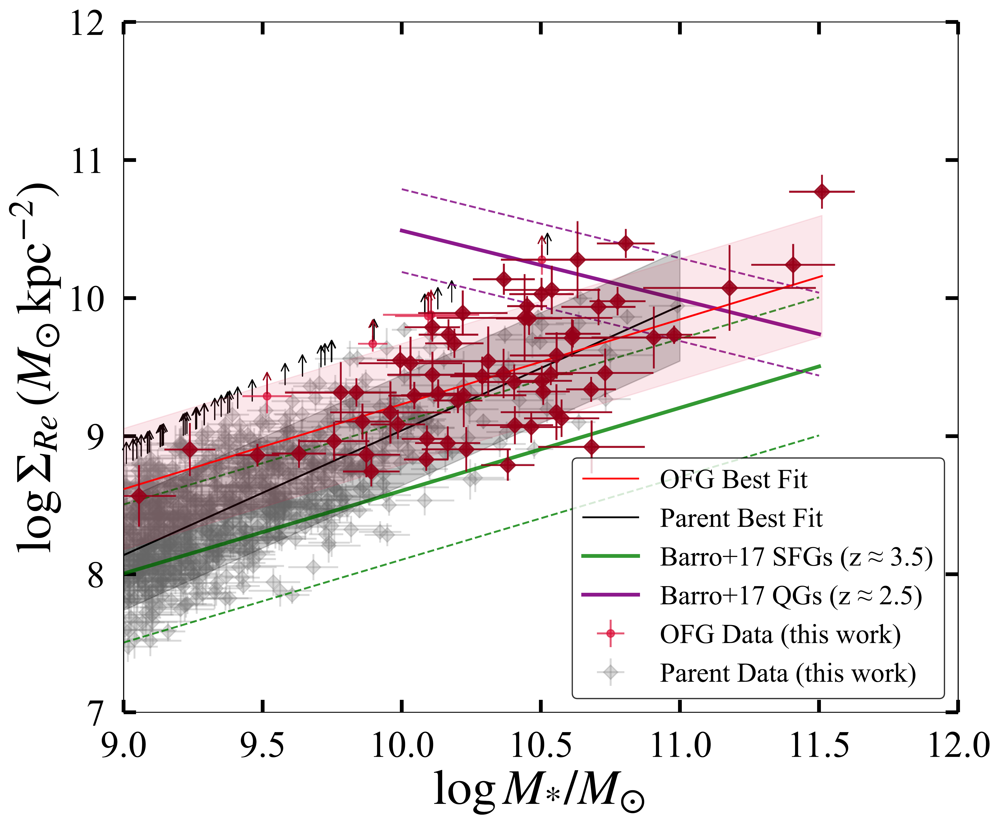
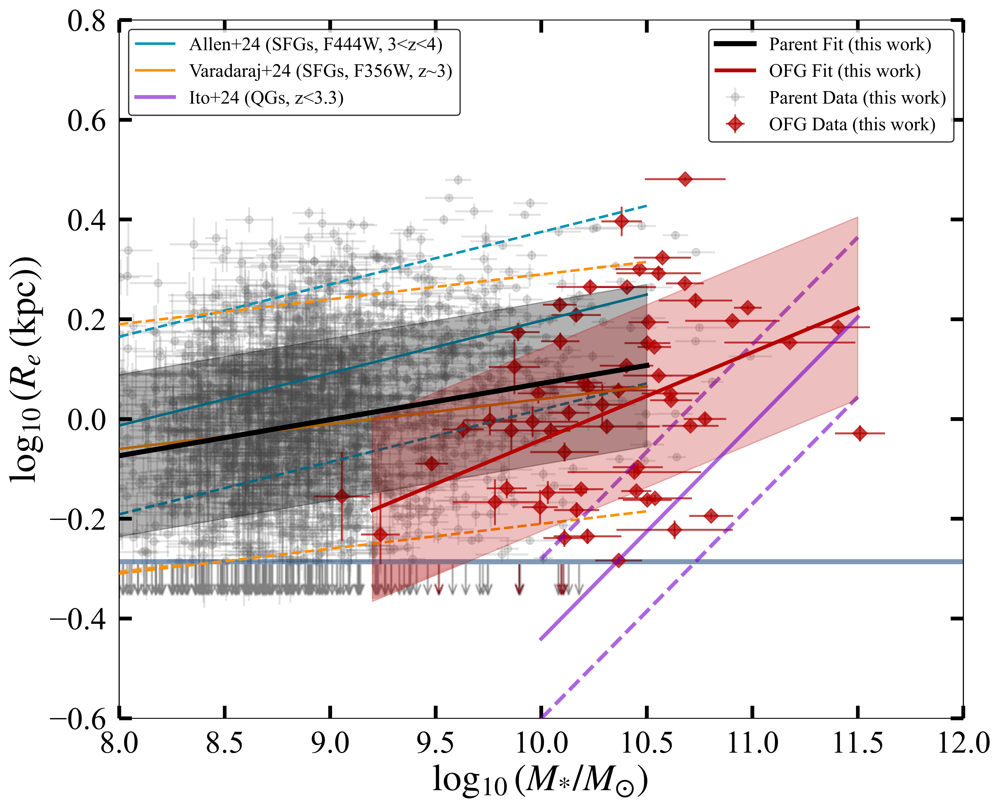
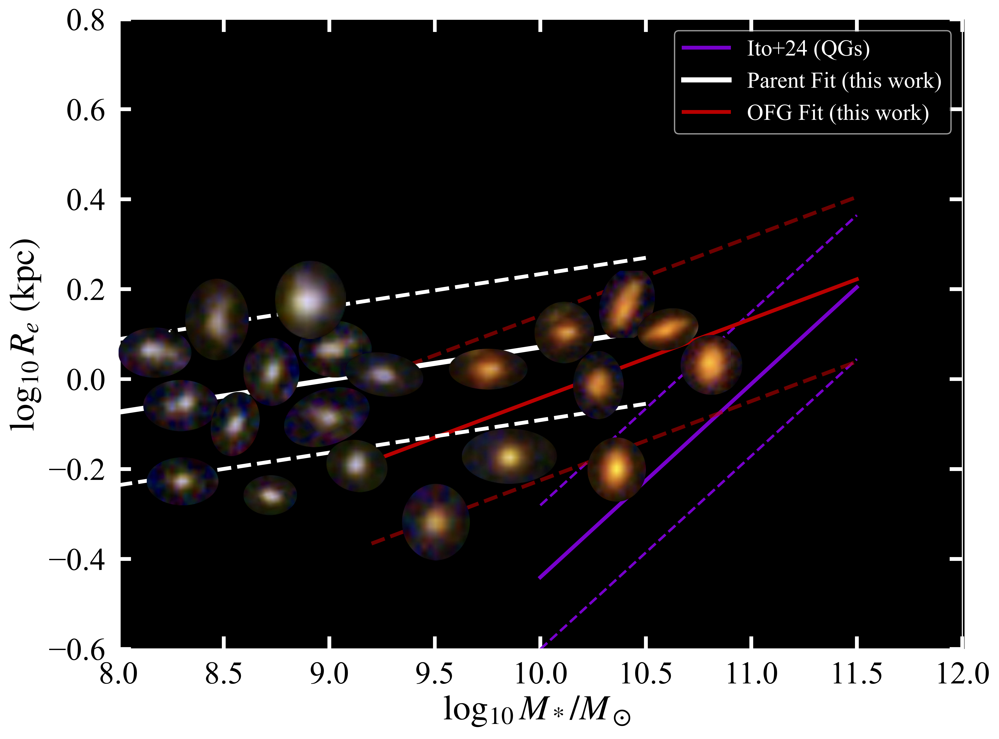

$\newcommand{\ensuremath}{}$
$\newcommand{\xspace}{}$
$\newcommand{\object}[1]{\texttt{#1}}$
$\newcommand{\farcs}{{.}''}$
$\newcommand{\farcm}{{.}'}$
$\newcommand{\arcsec}{''}$
$\newcommand{\arcmin}{'}$
$\newcommand{\ion}[2]{#1#2}$
$\newcommand{\textsc}[1]{\textrm{#1}}$
$\newcommand{\hl}[1]{\textrm{#1}}$
$\newcommand{\footnote}[1]{}$

# Stellar Morphology of Optically Dark or Faint Galaxies at $z>3$ with JWST

<mark>Appeared on: 2025-12-18</mark> - 

A. Ganguly, et al. -- incl., <mark>S. Bosman</mark>

**Abstract:** The sensitivity and resolution of the James Webb Space Telescope (JWST) offer an unprecedented view of optically dark or faint galaxies (OFGs), previously missed by the Hubble Space Telescope (HST). They are candidates for massive, heavily dust-obscured star-forming galaxies (SFGs) that substantially contribute to the cosmic star formation rate density at $z > 3$ . To understand what drives their high dust attenuation and how they fit into early universe galaxy evolution, we analyse the stellar morphology of 65 OFGs (selected from a parent sample of 1892 SFGs at $3<z<4$ ) using JWST/NIRCam F444W imaging from the PRIMER and CEERS legacy fields. We investigate correlations between dust attenuation ( $A_{v}$ ) and key galaxy properties, including stellar mass, size, and orientation, and compare scaling relations between OFGs and typical SFGs.We find that OFGs are $\sim$ 8--9 times more massive (median $\log M_\star/M_\odot=10.31^{+0.36}_{-0.42}$ ) and $\sim4$ times more dust attenuated ( ${A_{v,\mathrm{med}}=2.67 ^{+0.80}_{-0.96}}$ mag) than the parent sample. Structurally, OFGs resemble parent SFGs with median $R_e \sim 1$ kpc and median $\Sigma_{\mathrm{R_e}}\sim10^9,\mathrm{M_\odot/{kpc}^2}$ . At $z>3$ , OFGs may be slightly rounder on average as they prefer a higher median $q$ ( $q \sim 0.60^{+0.21}_{-0.20}$ ) than the parent SFGs ( $q \sim 0.47^{+0.22}_{-0.16}$ ), where, $q = b/a$ , b: semi-minor axis, a: semi-major axis. While $A_v$ is strongly correlated with stellar mass, it does not show significant dependence on stellar mass-normalised effective radius ( $R'_e$ ) and stellar mass surface density ( $\Sigma'_\mathrm{{R_e}}$ ), Sérsic index ( $n$ ), axis ratio ( $q$ ), or star formation rate surface density ( $\Sigma_{\mathrm{SFR}}$ ).  The mass-size and mass-surface density relations place OFGs as a higher-mass extension of SFGs, with no smoking-gun proof of evolutionary differences between them.Taken together, these results suggest that OFGs are heavily dust-obscured primarily due to their high stellar masses, which facilitates significant dust production and retention, with older stellar populations likely contributing as well. Although some OFGs exhibit high $\Sigma_\mathrm{{R_e}}$ and occupy regions of the mass-size plane similar to quiescent galaxies (QGs), the overall sample is not representative of this. Their current structures resemble typical SFGs, with no concrete signs of rapid compaction. The diversity in their physical properties indicates that OFGs span a range of evolutionary states with few showing reduced star formation, while most remain actively star-forming.

**Figure 10. -** Comparison of stellar mass, stellar mass-scaled $R_{e}$($R'_{e}$, scaled to $\log M_{\star}/M_{\odot}$= 10), $q$, stellar mass-scaled $\Sigma_\mathrm{R_e}$($\Sigma'_{R_e}$, scaled to $\log M_{\star}/M_{\odot}$= 10), and star formation rate surface densities ($\Sigma_\mathrm{SFR}$) with $A_v$ of OFGs and the parent sample at $ 3 \leqslant z < 4$. Sliding medians for the two galaxy types are shown in the legend, with bold diamonds for OFGs and bold circles for parent SFGs. The error bars represent the uncertainty of the medians, and bins with fewer than ten galaxies are not displayed. For Figure \ref{fig:overall_figure_dust}b and \ref{fig:overall_figure_dust}d , the $R'_{e}$ values are $R_{e}$ values scaled to a stellar mass of $10^{10} M_{\odot}$. (*fig:overall_figure_dust*)

**Figure 3. -** Redshift-binned effective stellar surface mass density $\Sigma_\mathrm{R_{e}}$ vs. stellar mass. Grey points represent SFGs, while red points represent OFGs. The upward pointing arrows represent the same sources that lie below the resolution limit in F444W as in Figure \ref{fig:combined-mass-size}. The purple solid lines indicate the $\Sigma_\mathrm{R_{e}}$-mass relation of QGs at $2 < z < 3$, with the dashed purple lines showing the intrinsic scatter for this population, as derived from \cite{Barro2017}. The green solid and dashed lines represent the redshift-extrapolated best-fit lines and intrinsic scatter for SFGs from the same study. Black lines denote the $\Sigma_\mathrm{R_{e}}$-mass relation for the parent SFG sample at the indicated redshifts (see legend). The red line represents the $\Sigma_\mathrm{R_{e}}$-mass relation for OFGs ($3 < z < 4$), with the shaded light red and grey regions showing the $1\sigma$ scatter of the best-fit relations for OFGs and parent sample, respectively. (*fig:sigma_re*)

**Figure 9. -** _Left panel_: Rest-frame optical mass-size relation for parent SFGs (grey points and black lines) and OFGs (red) for $3 < z < 4  (F444W)$. The down-pointing arrows represent sources with $R_e$ smaller than the PSF HWHM or the resolution limit in F444W. These arrows indicate that the resolution limit is treated as an upper limit on their size measurements. The teal lines represent the mass-size relation at $3 < z < 4  (F444W)$ obtained from JWST Rest-frame UV/Optical sizes \citep{allen2024galaxysizemassbuildup}, while the orange lines denote those from \cite{Varadaraj2024} at $z = 3  (F356W)$ for reference. The purple lines indicate the mass-size relation of quiescent galaxies (QGs) at $z< 3.3$\citep{ito2024sizestellarmass}. Dashed lines show the 1$\sigma$ scatter of the lines from the literature. The shaded light red and grey regions show the $1\sigma$ scatter of the best-fit relations of OFGs and parent SFGs, respectively. The light green line highlights the resolution limit of the NIRCam PSF in the F444W band. _Right panel_: Here are sample RGB images from JWST/NIRCam (F115W, F277W, F444W) that effectively illustrate the distinctions between parent SFGs and OFGs. The mass-size relation derived for the parent sample, OFGs and QGs is also underlaid for comparison. Notably, the differences in morphology and color are striking across these categories. OFGs exhibit significantly redder colors compared to the parent sample. The parent sample displays a diverse range of morphologies, spanning from compact to more extended structures. In contrast, OFGs are characterised by predominantly round or ellipsoidal shapes.  (*fig:combined-mass-size*)

