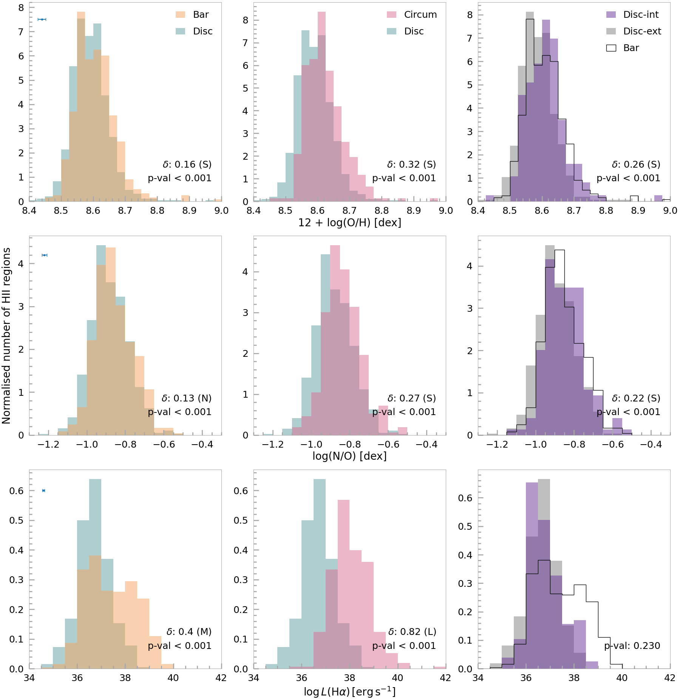

$\newcommand{\ensuremath}{}$
$\newcommand{\xspace}{}$
$\newcommand{\object}[1]{\texttt{#1}}$
$\newcommand{\farcs}{{.}''}$
$\newcommand{\farcm}{{.}'}$
$\newcommand{\arcsec}{''}$
$\newcommand{\arcmin}{'}$
$\newcommand{\ion}[2]{#1#2}$
$\newcommand{\textsc}[1]{\textrm{#1}}$
$\newcommand{\hl}[1]{\textrm{#1}}$
$\newcommand{\footnote}[1]{}$
$\newcommand{\thebibliography}{\DeclareRobustCommand{\VAN}[3]{##3}\VANthebibliography}$

# The impact of bars on the properties of H ${\Large **II**}$ regions in the TIMER survey

<mark>Appeared on: 2025-12-18</mark> -  _Published in MNRAS_

L. Sánchez-Menguiano, et al. -- incl., <mark>J. Neumann</mark>

**Abstract:** In this study we perform a comparative analysis of the properties of the HII regions located in different areas of barred galaxies, with the aim of investigating the impact of bars on the physical properties of the ionised gas. Based on integral field spectroscopy data for 17 barred galaxies covering approximately the central $6\times6$ kpc, we detect a total of 2200 $\ion{H}{ii}$ regions, of which 331 are located within the nuclear disc (also known as circumnuclear regions),  661 in the bar region, and 1208 in the disc. Among the physical properties of the $\ion{H}{ii}$ regions, we explore the O/H and N/O abundances, H $\alpha$ luminosity, dust extinction, electron density, and H $\alpha$ equivalent width. We find clear differences in the properties of the $\ion{H}{ii}$ regions between the nuclear disc, the bar and the disc, that could be explained by an enhancement in the molecular gas concentration in the central parts driven by bar-induced gas flows. As this gas is channelled towards the galaxy centre, the most extreme values in the analysed properties are found for the circumnuclear $\ion{H}{ii}$ regions. Unlike the bar strength, galaxy mass does seem to affect the properties of the $\ion{H}{ii}$ regions, with massive galaxies presenting higher values in most of the properties, possibly due to the increased amount of gas in these systems. This study provides evidence that the bar-driven redistribution of material within the galaxy inner parts causes significant differences in the $\ion{H}{ii}$ region properties depending on their location within the galaxies.

**Figure 4. -** Comparison of the distributions of oxygen abundances (_ top_), N/O abundances (_ middle_), and L(H$\alpha$) (_ bottom_) for different populations of $\ion${H}{ii} regions: disc (green) versus bar (orange) regions (_ left_), disc (green) versus circumnuclear (pink) regions (_ middle_), and regions in the disc inside (purple) versus outside (grey) the bar radius (_ right_). The distribution for the bar regions is also represented in right panels with unfilled black histograms. In the top left corner of first panels we include the typical (median) errorbar of each parameter, derived by propagating the errors in the involved emission line intensities (the intrinsic error in the used calibrations is not included for O/H and N/O abundances). In the bottom right corner of the panels the Mann-Whitney U test p-value for each pair of compared distributions is shown, and for those which have values below 5\%(i.e. presenting statistically significant differences), the Cliff's $\delta$ is also provided as a measure of the magnitude of the differences. These are categorised as negligible (N), small (S), medium (M) and large (L) differences (see Sec. \ref{sec:results} for details on these statistics). (*fig:hists1*)

**Figure 1. -** Modelling of the $\ion${H}{ii} regions by {\ttfamily PYHIIEXTRACTOR} for the galaxy NGC 4981. We show the observed H$\alpha$ map (top panel), the derived model of the candidate $\ion${H}{ii} regions and the DIG together (middle-top panel) and separately ($\ion${H}{ii} regions, middle-bottom panel; DIG, bottom panel). Orange circle and red ellipse in top panel delimit the nuclear disc and bar regions, respectively. (*fig:HIIregions*)

**Figure 5. -** Same as Fig. \ref{fig:hists1} but for the dust extinction (_ top_), the $[$\ion${S}{ii}]\lambda6717/[$\ion${S}{ii}]\lambda6731$ line ratio as a proxy for the electron density (_ middle_), and the H$\alpha$ equivalent width (_ bottom_). See caption above for more details. (*fig:hists2*)

