

$\newcommand{\ensuremath}{}$
$\newcommand{\xspace}{}$
$\newcommand{\object}[1]{\texttt{#1}}$
$\newcommand{\farcs}{{.}''}$
$\newcommand{\farcm}{{.}'}$
$\newcommand{\arcsec}{''}$
$\newcommand{\arcmin}{'}$
$\newcommand{\ion}[2]{#1#2}$
$\newcommand{\textsc}[1]{\textrm{#1}}$
$\newcommand{\hl}[1]{\textrm{#1}}$
$\newcommand{\footnote}[1]{}$
$\newcommand{\arraystretch}{1.3}$

# The AIDA-TNG project: 3D halo shapes

<mark>Appeared on: 2025-12-19</mark> -  _12 pages, and 8 figures, submitted to A&A. Find more information on AIDA-TNG here: this https URL_

C. Giocoli, et al. -- incl., <mark>A. Pillepich</mark>

**Abstract:** The shapes of dark matter halos can be used to constrain the fundamental properties of dark matter. In standard Cold Dark Matter (CDM) cosmologies, halos are typically triaxial, with a preference for prolate configurations, particularly at low masses and high redshift. We focus on the characterization of total matter 3D shape in alternative dark matter models, such as Self-Interacting Dark Matter (SIDM) and Warm Dark Matter (WDM). These scenarios predict different structural properties due to collisional effects or the suppression of small-scale power. We measure the different halo component shapes -- dark matter, stars and gas -- at various radii from the center in the AIDA-TNG (Alternative Interacting Dark Matter and Astrophysics – TNG), which is a suite of high-resolution cosmological simulations built upon the IllustrisTNG framework. The intent is to systematically study how     different dark matter models -- specifically, SIDM and WDM -- affect galaxy formation and the structure of dark matter halos, when realistic baryonic physics is also included. SIDM models tend to produce rounder and more isotropic halos, especially in the inner regions, as a result of momentum exchange between dark matter particles. WDM halos are also slightly more spherical than their CDM counterparts, and are typically less concentrated. In all cases, the inclusion of self-consistent baryonic physics makes the central regions of all halos rounder, while still revealing clear distinctions among the various dark matter models. The general framework presented in this work,     based on the 3D halo shape, can be useful to interpret multi-wavelength data analyses of galaxies and clusters.

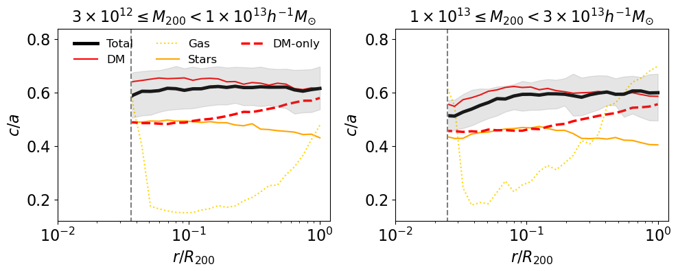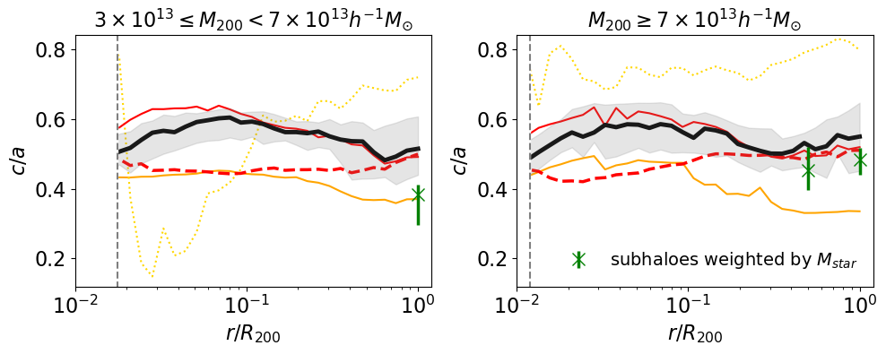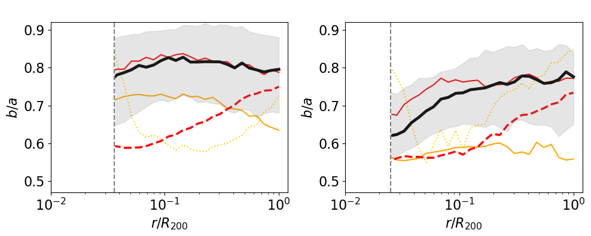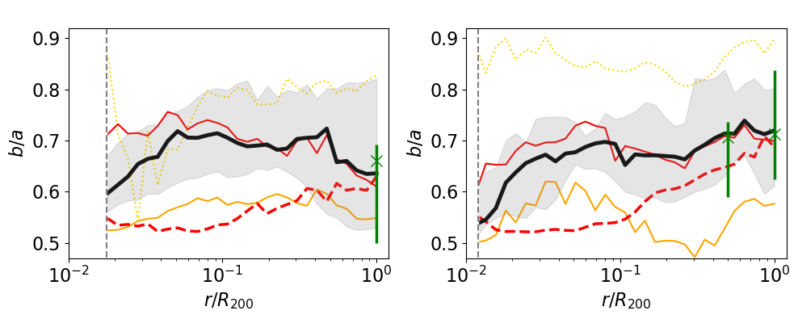

**Figure 3. -** Profiles of minor-to-major (top) and intermediate-to-major (bottom) axis ratios for $z=0$ halos in the CDM simulation in bins of increasing mass (from left to right).
Solid black curves show the total axis ratios in the FP run, while solid red, dotted gold, and solid orange curves show the corresponding results for the dark matter, gas, and stars, respectively. Dashed red curves show halos in the same mass bins but for the dark matter-only run. Green data points (shown only in some of the boxes) consider
the satellites and were weighted by stellar mass when computing the inertial mass tensor. The error bars bracket 25\% and 75\% of the distribution. The vertical bars display the resolution limit, which is equal to 10 times the softening length. (*fig_LCDM_Radius*)

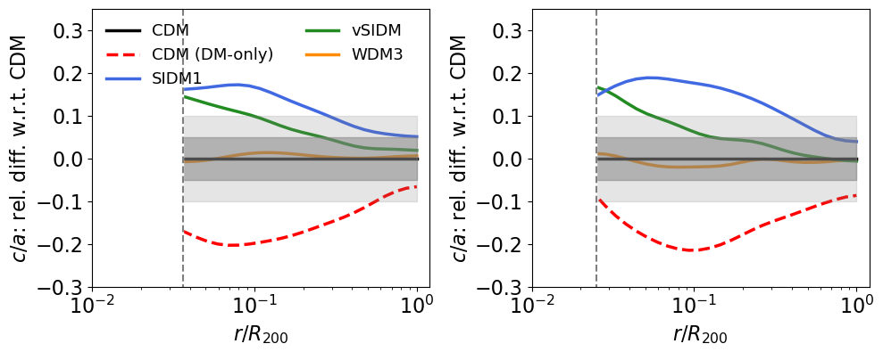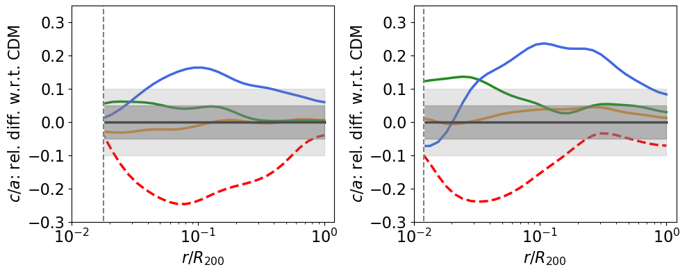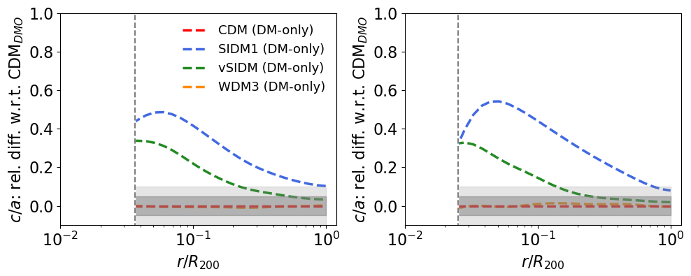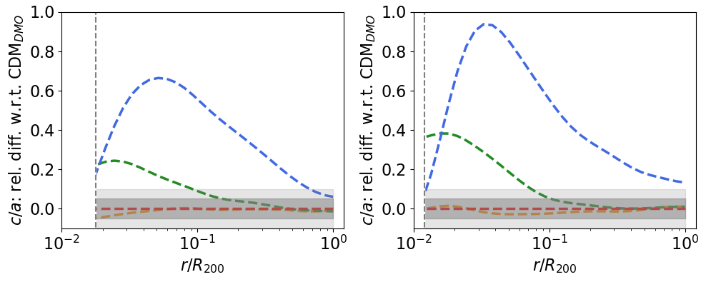

**Figure 4. -** Minor-to-major axis ratios for the DM models relative to the CDM value, for the same ($z=0$) mass bins as Fig. \ref{fig_LCDM_Radius}. Top and bottom panels display the results from FP and DMO runs, respectively. (*reldiff_c_over_a*)

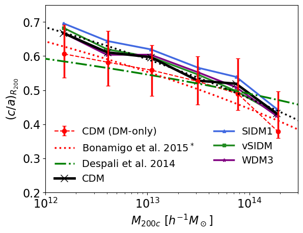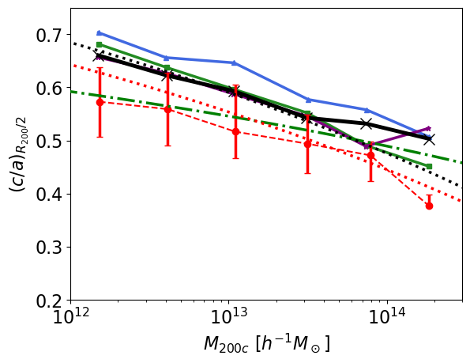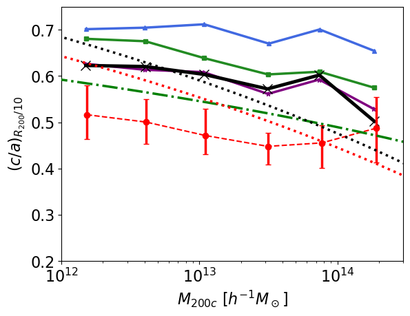

**Figure 6. -** Minor-to-major axis ratios as a function of the halo mass $M_{200}$. Red data points display the median relation for the CDM DMO simulation at $z=0$, while the corresponding
solid (dotted) error bars bracket $25$ and $75\%$ of the distribution at fixed halo mass. Black, blue, green, and magenta connected data points show the results for the FP runs in different dark matter models. To avoid overcrowding, these are displayed without the error bars.  Left, central, and right panels show the measurements at the halo boundary radius $R_{200}$, $R_{200}$/2, and $R_{200}$/10, respectively. The green dot-dashed curve shows the results from [Despali, Giocoli and Tormen (2014)](), while the red and black dotted lines show the best fit relation assuming the median value of the [Bonamigo, Despali and Limousin (2015)]() model at $\left(c/a\right)_{R200}$ -- repeated in all three panels to guide the reader. (*fig_c_over_c_M200*)

