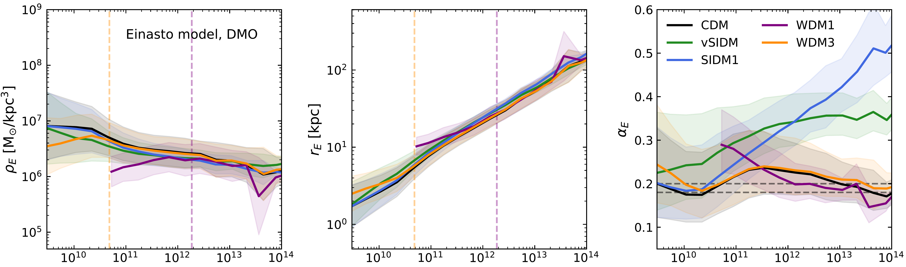
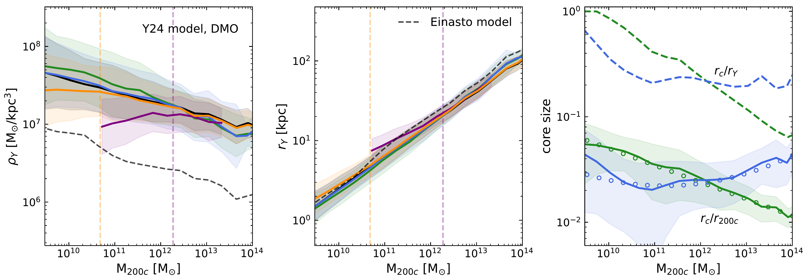
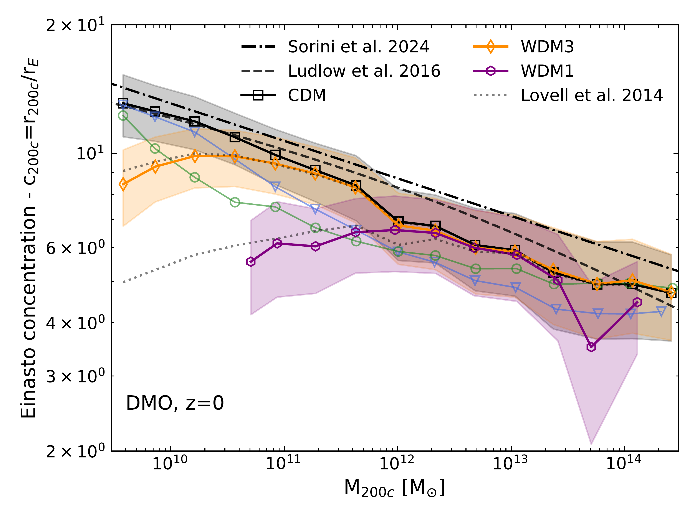
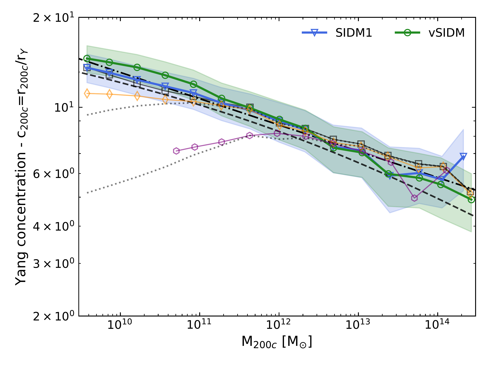
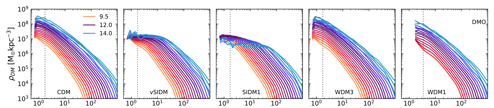
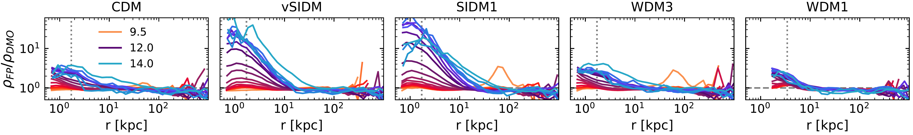
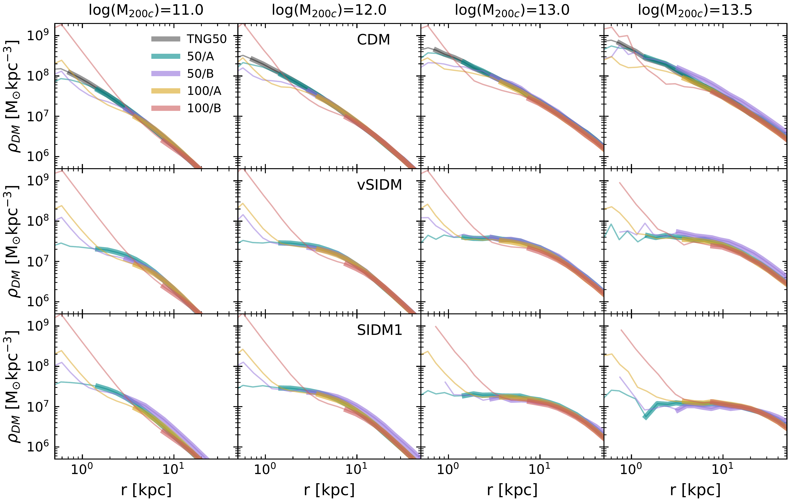
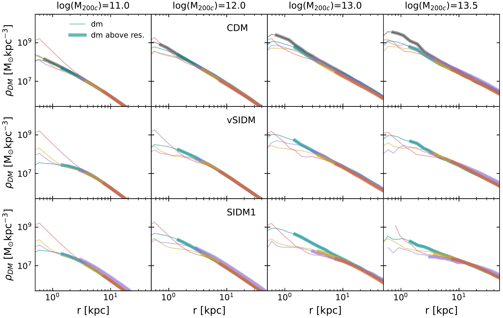

$\newcommand{\ensuremath}{}$
$\newcommand{\xspace}{}$
$\newcommand{\object}[1]{\texttt{#1}}$
$\newcommand{\farcs}{{.}''}$
$\newcommand{\farcm}{{.}'}$
$\newcommand{\arcsec}{''}$
$\newcommand{\arcmin}{'}$
$\newcommand{\ion}[2]{#1#2}$
$\newcommand{\textsc}[1]{\textrm{#1}}$
$\newcommand{\hl}[1]{\textrm{#1}}$
$\newcommand{\footnote}[1]{}$
$\newcommand{\arraystretch}{1.3}$

# The AIDA-TNG project: dark matter profiles and concentrations in alternative dark matter models

<mark>Appeared on: 2025-12-19</mark> -  _17 pages, 12 figures, submitted to A&A. Comments welcome. Find more information on AIDA-TNG here: this https URL_

G. Despali, et al. -- incl., <mark>A. Pillepich</mark>

**Abstract:** In the standard Cold Dark Matter (CDM) scenario, the density profiles of dark matter haloes are well described by analytical models linking their concentration to halo mass. Alternative scenarios, such as warm dark matter (WDM) and self-interacting dark matter (SIDM), modify the inner structure of haloes and predict different profile shapes and central slopes. We employ the AIDA-TNG simulations to investigate how alternative dark matter physics and baryonic processes jointly shape the internal structure of haloes. Using dark-matter-only and full-physics runs, we measure the dark matter density profiles of haloes spanning six orders of magnitude in mass, from $10^{9.5} M_{\odot}$ to $10^{14.5}M_{\odot}$ , and characterise them with multiple analytical models. We provide the distribution of the best-fitting parameters, as well as the concentration-mass relation in WDM and SIDM. The Einasto profile well reproduces the inner flattening produced in WDM models, both in the collisionless and in the full-physics runs. In SIDM dark-matter-only runs, haloes are better described by explicitly cored profiles, with core sizes that depend on mass and on the self-interaction model. When baryons are included, the differences between CDM and SIDM decrease, and such large dark-matter cores no longer form because adiabatic contraction in the baryon-dominated region counteracts self-interactions. Nevertheless, the coupling between baryons and self-interactions induces a broader range of inner slopes, including cases that are steeper than CDM at Milky Way masses. Alternative dark matter physics thus leaves clear signatures in the inner halo structure, even if baryons significantly reshape these differences. Our results are useful for future studies that need to predict the properties of haloes in multiple dark matter models.

**Figure 5. -** $Top$: Mean best fit parameters of the Einasto (first row) and Y24 (second row) models, plotted as a function of halo mass at $z=0$ in the DMO runs, together with their $1\sigma$ uncertainties represented by the coloured bands. In both cases, the first two panels show the mean scale density and radius, while the third panels differ: in the case of Einasto we have the shape parameter $\alpha_{E}$(compared to the fixed range 0.18-0.2 used in previous works for CDM haloes), while in the Y24 model the core radius that we scale to the halo radius as $r_{c}/r_{200c}$(solid lines) and to the scale radius (dashed lines). In the first two panels of the second row, the dashed black lines show the scale density and radius calculated from the Einasto fit in CDM, for comparison. Instead, in the right panel, the core radius is consistent with zero for the CDM and WDM models, and it is thus only shown for self-interacting scenarios. Here, the open circles correspond to the best-fit models from Eq. \ref{eq:model}. Finally, the vertical dashed lines correspond to the value 100$M_{hm}$, calculated for WDM1 and WDM3, where it is expected that the halo concentration starts deviating from CDM. $ Bottom$: Concentration-mass relation at $z=0$ for the DMO runs. On the left (right), we show the results based on the Einasto (Y24) fit. We compare to [Ludlow, Bose and Angulo (2016)](), who also used Einasto profiles to fit CDM and WDM halo profiles, and to [Sorini, Bose and Pakmor (2025)](), who instead modelled haloes with NFW. The dotted line shows the predicted WDM concentration when applying the correction by [Lovell, Frenk and Eke (2014)]() to the measured CDM relation (black squares). In the previous section, we have demonstrated that CDM and WDM profiles are best fit by Einasto, while SIDM ones by the Y24 profiles. We highlight these with solid lines in the figure and display the remaining ones with lighter colours. (*fig:ein_mean0*)

**Figure 2. -** Mean dark matter profiles for haloes in 21 logarithmically-spaced bins in mass between $3\times10^{9}M_{\odot}$(orange) and $10^{14}M_{\odot}$(light blue), from the DMO (top) and FP runs (middle). From left to right, we show CDM, followed by two self-interacting models (vSIDM and SIDM1) and two WDM models (WDM3 and WDM1) . We use the 50/A run in the first four panels and the WDM1 50/B box in the rightmost one. The latter only allows us to reliably measure density profiles of $M_{200c}\geq10^{10.5}M_{\odot}$, with stronger limits on the spatial resolution. In all panels, the dashed vertical line stands for the resolution limit $3\epsilon_{DM}$. When fitting the density profile, we restrict the range further to $r\geq3\epsilon_{DM}$ and haloes with more than 1000 dark matter particles.
        Finally, the bottom panels highlights the contraction caused by baryons by showing the ratio between the dark matter profiles in the FP and DMO cases.
     (*fig:prof*)

**Figure 11. -** Convergence tests for the dark matter profile in the 50/A boxes in the DMO (top) and FP (bottom) runs. We consider CDM, SIDM1 and vSIDM and we do not show results for the WDM models, as these behave similarly to CDM. For comparison, we also show results from the IllustrisTNG 50 Mpc run, since its resolution is higher than our best case. We plot the mean dark matter profile for four representative bins in halo mass of width 0.2 dex around the reported value. In each panel, the thick solid lines show the density profiles up to the resolution limit of each simulation, while the thinner lines help visualise where convergence breaks at lower radii.  (*fig:res1*)

