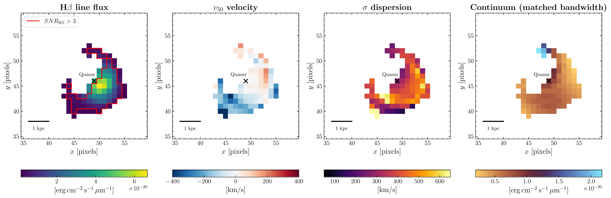
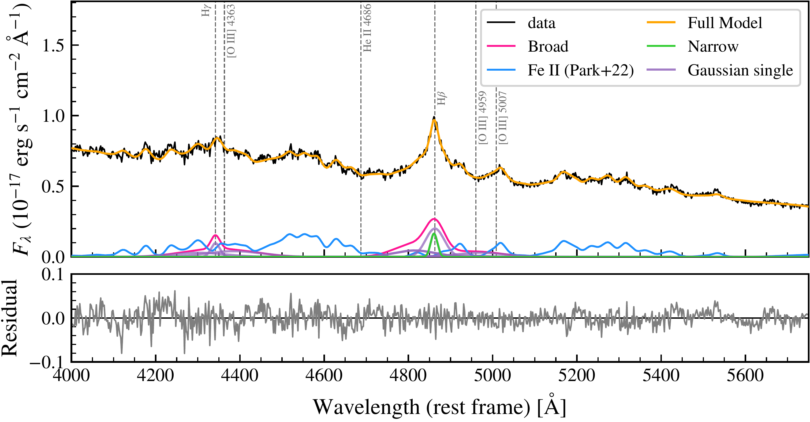
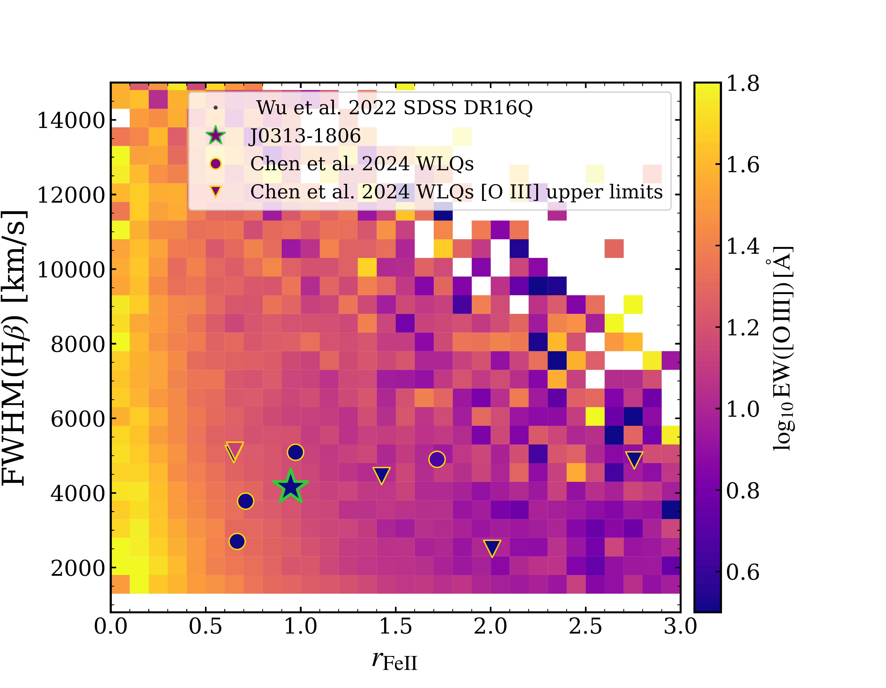

$\newcommand{\ensuremath}{}$
$\newcommand{\xspace}{}$
$\newcommand{\object}[1]{\texttt{#1}}$
$\newcommand{\farcs}{{.}''}$
$\newcommand{\farcm}{{.}'}$
$\newcommand{\arcsec}{''}$
$\newcommand{\arcmin}{'}$
$\newcommand{\ion}[2]{#1#2}$
$\newcommand{\textsc}[1]{\textrm{#1}}$
$\newcommand{\hl}[1]{\textrm{#1}}$
$\newcommand{\footnote}[1]{}$
$\newcommand{\feii}{\ion{Fe}{ii}}$
$\newcommand{\ciii}{\ion{C}{III}]~\lambda1909\xspace}$
$\newcommand{\siiii}{\ion{Si}{III}]~\lambda1892\xspace}$
$\newcommand{\heii}{\ion{He}{II}~\lambda1640\xspace}$
$\newcommand{\nv}{\ion{N}{V}~\lambda1240\xspace}$
$\newcommand{\ovi}{\ion{O}{VI}~\lambda1034\xspace}$
$\newcommand{\mgii}{\ion{Mg}{II}~\lambda2800\xspace}$
$\newcommand{\oiii}{[\ion{O}{III}]~\lambda5007\xspace}$
$\newcommand{\oiiil}{[\ion{O}{III}]~\lambda4959\xspace}$
$\newcommand{\oiiidd}{[\ion{O}{III}]~\lambda\lambda4959,5007\xspace}$
$\newcommand{\hbeta}{H\beta~\lambda4861\xspace}$
$\newcommand{\hbetashort}{H\beta\xspace}$
$\newcommand{\hgammafull}{H\gamma~\lambda4340\xspace}$
$\newcommand{\hgamma}{H\gamma\xspace}$
$\newcommand{\civ}{\ion{C}{IV}~\lambda1549\xspace}$
$\newcommand{\lya}{Ly\alpha~\lambda1216\xspace}$
$\newcommand{\nvdd}{\ion{N}{V}~\lambda\lambda1238,1242\xspace}$
$\newcommand{\lyanv}{Ly\alpha+ \ion{N}{V}~complex\xspace}$
$\newcommand{\paa}{Pa\alpha~\lambda18751\xspace}$
$\newcommand{\pab}{Pa\beta~\lambda12818\xspace}$
$\newcommand{\pag}{Pa\gamma~\lambda10938\xspace}$
$\newcommand{\pad}{Pa\delta~\lambda10049\xspace}$
$\newcommand{\nii}{[\ion{N}{II}]~\lambda6583\xspace}$
$\newcommand{\sii}{[\ion{S}{II}]~\lambda\lambda6716,6731\xspace}$
$\newcommand{\cii}{[\ion{C}{II}]~\lambda157.6 \mum\xspace}$
$\newcommand{\siv}{\ion{S}{IV}~\lambda\lambda1394,1403\xspace}$
$\newcommand{\halpha}{H\alpha~\lambda6563\xspace}$
$\newcommand{\oiiiaur}{[\ion{O}{III}]~\lambda4363\xspace}$

# Shedding the envelope: JWST reveals a kiloparsec-scale [O${\sc iii}$]-weak Balmer shell around a z=7.64 quasar

<mark>Appeared on: 2025-12-19</mark> -  _Revised version submitted after the first referee review_

<mark>J. Wolf</mark>, et al. -- incl., <mark>E. Bañados</mark>, <mark>A. Dumont</mark>, <mark>S. Belladitta</mark>, <mark>S. Bosman</mark>, <mark>F. Walter</mark>

**Abstract:** Luminous quasars at the redshift frontier $z>7$ serve as stringent probes of super-massive black hole (SMBH) formation and they are thought to undergo much of their growth obscured by dense gas and dust in their host galaxies. Fully characterizing the symbiotic evolution of SMBHs and hosts requires rest-frame optical observations that span spatial scales from the broad-line region (BLR) to the interstellar and circumgalactic medium (ISM/CGM). The James Webb Space Telescope (JWST) now provides the necessary spatially resolved spectroscopy to do so. But the physical conditions that regulate the interplay between SMBHs and their hosts at the highest redshifts, especially the nature of early feedback phases, remain unclear.   We present JWST/NIRSpec Integral Field Unit (IFU) observations of J0313 $-$ 1806 at $z=7.64$ , the most distant luminous quasar known.   From the restframe optical spectrum of the unresolved quasar, we derive a black hole mass of $M_\mathrm{BH}=(1.63 \pm 0.10)\times10^9 M_\odot$ based on $\hbeta$ ( $\hbetashort$ ) and an Eddington rate of $\lambda=L/L_\mathrm{Edd}=0.80\pm 0.05$ , consistent with previous $\mgii$ -based estimates. J0313--1806 exhibits no detectable [ O III ] $\lambda\lambda4959,5007$ emission on nuclear scales (3 $\sigma$ upper limit equivalent width of $\oiii$ $<1.42  Å$ ).Most remarkably, we detect an ionized gas shell extending out to $\sim 1.8$ kpc traced by $\hbetashort$ emission that also lacks any significant [ O III ] $\lambda\lambda4959,5007$ , with a $3\sigma$ upper limit on the [ O III ] $ \lambda$ 5007 to $\hbetashort$ flux ratio of $\log_{10} \left( F(\mathrm{[OIII]})/F(\mathrm{H}\beta)\right)=-1.15$ .    Through photoionization modelling, we demonstrate that the extended emission is consistent with a thin, clumpy outflowing shell where [ O III ] is collisionally de-excited by dense gas. We interpret this structure as a fossil remnant of a recent blowout phase, providing evidence for episodic feedback cycles in one of the earliest quasars.    These findings suggest that dense ISM phases may play a crucial role in shaping the spectral properties of quasars accross cosmic time.

**Figure 13. -** Kinematic moment maps of $\hbeta$short around J0313-1806 and bandwidth-matched continuum. Gaussian spatial smoothing over 2.5 pixel kernel was applied (at 0$\farcs$05/pix scale). _First panel_: Flux map of $3\sigma$ detected $\hbeta$short(57 spaxels). These are highlighted by the red contour. We define this distribution as $\hbeta$short shell. Adjunct spaxels in 8-connectivity to these detection spaxels with at least S/N$_\mathrm{H\beta}> 1.5$ are also shown. The flux in the line peaks close to the quasar location, consistent with a central ionizing source. _Second panel_: Velocity offset map as traced by the the $v_{50}$ parameter. A clear velocity gradient is observed along the shell, indicating expansion or rotation of the structure. _Third panel_: Velocity dispersion, $\sigma$. Patches of large dispersions (>600 $\mathrm{km/s}$) are observed at the edges and to the south-east of the structure, potentially indicating highly turbulent gas motion. _Fourth panel_: Continuum map constructed by integrating the fitted continuum model over a line-free spectral window with bandwidth matched to that of $\hbeta$short. The absence of brightened nuclear morphology in the continuum confirms that the observed $\hbeta$short structure is not driven by background variations or continuum residuals.  (*fig:moment_maps*)

**Figure 10. -**  Extracted quasar spectrum within a 0$\farcs$35 aperture centred on the spaxel with the highest integrated flux. The observed spectrum, shown in black, is well fit by the \texttt{PyQSOFit} model, shown in orange. Broad $\hbeta$short and $\hgamma$ are modelled using three and two broad Gaussian components (pink lines, individual Gaussians are shown in purple) with FWHM$>1200$ km/s, and one Gaussian component with FWHM$<1200$ km/s to trace narrow components (green line).
    The $\oiii$dd emission lines are modelled with one broad and one narrow component. No narrow $\oiii$dd components are detected, while a strong contribution from Fe{\sc ii} emission (blue line) is evident \citep{park22}. The lower panel shows fit residuals. (*fig:quasar_spectrum*)

**Figure 2. -** EV1 plane FWHM(H$\beta$) vs. $r_{\mathrm{FeII}}$. The distribution of a subset of SDSS DR16Q quasars from \citet{wu22} is shown in black (see text for selection criteria). The colourmap gives the mean $\log_{10} \mathrm{EW}([\mathrm{O III}])$ in bins of size $\Delta r_{\mathrm{FeII}} = 0.1$ and $\Delta \mathrm{FWHM}(\mathrm{H}\beta) = 500 \mathrm{km s^{-1}}$. J0313-1806 is shown as a green star. WLQs from \citet{chen24} are shown as circles (measured EW($\oiii$)) or triangles (upper limits), colour-coded according to their $\log_{10} \mathrm{EW}([\mathrm{O III}])$. J0313--1806 and several WLQs lie outside the xA regime ($r_{\mathrm{FeII}}>1$) but nonetheless show strikingly weak $\oiii$ emission compared to SDSS DR16Q quasars in the same EV1 bins. (*fig:ev1*)

