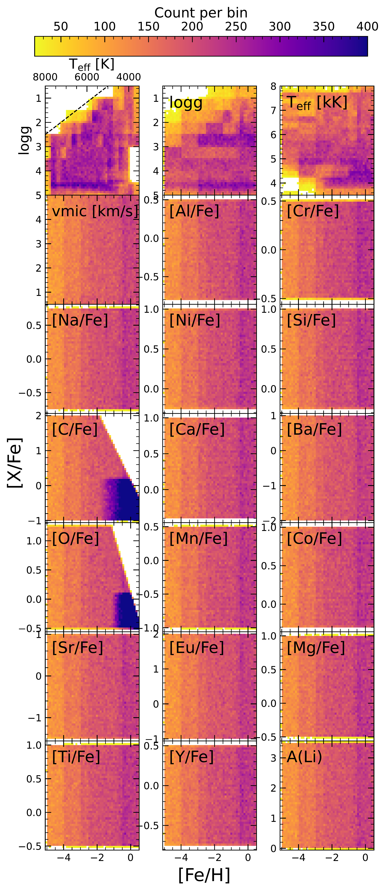
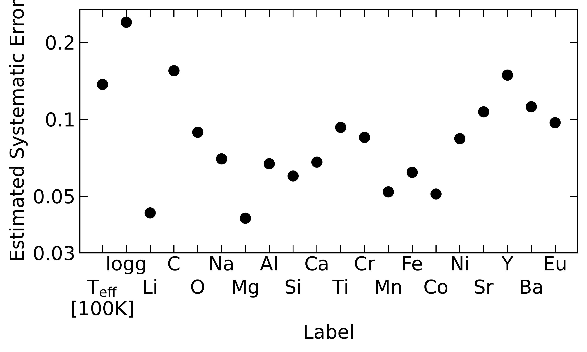

$\newcommand{\ensuremath}{}$
$\newcommand{\xspace}{}$
$\newcommand{\object}[1]{\texttt{#1}}$
$\newcommand{\farcs}{{.}''}$
$\newcommand{\farcm}{{.}'}$
$\newcommand{\arcsec}{''}$
$\newcommand{\arcmin}{'}$
$\newcommand{\ion}[2]{#1#2}$
$\newcommand{\textsc}[1]{\textrm{#1}}$
$\newcommand{\hl}[1]{\textrm{#1}}$
$\newcommand{\footnote}[1]{}$
$\newcommand{\vdag}{(v)^\dagger}$
$\newcommand$
$\newcommand$
$\newcommand{\ns}[1]{{\color{red} #1}}$
$\newcommand{\mb}[1]{{\color{brown}{\bf Maria:} #1}}$
$\newcommand{\teff}{T_{\rm eff}}$
$\newcommand{\logg}{\log g}$
$\newcommand{\vmic}{\xi_{\rm t}}$
$\newcommand{\vmac}{V_{\rm mac}}$
$\newcommand{\EW}{W_{\lambda}}$
$\newcommand{\mA}{{\rm mÅ}}$
$\newcommand{\Elow}{E_{\rm low}}$
$\newcommand{\Eup}{E_{\rm up}}$
$\newcommand{\SH}{S\!_{\rm H}}$

# Observational constraints on the origin of the elements. X. Combining NLTE and machine learning for chemical diagnostics of 4 million stars in the 4MIDABLE-HR survey

<mark>Appeared on: 2025-12-19</mark> -  _Submitted to ApJ. 12 pages + 22 pages appendix, 7 figures_

<mark>N. Storm</mark>, et al. -- incl., <mark>M. Bergemann</mark>, <mark>G. Guiglion</mark>

**Abstract:** We present 4MOST-HR resolution Non-Local Thermal Equilibrium (NLTE) Payne artificial neural network (ANN), trained on $404 793$ new FGK spectra with 16 elements computed in NLTE. This network will be part of the Stellar Abundances and atmospheric Parameters Pipeline (SAPP), which will analyse 4 million stars during the five year long 4MOST consortium 4: MIlkyway Disc And BuLgE High-Resolution (4MIDABLE-HR) survey. A fitting algorithm using this ANN is also presented that is able to fully-automatically and self-consistently derive both stellar parameters and elemental abundances. The ANN is validated by fitting 121 observed spectra of low-mass FGKM type stars, including main-sequence dwarf, subgiant and giant stars down to [ Fe/H ] $\approx -3.4$ degraded to 4MOST-HR resolution, and comparing the derived abundances with the output of the classical radiative transfer code TSFitPy. We are able to recover all 18 elemental abundances with a bias $<0.13$ and spread $<0.16$ dex, although the typical values are $<0.09$ dex for most elements. These abundances are compared to the OMEGA+ Galactic Chemical Evolution model, showcasing for the first time, the expected performance and results obtained from high-resolution spectra of the quality expected to be obtained with 4MOST. The expected Galactic trends are recovered, and we highlight the potential of using many chemical elements to constrain the formation history of the Galaxy.

**Figure 1. -** Distribution in a 2D histogram of synthetic spectra used to train the Payne. Top left panel shows the Kiel diagram, while the rest are distributions as a function of [Fe/H]. All abundances are chosen uniformly random in metallicity space, except for A(O)$< 8.87$ and A(C)$< 8.7$. There are less low metallicity giant model atmospheres, resulting in slightly less spectra at low metallicities. There are also no public MARCS models above the black line in the $\teff$-$\logg$ space, resulting in a lack of computed spectra in that regime.
 (*fig:training_dist*)

**Figure 2. -** Kiel diagram of the fitted stellar sample with [Fe/H] in colour with PARSEC evolutionary tracks  ([Bressan, et. al 2012](https://ui.adsabs.harvard.edu/abs/2012MNRAS.427..127B))  in colour.
 (*fig:hr_dia*)

**Figure 3. -** Estimated systematic error for stellar parameters and abundances. The error was estimated by taking spread of the difference between the derived parameter from Payne and literature (for $\teff$ and $\logg$ for benchmark stars from [Heiter, et. al (2015)](https://ui.adsabs.harvard.edu/abs/2015A&A...582A..49H)) or TSFitPy.
 (*fig:systematic_error*)

