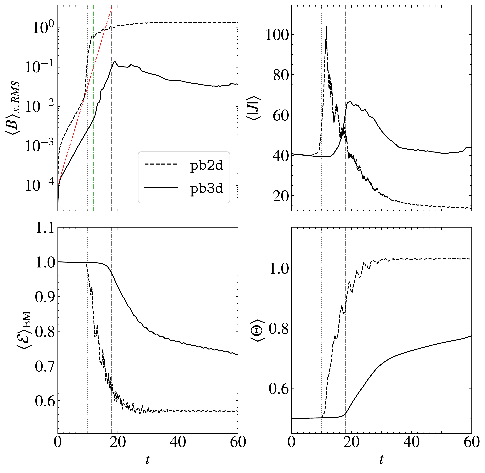

$\newcommand{\ensuremath}{}$
$\newcommand{\xspace}{}$
$\newcommand{\object}[1]{\texttt{#1}}$
$\newcommand{\farcs}{{.}''}$
$\newcommand{\farcm}{{.}'}$
$\newcommand{\arcsec}{''}$
$\newcommand{\arcmin}{'}$
$\newcommand{\ion}[2]{#1#2}$
$\newcommand{\textsc}[1]{\textrm{#1}}$
$\newcommand{\hl}[1]{\textrm{#1}}$
$\newcommand{\footnote}[1]{}$
$\newcommand{\hvec}[1]{\hat{\mathbf{#1}}}$
$\newcommand{\DS}{\displaystyle}$
$\newcommand{\pd}[2]{\frac{\partial #1}{\partial #2} }$
$\newcommand{\HALF}{\frac{1}{2}}$
$\newcommand{\THREEHALF}{\frac{3}{2}}$
$\newcommand{\av}[1]{\left<{#1} \right>}$
$\newcommand{\quotes}[1]{"#1"}$
$\newcommand{\tens}[1]{\mathsf{#1}}$
$\newcommand{\tJ}{\tilde{\vec{J}}}$
$\newcommand{\cE}{\mathcal{E}}$
$\newcommand{\cF}{\mathcal{F}}$
$\newcommand{\cH}{\mathcal{H}}$
$\newcommand{\cP}{\mathcal{P}}$
$\newcommand{\cQ}{\mathcal{Q}}$
$\newcommand{\cR}{\mathcal{R}}$
$\newcommand{\cS}{\mathcal{S}}$
$\newcommand{\cT}{\mathcal{T}}$
$\newcommand{\cU}{\mathcal{U}}$
$\newcommand{\cV}{\mathcal{V}}$
$\newcommand{\cW}{\mathcal{W}}$
$\newcommand{ç}{ {\boldsymbol{c}} }$
$\newcommand{\cf}{ f }$
$\newcommand{\xf}{ {\mathbf{x}_f} }$
$\newcommand{\yf}{ {\mathbf{y}_f} }$
$\newcommand{\zf}{ {\mathbf{z}_f} }$
$\newcommand{\xe}{ {\boldsymbol{x}_e} }$
$\newcommand{\ye}{ {\boldsymbol{y}_e} }$
$\newcommand{\ze}{ {\boldsymbol{z}_e} }$
$\newcommand{\RED}{\color{red}}$
$\newcommand{\BLACK}{\color{black}}$
$\newcommand{\BLUE}{\color{blue}}$
$\newcommand{\BROWN}{\color{brown}}$
$\newcommand{\MAGENTA}{\color{magenta}}$
$\newcommand{\GREEN}{\color{green}}$
$\newcommand{\mb}[1]{{\color{violet}MB: #1}}$
$\newcommand{\vec}[1]{\mathbf{#1}}$
$\newcommand{\arraystretch}{1.2}$
$\newcommand{\thebibliography}{\DeclareRobustCommand{\VAN}[3]{##3}\VANthebibliography}$

# 2D or not 2D? Exploring 3D relativistic magnetic reconnection dynamics with highly accurate numerical simulations

<mark>Appeared on: 2025-12-19</mark> -  _Submitted to MNRAS_

V. Berta, et al. -- incl., <mark>G. Mattia</mark>

**Abstract:** Fast reconnection in magnetically dominated plasmas is widely invoked in models of dissipation in pulsar winds, gamma-ray flares in the Crab nebula, and to explain the radio nanoshots of pulsars.When current sheets evolve reaching a critical inverse aspect ratio, scaling as $S^{-1/3}$ with the plasma Lundquist number, the so-called _ideal_ tearing instability sets in, with modes growing, independently of $S$ , extremely rapidly on timescales of only a few light-crossing times of the sheet length.We present the first set of fully 3D simulations of current-sheet disruption triggered by the ideal tearing instability within the resistive relativistic MHD approximation, as appropriate in situations where the Alfvén velocity approaches the speed of light.We compare 3D setups with different initial conditions with their 2D counterparts, and we assess the impact of dimensionality and of the magnetic field topology on the onset, evolution, and efficiency of reconnection.In force-free configurations, 3D runs develop ideal tearing, secondary instabilities, and a thick, turbulent current layer, sustaining dissipation of magnetic energy longer than in 2D.In pressure-balanced current sheets with a null guide field, 2D reference runs show the familiar reconnection dynamics, whereas in 3D tearing dynamics is quenched after the linear phase, as pressure-driven modes growing on forming plasmoids outcompete plasmoid coalescence and suppress fast dissipation of magnetic energy.Taken together, these results suggest that the evolution and efficiency of reconnection depend sensitively on the local plasma conditions and current-sheet configuration, and can be properly captured only in fully 3D simulations.

**Figure 3. -** \small Temporal evolution of the root-mean-square of the magnetic field component $B_{x}$(upper left panel), the module of $|\nabla \times $\vec${B}|$ as proxy for the non-relativistic electric current $|J|$(upper right), electromagnetic energy normalized to its initial value ${\cal E}_{\text{EM}} =(E^2 + B^2)/(E_0^2 + B_0^2)$(lower left), and the average relativistic temperature ${\Theta} = p/\rho$(lower right) for simulations initialized with the pressure-balanced equilibrium. All quantities integrated over the uniform portion of the computational volume are indicated with the $\av $ symbol.
  Time is given in units of the light-crossing time of half the sheet length, $\tau_c = L/c$.
  The black dotted and dash-dotted vertical lines mark, respectively, the transition to the non-linear regime. In the upper-left panel, the green dash-dotted line identifies the time at which the linear phase terminates in the corresponding force-free reference run, and the red dashed line marks the slope of the linear growth rate of ideal tearing in models \texttt{ff2d} and \texttt{ff3d}.
 (*fig:PB_time_evolution*)

**Figure 1. -** \small Temporal evolution of the root-mean-square of the magnetic field component $B_{x}$(upper left panel), the magnitude of the total electric current $|J|$(upper right), the electromagnetic energy ${\cal E}_{\text{EM}} = (E^2 + B^2)/(E_0^2 + B_0^2)$ normalized to its initial value (bottom-left), and the temperature ${\Theta} = p/\rho$(bottom-right) for simulations initialized with the force-free equilibrium.
  All volume-integrated quantities are indicated with the $\av $ symbol.
  Time is given in units of the light-crossing time of half the sheet length, $\tau_c = L/c$.
  The black dotted and dash-dotted vertical lines mark, respectively, the transition to the non-linear regime.
 (*fig:FF_time_evolution*)

**Figure 2. -** \small Snapshot of the module of the $z$-component of $|\nabla \times $\vec${B}|$ used as a proxy for $|J_z|$ in the plane $z = 0$ for model \texttt{ff2d}(left column), and module \texttt{ff3d}(right column) at three different times: $t = 5\tau_c$(top row), $t = 10\tau_c$(middle row), $t = 15\tau_c$(bottom row).
 (*fig:FF_xy_plane*)

