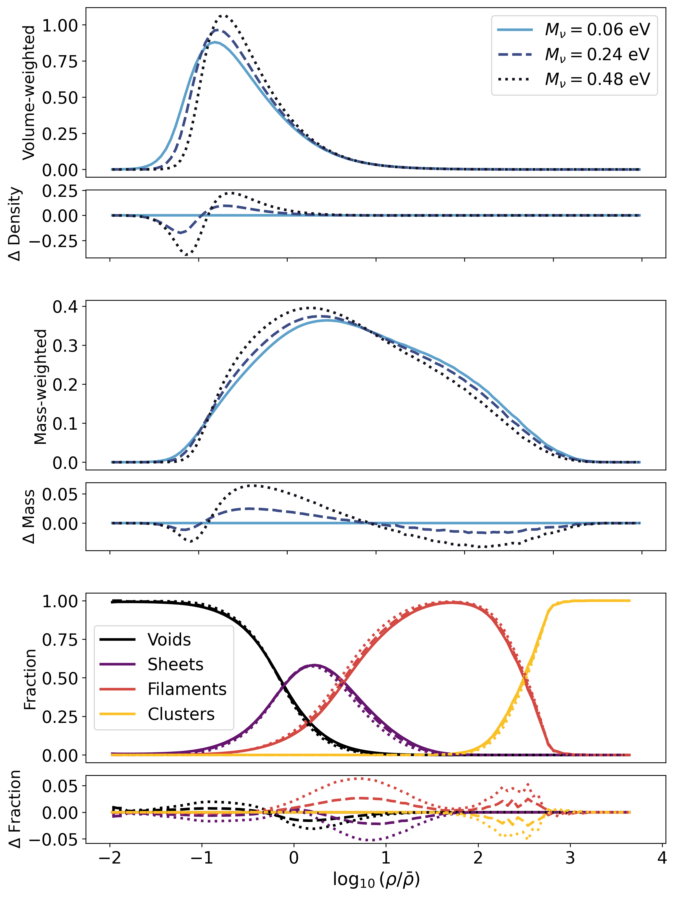
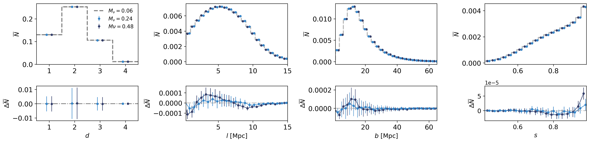
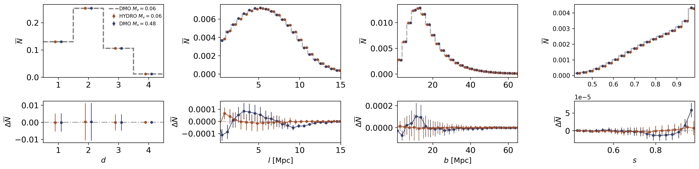

$\newcommand{\ensuremath}{}$
$\newcommand{\xspace}{}$
$\newcommand{\object}[1]{\texttt{#1}}$
$\newcommand{\farcs}{{.}''}$
$\newcommand{\farcm}{{.}'}$
$\newcommand{\arcsec}{''}$
$\newcommand{\arcmin}{'}$
$\newcommand{\ion}[2]{#1#2}$
$\newcommand{\textsc}[1]{\textrm{#1}}$
$\newcommand{\hl}[1]{\textrm{#1}}$
$\newcommand{\footnote}[1]{}$
$\newcommand{\strike}[1]{\sout{#1}}$
$\newcommand{\knedit}[1]{\textcolor{purple}{#1}}$
$\newcommand{\lsedit}[1]{\textcolor{brown}{#1}}$
$\newcommand{\thebibliography}{\DeclareRobustCommand{\VAN}[3]{##3}\VANthebibliography}$

# How massive neutrinos reshape the cosmic web

<mark>Appeared on: 2025-12-19</mark> -  _10 pages, 6 figures_

L. N. L. Simões, et al. -- incl., <mark>K. Naidoo</mark>

**Abstract:** We explore the effects of massive neutrinos on the cosmic web using the FLAMINGO simulations. We classify the cosmic web into voids, sheets, filaments, and clusters, and find that massive neutrinos affect the environment by decreasing the volume occupied by clusters and voids. We find that increasing the neutrino mass shifts the volume-weighted density distribution towards higher densities and leads to a more narrow density distribution, which we interpret as neutrinos delaying structure formation. We construct the minimum spanning tree (MST) graph from the subhaloes, adopting a number density chosen to match that expected for DESI-like observations. We show that most MST edges lie in filaments, approximately $70\%$ throughout different simulations, which we link to its sensitivity to neutrino mass. We also link the MST's edge length signal at different scales to different cosmic web environments, with clusters dominating the signal at small scales, voids at longer scales, and filaments at intermediate scales. The strong correlation between MST edges and cosmic web environments reinforces the MST’s potential to be used as a classifier for large-scale structure in galaxy surveys. We compare the effects of baryonic physics and massive neutrinos and find that each produces distinct signatures in MST edge lengths. This analysis is performed in 3D space, using the true positions of subhaloes and not accounting for redshift space distortions. Nevertheless, these results emphasise the MST's capability to go beyond two-point statistics, motivating future applications to real observational data.

**Figure 5. -** Histograms of the distribution of the edge lengths ($l$) in the MST separated into each classification of the cosmic web that they are tracing. In Fig. \ref{fig:neut_edges} we plot the total probability distribution function (PDF), normalised to total counts. In Fig. \ref{fig:neut_PDF_edges} we plot the individual PDFs, normalised for each classification. These plots come from the analysis of the DMO$+\nu$ simulation with $M_\nu = 0.06 \:{\rm eV }$, but the relations are similar for all simulations. (*fig:edges_neutrinos*)

**Figure 2. -** The normalised density (top) and mass-weighted density (middle) distributions for each neutrino mass. The top panels show the total density whereas in the bottom panels we subtract the $M_{\nu}=0.06\:{\rm eV  }$ distribution from the other two. In the bottom panel we split by cosmic web environment to show which components dominate at different densities. (*fig:density_models*)

**Figure 6. -** A comparison between the histogram distributions of the MST statistics in different models, using 500 000  haloes for the MST. In Fig. \ref{fig:neut_MST} we compare different neutrinos masses, and in Fig. \ref{fig:Baryon_MST} we compare the effect of baryons and the effect of massive neutrinos. In the top panels we show the distributions of the degrees (_d_), edge lengths (_l_), branch lengths (_b_), and branch shapes (_s_). The bottom panels show the differences between the PDFs, subtracting the initial $M_\nu = 0.06\:{\rm eV  }$ distribution (the dashed black line shows zero) from each model. (*fig:mst_comp*)

