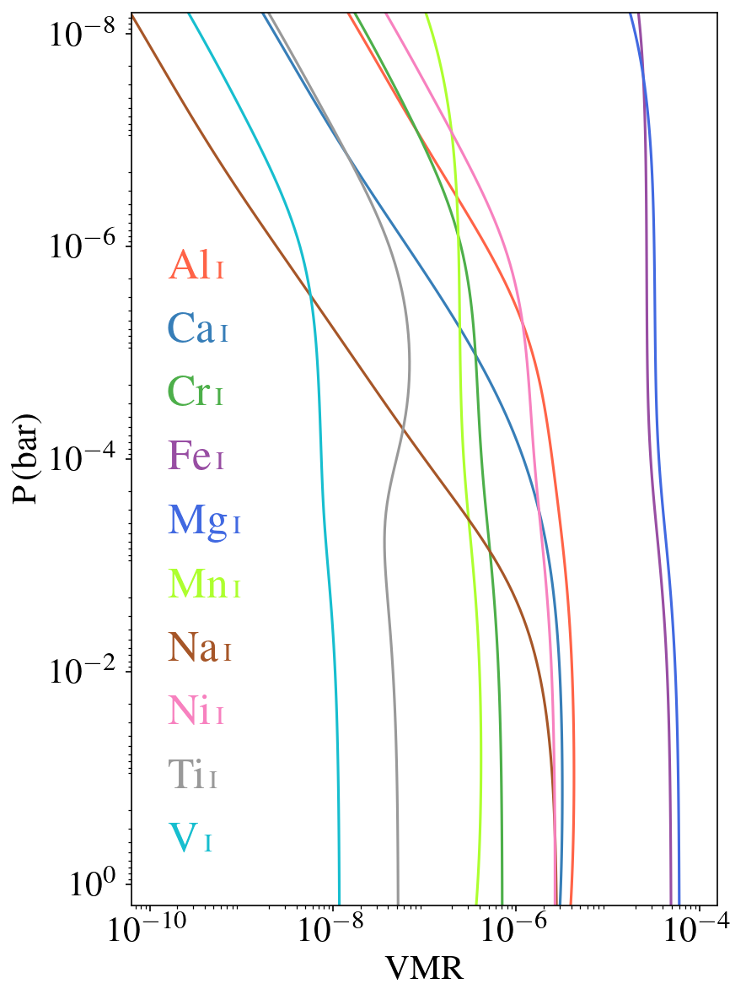
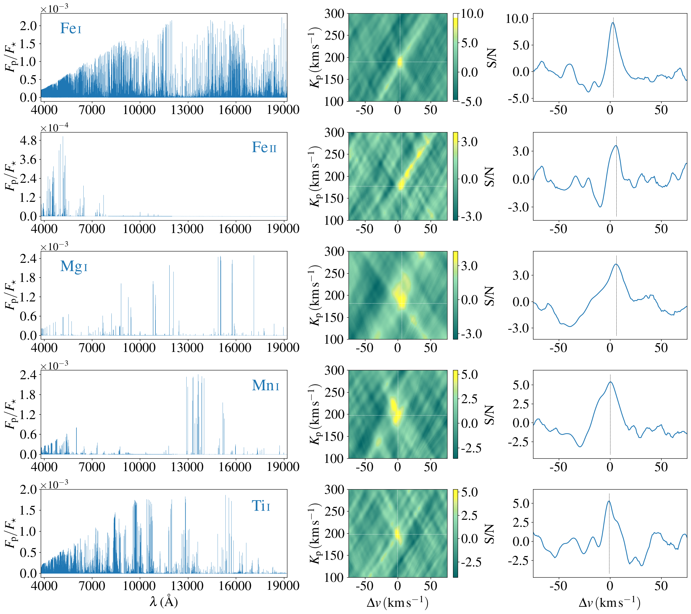

$\newcommand{\ensuremath}{}$
$\newcommand{\xspace}{}$
$\newcommand{\object}[1]{\texttt{#1}}$
$\newcommand{\farcs}{{.}''}$
$\newcommand{\farcm}{{.}'}$
$\newcommand{\arcsec}{''}$
$\newcommand{\arcmin}{'}$
$\newcommand{\ion}[2]{#1#2}$
$\newcommand{\textsc}[1]{\textrm{#1}}$
$\newcommand{\hl}[1]{\textrm{#1}}$
$\newcommand{\footnote}[1]{}$
$\newcommand{\arraystretch}{1.2}$
$\newcommand{\arraystretch}{1.2}$
$\newcommand{\arraystretch}{1.2}$
$\newcommand{\arraystretch}{1.2}$

# Elemental abundance pattern and temperature inversion on the dayside of HAT-P-70b observed with CARMENES and PEPSI

<mark>Appeared on: 2025-12-29</mark> -  _18 pages, 15 figures. Accepted for publication in A&A_

B. Guo, et al. -- incl., <mark>T. Henning</mark>

**Abstract:** Ground-based high-resolution spectroscopic observations have identified various chemical species in the atmosphere of numerous ultra-hot Jupiters (UHJs), including neutral and ionized metals. These detections have offered valuable insights into planet formation mechanisms via abundance measurements of refractory elements. We observed the dayside thermal emission spectrum of UHJ $\mbox{HAT-P-70b}$ using the high-resolution spectrographs CARMENES and PEPSI. Through our cross-correlation analysis, we detected emission signals for $\ion{Al}{i}$ , AlH, $\ion{Ca}{ii}$ , $\ion{Cr}{i}$ , $\ion{Fe}{i}$ , $\ion{Fe}{ii}$ , $\ion{Mg}{i}$ , $\ion{Mn}{i}$ , and $\ion{Ti}{i}$ , marking the first detection of $\ion{Al}{i}$ and AlH in an exoplanetary atmosphere. Tentative signals of $\ion{C}{i}$ , $\ion{Ca}{i}$ , $\ion{Na}{i}$ , NaH, and $\ion{Ni}{i}$ were also identified. Based on those detections, we were able to perform atmospheric retrievals to constrain the thermal profile and elemental abundances of the planet’s dayside hemisphere. The retrieved temperature-pressure profile reveals a strong temperature inversion layer. The chemical free retrieval yielded a metallicity of $\mathrm{[Fe/H]} = 0.38^{+0.74}_{-1.11}$ , while the chemical equilibrium retrieval resulted in $\mathrm{[Fe/H]} = 0.23^{+1.08}_{-0.98}$ , with both values consistent with the solar metallicity. We also tentatively found an enriched abundance of Ni, which could result from the accretion of Ni-rich planetesimals during the planet’s formation. On the other hand, elements with condensation temperatures above 1400 K (e.g., Ca, Ti, and V) appear to be slightly depleted, possibly due to cold-trapping on the planet’s nightside. However, Al, with the highest condensation temperature at 1653 K, displays a solar-like abundance, which might reflect the formation-related enrichment of Al. Our retrieval indicates extremely high volume mixing ratios of metal ions ( $\ion{Fe}{ii}$ and $\ion{Ca}{ii}$ ), which are significantly inconsistent with predictions from chemical equilibrium models. This disequilibrium suggests that the atmosphere is likely undergoing significant hydrodynamic escaping, which enhances the atmospheric density at high altitudes where the ionic lines are formed.

**Figure 7. -** Model spectra and S/N maps for $\ion${Al}{i}, AlH, $\ion${Ca}{ii}, and $\ion${Cr}{i}. _Left panels_: Model spectra for each chemical species. _Middle panels_: Corresponding S/N maps, combining data from both CARMENES and PEPSI instruments. The white dotted lines indicate the position of $K_\mathrm{p}$--$\Delta v$ where the S/N reaches its maximum. _Right panels_: CCFs at the $K_\mathrm{p}$ values corresponding to the maximum S/N detections. (*Kpmap_signal1*)

**Figure 5. -** Volume mixing ratios of all targeted metal atoms as a function of pressure at a fixed isothermal temperature of 2500 K under the assumption of chemical equilibrium. All elemental abundances are assumed to be solar. The results are illustrative calculations intended to demonstrate metal ionization, rather than retrieval results. (*VMR_metal*)

**Figure 8. -** Same as Fig. \ref{Kpmap_signal1}, but for $\ion${Fe}{i}, $\ion${Fe}{ii}, $\ion${Mg}{i}, $\ion${Mn}{i}, and $\ion${Ti}{i}. (*Kpmap_signal2*)

