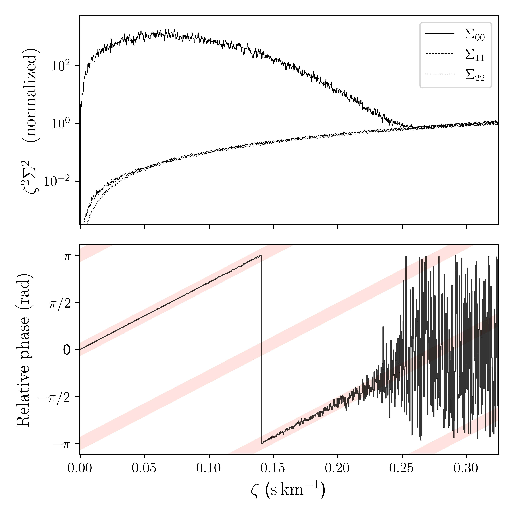

$\newcommand{\ensuremath}{}$
$\newcommand{\xspace}{}$
$\newcommand{\object}[1]{\texttt{#1}}$
$\newcommand{\farcs}{{.}''}$
$\newcommand{\farcm}{{.}'}$
$\newcommand{\arcsec}{''}$
$\newcommand{\arcmin}{'}$
$\newcommand{\ion}[2]{#1#2}$
$\newcommand{\textsc}[1]{\textrm{#1}}$
$\newcommand{\hl}[1]{\textrm{#1}}$
$\newcommand{\footnote}[1]{}$
$\newcommand{\barak}[1]{{\color{blue} #1}}$
$\newcommand{\sahar}[1]{{\color{magenta} #1}}$
$\newcommand{\thebibliography}{\DeclareRobustCommand{\VAN}[3]{##3}\VANthebibliography}$

# A Linearized Approach to Radial-Velocity Extraction. II: Shot-Noise-Limited Precision via Spectral Factorization

<mark>Appeared on: 2025-12-31</mark> -  _Submitted for publication in MNRAS_

<mark>S. Shahaf</mark>, B. Zackay

**Abstract:** We generalize the short-time Fourier transform (STFT) formalism for radial velocity extraction to cases where the underlying spectral components are unknown. The method factorizes a spectroscopic time series into principal spectra and time-dependent kernels, enabling simultaneous recovery of both. In Fourier space, each inverse-wavelength slice is decomposed by singular value decomposition, and radial velocity shifts are inferred from phase differences between epochs. In the high-SNR regime, this provides a linearized and statistically tractable estimate of differential velocities. The method is validated on synthetic and SOAP simulations and applied to EXPRES observations of HD 34411 and $\tau$ Ceti, recovering coherent signals and reaching the instrumental precision limit of ${\sim}30$ cm s \textsuperscript{-1} . Apart from p-mode modulation, the residuals show no significant long-term correlations and allow the detection of signals with semi-amplitudes down to ${\sim}50$ cm s \textsuperscript{-1} with $\lesssim10$ cm s \textsuperscript{-1} uncertainty. The framework thus enables extreme-precision radial velocity measurements in the presence of spectral variability, representing a step toward detecting and characterizing Earth-like planets around solar-type stars.

**Figure 1. -** _Top panel_---the normalized information in the first three principal spectra (corresponding to $\Sigma_{00}$, $\Sigma_{11}$ and $\Sigma_{22}$) versus their corresponding inverse-wavelength, $\zeta$, for the simulated white-noise spectroscopic time-series. All values are normalized to $\Sigma_{00}$ at $\zeta=0$.  _Bottom panel_---relative phases between the first and fourth simulated spectra, shown as a solid black line. The red stripes correspond to the expected relative phase due to the velocity difference between the two observations, i.e., $2\pi \zeta \times (v_4-v_1)$. Notably, the relative phase follows the expected trend for inverse wavelength below $\sim 0.2$ s km\textsuperscript{-1}, where the information content falls below the noise level. (*fig: singular values vs zeta*)

**Figure 9. -** _Top panels_---The rectified velocities, $v_{\rm c}$, extracted for the SOAP simulation described in Section \ref{sec: SOAP}. The simulated spectroscopic dataset is based on a synthetic spectrum of a Sun-like star, and the noise is assumed to be white and Gaussian. The injected radial velocity signal is a solid red curve.
        _Middle panels_---the extracted velocities from the zeroth-order kernel, $U^{(0)}$. These velocities show a combination of the injected Doppler shift and parasitic signal induced by stellar activity.
        _Bottom panels_---the extracted velocities from the first-order kernel, $U^{(1)}$, dominated by stellar activity. The solid red curve represents the fitted 5-harmonic model fitted to the extracted velocities (see text). (*fig: RV extraction soap*)

**Figure 8. -** _Top panel_---a selected segment from one of the simulated spectra used in Section \ref{sec: phase ratios}, centered around the MgB lines ($T_{\rm eff}=5{,}800   {\rm K}$; $\log g = 4.5$; ${\rm[Fe/H]}=0$; $v \sin i = 2  {\rm km  s}^{-1}$; and $\mathcal{R}=10^5$). _Bottom left panel_---the zeroth-order estimated of the principal kernels obtained from $\mathbf{U}_\zeta$, for the first seven spectra. The kernels are normalized such that their peak value is one and sorted one on top of the other. The arrows represent the Doppler shift used for each spectrum.
        _Bottom right panel_---same as the bottom-left panel, but using the reweighted matrices $\mathbf{U}_\zeta \Sigma_\zeta$. (*fig: U0 SVD*)

