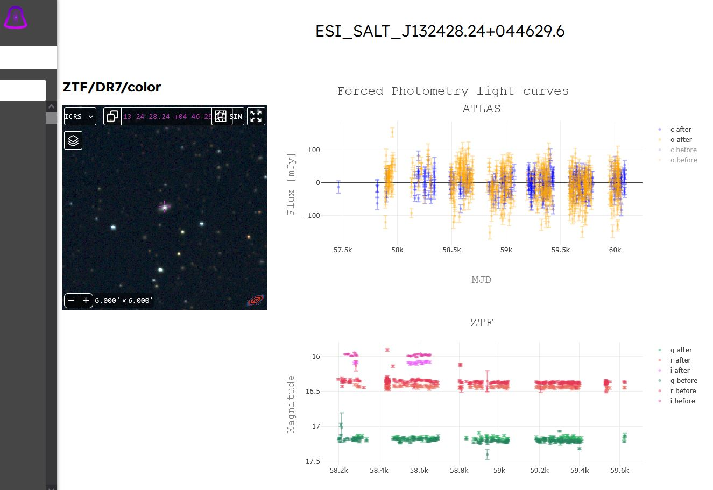
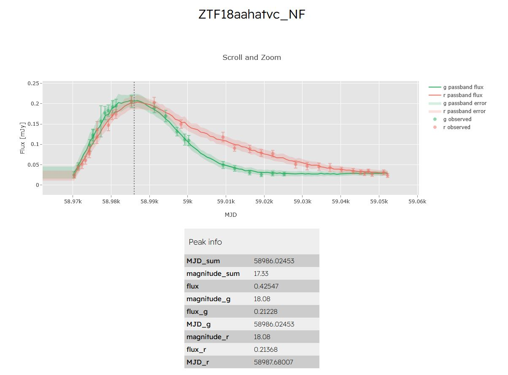

$\newcommand{\ensuremath}{}$
$\newcommand{\xspace}{}$
$\newcommand{\object}[1]{\texttt{#1}}$
$\newcommand{\farcs}{{.}''}$
$\newcommand{\farcm}{{.}'}$
$\newcommand{\arcsec}{''}$
$\newcommand{\arcmin}{'}$
$\newcommand{\ion}[2]{#1#2}$
$\newcommand{\textsc}[1]{\textrm{#1}}$
$\newcommand{\hl}[1]{\textrm{#1}}$
$\newcommand{\footnote}[1]{}$
$\newcommand{\thesection}{\Alph{section}.\arabic{section}}$

# **Website with interactive visualization of multivariate astronomical time series**

<mark>Appeared on: 2026-01-06</mark> -  _7 pages, 3 figures, accepted to Communications of BAO, Vol.72, Issue 2, 2025, pp.334-340_

M. Volkov$\star$, et al.

**Abstract:** Light curves represent astronomical time series of flux measured across one or more photometric bands. With the rapid growth of large-scale sky surveys, time-domain astronomy has become an essential area of modern astrophysical research. Interactive visualization of extensive light-curve datasets plays a key role in exploring transient phenomena and in planning large follow-up campaigns. In this work, we introduce two web-based platforms designed for interactive light-curve visualization: ${\sc Fulu}$ , for transient event studies, and VALC, for investigations of low-mass active galactic nuclei (AGNs). These tools provide a user-friendly interface for examining, comparing, and interpreting vast collections of astronomical light curves, supporting scientific discovery.

**Figure 1. -** (a) Sequence diagram illustrating the data flow between the user, frontend, API, and MongoDB when displaying and plotting object data using Plotly. (b) Component diagram illustrating simple architecture of the system. (*fig: seq*)

**Figure 2. -** Interface example of the low-mass AGN light curves visualization at the VALC page. (*fig: screen_valc*)

**Figure 3. -** Interface example of the transient event light curve, approximated by normalizing flows at the {\sc Fulu} page. (*fig: screen_fulu*)

