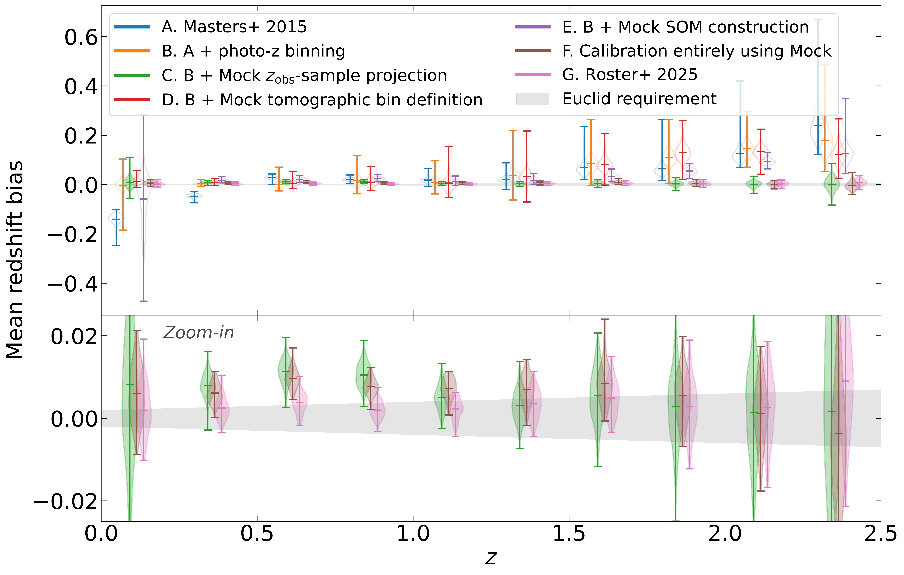

$\newcommand{\ensuremath}{}$
$\newcommand{\xspace}{}$
$\newcommand{\object}[1]{\texttt{#1}}$
$\newcommand{\farcs}{{.}''}$
$\newcommand{\farcm}{{.}'}$
$\newcommand{\arcsec}{''}$
$\newcommand{\arcmin}{'}$
$\newcommand{\ion}[2]{#1#2}$
$\newcommand{\textsc}[1]{\textrm{#1}}$
$\newcommand{\hl}[1]{\textrm{#1}}$
$\newcommand{\footnote}[1]{}$
$\newcommand{\orcid}[1]$
$\newcommand{\arraystretch}{1.3}$

# $\Euclid$: Improving redshift distribution reconstruction using a deep-to-wide transfer function$\thanks{This paper is published on behalf of the Euclid Consortium.}$

<mark>Appeared on: 2026-01-06</mark> - 

Y. Kang, et al. -- incl., <mark>K. Jahnke</mark>

**Abstract:** The $\Euclid$ mission of the European Space Agency seeks to understand the Universe’s expansion history and the nature of dark energy, through measurements of cosmic shear. This requires a very accurate estimate of the true redshift distribution of the galaxies, with the systematic error in the mean redshift satisfying $\sigma_{\langle z\rangle}<0.002(1+z)$ per tomographic bin. Achieving this accuracy relies on reference samples with spectroscopic redshifts, together with a procedure to match them to survey sources for which only photometric redshifts are available. One important source of systematic uncertainty is the mismatch in photometric properties between galaxies in the $\Euclid$ survey and the reference objects. We develop a method to degrade the photometry of objects with deep photometry to match the properties of any shallower survey in the multi-band photometric space, preserving all the correlations between the fluxes and their uncertainties. We compare our transfer method with more demanding image-based methods, such as Balrog from the Dark Energy Survey Collaboration. According to our metrics, our method outperforms Balrog. We implement our method in the redshift distribution reconstruction, based on the self-organising map approach of Masters_2015 , and test it using a realistic sample from the $\Euclid$ Flagship Mock Galaxy Simulation. We find that the key ingredient is to ensure that the reference objects are distributed in the colour space the same way as the wide-survey objects, which can be efficiently achieved with our transfer method. In our best implementation, the mean redshift biases are consistently reduced across the tomographic bins, bringing a significant fraction of them within the Euclid accuracy requirements in all tomographic bins. Equally importantly, the tests allow us to pinpoint which step in the calibration pipeline has the strongest impact on achieving the required accuracy. Our approach also reproduces the overall redshift distributions, which are crucial for applications such as angular clustering. The agreement between the reconstructed and true distributions demonstrates both the feasibility and robustness of the approach. This implementation is sufficient for Euclid Data Release 1 and provides a solid foundation for subsequent data releases.

**Figure 7. -** Mean redshift bias for different configurations of the calibration pipeline, shown as a function of redshift for ten equal-$z$ tomographic bins. The bias is computed relative to the true mean redshifts of the wide-sample $n(z)$ distributions. Violin points represent the distribution of 70 realisations, where violin points with face colour indicate calibration that used MPT-Mock-sample objects for projection and $n(z)$ reconstruction and points with no face colour indicate the projection and reconstruction are done by using deep-sample objects. The grey shaded region indicates the \Euclid requirements for $n(z)$ accuracy in weak lensing cosmology. Blue data points represent Scenario A (original  (Masters_2015)  method); Orange data points show Scenario B (photo-$z$s are used to define the tomographic binning); Green ones Scenario C ($z_{\mathrm{obs}}$ projection replaced with MPT-Mock-sample objects); Red data points show Scenario D (Tomographic bin defined by MPT-Mock-sample objects); Purple data points are Scenario E (SOM constructed by MPT-Mock-sample objects); Brown data points show Scenario F where full calibration is based on MPT-Mock-sample. The pink data points correspond to Scenario G, use the per-object photo-$z$ binning introduced in Roster_2025. The data points have been slightly shifted along the $x$-axis for clarity. (*fig:nz*)

**Figure 1. -** Projection of sources onto the self-organising map (SOM) trained using 8-band photometric data. Each SOM cell consists of objects with similar spectral energy distributions (SEDs). The background grayscale indicates the number of objects mapped to each cell. The red dot marks the true flux of a selected object projected onto the SOM, while the blue and green markers show 50 independent realisations of the same object with Deep and Wide photometric noise, respectively.
 (*fig:deep_to_wide*)

**Figure 2. -** {Left}: Comparison between RF photo-$z$ estimates and spectroscopic redshifts for objects in the MPT-Mock sample. A magnitude cut of $\IE\!<\!25$ and an S/N$ \geq\!10$ cut on the \IE-band photometry are applied. {Right}: Comparison of RF photo-$z$ estimates between matched objects in the Wide and MPT-Mock catalogues. The NMAD of the residuals and the outlier fractions are indicated in the figures, sources with $|z_{\mathrm{ph}}-z_{\mathrm{obs}}|>0.15(1+z_{\mathrm{obs}})$ being defined as outliers.  (*fig:photozspecz*)

