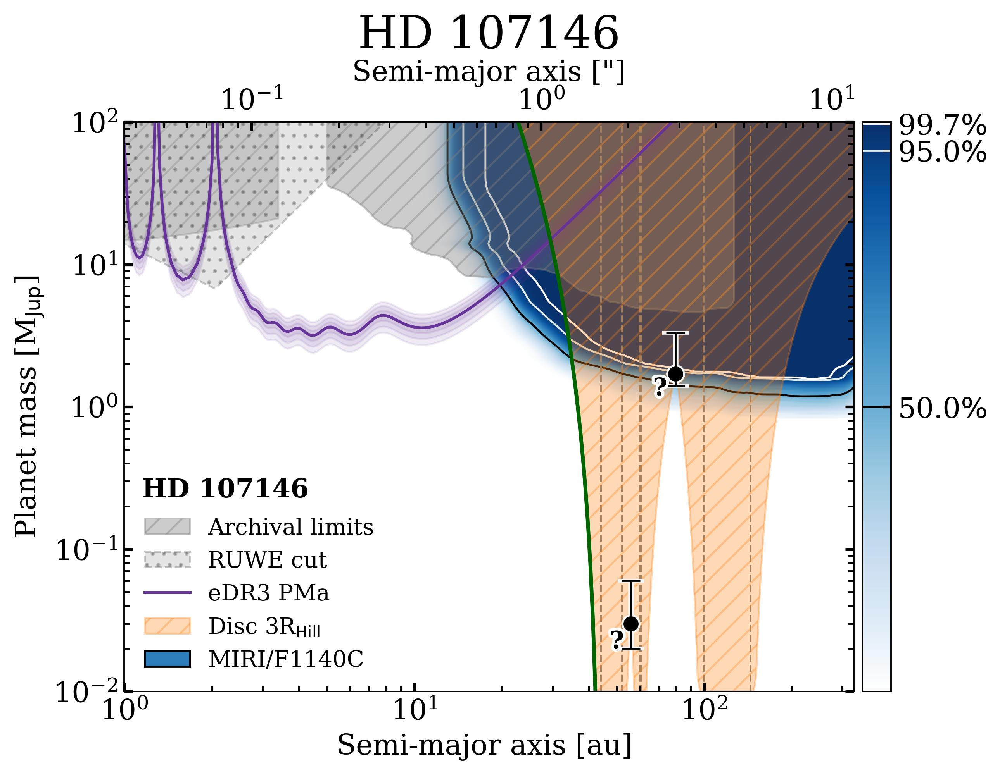
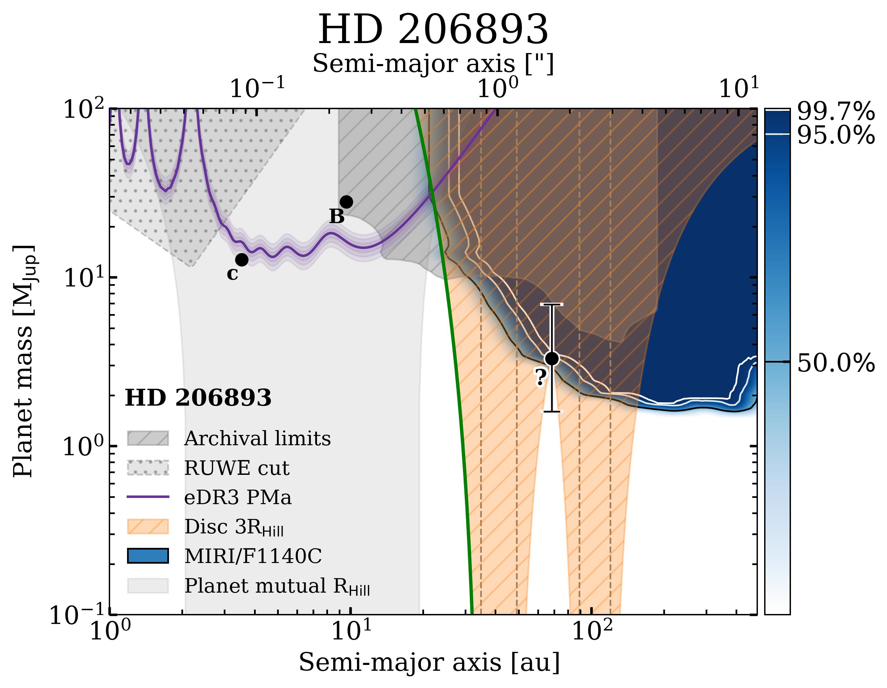
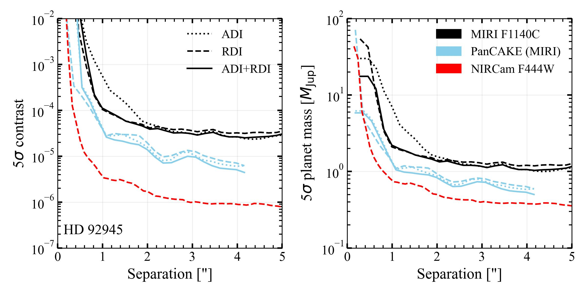
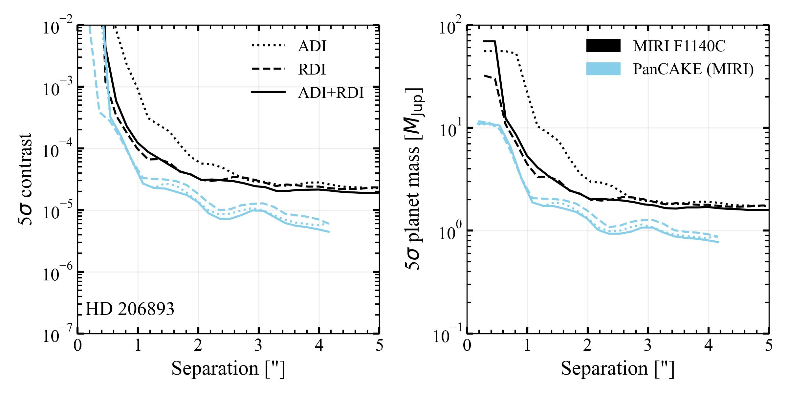

$\newcommand{\ensuremath}{}$
$\newcommand{\xspace}{}$
$\newcommand{\object}[1]{\texttt{#1}}$
$\newcommand{\farcs}{{.}''}$
$\newcommand{\farcm}{{.}'}$
$\newcommand{\arcsec}{''}$
$\newcommand{\arcmin}{'}$
$\newcommand{\ion}[2]{#1#2}$
$\newcommand{\textsc}[1]{\textrm{#1}}$
$\newcommand{\hl}[1]{\textrm{#1}}$
$\newcommand{\footnote}[1]{}$
$\newcommand{\Mjup}{M_{\mathrm{Jup}}}$
$\newcommand{\Rhill}{R_{\mathrm{Hill}}}$
$\newcommand{\rev}[1]{\textbf{{#1}}}$
$\newcommand{\arraystretch}{1.2}$
$\newcommand{\thebibliography}{\DeclareRobustCommand{\VAN}[3]{##3}\VANthebibliography}$

# _JWST_/MIRI coronagraphic search for planets in systems with gapped exoKuiper belts and proper motion anomalies

<mark>Appeared on: 2026-01-06</mark> -  _23 pages, 10 figures, Accepted for publication in MNRAS_

R. Bendahan-West, et al. -- incl., <mark>T. Henning</mark>

**Abstract:** Over the past decade, ALMA has uncovered a range of substructures within exoKuiper belts, pointing to a population of undetected planets. With _JWST_ 's sensitivity, we now have the opportunity to identify these planets thought to be responsible for the observed substructures in debris discs. We present Cycle 1 _JWST_ /MIRI $11.4 \mu$ m coronagraphic observations of three exoKuiper belts that exhibit gaps in their radial structures: HD 92945, HD 107146, and HD 206893, to determine whether planets are responsible for carving these structures, as seen in our Solar System with the gas giants. We reduce the _JWST_ /MIRI data using \texttt{spaceKLIP} , and introduce new routines to mitigate the Brighter-Fatter effect and persistence. We do not detect any planet candidates, and all detected objects in the field-of-view are consistent with background stars or galaxies. However, by combining _JWST_ mass limits, archival observational constraints, and astrometric accelerations, we rule out a significant portion of planet parameter space, placing tight constraints on the planets possibly responsible for these gaps. To interpret these results, we explore multiple gap-carving scenarios in discs, either massless or with non-zero mass, including clearing by in-situ planet(s), as well as shaping by inner planets through mean-motion or secular apsidal resonances. Finally, we conclude that the planets causing the proper motion anomaly in these systems must reside within the inner 20 au.

**Figure 2. -** DPMs for HD 92945, HD 107146, and HD 206893 (top to bottom). The blue shading shows the probability of a 5$\sigma$ planet detection with MIRI at 11.4 \micron, with contours marking the 50, 95 and 99.7\% confidence levels. For HD 92945, the red dash-dotted line shows the 99.7\% detection limit from NIRCam at 4.4 \micron. The darker grey shaded regions denote constraints from archival direct imaging and RV data, and grey dotted regions from Gaia astrometry (RUWE). The orange hatching marks limits imposed by the disc morphology, where planets within 3 $\Rhill$ of the disc edges would disrupt it (\S\ref{subsec: disc stability}). The purple curve describes the planet mass and separation combinations required to explain the observed PMa signal. The green solid line highlights the orbital parameters for a planet shaping the disc inner edge (\S\ref{constraints inner edge}), and the black dot with a question mark marks the possible parameters for a planet located at the centre of the gaps in a massless disc (\S\ref{sec: single-planet-massless-disc}). For HD 206893, the light-grey region rules out planet parameters to ensure planet stability based on mutual $\Rhill$. All DPM components are detailed in \S\ref{sec: DPM}. (*fig:detectability*)

**Figure 1. -** Calibrated $5\sigma$ contrast curves (left) for the MIRI 1140C observations with the respective mass sensitivities in units of $\Mjup$ (right), as a function of projected separation. Black curves correspond to MIRI F1140C contrasts, blue curves correspond to \texttt{PanCAKE} contrast predictions, and for HD 92945 only, the red curve corresponds to the NIRCam F444W contrast \citep[from GO 3989,][]{Lazzoni_2025}. The different line styles represent contrast obtained using different PSF subtraction techniques (i.e., ADI, RDI, and ADI+RDI). All contrasts were calculated with \texttt{spaceKLIP} using the maximum number of KL modes and with 1 annulus/1 subsection. (*fig:contrast curves*)

**Figure 8. -** Comparison between the $11.4 \mu$m _JWST_/MIRI data (top row) and archival ALMA observations (bottom row) for HD 92945, HD 107146, and HD 206893 obtained from \citet[][respectively]{marino_2019, marino_2018, marino_2020}. The radial extent of the ALMA disc is over-plotted on the _JWST_ data to guide the eye. The positions of the sources in the _JWST_ observations are traced back to account for the proper motion of these stars to determine whether they are co-moving or background objects. Solid yellow circles indicate sources observed in both _JWST_ and ALMA (C1, C2, and C3 in HD 92945, and C3 in HD 206893), while dashed yellow circles denote sources without ALMA counterparts (C4 in HD 92945, C1 in HD 107146, and C1 and C2 in HD 206893). Only C4 in HD 92945 is consistent with being a star, while the others are consistent with background galaxies.The scale bar in the bottom right corner represents a projected distance of 50 au. The white circle in the bottom left corner of the ALMA plots denotes the beam size used in the observations. (*fig:bkg_vetting*)

