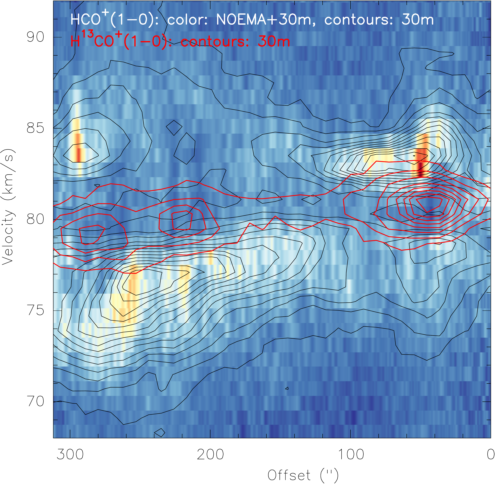

$\newcommand{\ensuremath}{}$
$\newcommand{\xspace}{}$
$\newcommand{\object}[1]{\texttt{#1}}$
$\newcommand{\farcs}{{.}''}$
$\newcommand{\farcm}{{.}'}$
$\newcommand{\arcsec}{''}$
$\newcommand{\arcmin}{'}$
$\newcommand{\ion}[2]{#1#2}$
$\newcommand{\textsc}[1]{\textrm{#1}}$
$\newcommand{\hl}[1]{\textrm{#1}}$
$\newcommand{\footnote}[1]{}$
$\newcommand{\pdeg}{\ifmmode \setbox0=\hbox{^{\circ}}\rlap{\hskip.11\wd0 .}^{\circ}$
$  \else \setbox0=\hbox{^{\circ}}\rlap{\hskip.11\wd0 .}^{\circ}\fi}$
$\newcommand\natexlab{#1}$

# The converging gas flow around the infrared dark cloud G28.37

<mark>Appeared on: 2026-01-13</mark> -  _16 pages, 11 figures, accepted for A&A_

<mark>H. Beuther</mark>, et al. -- incl., <mark>C. Gieser</mark>, <mark>H. Linz</mark>, <mark>D. Semenov</mark>, <mark>M. Wells</mark>

**Abstract:** How dense clouds and star-forming regions form out of the      dynamical interstellar medium is at the heart of star formation      research. The G28.37+0.07 star-forming region is a prototypical infrared dark cloud      (IRDC) located at the interface of a      converging gas flow. This study characterizes the properties of      this dynamic gas flow. Combining data from the Northern Extended Millimeter Array      (NOEMA) with single-dish data from the IRAM 30 m observatory, we mapped large spatial scales ( $\sim$ 81 pc $^2$ ) at high      angular resolution ( $7.0"\times 2.6"$ corresponding $\sim$ 2.3 $\times 10^4$ au or $\sim$ 0.1 pc) down to core      scales. The spectral setup in the 3 mm band covers many      spectral lines as well as the continuum emission. The data clearly reveal the proposed west-east converging gas flow in  all observed dense gas tracers. We estimate a mass-flow rate along  that flow around $10^{-3}$ M $_{\odot}$ yr $^{-1}$ . Comparing  these west-east flow rates to infall rates toward sources along the  line of sight, the gas flow rates are roughly a factor  of 25 greater than than those along the line of sight (roughly  perpendicular to the west-east flow). This confirms the dominance of  longitudinal motions along the converging gas flow in this  region. For comparison, in the main north-south IRDC formed  by the west-east converging gas flow, infall rates along the  line of sight are about an order of magnitude greater than those along the  west-east flow. In addition to the kinematic analysis, a comparison of  $CH_3$ CN-derived gas temperatures with Herschel-derived dust  temperatures typically show higher gas temperatures toward  high-density sources. We discuss whether mechanical heating from the  conversion of the flow's kinetic energy into thermal energy may  explain some of the observed temperature differences. Our analysis of the G28.37+0.07 converging gas flow shows that such  structures can indeed form and feed typical high-mass  star-forming regions in the Milky Way. The differences between flow  rates along the converging flow, perpendicular to it, and toward  the sources at the IRDC center indicate that at the  interfaces of converging gas flows -- where most of the active star  formation takes place -- originally more directed gas flows can  convert into multidirectional infall motions.

**Figure 9. -** Velocity comparison between large-scale APEX [CI] and
  small-scale NOEMA emission data. Top two panels: Reproduction of the [CI] first-moment map and pv cut
  from \citet{beuther2020}. Top-left: Color scale and contours
  showing the [CI] first-moment map and ATLASGAL 870 $\mu$m emission
  (contour levels starting at $4\sigma$ and continuing in $8\sigma$ steps,
  $1\sigma$=50 mJy beam$^{-1}$). A scale bar is shown as well.
    Top-right: Position-velocity diagram along the white arrow
  in the top-left panel from high to low latitudes (high latitude
  offset 0). The full white lines mark the center position of the single-dish filament, and the dotted lines indicate the
  approximate extent of the corresponding pv cuts from the NOEMA
  data. Bottom row: Three pv diagrams in color, with contours along the west-east line (offset 0 indicates west) shown in
  Fig. \ref{mom1} in H$^{13}$CO$^+$, HCO$^+$, and SiO. The color scale
  shows the corresponding NOEMA+30 m data, and the contours show
  the 30 m data only. The red contours in the middle HCO$^+$ panel
  also show the corresponding H$^{13}$CO$^+$ emission (30 m-only
  data). Contour levels are in $4\sigma$ steps. (*pv*)

**Figure 6. -** Temperature maps. Left: Temperature map from combined fitting of $CH_3$CN$(5_k-4_k)$ and
  $(4_k-3_k)$$k$-ladders ($k$ from 0 to 4). Middle: Dust temperature map from Herschel far-infrared
  data \citep{marsh2017}. Right: $CH_3$CN temperature map, smoothed to
  the same $12"$ spatial resolution of the Herschel map. The
  contours outline the NOEMA 3.6 mm continuum emission; contour
  levels are from 0.4 to 1.6 mJy beam$^{-1}$($1\sigma \sim
  0.1$ mJy beam$^{-1}$). The source numbers and a scale bar are shown
  in the left panel. (*temp*)

**Figure 8. -** First-moment maps (intensity-weighted peak velocities) for
  G28. Top: 30 m observations. Bottom: Merged NOEMA+30m data (except NH
2
D, which shows NOEMA-only data as that line was
  not covered by the 30 m observations). All maps were created by clipping the
  data below the $3\sigma$ level. The contours on the 30 m data show
  870 $\mu$m continuum \citep{schuller2009} in $3\sigma$ steps of
  0.15 Jy beam$^{-1}$. The contours on the NOEMA+30 m data show the
  NOEMA-only 3.6 mm continuum from 0.4 to to
  1.6 mJy beam$^{-1}$($1\sigma\sim$0.1 mJy beam$^{-1}$). Molecules are labeled in all
  panels, and the beam and scale bar are shown in the top-left
  panels. The H$^{13}$CO$^+$ panels outline the west-east pv cut
  presented in Fig. \ref{pv}. (*mom1*)

