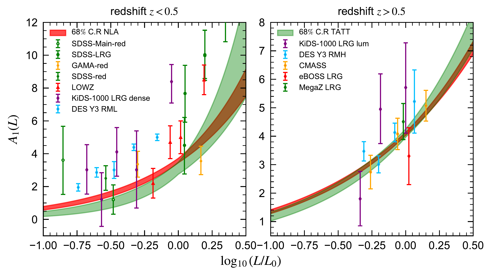
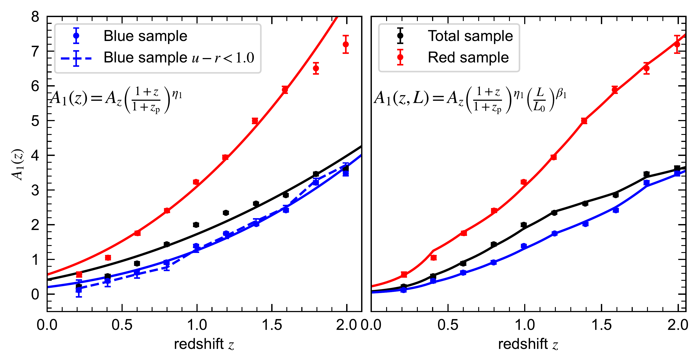
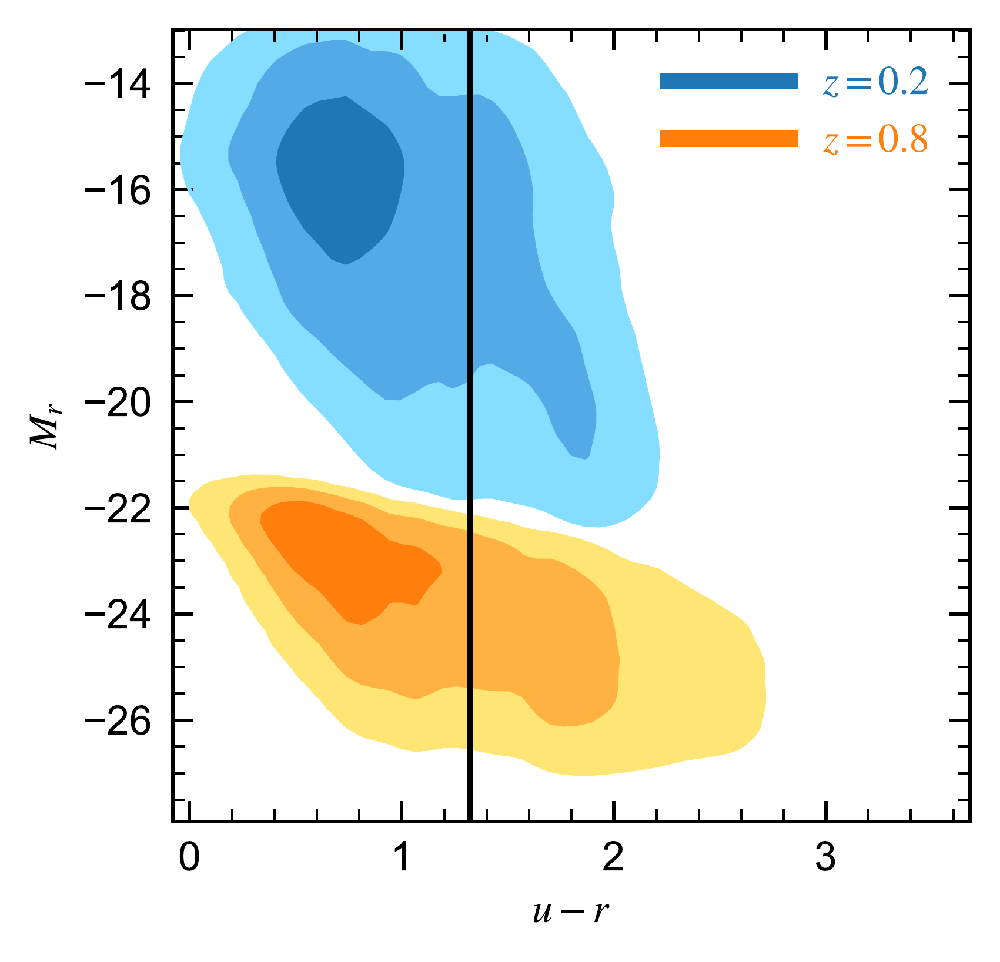

$\newcommand{\ensuremath}{}$
$\newcommand{\xspace}{}$
$\newcommand{\object}[1]{\texttt{#1}}$
$\newcommand{\farcs}{{.}''}$
$\newcommand{\farcm}{{.}'}$
$\newcommand{\arcsec}{''}$
$\newcommand{\arcmin}{'}$
$\newcommand{\ion}[2]{#1#2}$
$\newcommand{\textsc}[1]{\textrm{#1}}$
$\newcommand{\hl}[1]{\textrm{#1}}$
$\newcommand{\footnote}[1]{}$
$\newcommand{\DESKIDS}{DES\&KiDs\xspace}$
$\newcommand{\Kai}{H26\xspace}$
$\newcommand{\kai}[1]{\textcolor{purple}{\bf Kai: #1}}$
$\newcommand{\rp}[1]{\textcolor{pink}{\bf rp: #1}}$
$\newcommand{\sandrine}[1]{\textcolor{darkraspberry}{[SC:\bf{#1}]}}$
$\newcommand{\ci}{\mathrm{i}}$
$\newcommand{\dd}{\mathrm{d}}$
$\newcommand{\orcid}[1]$
$\newcommand{\der}{\mathrm{d}}$

# $\Euclid$ preparation. Testing analytic models of galaxy intrinsic alignments in the $\Euclid$ Flagship simulation

<mark>Appeared on: 2026-01-13</mark> - 

E. Collaboration, et al. -- incl., <mark>K. Jahnke</mark>

**Abstract:** We model intrinsic alignments (IA) in $\Euclid$ 's Flagship simulation to investigate its impact on $\Euclid$ 's weak lensing signal. Our IA implementation in the Flagship simulation takes into account photometric properties of galaxies as well as their dark matter host halos. The simulation parameters are calibrated using combined constraints from observations and cosmological hydrodynamical simulations. We compare simulations against theory predictions, determining the parameters of two of the most widely used IA models: the Non Linear Alignment (NLA) and the Tidal Alignment and Tidal Torquing (TATT) models.We measure the amplitude of the simulated IA signal as a function of galaxy magnitude and colour in the redshift range $0.1<z<2.1$ , similar to $\Euclid$ 's main galaxy sample. We find that both NLA and TATT can accurately describe the IA signal in the simulation down to scales of $6$ -- $7  h^{-1} $ Mpc. We measure alignment amplitudes for red galaxies comparable to those of the observations, with samples not used in the calibration procedure. For blue galaxies, our constraints are consistent with zero alignments in our first redshift bin $0.1 < z < 0.3$ , but we detect a non-negligible signal at higher redshift, which is, however, consistent with the upper limits set by observational constraints. Additionally, several hydrodynamical simulations predict alignment for spiral galaxies, in agreement with our findings. Finally, the evolution of alignment with redshift is realistic and comparable to that determined in the observations. However, we find that the commonly adopted redshift power-law for IA fails to reproduce the simulation alignments above $z=1.1$ . A significantly better agreement is obtained when a luminosity dependence is included, capturing the intrinsic luminosity evolution with redshift in magnitude-limited surveys.We conclude that the Flagship IA simulation is a useful tool for translating current IA constraints into predictions for IA contamination of $\Euclid$ -like samples.

**Figure 16. -** IA linear amplitude versus luminosity for the NLA model. The low-$z$ sample corresponds to the redshift slices below $z = 0.5$, while the high-$z$ sample corresponds to the redshift slices between $0.5 < z < 0.9$. The luminosity is computed as $\logten( L / L_0) = -(M_\text{r} - M_0)/2.5$. The shaded areas correspond to the 68$\%$ confidence regions, determined by propagating the errors on the power-law amplitudes and indices. The observational measurements are given in: SDSS-Main-red, SDSS-LRG and MegaZ LRG $\ci$tep{Joachimi11}, Gama-red and SDSS-red $\ci$tep{Johnston19}, LOWZ $\ci$tep{Singh15}, KiDS-1000 LRG dense and lum $\ci$tep{fortuna21b}, DES Y3 RML and RMH $\ci$tep{Samuroff22}, CMASS and eBOSS LRG $\ci$tep{FABIBI2024}. (*fig:LR_vs_A1_obs*)

**Figure 17. -** Redshift evolution of the linear IA amplitude. Each point represents the fit performed with the NLA-1 model to either the density samples (black), red samples (red), or blue samples (blue). Here, each sample is subsampled (if possible) to have the same number density, $n = 4 \times 10^{-3} h^{-3}$Mpc$^{3}$. *Left*: the solid lines represent the best-fit power law of Eq. \eqref{eq:znla}, with constraints given in Table \ref{tab:znla}. *Right*: the solid lines now represent the best fit of Eq. \eqref{eq:enla}. (*fig:IA_vs_red*)

**Figure 2. -** Colour-magnitude diagram of Flagship galaxies at redshift $z=0.2$ and $z=0.8$. We present the 68, 95, and 99$\%$ percentiles of the distributions. The dashed vertical line represents the cut that we used to define red and blue galaxy samples, i.e. $u-r = 1.32$. We shifted the rest-frame magnitude by $-4$ at redshift $z=0.8$ for clarity. (*fig:color_distribution*)

