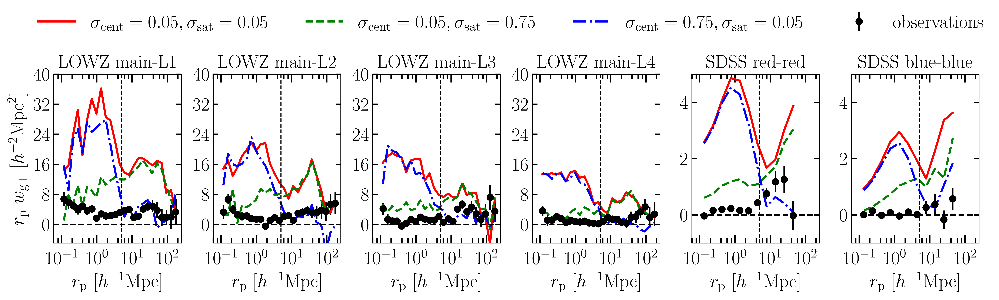
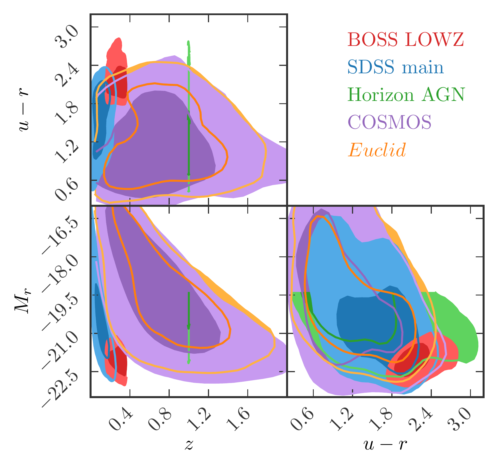

$\newcommand{\ensuremath}{}$
$\newcommand{\xspace}{}$
$\newcommand{\object}[1]{\texttt{#1}}$
$\newcommand{\farcs}{{.}''}$
$\newcommand{\farcm}{{.}'}$
$\newcommand{\arcsec}{''}$
$\newcommand{\arcmin}{'}$
$\newcommand{\ion}[2]{#1#2}$
$\newcommand{\textsc}[1]{\textrm{#1}}$
$\newcommand{\hl}[1]{\textrm{#1}}$
$\newcommand{\footnote}[1]{}$
$\newcommand{\eq}[1]{\begin{equation}  #1 \end{equation}}$
$\newcommand{\eqa}[1]{\begin{eqnarray}   #1 \end{eqnarray}}$
$\newcommand{\sigMf}{\sigma_{\rm MF}\xspace}$
$\newcommand{\sigMfC}{\sigma_{\rm MF}^{\rm cent}\xspace}$
$\newcommand{\sigMfS}{\sigma_{\rm MF}^{\rm sat}\xspace}$
$\newcommand{\wgp}{w_{\rm g+}\xspace}$
$\newcommand{\wgg}{w_{\rm gg}\xspace}$
$\newcommand{\etaAC}{\eta_{\rm A/C}\xspace}$
$\newcommand{\etaA}{\eta_{\rm A}\xspace}$
$\newcommand{\etaC}{\eta_{\rm C}\xspace}$
$\newcommand{\mpch}{h^{-1}\mathrm{Mpc}\xspace}$
$\newcommand{\chisqtot}{{\chi}^2_{\rm tot}\xspace}$
$\newcommand{\cost}{C\xspace}$
$\newcommand{\flagship}{Flagship\xspace}$
$\newcommand{\ci}{\mathrm{i}}$
$\newcommand{\dd}{\mathrm{d}}$
$\newcommand{\orcid}[1]$

# $\Euclid$ preparation: Calibrated intrinsic galaxy alignments in the Euclid Flagship simulation

<mark>Appeared on: 2026-01-13</mark> - 

E. Collaboration, et al. -- incl., <mark>K. Jahnke</mark>

**Abstract:** Intrinsic alignments of galaxies are potentially a major contaminant of cosmological analyses of weak gravitational lensing.We construct a semi-analytic model of galaxy ellipticities and alignments in the $\Euclid$ Flagship simulation to predictthis contamination in Euclid's weak lensing observations. Galaxy shapes and orientations are determined by the corresponding properties of the host haloes in the underlying $N$ -body simulation, as well as the relative positions of galaxies within their halo. Alignment strengths are moderated via stochastic misalignments, separately for central and satellite galaxies and conditional on the galaxy's redshift, luminosity, and rest-frame colour. The resulting model is calibrated against galaxy ellipticity statistics from the COSMOS Survey, selected alignment measurements based on Sloan Digital Sky Survey samples, and galaxy orientations extracted from the Horizon-AGN hydrodynamic simulation at redshift $z=1$ .The best-fit model has a total of 12 alignment parameters and generally reproduces the calibration data sets well within the $1\sigma$ statistical uncertainties of the observations and the $\flagship$ simulation, with notable exceptions for the most luminous sub-samples on small physical scales. The statistical power of the calibration data and the volume of the single $\flagship$ realisation are still too small to provide informative prior ranges for intrinsic alignment amplitudes in relevant galaxy samples.As a first application, we predict that $\Euclid$ end-of-mission tomographic weak gravitational lensing two-point statistics are modified by up to order $10 \%$ due to intrinsic alignments.

**Figure 11. -** 
        Projected galaxy-ellipticity cross-correlation between a density sample and various shape samples. The four left panels show results based on shapes from the luminosity sub-samples, with the full LOWZ sample as the density sample. The two right panels display results for SDSS, using the Main sample as the density sample and colour sub-samples as shape samples. Black dots represent observational data, while coloured lines represent $\flagship$ simulations for three simplified intrinsic alignment (IA) models, each using different fixed values for $\sigma_{\rm MF}^{\rm cent}$ and $\sigma_{\rm MF}^{\rm sat}$.
     (*fig:wgp_lowz_fixed_sigma*)

**Figure 1. -** Redshift, magnitude, colour distributions of mock samples, used for calibrating the IA
        model parameters for galaxy misalignment. Contours enclose $68\%$ and $95\%$ of the distributions. (*fig:zmc_distribution*)

**Figure 12. -** 3D IA cross-correlations ($\eta$, as defined in Eq. \ref{eq:eta})
   between a main density sample and the orientations of galaxies in three
   luminosity-limited sub-samples. Orientations are given by the 3D major
   and minor axes $A$ and $C$. Black dots show measurements
   from the HAGN simulation at $z=1.0$ with errors indicating the standard deviation.
   coloured lines show the results from mock HAGN samples from $\flagship$ for three
   simplified IA models with different combinations of fixed values for
   $\sigma_{\rm MF}^{\rm cent}$ and $\sigma_{\rm MF}^{\rm sat}$, analogously to
   Fig. \ref{fig:wgp_lowz_fixed_sigma}. Errors for $\flagship$ measurements are
   similar to those displayed in Fig. \ref{fig:eta_hagn_flagship} and are not shown for clarity. (*fig:eta_hagn_flagship_fixed_sigma*)

