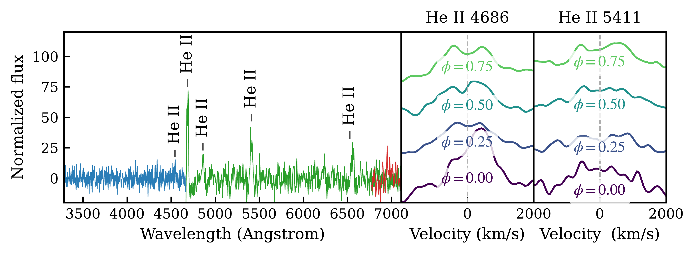

$\newcommand{\ensuremath}{}$
$\newcommand{\xspace}{}$
$\newcommand{\object}[1]{\texttt{#1}}$
$\newcommand{\farcs}{{.}''}$
$\newcommand{\farcm}{{.}'}$
$\newcommand{\arcsec}{''}$
$\newcommand{\arcmin}{'}$
$\newcommand{\ion}[2]{#1#2}$
$\newcommand{\textsc}[1]{\textrm{#1}}$
$\newcommand{\hl}[1]{\textrm{#1}}$
$\newcommand{\footnote}[1]{}$
$\newcommand{\vdag}{(v)^\dagger}$
$\newcommand$
$\newcommand$
$\newcommand{\vdag}{(v)^\dagger}$
$\newcommand$
$\newcommand$

# An eclipsing 8.56 minute orbital period mass-transferring binary

<mark>Appeared on: 2026-01-14</mark> -  _14 pages, 10 figures_

E. T. Chickles, et al. -- incl., <mark>K. El-Badry</mark>

**Abstract:** We report the discovery of ATLAS J101342.5 $-$ 451656.8 (hereafter referred to as ATLAS J1013 $-$ 4516), an 8.56 minute orbital-period mass-transferring AM Canum Venaticorum (AM CVn) binary with a mean _Gaia_ magnitude of $G=19.51$ , identified via periodic variability in light curves from the Asteroid Terrestrial-impact Last Alert System (ATLAS) of _Gaia_ white-dwarf candidates. Follow-up with the Large Lenslet Array Magellan Spectrograph (LLAMAS) shows a helium-dominated accretion disk, and high-speed ULTRACAM photometry reveals pronounced primary and secondary eclipses. We construct a decade-long timing baseline leveraging lightcurves from the ATLAS and _Gaia_ surveys, as well as the high-speed imagers ULTRACAM on the GTC and proto-Lightspeed on the Magellan Clay telescope. From this timing baseline, we measure an orbital period derivative of $\dot{P}=-1.60\pm0.07\times 10^{-12}$ s s $^{-1}$ . Interpreted in the context of stable mass transfer, the magnitude and sign of $\dot{P}$ indicate that the orbital evolution is governed by the interplay between gravitational-wave--driven angular-momentum losses and mass transfer, directly probing the donor's structural response to mass loss. We constrain the accretor and donor mass based on stable mass-transfer arguments assuming angular momentum loss dominated by gravitational wave emission, allowing us to infer the characteristic gravitational wave strain of the binary for future space-based GW observatories such as the Laser Interferometer Space Antenna ( _LISA_ ). We predict a characteristic strain corresponding to a 4-year _LISA_ signal-to-noise ratio $\gtrsim20$ , establishing ATLAS J1013 $-$ 4516 as a strong prospective _LISA_ source that will probe long-term orbital evolution in the mass-transferring regime.

**Figure 15. -** Coadded, continuum-subtracted Magellan/LLAMAS spectra of ATLAS J1013$-$4516 obtained on 2025 December 14. The displayed wavelength range is restricted to the highest signal-to-noise, non--sky-dominated region of the LLAMAS coverage. Right panels show phase-resolved He ii line profiles, constructed by binning the spectra into four equal orbital phase bins and arbitrarily offset vertically for clarity. Both the phase-binned line profiles and the coadded spectrum have been smoothed with a Gaussian kernel for visualization. (*fig:LLAMAS*)

**Figure 18. -** Coadded, continuum-subtracted Magellan/LLAMAS spectra of ATLAS J1013$-$4516 obtained on 2025 December 14. The displayed wavelength range is restricted to the highest signal-to-noise, non--sky-dominated region of the LLAMAS coverage. Right panels show phase-resolved He ii line profiles, constructed by binning the spectra into four equal orbital phase bins and arbitrarily offset vertically for clarity. Both the phase-binned line profiles and the coadded spectrum have been smoothed with a Gaussian kernel for visualization. (*fig:LLAMAS*)

**Figure 1. -** Phase-folded light curves of ATLAS J1013$-$4516 from synoptic surveys, folded on the timing ephemeris listed in Table \ref{tab:inferred} with phase zero defined at mid-eclipse. Cyan ($c$, 420–650 nm) and orange ($o$, 560–820 nm) points show phase-binned ATLAS photometry, overlaid with *Gaia* epoch photometry. All data are binned using inverse-variance--weighted averaging and repeated over three orbital cycles for visualization. The ATLAS light curves are linearly rescaled to match the interquartile range and median level of the phase-binned *Gaia* photometry. The resulting $\sim$50\% eclipse-like attenuation and coherent periodic modulation motivated high-speed follow-up. (*fig:atlas*)

