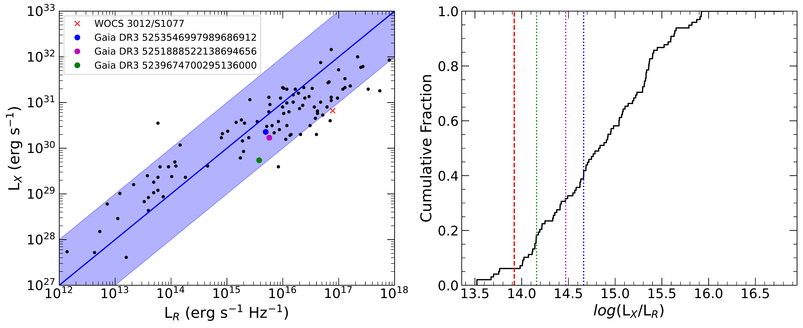
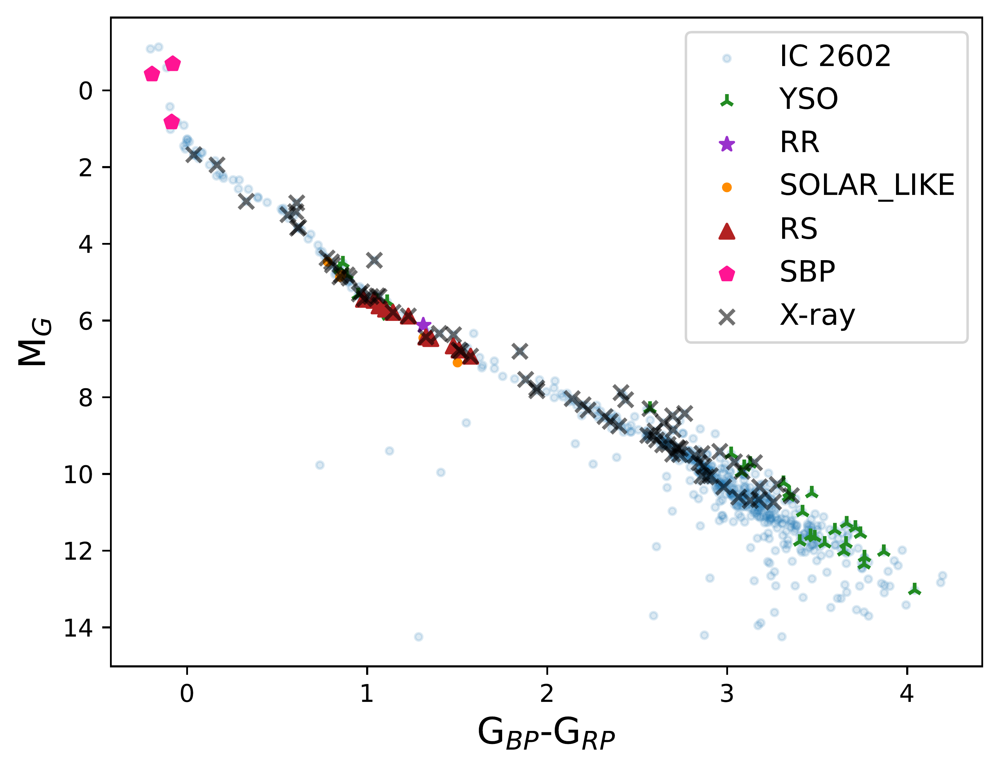
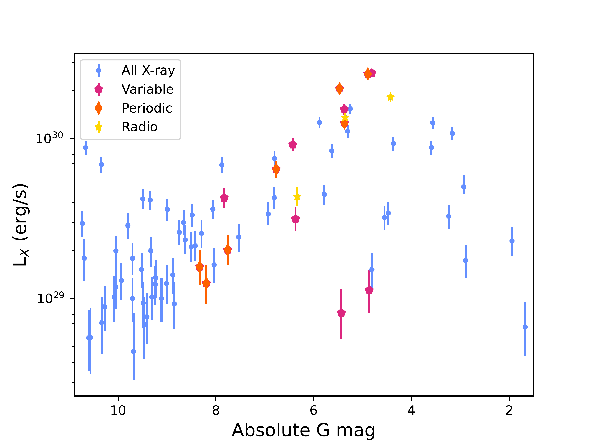

$\newcommand{\ensuremath}{}$
$\newcommand{\xspace}{}$
$\newcommand{\object}[1]{\texttt{#1}}$
$\newcommand{\farcs}{{.}''}$
$\newcommand{\farcm}{{.}'}$
$\newcommand{\arcsec}{''}$
$\newcommand{\arcmin}{'}$
$\newcommand{\ion}[2]{#1#2}$
$\newcommand{\textsc}[1]{\textrm{#1}}$
$\newcommand{\hl}[1]{\textrm{#1}}$
$\newcommand{\footnote}[1]{}$
$\newcommand$

# The Secret Lives of Open Clusters: a Multiwavelength Examination of Three Open Clusters

<mark>Appeared on: 2026-01-14</mark> -  _accepted to PASA_

K. C. Dage, et al. -- incl., <mark>A. Patil</mark>

**Abstract:** Star clusters are well known for their dynamical interactions, an outcome of their high stellar densities; in this paper we use multiwavelength observations to search for the unique outcomes of these interactions in three nearby Galactic open clusters: IC 2602 (30  Myr), NGC 2632 (750 Myr) and M67 (4 Gyr). We compared X-ray observations from all-sky surveys like eROSITA, plus archival observations from _Chandra_ X-ray Observatory, survey radio observations from ASKAP's Evolutionary Map of the Universe survey plus archival VLA observations, in conjunction with new cluster catalogs with Gaia. From X-ray, we found 77 X-ray sources likely associated with IC 2602, 31 X-ray sources in NGC 2632, and 31 near M67's central regions. We were further able to classify these X-ray sources based on their optical variability and any radio emission. Three IC 2602 X-ray sources had radio counterparts, which are likely all chromospherically active binary stars. We also identified luminous radio and X-ray variability from a spectroscopic triple system in M67, WOCS 3012/S1077, which is either consistent with a quiescent black hole binary, or due to an active binary stellar system. A recent population study of optical variables by Anderson \& Hunt 2025 shows that the population of optical variables in open clusters clearly changes over **cluster age** ; this pilot study gives evidence that the X-ray population also changes with time, and demonstrates the need for a broader multiwavelength study of Galactic open clusters.

**Figure 7. -** The location of IC 2602 radio/X-ray sources (Table 5) and WOCS 3012/S1077 on the relation of radio and X-ray for active binaries from \cite{1995A&A...302..775G}. Adapted from \cite{Paduano24}. The three sources in IC 2602 fall firmly on the correlation for active binaries. WOCS 3012/S1077 (dashed line in left hand side) falls in the scatter near the correlation.  (*fig:gudelbenz*)

**Figure 1. -** CMD for IC 2602. Black x's are X-rays from eROSITA, green triangles are $\delta$ Scuti/$\gamma$ Doradus/SX Pheonicis, purple pentagons are ACV systems, red triangles are RS Canum Venaticorum, teal squares are eclipsing binaries and orange points are solar-like variability.  (*fig:ic2602cmd*)

**Figure 2. -** X-ray luminosity (eROSITA band) versus absolute G magnitude for X-ray sources in IC 2602. Sources with variability flags from \cite{2023A&A...674A..13E} are labeled in orange pentagons, with periodic sources marked with pink diamonds. Three sources (yellow triangles) had radio emission associated with them, but were not flagged as variable by \cite{2023A&A...674A..13E}.  (*fig:ic2602-var*)

