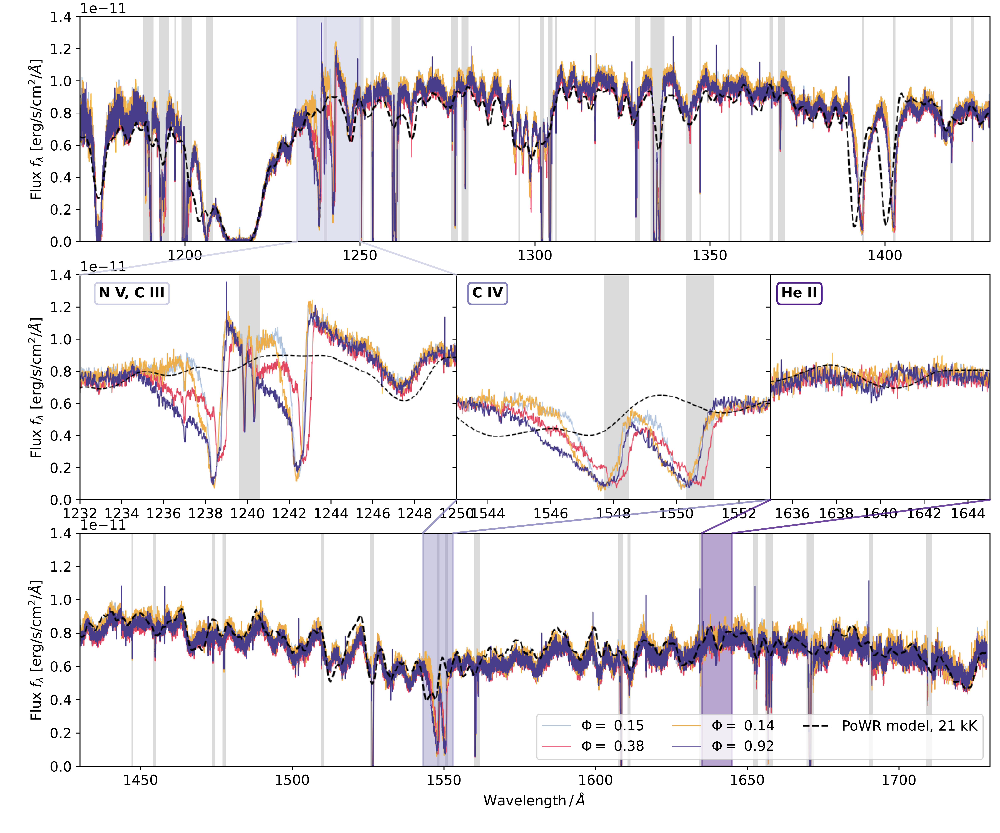
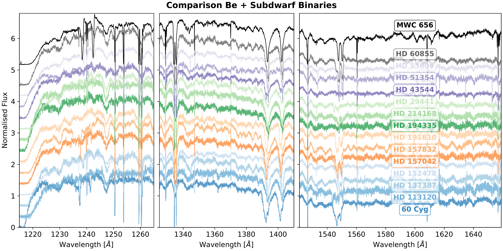
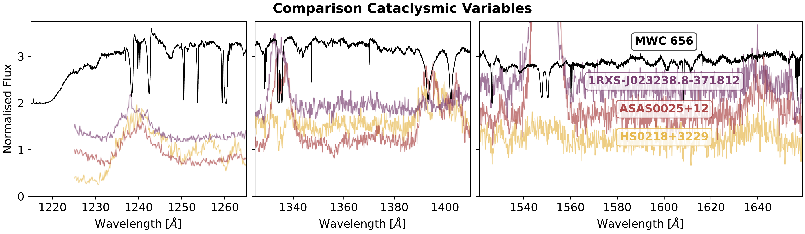

$\newcommand{\ensuremath}{}$
$\newcommand{\xspace}{}$
$\newcommand{\object}[1]{\texttt{#1}}$
$\newcommand{\farcs}{{.}''}$
$\newcommand{\farcm}{{.}'}$
$\newcommand{\arcsec}{''}$
$\newcommand{\arcmin}{'}$
$\newcommand{\ion}[2]{#1#2}$
$\newcommand{\textsc}[1]{\textrm{#1}}$
$\newcommand{\hl}[1]{\textrm{#1}}$
$\newcommand{\footnote}[1]{}$
$\newcommand{\arraystretch}{1.6}$
$\newcommand{\arraystretch}{1.6}$

# Ultraviolet spectroscopy reveals a hot and luminous companion to the Be star + black hole candidate MWC 656

<mark>Appeared on: 2026-01-22</mark> -  _21 pages, 14 figures, submitted to A&A_

<mark>J. Müller-Horn</mark>, et al. -- incl., <mark>K. El-Badry</mark>

**Abstract:** The Galactic Be star binary MWC 656 was long considered the only known Be star + black hole (BH) system, making it a critical benchmark for models of massive binary evolution and for the expected X-ray emission of Be+BH binaries. However, recent dynamical measurements cast doubt on the presence of a BH companion. We present new multi-epoch ultraviolet spectroscopy from the Hubble Space Telescope (HST), combined with high-resolution optical spectra, to reassess the nature of the companion. The far-ultraviolet spectra reveal high-ionisation features -- including prominent N v and He ii lines -- which are absent in the spectra of normal Be stars and are indicative of a hot, luminous companion. Spectral modelling shows that these features cannot originate from the Be star or from an accretion disc around a compact object. Instead, we find that the data are best explained by a hot ( $T_\mathrm{eff}\approx85 $ kK), compact, hydrogen-deficient star with strong wind signatures, consistent with an intermediate-mass stripped star. Our revised orbital solution and composite spectroscopic modelling yield a companion mass of $M_2 = 1.54^{+0.57}_{-0.46} \mathrm{M}_\odot$ , definitively ruling out a BH and disfavouring a white dwarf. MWC 656 thus joins the growing class of Be + stripped star binaries. The system's unusual properties -- including a high companion temperature and wind strength -- extend the known parameter space of such binaries. The continued absence of confirmed OBe+BH binaries in the Galaxy highlights a growing tension with population synthesis models.

**Figure 8. -** HST/STIS UV spectra of MWC 656 obtained on four observing dates. A PoWR stellar atmosphere model with $T_* = 21$ kK, $\log g_* = 3.4$, and $v\sin i = 300$ km s$^{-1}$ is shown in black for comparison. The top and bottom panels show the full spectral range, split into blue and red halves, while the middle row displays zoom-ins on key diagnostic lines: the $\ion${N}{v $\lambda\lambda$1238, 1241} doublet, the $\ion${C}{iv $\lambda\lambda$1548, 1551} doublet, and the $\ion${He}{ii $\lambda$1640} line. Shaded gray regions mark known ISM absorption features. The zoom-in panels reveal prominent high-ionisation features, not present in the Be star model, suggesting they originate from a hotter source within the system. (*fig:spec_uv_zoom*)

**Figure 11. -** Comparison of the HST/STIS UV spectrum of MWC 656 (black) with reference spectra from two classes of stars: known Be+subdwarf systems \citep[top;][]{Wang+2021}
    and cataclysmic variables \citep[bottom;][]{Pala+2022,Toloza+2023}. The Be+subdwarf and cataclysmic variable spectra have been rebinned using bin sizes of three and two, respectively, to improve S/N. All spectra have been normalised by their median flux, and vertical offsets have been applied for readability. (*fig:stripped_star_comparison_spectra*)

**Figure 1. -** Phase-folded RV curves of the Be star and its companion in the MWC 656 binary system, using the best-fit orbital period. RV measurements and uncertainties of the Be star (circles) and the companion (squares) are shown with colour-coded markers corresponding to the instrument used.
    Maximum-likelihood orbital models derived from RV fitting are overplotted for the Be star (pink) and the companion (green) with thick lines. Thin lines show orbital models for random samples from the posterior to illustrate uncertainties in the inferred parameters. The grey dotted line shows the inferred systemic velocity. Star symbols indicate the predicted orbital phases and velocities of the four HST/STIS FUV observations based on the fitted orbit. (*fig:orbit_fit*)

