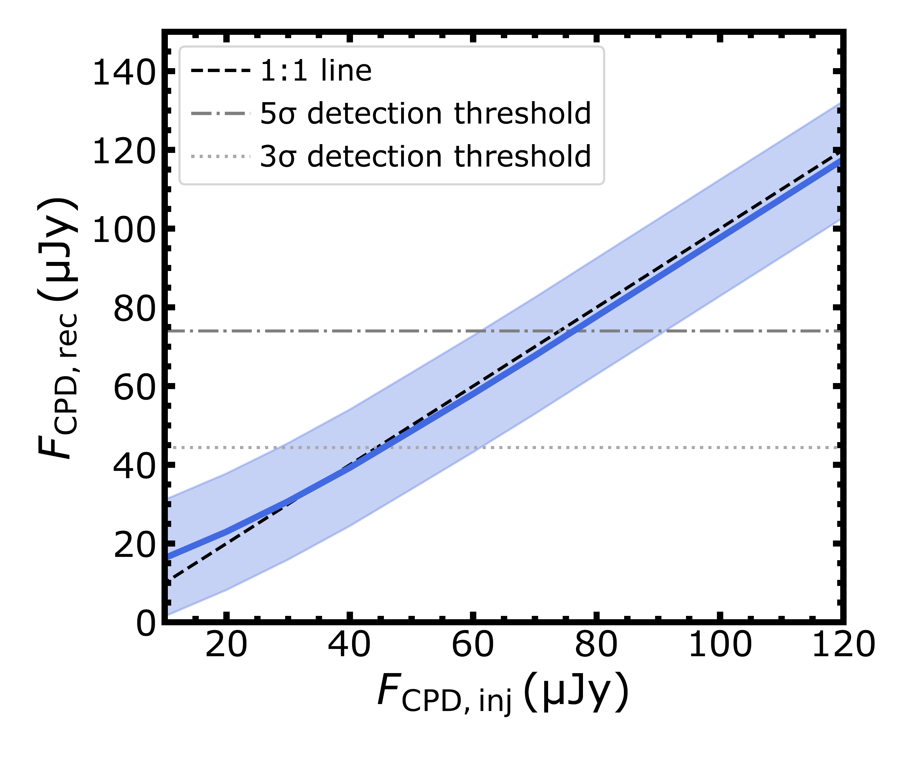

$\newcommand{\ensuremath}{}$
$\newcommand{\xspace}{}$
$\newcommand{\object}[1]{\texttt{#1}}$
$\newcommand{\farcs}{{.}''}$
$\newcommand{\farcm}{{.}'}$
$\newcommand{\arcsec}{''}$
$\newcommand{\arcmin}{'}$
$\newcommand{\ion}[2]{#1#2}$
$\newcommand{\textsc}[1]{\textrm{#1}}$
$\newcommand{\hl}[1]{\textrm{#1}}$
$\newcommand{\footnote}[1]{}$
$\newcommand{\kms}{km~s^{-1} }$
$\newcommand{\vdag}{(v)^\dagger}$
$\newcommand$
$\newcommand$

# A 2 au resolution view by ALMA of the planet-hosting WISPIT 2 disk

<mark>Appeared on: 2026-01-23</mark> -  _Accepted for publication on ApJL; 14 pages, 10 figures_

F. Stefano, et al. -- incl., <mark>M. Benisty</mark>, <mark>F. Zagaria</mark>

**Abstract:** We present deep, high spatial resolution interferometric observations of 0.88 mm continuum emission from the TYC 5709-354-1 system, hereafter WISPIT 2, obtained with the goal of detecting circumplanetary emission in the vicinity of the newly discovered WISPIT 2b planet. Observations with the most extended baseline configuration offered by ALMA, achieving an angular resolution of $25 \times 17$ mas ( $3.3\times2.2$ au), revealed a single, narrow ring with a deprojected radius of $144.4$ au and width of $7.2$ au, and no evidence of circumplanetary emission within the cavity. Injection and recovery tests demonstrate that these observations can rule out point-like emission at the location of WISPIT 2b brighter than ${\approx} 45 \mu$ Jy at the $3\sigma$ level. While these data can rule out PDS 70c like circumplanetary emission, the upper limit is consistent with empirical mass-flux relationships extrapolated from the stellar regime. Visibility modeling of the continuum ring confirms that WISPIT 2b lies significantly interior to the mm dust ring, raising doubts about the ability of WISPIT 2b to be the only driver of the dust structure. Possible solutions include either another lower mass companion, residing between WISPIT 2b and the cavity edge, likely in the gap seen by SPHERE at $\sim130 $ au, or that WISPIT 2b is either substantially more massive than IR-photometry based estimates ( ${\sim} 15 M_{\rm Jup}$ ) or on a moderately eccentric orbit. The combination of observations sensitive to the gas and dust distributions on larger spatial scales and dedicated hydrodynamical modeling will help differentiate between scenarios.

**Figure 3. -** Gap width (in units of the gap radius) as a function of the planet-to-star mass ratio. For systems hosting detected protoplanets, $R_{\rm gap} = a_{\rm p}$, where $a_{\rm p}$ is the orbital radius of the planet. The candidate protoplanets in (some of) the gaps in the DSHARP sample \citep{Andrews_ea_2018,Huang2018} and the Taurus survey of \citet{Long2018} are displayed as gray dots, with putative planet masses estimated by \citet{Ruzza2025} and stellar masses by \citet{Andrews_ea_2018,Long2019}. PDS 70b and c are over-plotted in blue and WISPIT 2b in yellow. The dashed and dashed dotted black lines are the expected gap width to planet mass trends predicted by \citet{Rosotti2016} and \citet{Facchini2018}, their extrapolation to the whole planet mass range we considered is shown in gray. (*fig:R_mm_a_planet*)

**Figure 1. -** Injected ($F_{\rm CPD,inj}$) vs recovered ($F_{\rm CPD,rec}$) flux density of a point-source at the location of WISPIT 2b. The recovered flux density is estimated as the peak intensity within 1.5 beams at that location. The ribbon indicates the $1\sigma$ uncertainty on the peak intensity estimate. (*fig:CPD_flux_recovery*)

**Figure 7. -** 0.88 mm continuum intensity of the WISPIT 2 system, showing a thin ring at $1$\farcs$086$($144.4 $au deprojected distance). The right panel shows the same image, with white dashed lines indicating the radial peaks observed in IR scattered light by \citet{van_Capelleveen2025}, projected onto the disk midplane. The numbering ($R_{N,{\rm S}}$) follows the one by \citet{van_Capelleveen2025}. The location of the WISPIT 2b planet \citep{van_Capelleveen2025,Close2025} is highlighted in the right panel. The ALMA resolution element is shown in the bottom left of each panel. (*fig:WISPIT_2*)

