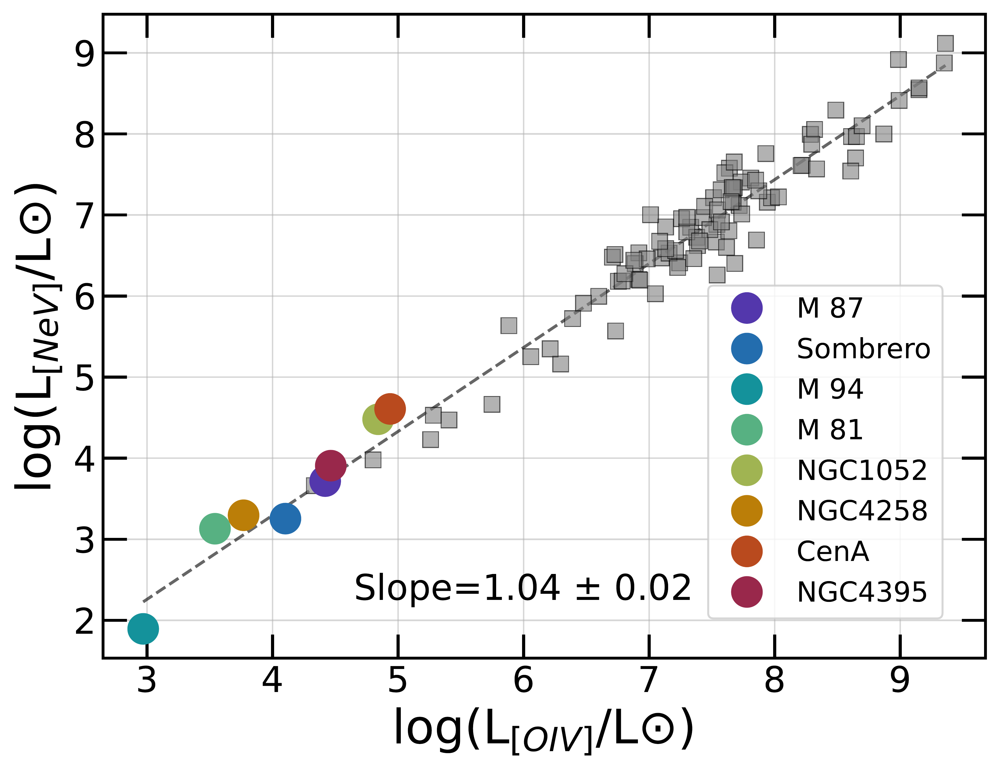
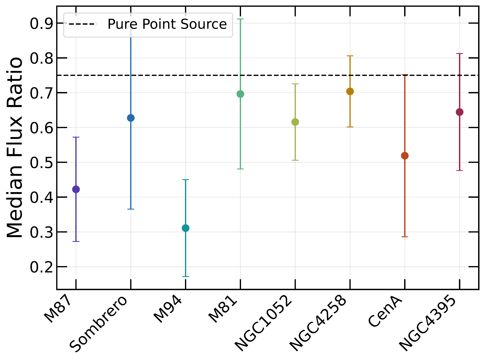

$\newcommand{\ensuremath}{}$
$\newcommand{\xspace}{}$
$\newcommand{\object}[1]{\texttt{#1}}$
$\newcommand{\farcs}{{.}''}$
$\newcommand{\farcm}{{.}'}$
$\newcommand{\arcsec}{''}$
$\newcommand{\arcmin}{'}$
$\newcommand{\ion}[2]{#1#2}$
$\newcommand{\textsc}[1]{\textrm{#1}}$
$\newcommand{\hl}[1]{\textrm{#1}}$
$\newcommand{\footnote}[1]{}$
$\newcommand{\vdag}{(v)^\dagger}$
$\newcommand{\aastex}{AAS\TeX}$
$\newcommand{\latex}{La\TeX}$
$\newcommand{\nefive}{[\ion{Ne}{5}]~\ensuremath{\lambda14.32~\mu\mathrm{m}}}$
$\newcommand{\ofour}{[\ion{O}{4}]~\ensuremath{\lambda25.91~\mu\mathrm{m}}}$
$\newcommand{\nethree}{[\ion{Ne}{3}]~\ensuremath{\lambda15.56~\mu\mathrm{m}}}$
$\newcommand{\netwo}{[\ion{Ne}{2}]~\ensuremath{\lambda12.81~\mu\mathrm{m}}}$
$\newcommand{\fetwo}{[\ion{Fe}{2}]~\ensuremath{\lambda5.34~\mu\mathrm{m}}}$
$\newcommand{\red}[1]{\textcolor{red}{#1}}$
$\newcommand{\blue}[1]{\textcolor{blue}{#1}}$
$\newcommand{\lbolledd}{\ensuremath{\log(L_{\mathrm{bol}}/L_{\mathrm{Edd}})}}$

# ReveaLLAGN 1: JWST Emission-Line Spectra Reveal Low-Luminosity AGN with UV-Deficient SEDs and Warm Molecular Gas

<mark>Appeared on: 2026-01-26</mark> -  _Submitted to The Astrophysical Journal; under review after addressing referee comments. 25 pages, 10 figures_

K. Goold, et al. -- incl., <mark>A. Dumont</mark>, <mark>N. Neumayer</mark>

**Abstract:** We present near- and mid-infrared spectra of eight Low-Luminosity Active Galactic Nuclei (LLAGN), spanning nearly four orders of magnitude in black hole mass and Eddington ratio, obtained with JWST/NIRSpec and MIRI as part of the ReveaLLAGN program along with identical archival data of Cen A. The high spatial resolution of JWST cleanly separates AGN emission from host-galaxy contamination, enabling detections of high–ionization potential lines more than an order of magnitude fainter than previously measured. Emission-line diagnostics reveal a transition at log( $L_{\rm bol}/L_{\rm Edd}$ ) $\sim -3.5$ , where the spectral energy distribution becomes increasingly deficient in ultraviolet photons. We find that rotational $H_2$ excitation temperatures are elevated ( $\sim$ 500 K higher) compared to both higher-luminosity AGN and star-forming galaxies, while the $H_2$ (0-0)S(3)/PAH $_{11.3 \mu \mathrm{m}}$ ratios are consistent with those observed in the AGN population. We discuss the possible roles of outflows, jets, and X-ray dominated regions in shaping the interstellar medium surrounding LLAGN. Silicate emission at $\sim$ 10 $\mu$ m, localized to the nuclear region, is detected in most ReveaLLAGN targets. This dataset offers the first comprehensive JWST-based characterization of infrared emission lines in the nuclear regions of LLAGN.

**Figure 10. -** The emission line ratios observed in ReveaLLAGN targets are broadly consistent with photoionization models using a power-law ionizing spectrum (red grid; \citealt{Fern2023}). For NGC 4395, which has a relatively low black hole mass and accretes above a log Eddington ratio of –2.7, the line ratios are better reproduced by accretion disk–dominated photoionization models (blue grid; \citealt{Ferland2020}). Shock-only models (black grid) reproduce neon line ratios that are degenerate with those from power-law photoionization models, but only within a narrow range of low pre-shock densities and low shock velocities. At higher pre-shock densities, the shock models become inconsistent with the observations, and they fail to reproduce several key line ratios beyond neon. Gray squares represent comparison data as described in \ref{sec:supplemental_data}, and ReveaLLAGN sources are colored the same as in Figure \ref{fig:nev_oiv}. (*fig:photo_vs_shock*)

**Figure 2. -** [NeV]$_{14 \mu \rm{m}}$ luminosity versus [OIV]$_{26 \mu \rm{m}}$. ReveaLLAGN targets all show low-luminosity detections in both lines, with M94 being the faintest. For comparison, data from previous surveys \citet{Sturm2002, Goulding2009, Tommasin2010, Fernandez2016} are shown in gray. 1$\sigma$ errors are smaller than data points. [NeV]$_{14 \mu \rm{m}}$ and [OIV]$_{26 \mu \rm{m}}$ are strongly correlated across many orders of magnitude in solar luminosity, and the ReveaLLAGN sample extends this trend to the lowest luminosities. ReveaLLAGN sources are ordered in the legend according to Eddington ratio and colored using the same sequential color map as in Figure \ref{fig:nuc_large_ratio}. (*fig:nev_oiv*)

**Figure 1. -** Emission from the nuclear extracted spectra is consistent with that of a point-like source. The dashed line marks the ratio expected for an unresolved point source. For each galaxy, we show the median and standard deviation of the flux ratios computed across all detected ionic lines. Data points are ordered, left to right, by Eddington ratio and colored using a sequential color scheme carried through the rest of the paper. (*fig:nuc_large_ratio*)

