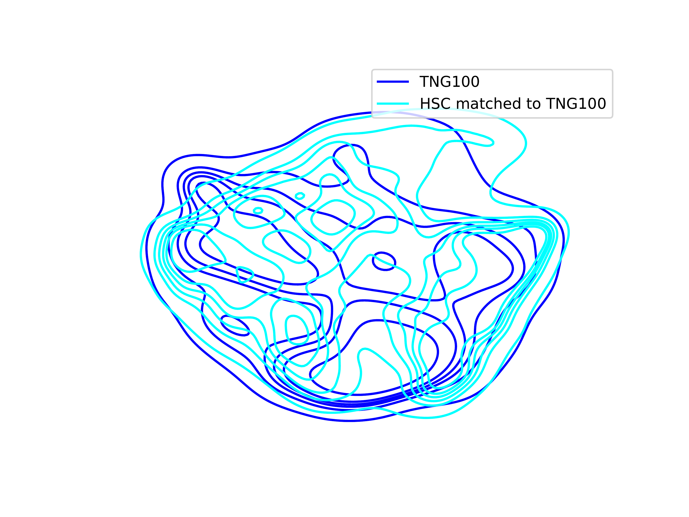
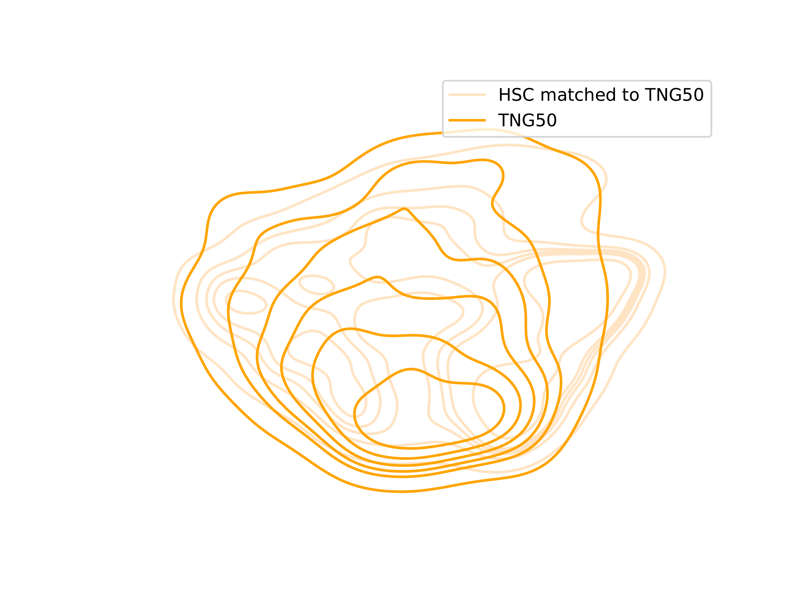
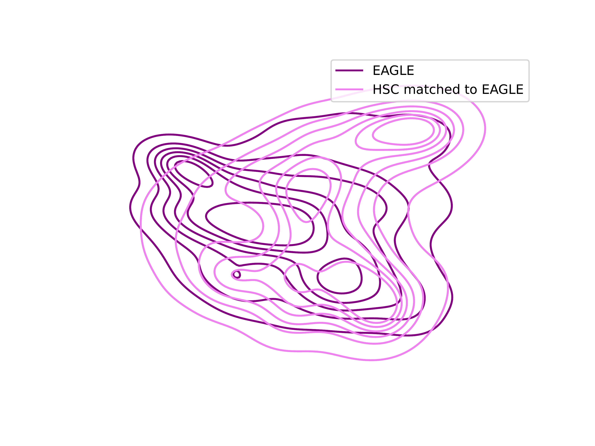
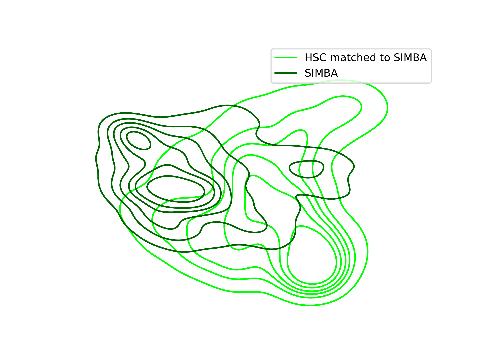
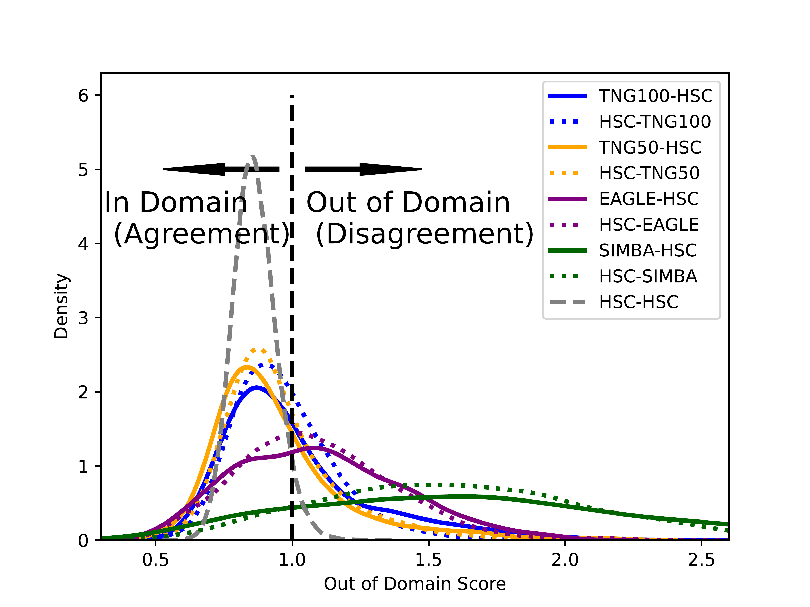
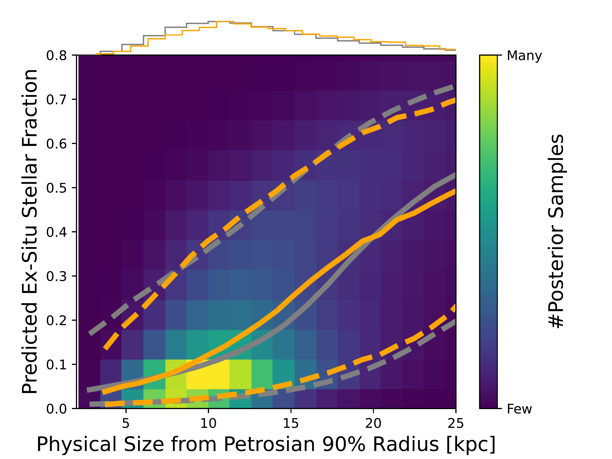
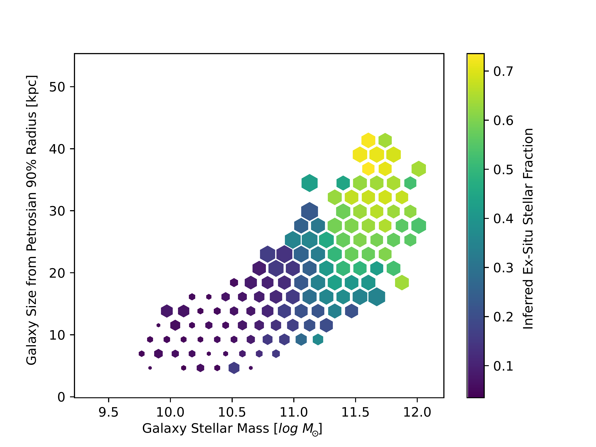

$\newcommand{\ensuremath}{}$
$\newcommand{\xspace}{}$
$\newcommand{\object}[1]{\texttt{#1}}$
$\newcommand{\farcs}{{.}''}$
$\newcommand{\farcm}{{.}'}$
$\newcommand{\arcsec}{''}$
$\newcommand{\arcmin}{'}$
$\newcommand{\ion}[2]{#1#2}$
$\newcommand{\textsc}[1]{\textrm{#1}}$
$\newcommand{\hl}[1]{\textrm{#1}}$
$\newcommand{\footnote}[1]{}$
$\newcommand{\orcid}[1]{\href{https://orcid.org/#1}{\includegraphics[scale=0.08]{img/data/ORCID-iD_icon-128x128.png}}}$
$\newcommand{\MSUN}{\rm{M}_{\odot}}$
$\newcommand{\thebibliography}{\DeclareRobustCommand{\VAN}[3]{##3}\VANthebibliography}$

# ERGO-ML: The assembly histories of HSC galaxy images via invertible neural networks, contrastive learning, and cosmological simulations

<mark>Appeared on: 2026-01-28</mark> -  _Submitted to MNRAS, 25 pages, 10 figures_

L. Eisert, et al. -- incl., <mark>A. Pillepich</mark>

**Abstract:** In this paper of ERGO-ML (Extracting Reality from Galaxy Observables with Machine Learning), we develop a model that infers the merger/assembly histories of galaxies directly from optical images. We apply the self-supervised contrastive learning framework NNCLR (Nearest-Neighbor Contrastive Learning of visual Representations) on realistic HSC mock images (g,r,i - bands) produced from galaxies simulated within the TNG50 and TNG100 flagship runs of the IllustrisTNG project and with stellar masses of $10^{9-12} \MSUN$ . The resulting representation is then used as conditional input for a cINN (conditional Invertible Neural Network) to gain posteriors for merger/assembly statistics, particularly the lookback time and stellar mass of the last major merger and the fraction of ex-situ stars.Through validation against the ground truth available for simulated galaxies, we assess the performance of our model, achieving good accuracy in inferring the stellar ex-situ fraction ( $\le \pm 10$ per cent for 80 per cent of the test sample) and the mass of the last major merger (within $\pm 0.5 \log \MSUN$ for stellar masses $>10^{9.5} \MSUN$ ). The information content about the lookback time is, instead, limited. We also successfully apply the TNG-trained model to simulated mocks from the EAGLE simulation, demonstrating that our model is applicable outside of the TNG domain. We hence use our simulation-based model to infer aspects of the history of observed galaxies, in particular for HSC images that are close to the domain of TNG ones. We recover the trend of increasing ex-situ stellar fraction with stellar mass and more spherical morphology, but we also identify a discrepancy between TNG and HSC: on average, observed galaxies generally exhibit lower ex-situ fractions. Despite challenges such as information loss (e.g. projection effects and surface brightness limits) and domain shifts (from simulations to observations), our results demonstrate the feasibility of extracting the merger past of galaxies from their optical images.

**Figure 7. -** ** How well do representations of the observed and simulated galaxy images align to each other?** We compare the distributions of TNG100, TNG50, EAGLE, and SIMBA images to the observed ones from HSC in the corresponding 2D-UMAP mapping of the 256-dimensional representations obtained by training a ResNet model using contrastive learning _ simultaneously_ on all  datasets. In the top-left panel, we show kernel density estimation (KDE) density plots of TNG100 images in blue and of the selection function-matched HSC set in light blue. Analogously, we compare the image density distributions of TNG50 vs. its corresponding matched HSC set (top right) and similar visualizations of the UMAPs for EAGLE (bottom left) and SIMBA (bottom right). Contours indicate isodensity lines derived from KDE in the 2D UMAP space. While there is a significant overlap among the first three sets, slight offsets and differences in point density are also evident. For the SIMBA galaxies, the distributions of images diverge most significantly. Namely, TNG100, TNG50 and EAGLE return galaxy images that are, at the population level, more consistent with observed ones from HSC than SIMBA. (*fig:umaps*)

**Figure 8. -** ** Out-of-Domain (OOD) Scores of the same image representations of Figure \ref{fig:umaps**, to quantitatively assess the realism of simulated galaxies in comparison to HSC images.} We show the OOD score distributions for the observed HSC and simulated datasets (TNG50, TNG100, EAGLE, and SIMBA), following the methodology introduced by \citealt{Eisert_2024} and  using the self-supervised contrastive-learning model of Figure \ref{fig:umaps}. The OOD score is evaluated across multiple scenarios, including comparisons between pairs of datasets and random splits within each dataset, to understand the inherent scatter: the distribution of self-distances for HSC images is provided as reference and is similar to those of the self-distances across the other simulated samples (not shown). The measurement distinguishes between the "sides" of the comparison, where, for example, TNG100-HSC refers to the distances of TNG100 galaxies relative to HSC, while HSC-TNG100 reflects the reverse. Images with high OOD values denote galaxies that do not resemble well observed ones. From the shape of the distributions, we can see that TNG50 and TNG100 return galaxy samples that are overall more realistic, i.e. more aligned, with HSC galaxies than EAGLE and, to a much larger degree, SIMBA. Namely, there are relatively fewer TNG50 and TNG100 galaxies than in SIMBA that appear inconsistent with HSC data. (*fig:similarity_distribution_pre_matched*)

**Figure 12. -** ** The ex-situ stellar mass fraction of HSC galaxies inferred by our SBI model based on the TNG50 and TNG100 simulations.** Top left: 2D histogram of the ex-situ fractions, inferred by our model, plotted against the galaxy stellar masses from the Sloan Digital Sky Survey (SDSS). For each HSC image with available SDSS stellar masses (a total of 9,043 galaxies), we plot 400 posterior samples to account for the uncertainty in predictions as modeled by our approach (color code). The median of all ex-situ fraction posterior samples in bins of stellar mass is shown for both HSC galaxies (in grey) and the combined TNG50/TNG100 dataset (in orange), in addition to dashed curves encompassing the 80 per-cent range of posterior data points in each mass bin. For the TNG galaxies, we use the total stellar mass of the corresponding galaxy. Since stellar mass measurements for HSC galaxies are available only for a subset of the overall HSC sample, we perform an additional mass matching between HSC and TNG galaxies for this plot, assuming that the two different operational definitions of a galaxy mass are consistent. Top right: same as on the left, but for the inferred ex-situ fractions plotted against galaxy stellar sizes (63,403 galaxies in total). We derive the physical radii from the Petrosian 90 per-cent light radii using the spectroscopic redshifts (Table \ref{tab:observable_properties}) and the Petrosian radii are measured exactly in the same way in both observed and simulations maps. Main: galaxy stellar sizes vs. galaxy stellar masses of 9,043 HSC galaxies color coded by the inferred ex-situ mass fraction. Each hex-bin is colored according to the median MAP of the ex-situ posterior inferred by our model. The size of the hex-bin decode the median uncertainty (i.e. the standard deviation of the posterior) of the prediction. Small hexagons relate to a small uncertainty ($\approx 0.04$ per-cent) while large hexagons to a large uncertainty ($\approx 0.12$ per-cent). According to HSC galaxies, more massive galaxies and more extended ones (also at fixed stellar mass) are made of larger fractions of accreted stars. (*fig:inference_exsitu_mass_size*)

