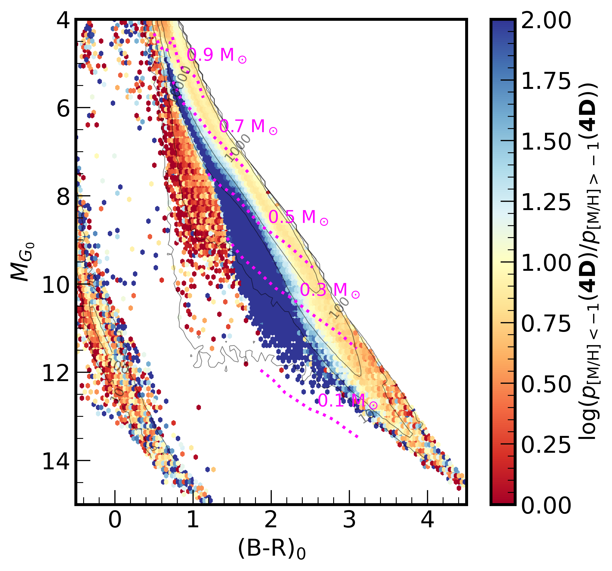
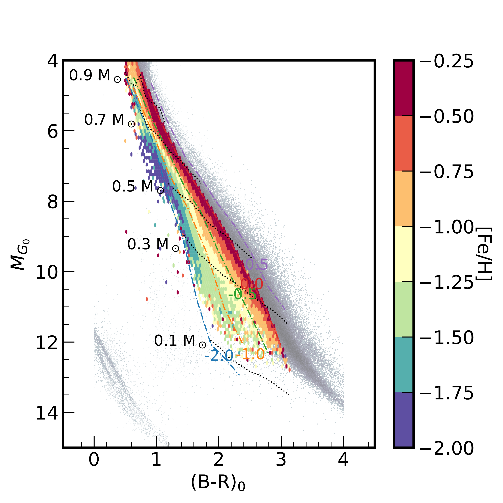
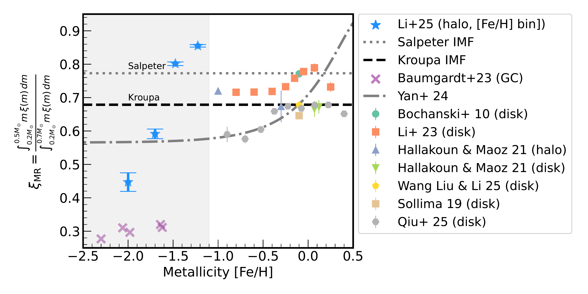
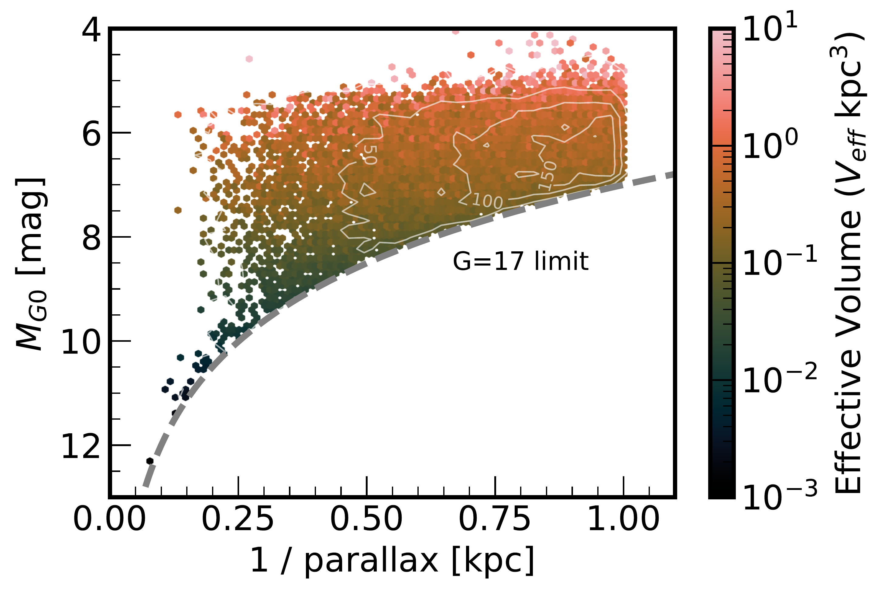

$\newcommand{\ensuremath}{}$
$\newcommand{\xspace}{}$
$\newcommand{\object}[1]{\texttt{#1}}$
$\newcommand{\farcs}{{.}''}$
$\newcommand{\farcm}{{.}'}$
$\newcommand{\arcsec}{''}$
$\newcommand{\arcmin}{'}$
$\newcommand{\ion}[2]{#1#2}$
$\newcommand{\textsc}[1]{\textrm{#1}}$
$\newcommand{\hl}[1]{\textrm{#1}}$
$\newcommand{\footnote}[1]{}$
$\newcommand{\vdag}{(v)^\dagger}$
$\newcommand$
$\newcommand$
$\newcommand{\gaia}{\textsl{Gaia}}$
$\newcommand{\photmoh}{[M/H]_{\rm phot}}$
$\newcommand{\teff}{T_{\rm eff}}$
$\newcommand{\logg}{\log ~ g}$
$\newcommand{\moh}{[M/H]}$
$\newcommand{\emoh}{\sigma_{\rm{[M/H]}}}$
$\newcommand{\eteff}{\sigma_{T_{\rm eff}}}$
$\newcommand{\elogg}{\sigma_{\log ~ g}}$
$\newcommand{\msun}{{\rm M}_{\odot}}$
$\newcommand{\HWRrevision}[1]{\textcolor{blue}{#1}}$
$\newcommand{\jd}[1]{\textcolor{blue}{#1}}$

# Variations in the Milky Way's Stellar Mass Function at [Fe/H] < -1

<mark>Appeared on: 2026-01-28</mark> -  _15 pages, 9 figures, 5 tables, Accepted for publication in ApJL_

<mark>J. Li</mark>, et al. -- incl., <mark>H.-W. Rix</mark>

**Abstract:** We present the first determination of the Galactic stellar mass function (MF) for low-mass stars ( $0.2-0.5 {\rm M}_\odot$ ) at metallicities [ Fe/H ] $\lesssim -1$ . A sample of $\sim$ 53,000  stars was selected as metal-poor on the basis of both their halo-like orbits and their spectroscopic [ Fe/H ] from Gaia DR3 BP/RP (XP) spectra. These metallicity estimates for low-mass stars were enabled by calibrating Gaia XP spectra with stellar parameters from SDSS-V.For $-1.5<$ [ Fe/H ] $<$ -1, we find that the MF below 0.5 ${\rm M}_\odot$ exhibits a "bottom-heavy" power-law slope of $\alpha \sim -1.6$ . We tentatively find that at even lower metallicities, the MF becomes very bottom-light, with a near-flat power-law slope of $\alpha \sim 0$ that implies a severe deficit of low-mass stars. This metallicity-dependent variation is insensitive to the adopted stellar evolution model. These results show that the Galactic low-mass MF is not universal, with variations in the metal-poor regime.A further calibration of XP metallicities in the regime of $M<0.5 M_{\odot}$ and [ Fe/H ] $<-1.5$ will be essential to verify these tentative low-metallicity trends.

**Figure 6. -** Color-Magnitude Diagrams (CMDs) of the Gaia XP sample.
    _Left:_  The CMD of Gaia sources within 1 kpc is color-coded by $\eta$, defined in Eq. \ref{eq:eta}, which is the likelihood that a star's orbit is halo-like rather than disk-like. Blue colors denote stars that are more likely to be on halo-like orbits.
    _Right:_ CMD of the sample with halo-like orbits ($\eta>10$), color-coded by XP-derived metallicity.
    Typical absolute-magnitude error is dominated by distance uncertainties, with $\sigma_{M_G}\approx 0.08 \mathrm{mag}$ at $d=800 \mathrm{pc}$.
    The gray background represents sources within 100 pc.
    The dot--dashed colored lines show loci from the PARSEC stellar evolution models evaluated at a fixed age of 5 Gyr for different metallicities. The black dotted lines indicate iso-mass lines from the PARSEC models.
     (*fig:cmd_eta_feh*)

**Figure 8. -** 
    Stellar mass functions for the metal-poor sample.
    The logarithmic mass density, $\log_{10}\Phi$[number kpc$^{-3}$ M$_\odot^{-1}$], is shown as a function of stellar mass $M$ for different metallicity bins (color-coded by [Fe/H], see color bar).
    Stellar masses are derived from PARSEC models (solid lines) and BaSTI models (dotted lines).
    Symbols show the binned densities with shaded bands indicating $1\sigma$ uncertainties.
    The dashed gray line shows the canonical Kroupa IMF, scaled for visual comparison.
    The mass ratio, $\xi_{\mathrm{MR}}$, as a function of [Fe/H].
    The ratio $\xi_{\mathrm{MR}}$ is defined as the stellar mass fraction between $0.2 {\rm M}_\odot$ and $0.5 {\rm M}_\odot$ relative to the mass between $0.2 {\rm M}_\odot$ and $0.7 {\rm M}_\odot$.
    Our results for metal-poor stars are shown as blue symbols for individual metallicity bins (stars).  These are compared against a compilation of literature data (other colored symbols). The horizontal black-dashed and grey-dotted lines represent the values for canonical Kroupa and Salpeter IMFs, respectively. The metallicity-dependent model from \cite{yan2024} is shown as a grey dash-dot curve. The shaded grey area shows the metal-poor regime with [Fe/H]$<-1.1$. (*fig:smf*)

**Figure 1. -** The estimated effective volume $\tilde{V}_{\mathrm{eff}}$ as a function of absolute magnitude $M_{G0}$. The plot shows how the volume accessible to the survey is much larger for brighter (lower $M_{G0}$), more massive stars than for fainter, less massive ones. (*fig:veff*)

