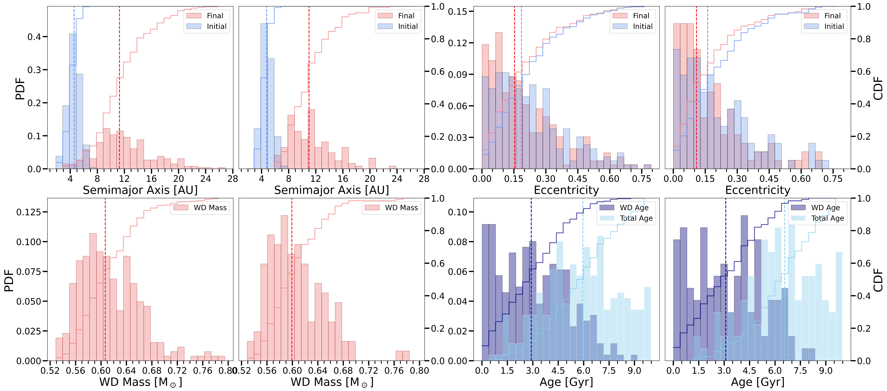
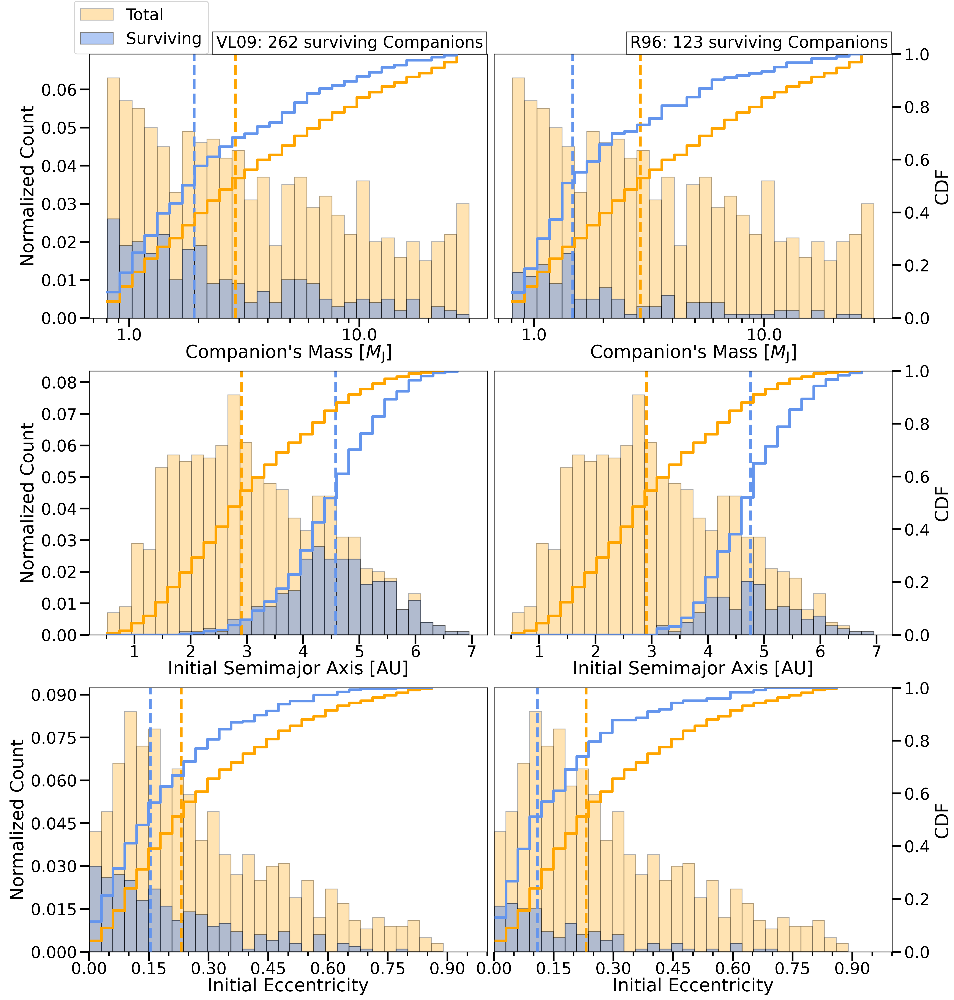

$\newcommand{\ensuremath}{}$
$\newcommand{\xspace}{}$
$\newcommand{\object}[1]{\texttt{#1}}$
$\newcommand{\farcs}{{.}''}$
$\newcommand{\farcm}{{.}'}$
$\newcommand{\arcsec}{''}$
$\newcommand{\arcmin}{'}$
$\newcommand{\ion}[2]{#1#2}$
$\newcommand{\textsc}[1]{\textrm{#1}}$
$\newcommand{\hl}[1]{\textrm{#1}}$
$\newcommand{\footnote}[1]{}$
$\newcommand{\mrs}[1]{\textbf{\color{forestgreen(traditional)} (MRS: #1)}}$
$\newcommand{\Cata}[1]{\textbf{\color{blue} (Cata: #1)}}$
$\newcommand{\Diego}[1]{\textbf{\color{red} (Diego: #1)}}$
$\newcommand{\Alex}[1]{\textbf{\color{orange} (Alex: #1)}}$
$\newcommand{\Javi}[1]{\textbf{\color{cyan} (Javi: #1)}}$
$\newcommand{\Pau}[1]{\textbf{\color{red} (Pau: #1)}}$
$\newcommand{\specialcell}[2][c]{\begin{tabular}[#1]{@ l@ }#2\end{tabular}}$
$\newcommand{\Lsun}{L_{\odot}}$
$\newcommand{\Msun}{M_{\odot}}$
$\newcommand{\Mjup}{M_{\mathrm{J}}}$
$\newcommand{\Rsun}{R_{\odot}}$
$\newcommand{\Msunyr}{M_{\odot}~yr^{-1}}$
$\newcommand{\gppr}{\stackrel{>}{\scriptstyle \sim}}$
$\newcommand{\gappr}{\raisebox{-0.4ex}{\gppr}}$
$\newcommand{\lppr}{\stackrel{<}{\scriptstyle \sim}}$
$\newcommand{\lappr}{\raisebox{-0.4ex}{\lppr}}$
$\newcommand{\arraystretch}{1.5}$
$\newcommand\hyper{@linkstart##1##2 $
$     }$
$\newcommand\hyper{@linkstart##1##2 $
$     }$
$\newcommand\hyper{@linkstart##1##2 $
$     }$
$\newcommand\hyper{@linkstart##1##2 $
$     }$

# Predicted incidence of Jupiter-like planets around white dwarfs

<mark>Appeared on: 2026-01-28</mark> -  _Accepted for publication in A&A_

A. Mauch-Soriano, et al. -- incl., <mark>W. Brandner</mark>

**Abstract:** Gas-giant planets and brown dwarfs have been discovered in large numbers around main-sequence stars and even evolved stars. In contrast, and despite ongoing imaging surveys using state-of-the-art facilities, only a handful of substellar companions to white dwarfs are known. It remains unclear whether this paucity reflects observational challenges or the consequences of stellar evolution. We aim to carry out population synthesis of substellar objects around white dwarfs to predict the fraction and properties of white dwarfs hosting substellar companions. We generated a representative population of white-dwarf progenitors (up to $4$ $\Msun$ ) with substellar companions, adopting companion distributions derived from radial-velocity surveys of giant stars and a global age-metallicity relation. We then combined the stellar-evolution codes Modules for Experiments in Stellar Astrophysics (MESA) and Single Star Evolution (SSE) with standard prescriptions for mass loss and stellar tides to predict the resulting population of white dwarfs and their substellar companions. We find that the predicted fraction of white dwarfs hosting substellar companions in the Milky Way is, independent of uncertainties related to initial distributions, stellar tides, or stellar mass loss during the asymptotic giant branch, below $\sim3\pm1.5$ \% . The occurrence rate peaks at relatively low-mass ( $\sim 0.53M_\odot$ to $\sim 0.66M_\odot$ ) white dwarfs and relatively young ( $\sim 1$ - $6$ Gyr) systems, where it can reach $\gappr3$ \% .   The semimajor axes of the surviving companions range from $3-24$ au with a median of $11$ au. We estimate that $\sim95$ \% of the predicted companions are gas-giant planets, which translates to a predicted general Jupiter-like planet occurrence rate around white dwarfs below $\sim2.9\pm1.4$ \% . These occurrence rates might slightly increase if multi-planetary systems are considered.   Furthermore, owing to the strong dependence   of companion occurrence on the metallicity of the white dwarf progenitor, the assumed age-metallicity relation strongly affects the predictions. Based on recent estimates of the local age-metallicity relation, we estimate that the fraction of white dwarfs with companions close to the Sun might reach $\lappr8$ \% . If the planetary and brown dwarf companion distributions derived from intermediate-mass giant stars through radial velocity surveys reflect the characteristics of the true population, less than $3 \pm1.5$ \% of white dwarfs host substellar companions. Depending somewhat on the age-metallicity relation, this most likely represents an upper limit on possible detections because a significant number of companions might not be detectable with current facilities.

**Figure 4. -** Final and initial properties of systems that host a susbtellar companion. Each row shows a set of histograms comparing two WD samples: one modeled using \citetalias[][]{Villaver_2009}(left) and one based on the \citetalias[][]{rasioetal96-1}(right) approximation for stellar tides. All histograms are normalized to the total number of surviving companions for each simulation. The final semimajor axes are significantly larger than the initial ones for both tidal prescriptions (top left). For weak tides, the eccentricity distribution does not significantly change, while the distribution moves slightly toward smaller eccentricities for strong tides (top right). The bottom panels show the WD mass and age distributions for both approximations of tidal forces which appear to be rather similar. (*fig:final-and-WD*)

**Figure 2. -** 
    Orbital evolution of a $1$\Mjup gas-giant planet orbiting a $2$\Msun star with $Z=0.0187$, comparing calculations performed with SSE (left), the MESA default test suite (middle), for which the AGB mass-loss efficiency is set to $\eta=0.7$, and MESA assuming a more realistic mass-loss efficiency ($\eta= 0.02$; right).
    The orbits are assumed to be circular, and initial separations range from $2$ to $4.5$ au, with a step size of $0.5$ au. The red filled area corresponds to the stellar radius, while purple and green lines denote the orbital separation of the engulfed and surviving planets, respectively. The insets show zoomed-in views of the thermal pulse phase of the AGB and highlight its critical role in planetary engulfment. SSE does not account for the thermal pulses (left). For a large mass-loss efficiency (middle), most planets survive because the orbit expansion caused by stellar mass loss dominates. In the most realistic scenario assuming a small efficiency (right), the star evolves through more thermal pulses and reaches a larger radius, which causes most planets to be engulfed. (*fig:stellar_evolution*)

**Figure 3. -** Survival of substellar companions as function of companion mass (top), initial semimajor axis (middle), and initial eccentricity (bottom).
        The left panels represent results when considering the tidal force model by \citetalias{Villaver_2009}, while the right panels show results when using the tidal force model by \citetalias{rasioetal96-1}.  All distributions are normalized by
         the total number of stars (1000).
        The number of surviving companions is indicated in the figure for each model (blue histogram). The vertical lines correspond to the median value of each sample. The solid lines correspond to the cumulative distributions.
        In general, the initial distributions of surviving companions (orange) are shifted toward lower masses, larger semimajor axes, and smaller eccentricities compared to the initial values of all companions (blue).
        These effects are slightly more pronounced for stronger tides (right panels).
         (*fig:Initial planets distributions*)

