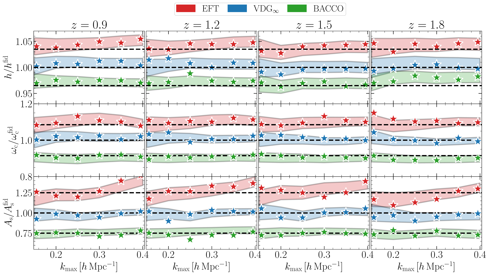

$\newcommand{\ensuremath}{}$
$\newcommand{\xspace}{}$
$\newcommand{\object}[1]{\texttt{#1}}$
$\newcommand{\farcs}{{.}''}$
$\newcommand{\farcm}{{.}'}$
$\newcommand{\arcsec}{''}$
$\newcommand{\arcmin}{'}$
$\newcommand{\ion}[2]{#1#2}$
$\newcommand{\textsc}[1]{\textrm{#1}}$
$\newcommand{\hl}[1]{\textrm{#1}}$
$\newcommand{\footnote}[1]{}$
$\newcommand{\rsd}{\gls{rsd}\xspace}$
$\newcommand{\spt}{\gls{spt}\xspace}$
$\newcommand{\ept}{\gls{ept}\xspace}$
$\newcommand{\eft}{\gls{eft}\xspace}$
$\newcommand{\vdg}{\gls{vdg}\xspace}$
$\newcommand{\vdgf}{\gls{vdgf}\xspace}$
$\newcommand{\bao}{\gls{bao}\xspace}$
$\newcommand{\ir}{\gls{ir}\xspace}$
$\newcommand{\hod}{\gls{hod}\xspace}$
$\newcommand{\fob}{\gls{fob}\xspace}$
$\newcommand{\fom}{\gls{fom}\xspace}$
$\newcommand{\ppd}{\gls{ppd}\xspace}$
$\newcommand{\pvalue}{p-value\xspace}$
$\newcommand{\uv}{\gls{uv}\xspace}$
$\newcommand{\pt}{\gls{pt}\xspace}$
$\newcommand{\nbody}{\textit{N}-body }$
$\newcommand{\eul}{{\rm e}}$
$\newcommand{\imag}{{\rm i}}$
$\newcommand{\de}{\mathrm{d}}$
$\newcommand{\med}[1]{\left \langle #1 \right \rangle}$
$\newcommand{\bdm}{\begin{displaymath}}$
$\newcommand{\edm}{\end{displaymath}}$
$\newcommand{\nn}{\nonumber}$
$\newcommand{\xv}{{\bm x}}$
$\newcommand{\vv}{{\bm v}}$
$\newcommand{\yv}{{\bm y}}$
$\newcommand{\kv}{{\bm k}}$
$\newcommand{\nv}{{\bm n}}$
$\newcommand{\mv}{{\bm m}}$
$\newcommand{\rv}{{\bm r}}$
$\newcommand{\qv}{{\bm q}}$
$\newcommand{\pv}{{\bm p}}$
$\newcommand{\Pl}{P_{\rm L}}$
$\newcommand{\del}{\delta}$
$\newcommand\td{\widetilde{\delta}}$
$\newcommand{\Le}{{\mathcal L}}$
$\newcommand{\intq}{{\int_{\qv}}}$
$\newcommand{\kmin}{k_{\rm min}}$
$\newcommand{\kmax}{k_{\rm max}}$
$\newcommand{\omegam}{\Omega_{\rm m} h^2}$
$\newcommand{\lbox}{L_{\rm box}}$
$\newcommand{\dd}{{\mathrm d}}$
$\newcommand{\ie}{{i.e.}~}$
$\newcommand{\eg}{{e.g.}~}$
$\newcommand{\Ms}{  h^{-1}   M_\odot}$
$\newcommand{\Mpc}{  h^{-1}   {\rm Mpc}}$
$\newcommand{\cMpc}{  h^{-3}   {\rm Mpc}^3}$
$\newcommand{\Gpc}{  h^{-1}   {\rm Gpc}}$
$\newcommand{\cGpc}{  h^{-3}   {\rm Gpc}^3}$
$\newcommand{\kMpc}{  h   {\rm Mpc}^{-1}}$
$\newcommand{\kcMpc}{  h^3   {\rm Mpc}^{-3}}$
$\newcommand{\Hunits}{  {\rm km   s^{-1}   Mpc^{-1}}}$
$\newcommand{\eq}[1]{eq.~(\ref{#1})}$
$\newcommand{\Pg}{P_{\rm g}}$
$\newcommand{\Bg}{B_{\rm g}}$
$\newcommand{\omegac}{\omega_{\rm c}}$
$\newcommand{\omegab}{\omega_{\hbox{\hglue 0.5pt}\rm b}}$
$\newcommand{\deltag}{\delta_{\rm g}}$
$\newcommand{\As}{A_{\rm s}}$
$\newcommand{\ns}{n_{\rm s}}$
$\newcommand{\Pgg}{P_{\rm gg}}$
$\newcommand{\kF}{k_{ \rm F}}$
$\newcommand{\kN}{k_{ \rm Nyq}}$
$\newcommand{\dirac}{\delta_{\rm D}}$
$\newcommand{\deltainit}{\delta_{\rm L}}$
$\newcommand{\Fn}{F_n}$
$\newcommand{\Plin}{P_{\rm L}}$
$\newcommand{\Pmm}{P_{\rm mm}}$
$\newcommand{\Ponel}{P^{ \rm 1\mbox{-}loop}}$
$\newcommand{\Ptwol}{P^{ \rm 2\mbox{-}loop}}$
$\newcommand{\Pnw}{P_{\rm nw}}$
$\newcommand{\Pw}{P_{\rm w}}$
$\newcommand{\Pmmlo}{P_{\rm mm}^{ {\rm IR\mbox{-}LO}}}$
$\newcommand{\Pmmnlo}{P_{\rm mm}^{ {\rm IR\mbox{-}NLO}}}$
$\newcommand{\ks}{k_{\rm s}}$
$\newcommand{\kosc}{k_{\rm osc}}$
$\newcommand{\losc}{\ell_{\rm osc}}$
$\newcommand{\Pctr}{P_{\rm ctr}}$
$\newcommand{\bGtwo}{b_{{\cal G}_2}}$
$\newcommand{\bGthree}{b_{\Gamma_3}}$
$\newcommand{\bdtwod}{b_{\nabla^{ 2}\delta}}$
$\newcommand{\bone}{b_1}$
$\newcommand{\btwo}{b_2}$
$\newcommand{\gtwo}{\gamma_2}$
$\newcommand{\gtwoone}{\gamma_{21}}$
$\newcommand{\czero}{c_0}$
$\newcommand{\ctwo}{c_2}$
$\newcommand{\cfour}{c_4}$
$\newcommand{\cnlo}{c_{\rm nlo}}$
$\newcommand{\npzero}{N_0^P}$
$\newcommand{\nptwozero}{N_{20}^P}$
$\newcommand{\nptwotwo}{N_{22}^P}$
$\newcommand{\aPone}{\alpha_{{\rm P},1}}$
$\newcommand{\aPtwo}{\alpha_{{\rm P},2}}$
$\newcommand{\Pggtt}{P_{{\rm gg}, 22}}$
$\newcommand{\Pggot}{P_{{\rm gg}, 13}}$
$\newcommand{\Pgglo}{P_{\rm gg}^{ \rm IR-LO}}$
$\newcommand{\Pggnlo}{P_{\rm gg}^{ \rm IR-NLO}}$
$\newcommand{\thetav}{\bm{\theta}}$
$\newcommand{\Peh}{P_{\rm EH}}$
$\newcommand*{\dint}{  \mathrm{d}}$
$\newcommand*{\Cov}[1]{\operatorname{Cov}\left[{#1}\right]}$
$\newcommand*\mc[1]{{\color{magenta}{#1}}}$
$\newcommand{\MC}[1]{{\color{cyan} (MC: #1)}}$
$\newcommand*\bcl[1]{{\color{red}{#1}}}$
$\newcommand{\done}{\color{red} (done)}$
$\newcommand{\AP}[1]{{\color{orange} (AP: #1)}}$
$\newcommand{\BC}[1]{{\color{purple} (BC: #1)}}$
$\newcommand{\alex}[1]{{\color{green} (AE: #1)}}$
$\newcommand{\qq}{ \pmb{q} }$
$\newcommand{\xx}{ \pmb{x} }$
$\newcommand{\sv}{ \pmb{s} }$
$\newcommand{\om}{ \Omega_{\rm m} }$
$\newcommand{\dl}{ \delta_{\rm L}(\pmb{q}) }$
$\newcommand{\dg}{ \delta_{\rm g} }$
$\newcommand{\lamsat}{ \lambda_{\rm sat} }$
$\newcommand{\fsat}{ f_{\rm sat} }$
$\newcommand{\ihMpc}{ h^{-1}{\rm Mpc} }$
$\newcommand{\hMsun}{ h^{-1}{\rm M_{ \odot}}}$
$\newcommand{\avir}{a_{\rm vir}}$
$\newcommand{\bacco}{{\tt BACCO}\xspace}$
$\begin{document}$
$\title{\Euclid preparation}$
$\subtitle{Galaxy power spectrum modelling in redshift space}$
$\newcommand{\orcid}[1] $
$\author{Euclid Collaboration: B.~Camacho~Quevedo\orcid{0000-0002-8789-4232}\thanks{\email{bcamacho@sissa.it}}\inst{\ref{aff1},\ref{aff2},\ref{aff3},\ref{aff4},\ref{aff5}}$
$\and M.~Crocce\orcid{0000-0002-9745-6228}\inst{\ref{aff3},\ref{aff4}}$
$\and M.~Pellejero~Ibañez\orcid{0000-0003-4680-7275}\inst{\ref{aff7}}$
$\and R.~E.~Angulo\orcid{0000-0003-2953-3970}\inst{\ref{aff8},\ref{aff9}}$
$\and A.~Pezzotta\orcid{0000-0003-0726-2268}\inst{\ref{aff10}}$
$\and A.~Eggemeier\orcid{0000-0002-1841-8910}\inst{\ref{aff11}}$
$\and G.~Gambardella\orcid{0009-0001-1281-1746}\inst{\ref{aff3},\ref{aff4}}$
$\and C.~Moretti\orcid{0000-0003-3314-8936}\inst{\ref{aff5},\ref{aff1},\ref{aff12}}$
$\and E.~Sefusatti\orcid{0000-0003-0473-1567}\inst{\ref{aff5},\ref{aff1},\ref{aff12}}$
$\and A.~Moradinezhad~Dizgah\orcid{0000-0001-8841-9989}\inst{\ref{aff13}}$
$\and M.~Zennaro\orcid{0000-0002-4458-1754}\inst{\ref{aff14}}$
$\and M.-A.~Breton\inst{\ref{aff15}}$
$\and A.~Chudaykin\inst{\ref{aff16}}$
$\and G.~D'Amico\orcid{0000-0002-8183-1214}\inst{\ref{aff17},\ref{aff18}}$
$\and V.~Desjacques\orcid{0000-0003-2062-8172}\inst{\ref{aff19}}$
$\and S.~de~la~Torre\inst{\ref{aff20}}$
$\and M.~Guidi\orcid{0000-0001-9408-1101}\inst{\ref{aff21},\ref{aff22}}$
$\and M.~K{ä}rcher\orcid{0000-0001-5868-647X}\inst{\ref{aff23}}$
$\and K.~Pardede\orcid{0000-0002-7728-8220}\inst{\ref{aff18}}$
$\and C.~Porciani\orcid{0000-0002-7797-2508}\inst{\ref{aff11}}$
$\and A.~Pugno\inst{\ref{aff11}}$
$\and J.~Salvalaggio\orcid{0000-0002-1431-5607}\inst{\ref{aff5},\ref{aff1},\ref{aff24},\ref{aff12}}$
$\and E.~Sarpa\orcid{0000-0002-1256-655X}\inst{\ref{aff2},\ref{aff25},\ref{aff5}}$
$\and A.~Veropalumbo\orcid{0000-0003-2387-1194}\inst{\ref{aff10},\ref{aff26},\ref{aff27}}$
$\and B.~Altieri\orcid{0000-0003-3936-0284}\inst{\ref{aff28}}$
$\and S.~Andreon\orcid{0000-0002-2041-8784}\inst{\ref{aff10}}$
$\and N.~Auricchio\orcid{0000-0003-4444-8651}\inst{\ref{aff22}}$
$\and C.~Baccigalupi\orcid{0000-0002-8211-1630}\inst{\ref{aff1},\ref{aff5},\ref{aff12},\ref{aff2}}$
$\and M.~Baldi\orcid{0000-0003-4145-1943}\inst{\ref{aff21},\ref{aff22},\ref{aff29}}$
$\and S.~Bardelli\orcid{0000-0002-8900-0298}\inst{\ref{aff22}}$
$\and R.~Bender\orcid{0000-0001-7179-0626}\inst{\ref{aff30},\ref{aff31}}$
$\and A.~Biviano\orcid{0000-0002-0857-0732}\inst{\ref{aff5},\ref{aff1}}$
$\and E.~Branchini\orcid{0000-0002-0808-6908}\inst{\ref{aff27},\ref{aff26},\ref{aff10}}$
$\and M.~Brescia\orcid{0000-0001-9506-5680}\inst{\ref{aff32},\ref{aff33}}$
$\and S.~Camera\orcid{0000-0003-3399-3574}\inst{\ref{aff34},\ref{aff35},\ref{aff36}}$
$\and V.~Capobianco\orcid{0000-0002-3309-7692}\inst{\ref{aff36}}$
$\and C.~Carbone\orcid{0000-0003-0125-3563}\inst{\ref{aff37}}$
$\and V.~F.~Cardone\inst{\ref{aff38},\ref{aff39}}$
$\and J.~Carretero\orcid{0000-0002-3130-0204}\inst{\ref{aff40},\ref{aff41}}$
$\and S.~Casas\orcid{0000-0002-4751-5138}\inst{\ref{aff42},\ref{aff43}}$
$\and F.~J.~Castander\orcid{0000-0001-7316-4573}\inst{\ref{aff3},\ref{aff4}}$
$\and M.~Castellano\orcid{0000-0001-9875-8263}\inst{\ref{aff38}}$
$\and G.~Castignani\orcid{0000-0001-6831-0687}\inst{\ref{aff22}}$
$\and S.~Cavuoti\orcid{0000-0002-3787-4196}\inst{\ref{aff33},\ref{aff44}}$
$\and K.~C.~Chambers\orcid{0000-0001-6965-7789}\inst{\ref{aff45}}$
$\and A.~Cimatti\inst{\ref{aff46}}$
$\and C.~Colodro-Conde\inst{\ref{aff47}}$
$\and G.~Congedo\orcid{0000-0003-2508-0046}\inst{\ref{aff7}}$
$\and L.~Conversi\orcid{0000-0002-6710-8476}\inst{\ref{aff48},\ref{aff28}}$
$\and Y.~Copin\orcid{0000-0002-5317-7518}\inst{\ref{aff49}}$
$\and F.~Courbin\orcid{0000-0003-0758-6510}\inst{\ref{aff50},\ref{aff51},\ref{aff4}}$
$\and H.~M.~Courtois\orcid{0000-0003-0509-1776}\inst{\ref{aff52}}$
$\and H.~Degaudenzi\orcid{0000-0002-5887-6799}\inst{\ref{aff53}}$
$\and G.~De~Lucia\orcid{0000-0002-6220-9104}\inst{\ref{aff5}}$
$\and H.~Dole\orcid{0000-0002-9767-3839}\inst{\ref{aff54}}$
$\and M.~Douspis\orcid{0000-0003-4203-3954}\inst{\ref{aff54}}$
$\and F.~Dubath\orcid{0000-0002-6533-2810}\inst{\ref{aff53}}$
$\and C.~A.~J.~Duncan\orcid{0009-0003-3573-0791}\inst{\ref{aff7}}$
$\and X.~Dupac\inst{\ref{aff28}}$
$\and S.~Dusini\orcid{0000-0002-1128-0664}\inst{\ref{aff55}}$
$\and S.~Escoffier\orcid{0000-0002-2847-7498}\inst{\ref{aff56}}$
$\and M.~Farina\orcid{0000-0002-3089-7846}\inst{\ref{aff57}}$
$\and R.~Farinelli\inst{\ref{aff22}}$
$\and S.~Farrens\orcid{0000-0002-9594-9387}\inst{\ref{aff15}}$
$\and S.~Ferriol\inst{\ref{aff49}}$
$\and F.~Finelli\orcid{0000-0002-6694-3269}\inst{\ref{aff22},\ref{aff58}}$
$\and S.~Fotopoulou\orcid{0000-0002-9686-254X}\inst{\ref{aff59}}$
$\and N.~Fourmanoit\orcid{0009-0005-6816-6925}\inst{\ref{aff56}}$
$\and M.~Frailis\orcid{0000-0002-7400-2135}\inst{\ref{aff5}}$
$\and E.~Franceschi\orcid{0000-0002-0585-6591}\inst{\ref{aff22}}$
$\and M.~Fumana\orcid{0000-0001-6787-5950}\inst{\ref{aff37}}$
$\and S.~Galeotta\orcid{0000-0002-3748-5115}\inst{\ref{aff5}}$
$\and K.~George\orcid{0000-0002-1734-8455}\inst{\ref{aff60}}$
$\and B.~Gillis\orcid{0000-0002-4478-1270}\inst{\ref{aff7}}$
$\and C.~Giocoli\orcid{0000-0002-9590-7961}\inst{\ref{aff22},\ref{aff29}}$
$\and J.~Gracia-Carpio\orcid{0000-0003-4689-3134}\inst{\ref{aff30}}$
$\and A.~Grazian\orcid{0000-0002-5688-0663}\inst{\ref{aff61}}$
$\and F.~Grupp\inst{\ref{aff30},\ref{aff31}}$
$\and L.~Guzzo\orcid{0000-0001-8264-5192}\inst{\ref{aff23},\ref{aff10},\ref{aff62}}$
$\and S.~V.~H.~Haugan\orcid{0000-0001-9648-7260}\inst{\ref{aff63}}$
$\and W.~Holmes\inst{\ref{aff64}}$
$\and F.~Hormuth\inst{\ref{aff65}}$
$\and A.~Hornstrup\orcid{0000-0002-3363-0936}\inst{\ref{aff66},\ref{aff67}}$
$\and K.~Jahnke\orcid{0000-0003-3804-2137}\inst{\ref{aff68}}$
$\and B.~Joachimi\orcid{0000-0001-7494-1303}\inst{\ref{aff69}}$
$\and S.~Kermiche\orcid{0000-0002-0302-5735}\inst{\ref{aff56}}$
$\and A.~Kiessling\orcid{0000-0002-2590-1273}\inst{\ref{aff64}}$
$\and B.~Kubik\orcid{0009-0006-5823-4880}\inst{\ref{aff49}}$
$\and M.~Kümmel\orcid{0000-0003-2791-2117}\inst{\ref{aff31}}$
$\and M.~Kunz\orcid{0000-0002-3052-7394}\inst{\ref{aff16}}$
$\and H.~Kurki-Suonio\orcid{0000-0002-4618-3063}\inst{\ref{aff70},\ref{aff71}}$
$\and A.~M.~C.~Le~Brun\orcid{0000-0002-0936-4594}\inst{\ref{aff72}}$
$\and S.~Ligori\orcid{0000-0003-4172-4606}\inst{\ref{aff36}}$
$\and P.~B.~Lilje\orcid{0000-0003-4324-7794}\inst{\ref{aff63}}$
$\and V.~Lindholm\orcid{0000-0003-2317-5471}\inst{\ref{aff70},\ref{aff71}}$
$\and I.~Lloro\orcid{0000-0001-5966-1434}\inst{\ref{aff73}}$
$\and G.~Mainetti\orcid{0000-0003-2384-2377}\inst{\ref{aff74}}$
$\and E.~Maiorano\orcid{0000-0003-2593-4355}\inst{\ref{aff22}}$
$\and O.~Mansutti\orcid{0000-0001-5758-4658}\inst{\ref{aff5}}$
$\and S.~Marcin\inst{\ref{aff75}}$
$\and O.~Marggraf\orcid{0000-0001-7242-3852}\inst{\ref{aff11}}$
$\and M.~Martinelli\orcid{0000-0002-6943-7732}\inst{\ref{aff38},\ref{aff39}}$
$\and N.~Martinet\orcid{0000-0003-2786-7790}\inst{\ref{aff20}}$
$\and F.~Marulli\orcid{0000-0002-8850-0303}\inst{\ref{aff76},\ref{aff22},\ref{aff29}}$
$\and R.~J.~Massey\orcid{0000-0002-6085-3780}\inst{\ref{aff77}}$
$\and E.~Medinaceli\orcid{0000-0002-4040-7783}\inst{\ref{aff22}}$
$\and M.~Melchior\inst{\ref{aff78}}$
$\and M.~Meneghetti\orcid{0000-0003-1225-7084}\inst{\ref{aff22},\ref{aff29}}$
$\and E.~Merlin\orcid{0000-0001-6870-8900}\inst{\ref{aff38}}$
$\and G.~Meylan\inst{\ref{aff79}}$
$\and A.~Mora\orcid{0000-0002-1922-8529}\inst{\ref{aff80}}$
$\and M.~Moresco\orcid{0000-0002-7616-7136}\inst{\ref{aff76},\ref{aff22}}$
$\and L.~Moscardini\orcid{0000-0002-3473-6716}\inst{\ref{aff76},\ref{aff22},\ref{aff29}}$
$\and C.~Neissner\orcid{0000-0001-8524-4968}\inst{\ref{aff81},\ref{aff41}}$
$\and S.-M.~Niemi\orcid{0009-0005-0247-0086}\inst{\ref{aff82}}$
$\and C.~Padilla\orcid{0000-0001-7951-0166}\inst{\ref{aff81}}$
$\and S.~Paltani\orcid{0000-0002-8108-9179}\inst{\ref{aff53}}$
$\and F.~Pasian\orcid{0000-0002-4869-3227}\inst{\ref{aff5}}$
$\and K.~Pedersen\inst{\ref{aff83}}$
$\and W.~J.~Percival\orcid{0000-0002-0644-5727}\inst{\ref{aff84},\ref{aff85},\ref{aff86}}$
$\and V.~Pettorino\orcid{0000-0002-4203-9320}\inst{\ref{aff82}}$
$\and S.~Pires\orcid{0000-0002-0249-2104}\inst{\ref{aff15}}$
$\and G.~Polenta\orcid{0000-0003-4067-9196}\inst{\ref{aff87}}$
$\and M.~Poncet\inst{\ref{aff88}}$
$\and L.~A.~Popa\inst{\ref{aff89}}$
$\and F.~Raison\orcid{0000-0002-7819-6918}\inst{\ref{aff30}}$
$\and J.~Rhodes\orcid{0000-0002-4485-8549}\inst{\ref{aff64}}$
$\and G.~Riccio\inst{\ref{aff33}}$
$\and F.~Rizzo\orcid{0000-0002-9407-585X}\inst{\ref{aff5}}$
$\and E.~Romelli\orcid{0000-0003-3069-9222}\inst{\ref{aff5}}$
$\and M.~Roncarelli\orcid{0000-0001-9587-7822}\inst{\ref{aff22}}$
$\and R.~Saglia\orcid{0000-0003-0378-7032}\inst{\ref{aff31},\ref{aff30}}$
$\and Z.~Sakr\orcid{0000-0002-4823-3757}\inst{\ref{aff90},\ref{aff91},\ref{aff92}}$
$\and A.~G.~Sánchez\orcid{0000-0003-1198-831X}\inst{\ref{aff30}}$
$\and D.~Sapone\orcid{0000-0001-7089-4503}\inst{\ref{aff93}}$
$\and B.~Sartoris\orcid{0000-0003-1337-5269}\inst{\ref{aff31},\ref{aff5}}$
$\and P.~Schneider\orcid{0000-0001-8561-2679}\inst{\ref{aff11}}$
$\and A.~Secroun\orcid{0000-0003-0505-3710}\inst{\ref{aff56}}$
$\and G.~Seidel\orcid{0000-0003-2907-353X}\inst{\ref{aff68}}$
$\and E.~Sihvola\orcid{0000-0003-1804-7715}\inst{\ref{aff94}}$
$\and P.~Simon\inst{\ref{aff11}}$
$\and C.~Sirignano\orcid{0000-0002-0995-7146}\inst{\ref{aff95},\ref{aff55}}$
$\and G.~Sirri\orcid{0000-0003-2626-2853}\inst{\ref{aff29}}$
$\and A.~Spurio~Mancini\orcid{0000-0001-5698-0990}\inst{\ref{aff96}}$
$\and L.~Stanco\orcid{0000-0002-9706-5104}\inst{\ref{aff55}}$
$\and P.~Tallada-Crespí\orcid{0000-0002-1336-8328}\inst{\ref{aff40},\ref{aff41}}$
$\and D.~Tavagnacco\orcid{0000-0001-7475-9894}\inst{\ref{aff5}}$
$\and A.~N.~Taylor\inst{\ref{aff7}}$
$\and I.~Tereno\orcid{0000-0002-4537-6218}\inst{\ref{aff97},\ref{aff98}}$
$\and N.~Tessore\orcid{0000-0002-9696-7931}\inst{\ref{aff99}}$
$\and S.~Toft\orcid{0000-0003-3631-7176}\inst{\ref{aff100},\ref{aff101}}$
$\and R.~Toledo-Moreo\orcid{0000-0002-2997-4859}\inst{\ref{aff102}}$
$\and F.~Torranewcommandlot\orcid{0000-0003-1160-1517}\inst{\ref{aff41},\ref{aff40}}$
$\and I.~Tutusaus\orcid{0000-0002-3199-0399}\inst{\ref{aff3},\ref{aff6},\ref{aff91}}$
$\and J.~Valiviita\orcid{0000-0001-6225-3693}\inst{\ref{aff70},\ref{aff71}}$
$\and T.~Vassallo\orcid{0000-0001-6512-6358}\inst{\ref{aff5},\ref{aff60}}$
$\and Y.~Wang\orcid{0000-0002-4749-2984}\inst{\ref{aff103}}$
$\and J.~Weller\orcid{0000-0002-8282-2010}\inst{\ref{aff31},\ref{aff30}}$
$\and G.~Zamorani\orcid{0000-0002-2318-301X}\inst{\ref{aff22}}$
$\and F.~M.~Zerbi\orcid{0000-0002-9996-973X}\inst{\ref{aff10}}$
$\and E.~Zucca\orcid{0000-0002-5845-8132}\inst{\ref{aff22}}$
$\and V.~Allevato\orcid{0000-0001-7232-5152}\inst{\ref{aff33}}$
$\and M.~Ballardini\orcid{0000-0003-4481-3559}\inst{\ref{aff104},\ref{aff105},\ref{aff22}}$
$\and A.~Boucaud\orcid{0000-0001-7387-2633}\inst{\ref{aff106}}$
$\and E.~Bozzo\orcid{0000-0002-8201-1525}\inst{\ref{aff53}}$
$\and C.~Burigana\orcid{0000-0002-3005-5796}\inst{\ref{aff107},\ref{aff58}}$
$\and R.~Cabanac\orcid{0000-0001-6679-2600}\inst{\ref{aff91}}$
$\and M.~Calabrese\orcid{0000-0002-2637-2422}\inst{\ref{aff108},\ref{aff37}}$
$\and A.~Cappi\inst{\ref{aff109},\ref{aff22}}$
$\and T.~Castro\orcid{0000-0002-6292-3228}\inst{\ref{aff5},\ref{aff12},\ref{aff1},\ref{aff25}}$
$\and J.~A.~Escartin~Vigo\inst{\ref{aff30}}$
$\and L.~Gabarra\orcid{0000-0002-8486-8856}\inst{\ref{aff14}}$
$\and J.~Macias-Perez\orcid{0000-0002-5385-2763}\inst{\ref{aff110}}$
$\and R.~Maoli\orcid{0000-0002-6065-3025}\inst{\ref{aff111},\ref{aff38}}$
$\and J.~Martín-Fleitas\orcid{0000-0002-8594-569X}\inst{\ref{aff112}}$
$\and N.~Mauri\orcid{0000-0001-8196-1548}\inst{\ref{aff46},\ref{aff29}}$
$\and R.~B.~Metcalf\orcid{0000-0003-3167-2574}\inst{\ref{aff76},\ref{aff22}}$
$\and P.~Monaco\orcid{0000-0003-2083-7564}\inst{\ref{aff24},\ref{aff5},\ref{aff12},\ref{aff1}}$
$\and A.~A.~Nucita\inst{\ref{aff113},\ref{aff114},\ref{aff115}}$
$\and M.~Pöntinen\orcid{0000-0001-5442-2530}\inst{\ref{aff70}}$
$\and I.~Risso\orcid{0000-0003-2525-7761}\inst{\ref{aff10},\ref{aff26}}$
$\and V.~Scottez\orcid{0009-0008-3864-940X}\inst{\ref{aff116},\ref{aff117}}$
$\and M.~Sereno\orcid{0000-0003-0302-0325}\inst{\ref{aff22},\ref{aff29}}$
$\and M.~Tenti\orcid{0000-0002-4254-5901}\inst{\ref{aff29}}$
$\and M.~Tucci\inst{\ref{aff53}}$
$\and M.~Viel\orcid{0000-0002-2642-5707}\inst{\ref{aff1},\ref{aff5},\ref{aff2},\ref{aff12},\ref{aff25}}$
$\and M.~Wiesmann\orcid{0009-0000-8199-5860}\inst{\ref{aff63}}$
$\and Y.~Akrami\orcid{0000-0002-2407-7956}\inst{\ref{aff90},\ref{aff118}}$
$\and I.~T.~Andika\orcid{0000-0001-6102-9526}\inst{\ref{aff60}}$
$\and G.~Angora\orcid{0000-0002-0316-6562}\inst{\ref{aff33},\ref{aff104}}$
$\and M.~Archidiacono\orcid{0000-0003-4952-9012}\inst{\ref{aff23},\ref{aff62}}$
$\and F.~Atrio-Barandela\orcid{0000-0002-2130-2513}\inst{\ref{aff119}}$
$\and L.~Bazzanini\orcid{0000-0003-0727-0137}\inst{\ref{aff104},\ref{aff22}}$
$\and J.~Bel\inst{\ref{aff120}}$
$\and D.~Bertacca\orcid{0000-0002-2490-7139}\inst{\ref{aff95},\ref{aff61},\ref{aff55}}$
$\and M.~Bethermin\orcid{0000-0002-3915-2015}\inst{\ref{aff121}}$
$\and A.~Blanchard\orcid{0000-0001-8555-9003}\inst{\ref{aff91}}$
$\and L.~Blot\orcid{0000-0002-9622-7167}\inst{\ref{aff122},\ref{aff72}}$
$\and H.~Böhringer\orcid{0000-0001-8241-4204}\inst{\ref{aff30},\ref{aff60},\ref{aff123}}$
$\and S.~Borgani\orcid{0000-0001-6151-6439}\inst{\ref{aff24},\ref{aff1},\ref{aff5},\ref{aff12},\ref{aff25}}$
$\and M.~L.~Brown\orcid{0000-0002-0370-8077}\inst{\ref{aff124}}$
$\and S.~Bruton\orcid{0000-0002-6503-5218}\inst{\ref{aff125}}$
$\and A.~Calabro\orcid{0000-0003-2536-1614}\inst{\ref{aff38}}$
$\and F.~Caro\inst{\ref{aff38}}$
$\and C.~S.~Carvalho\inst{\ref{aff98}}$
$\and F.~Cogato\orcid{0000-0003-4632-6113}\inst{\ref{aff76},\ref{aff22}}$
$\and A.~R.~Cooray\orcid{0000-0002-3892-0190}\inst{\ref{aff126}}$
$\and S.~Davini\orcid{0000-0003-3269-1718}\inst{\ref{aff26}}$
$\and F.~De~Paolis\orcid{0000-0001-6460-7563}\inst{\ref{aff113},\ref{aff114},\ref{aff115}}$
$\and G.~Desprez\orcid{0000-0001-8325-1742}\inst{\ref{aff127}}$
$\and A.~Díaz-Sánchez\orcid{0000-0003-0748-4768}\inst{\ref{aff128}}$
$\and S.~Di~Domizio\orcid{0000-0003-2863-5895}\inst{\ref{aff27},\ref{aff26}}$
$\and J.~M.~Diego\orcid{0000-0001-9065-3926}\inst{\ref{aff129}}$
$\and V.~Duret\orcid{0009-0009-0383-4960}\inst{\ref{aff56}}$
$\and M.~Y.~Elkhashab\orcid{0000-0001-9306-2603}\inst{\ref{aff5},\ref{aff12},\ref{aff24},\ref{aff1}}$
$\and A.~Enia\orcid{0000-0002-0200-2857}\inst{\ref{aff22}}$
$\and Y.~Fang\orcid{0000-0002-0334-6950}\inst{\ref{aff31}}$
$\and A.~G.~Ferrari\orcid{0009-0005-5266-4110}\inst{\ref{aff29}}$
$\and A.~Finoguenov\orcid{0000-0002-4606-5403}\inst{\ref{aff70}}$
$\and A.~Fontana\orcid{0000-0003-3820-2823}\inst{\ref{aff38}}$
$\and F.~Fontanot\orcid{0000-0003-4744-0188}\inst{\ref{aff5},\ref{aff1}}$
$\and A.~Franco\orcid{0000-0002-4761-366X}\inst{\ref{aff114},\ref{aff113},\ref{aff115}}$
$\and K.~Ganga\orcid{0000-0001-8159-8208}\inst{\ref{aff106}}$
$\and T.~Gasparetto\orcid{0000-0002-7913-4866}\inst{\ref{aff38}}$
$\and E.~Gaztanaga\orcid{0000-0001-9632-0815}\inst{\ref{aff3},\ref{aff6},\ref{aff130}}$
$\and F.~Giacomini\orcid{0000-0002-3129-2814}\inst{\ref{aff29}}$
$\and F.~Gianotti\orcid{0000-0003-4666-119X}\inst{\ref{aff22}}$
$\and G.~Gozaliasl\orcid{0000-0002-0236-919X}\inst{\ref{aff131},\ref{aff70}}$
$\and A.~Gruppuso\orcid{0000-0001-9272-5292}\inst{\ref{aff22},\ref{aff29}}$
$\and C.~M.~Gutierrez\orcid{0000-0001-7854-783X}\inst{\ref{aff47},\ref{aff132}}$
$\and A.~Hall\orcid{0000-0002-3139-8651}\inst{\ref{aff7}}$
$\and C.~Hernández-Monteagudo\orcid{0000-0001-5471-9166}\inst{\ref{aff132},\ref{aff47}}$
$\and H.~Hildebrandt\orcid{0000-0002-9814-3338}\inst{\ref{aff133}}$
$\and J.~Hjorth\orcid{0000-0002-4571-2306}\inst{\ref{aff83}}$
$\and J.~J.~E.~Kajava\orcid{0000-0002-3010-8333}\inst{\ref{aff134},\ref{aff135}}$
$\and Y.~Kang\orcid{0009-0000-8588-7250}\inst{\ref{aff53}}$
$\and V.~Kansal\orcid{0000-0002-4008-6078}\inst{\ref{aff136},\ref{aff137}}$
$\and D.~Karagiannis\orcid{0000-0002-4927-0816}\inst{\ref{aff104},\ref{aff138}}$
$\and K.~Kiiveri\inst{\ref{aff94}}$
$\and J.~Kim\orcid{0000-0003-2776-2761}\inst{\ref{aff14}}$
$\and C.~C.~Kirkpatrick\inst{\ref{aff94}}$
$\and S.~Kruk\orcid{0000-0001-8010-8879}\inst{\ref{aff28}}$
$\and L.~Legrand\orcid{0000-0003-0610-5252}\inst{\ref{aff139},\ref{aff140}}$
$\and M.~Lembo\orcid{0000-0002-5271-5070}\inst{\ref{aff141}}$
$\and F.~Lepori\orcid{0009-0000-5061-7138}\inst{\ref{aff142}}$
$\and G.~Leroy\orcid{0009-0004-2523-4425}\inst{\ref{aff143},\ref{aff77}}$
$\and G.~F.~Lesci\orcid{0000-0002-4607-2830}\inst{\ref{aff76},\ref{aff22}}$
$\and J.~Lesgourgues\orcid{0000-0001-7627-353X}\inst{\ref{aff42}}$
$\and T.~I.~Liaudat\orcid{0000-0002-9104-314X}\inst{\ref{aff144}}$
$\and M.~Magliocchetti\orcid{0000-0001-9158-4838}\inst{\ref{aff57}}$
$\and F.~Mannucci\orcid{0000-0002-4803-2381}\inst{\ref{aff145}}$
$\and C.~J.~A.~P.~Martins\orcid{0000-0002-4886-9261}\inst{\ref{aff146},\ref{aff147}}$
$\and L.~Maurin\orcid{0000-0002-8406-0857}\inst{\ref{aff54}}$
$\and M.~Miluzio\inst{\ref{aff28},\ref{aff148}}$
$\and A.~Montoro\orcid{0000-0003-4730-8590}\inst{\ref{aff3},\ref{aff6}}$
$\and G.~Morgante\inst{\ref{aff22}}$
$\and S.~Nadathur\orcid{0000-0001-9070-3102}\inst{\ref{aff130}}$
$\and K.~Naidoo\orcid{0000-0002-9182-1802}\inst{\ref{aff130},\ref{aff68}}$
$\and A.~Navarro-Alsina\orcid{0000-0002-3173-2592}\inst{\ref{aff11}}$
$\and S.~Nesseris\orcid{0000-0002-0567-0324}\inst{\ref{aff90}}$
$\and L.~Pagano\orcid{0000-0003-1820-5998}\inst{\ref{aff104},\ref{aff105}}$
$\and D.~Paoletti\orcid{0000-0003-4761-6147}\inst{\ref{aff22},\ref{aff58}}$
$\and F.~Passalacqua\orcid{0000-0002-8606-4093}\inst{\ref{aff95},\ref{aff55}}$
$\and K.~Paterson\orcid{0000-0001-8340-3486}\inst{\ref{aff68}}$
$\and L.~Patrizii\inst{\ref{aff29}}$
$\and A.~Pisani\orcid{0000-0002-6146-4437}\inst{\ref{aff56}}$
$\and D.~Potter\orcid{0000-0002-0757-5195}\inst{\ref{aff149}}$
$\and G.~W.~Pratt\inst{\ref{aff15}}$
$\and S.~Quai\orcid{0000-0002-0449-8163}\inst{\ref{aff76},\ref{aff22}}$
$\and M.~Radovich\orcid{0000-0002-3585-866X}\inst{\ref{aff61}}$
$\and K.~Rojas\orcid{0000-0003-1391-6854}\inst{\ref{aff75}}$
$\and W.~Roster\orcid{0000-0002-9149-6528}\inst{\ref{aff30}}$
$\and S.~Sacquegna\orcid{0000-0002-8433-6630}\inst{\ref{aff150}}$
$\and M.~Sahlén\orcid{0000-0003-0973-4804}\inst{\ref{aff151}}$
$\and D.~B.~Sanders\orcid{0000-0002-1233-9998}\inst{\ref{aff45}}$
$\and A.~Schneider\orcid{0000-0001-7055-8104}\inst{\ref{aff149}}$
$\and D.~Sciotti\orcid{0009-0008-4519-2620}\inst{\ref{aff38},\ref{aff39}}$
$\and E.~Sellentin\inst{\ref{aff152},\ref{aff153}}$
$\and L.~C.~Smith\orcid{0000-0002-3259-2771}\inst{\ref{aff154}}$
$\and K.~Tanidis\orcid{0000-0001-9843-5130}\inst{\ref{aff155}}$
$\and C.~Tao\orcid{0000-0001-7961-8177}\inst{\ref{aff56}}$
$\and F.~Tarsitano\orcid{0000-0002-5919-0238}\inst{\ref{aff156},\ref{aff53}}$
$\and G.~Testera\inst{\ref{aff26}}$
$\and R.~Teyssier\orcid{0000-0001-7689-0933}\inst{\ref{aff157}}$
$\and S.~Tosi\orcid{0000-0002-7275-9193}\inst{\ref{aff27},\ref{aff10},\ref{aff26}}$
$\and A.~Troja\orcid{0000-0003-0239-4595}\inst{\ref{aff95},\ref{aff55}}$
$\and D.~Vergani\orcid{0000-0003-0898-2216}\inst{\ref{aff22}}$
$\and F.~Vernizzi\orcid{0000-0003-3426-2802}\inst{\ref{aff158}}$
$\and G.~Verza\orcid{0000-0002-1886-8348}\inst{\ref{aff159},\ref{aff160}}$
$\and P.~Vielzeuf\orcid{0000-0003-2035-9339}\inst{\ref{aff56}}$
$\and S.~Vinciguerra\orcid{0009-0005-4018-3184}\inst{\ref{aff20}}$
$\and N.~A.~Walton\orcid{0000-0003-3983-8778}\inst{\ref{aff154}}$
$\and A.~H.~Wright\orcid{0000-0001-7363-7932}\inst{\ref{aff133}}}$
$\institute{IFPU, Institute for Fundamental Physics of the Universe, via Beirut 2, 34151 Trieste, Italy\label{aff1}$
$\and$
$SISSA, International School for Advanced Studies, Via Bonomea 265, 34136 Trieste TS, Italy\label{aff2}$
$\and$
$Institute of Space Sciences (ICE, CSIC), Campus UAB, Carrer de Can Magrans, s/n, 08193 Barcelona, Spain\label{aff3}$
$\and$
$Institut d'Estudis Espacials de Catalunya (IEEC),  Edifici RDIT, Campus UPC, 08860 Castellnewcommandels, Barcelona, Spain\label{aff4}$
$\and$
$INAF-Osservatorio Astronomico di Trieste, Via G. B. Tiepolo 11, 34143 Trieste, Italy\label{aff5}$
$\and$
$Institute for Astronomy, University of Edinburgh, Royal Observatory, Blackford Hill, Edinburgh EH9 3HJ, UK\label{aff7}$
$\and$
$Donostia International Physics Center (DIPC), Paseo Manuel de Lardizabal, 4, 20018, Donostia-San Sebastián, Guipuzkoa, Spain\label{aff8}$
$\and$
$IKERBASQUE, Basque Foundation for Science, 48013, Bilbao, Spain\label{aff9}$
$\and$
$INAF-Osservatorio Astronomico di Brera, Via Brera 28, 20122 Milano, Italy\label{aff10}$
$\and$
$Universität Bonn, Argelander-Institut für Astronomie, Auf dem Hügel 71, 53121 Bonn, Germany\label{aff11}$
$\and$
$INFN, Sezione di Trieste, Via Valerio 2, 34127 Trieste TS, Italy\label{aff12}$
$\and$
$Laboratoire d'Annecy-le-Vieux de Physique Theorique, CNRS \& Universite Savoie Mont Blanc, 9 Chemin de Bellevue, BP 110, Annecy-le-Vieux, 74941 ANNECY Cedex, France\label{aff13}$
$\and$
$Department of Physics, Oxford University, Keble Road, Oxford OX1 3RH, UK\label{aff14}$
$\and$
$Université Paris-Saclay, Université Paris Cité, CEA, CNRS, AIM, 91191, Gif-sur-Yvette, France\label{aff15}$
$\and$
$Université de Genève, Département de Physique Théorique and Centre for Astroparticle Physics, 24 quai Ernest-Ansermet, CH-1211 Genève 4, Switzerland\label{aff16}$
$\and$
$Dipartimento di Scienze Matematiche, Fisiche e Informatiche, Università di Parma, Viale delle Scienze 7/A 43124 Parma, Italy\label{aff17}$
$\and$
$INFN Gruppo Collegato di Parma, Viale delle Scienze 7/A 43124 Parma, Italy\label{aff18}$
$\and$
$Technion Israel Institute of Technology, Israel\label{aff19}$
$\and$
$Aix-Marseille Université, CNRS, CNES, LAM, Marseille, France\label{aff20}$
$\and$
$Dipartimento di Fisica e Astronomia, Università di Bologna, Via Gobetti 93/2, 40129 Bologna, Italy\label{aff21}$
$\and$
$INAF-Osservatorio di Astrofisica e Scienza dello Spazio di Bologna, Via Piero Gobetti 93/3, 40129 Bologna, Italy\label{aff22}$
$\and$
$Dipartimento di Fisica "Aldo Pontremoli", Università degli Studi di Milano, Via Celoria 16, 20133 Milano, Italy\label{aff23}$
$\and$
$Dipartimento di Fisica - Sezione di Astronomia, Università di Trieste, Via Tiepolo 11, 34131 Trieste, Italy\label{aff24}$
$\and$
$ICSC - Centro Nazionale di Ricerca in High Performance Computing, Big Data e Quantum Computing, Via Magnanelli 2, Bologna, Italy\label{aff25}$
$\and$
$INFN-Sezione di Genova, Via Dodecaneso 33, 16146, Genova, Italy\label{aff26}$
$\and$
$Dipartimento di Fisica, Università di Genova, Via Dodecaneso 33, 16146, Genova, Italy\label{aff27}$
$\and$
$ESAC/ESA, Camino Bajo del Castillo, s/n., Urb. Villafranca del Castillo, 28692 Villanueva de la Cañada, Madrid, Spain\label{aff28}$
$\and$
$INFN-Sezione di Bologna, Viale Berti Pichat 6/2, 40127 Bologna, Italy\label{aff29}$
$\and$
$Max Planck Institute for Extraterrestrial Physics, Giessenbachstr. 1, 85748 Garching, Germany\label{aff30}$
$\and$
$Universitäts-Sternwarte München, Fakultät für Physik, Ludwig-Maximilians-Universität München, Scheinerstr.~1, 81679 München, Germany\label{aff31}$
$\and$
$Department of Physics "E. Pancini", University Federico II, Via Cinthia 6, 80126, Napoli, Italy\label{aff32}$
$\and$
$INAF-Osservatorio Astronomico di Capodimonte, Via Moiariello 16, 80131 Napoli, Italy\label{aff33}$
$\and$
$Dipartimento di Fisica, Università degli Studi di Torino, Via P. Giuria 1, 10125 Torino, Italy\label{aff34}$
$\and$
$INFN-Sezione di Torino, Via P. Giuria 1, 10125 Torino, Italy\label{aff35}$
$\and$
$INAF-Osservatorio Astrofisico di Torino, Via Osservatorio 20, 10025 Pino Torinese (TO), Italy\label{aff36}$
$\and$
$INAF-IASF Milano, Via Alfonso Corti 12, 20133 Milano, Italy\label{aff37}$
$\and$
$INAF-Osservatorio Astronomico di Roma, Via Frascati 33, 00078 Monteporzio Catone, Italy\label{aff38}$
$\and$
$INFN-Sezione di Roma, Piazzale Aldo Moro, 2 - c/o Dipartimento di Fisica, Edificio G. Marconi, 00185 Roma, Italy\label{aff39}$
$\and$
$Centro de Investigaciones Energéticas, Medioambientales y Tecnológicas (CIEMAT), Avenida Complutense 40, 28040 Madrid, Spain\label{aff40}$
$\and$
$Port d'Informació Científica, Campus UAB, C. Albareda s/n, 08193 Bellaterra (Barcelona), Spain\label{aff41}$
$\and$
$Institute for Theoretical Particle Physics and Cosmology (TTK), RWTH Aachen University, 52056 Aachen, Germany\label{aff42}$
$\and$
$Deutsches Zentrum für Luft- und Raumfahrt e. V. (DLR), Linder Höhe, 51147 Köln, Germany\label{aff43}$
$\and$
$INFN section of Naples, Via Cinthia 6, 80126, Napoli, Italy\label{aff44}$
$\and$
$Institute for Astronomy, University of Hawaii, 2680 Woodlawn Drive, Honolulu, HI 96822, USA\label{aff45}$
$\and$
$Dipartimento di Fisica e Astronomia "Augusto Righi" - Alma Mater Studiorum Università di Bologna, Viale Berti Pichat 6/2, 40127 Bologna, Italy\label{aff46}$
$\and$
$Instituto de Astrofísica de Canarias, E-38205 La Laguna, Tenerife, Spain\label{aff47}$
$\and$
$European Space Agency/ESRIN, Largo Galileo Galilei 1, 00044 Frascati, Roma, Italy\label{aff48}$
$\and$
$Université Claude Bernard Lyon 1, CNRS/IN2P3, IP2I Lyon, UMR 5822, Villeurbanne, F-69100, France\label{aff49}$
$\and$
$Institut de Ciències del Cosmos (ICCUB), Universitat de Barcelona (IEEC-UB), Martí i Franquès 1, 08028 Barcelona, Spain\label{aff50}$
$\and$
$Institució Catalana de Recerca i Estudis Avançats (ICREA), Passeig de Lluís Companys 23, 08010 Barcelona, Spain\label{aff51}$
$\and$
$UCB Lyon 1, CNRS/IN2P3, IUF, IP2I Lyon, 4 rue Enrico Fermi, 69622 Villeurbanne, France\label{aff52}$
$\and$
$Department of Astronomy, University of Geneva, ch. d'Ecogia 16, 1290 Versoix, Switzerland\label{aff53}$
$\and$
$Université Paris-Saclay, CNRS, Institut d'astrophysique spatiale, 91405, Orsay, France\label{aff54}$
$\and$
$INFN-Padova, Via Marzolo 8, 35131 Padova, Italy\label{aff55}$
$\and$
$Aix-Marseille Université, CNRS/IN2P3, CPPM, Marseille, France\label{aff56}$
$\and$
$INAF-Istituto di Astrofisica e Planetologia Spaziali, via del Fosso del Cavaliere, 100, 00100 Roma, Italy\label{aff57}$
$\and$
$INFN-Bologna, Via Irnerio 46, 40126 Bologna, Italy\label{aff58}$
$\and$
$School of Physics, HH Wills Physics Laboratory, University of Bristol, Tyndall Avenue, Bristol, BS8 1TL, UK\label{aff59}$
$\and$
$University Observatory, LMU Faculty of Physics, Scheinerstr.~1, 81679 Munich, Germany\label{aff60}$
$\and$
$INAF-Osservatorio Astronomico di Padova, Via dell'Osservatorio 5, 35122 Padova, Italy\label{aff61}$
$\and$
$INFN-Sezione di Milano, Via Celoria 16, 20133 Milano, Italy\label{aff62}$
$\and$
$Institute of Theoretical Astrophysics, University of Oslo, P.O. Box 1029 Blindern, 0315 Oslo, Norway\label{aff63}$
$\and$
$Jet Propulsion Laboratory, California Institute of Technology, 4800 Oak Grove Drive, Pasadena, CA, 91109, USA\label{aff64}$
$\and$
$Felix Hormuth Engineering, Goethestr. 17, 69181 Leimen, Germany\label{aff65}$
$\and$
$Technical University of Denmark, Elektrovej 327, 2800 Kgs. Lyngby, Denmark\label{aff66}$
$\and$
$Cosmic Dawn Center (DAWN), Denmark\label{aff67}$
$\and$
$Max-Planck-Institut für Astronomie, Königstuhl 17, 69117 Heidelberg, Germany\label{aff68}$
$\and$
$Department of Physics and Astronomy, University College London, Gower Street, London WC1E 6BT, UK\label{aff69}$
$\and$
$Department of Physics, P.O. Box 64, University of Helsinki, 00014 Helsinki, Finland\label{aff70}$
$\and$
$Helsinki Institute of Physics, Gustaf H{ä}llstr{ö}min katu 2, University of Helsinki, 00014 Helsinki, Finland\label{aff71}$
$\and$
$Laboratoire d'etude de l'Univers et des phenomenes eXtremes, Observatoire de Paris, Université PSL, Sorbonne Université, CNRS, 92190 Meudon, France\label{aff72}$
$\and$
$SKAO, Jodrell Bank, Lower Withington, Macclesfield SK11 9FT, UK\label{aff73}$
$\and$
$Centre de Calcul de l'IN2P3/CNRS, 21 avenue Pierre de Coubertin 69627 Villeurbanne Cedex, France\label{aff74}$
$\and$
$University of Applied Sciences and Arts of Northwestern Switzerland, School of Computer Science, 5210 Windisch, Switzerland\label{aff75}$
$\and$
$Dipartimento di Fisica e Astronomia "Augusto Righi" - Alma Mater Studiorum Università di Bologna, via Piero Gobetti 93/2, 40129 Bologna, Italy\label{aff76}$
$\and$
$Department of Physics, Institute for Computational Cosmology, Durham University, South Road, Durham, DH1 3LE, UK\label{aff77}$
$\and$
$University of Applied Sciences and Arts of Northwestern Switzerland, School of Engineering, 5210 Windisch, Switzerland\label{aff78}$
$\and$
$Institute of Physics, Laboratory of Astrophysics, Ecole Polytechnique Fédérale de Lausanne (EPFL), Observatoire de Sauverny, 1290 Versoix, Switzerland\label{aff79}$
$\and$
$Telespazio UK S.L. for European Space Agency (ESA), Camino bajo del Castillo, s/n, Urbanizacion Villafranca del Castillo, Villanueva de la Cañada, 28692 Madrid, Spain\label{aff80}$
$\and$
$Institut de Física d'Altes Energies (IFAE), The Barcelona Institute of Science and Technology, Campus UAB, 08193 Bellaterra (Barcelona), Spain\label{aff81}$
$\and$
$European Space Agency/ESTEC, Keplerlaan 1, 2201 AZ Noordwijk, The Netherlands\label{aff82}$
$\and$
$DARK, Niels Bohr Institute, University of Copenhagen, Jagtvej 155, 2200 Copenhagen, Denmark\label{aff83}$
$\and$
$Waterloo Centre for Astrophysics, University of Waterloo, Waterloo, Ontario N2L 3G1, Canada\label{aff84}$
$\and$
$Department of Physics and Astronomy, University of Waterloo, Waterloo, Ontario N2L 3G1, Canada\label{aff85}$
$\and$
$Perimeter Institute for Theoretical Physics, Waterloo, Ontario N2L 2Y5, Canada\label{aff86}$
$\and$
$Space Science Data Center, Italian Space Agency, via del Politecnico snc, 00133 Roma, Italy\label{aff87}$
$\and$
$Centre National d'Etudes Spatiales -- Centre spatial de Toulouse, 18 avenue Edouard Belin, 31401 Toulouse Cedex 9, France\label{aff88}$
$\and$
$Institute of Space Science, Str. Atomistilor, nr. 409 M\u{a}gurele, Ilfov, 077125, Romania\label{aff89}$
$\and$
$Instituto de Física Teórica UAM-CSIC, Campus de Cantoblanco, 28049 Madrid, Spain\label{aff90}$
$\and$
$Institut de Recherche en Astrophysique et Planétologie (IRAP), Université de Toulouse, CNRS, UPS, CNES, 14 Av. Edouard Belin, 31400 Toulouse, France\label{aff91}$
$\and$
$Université St Joseph; Faculty of Sciences, Beirut, Lebanon\label{aff92}$
$\and$
$Departamento de Física, FCFM, Universidad de Chile, Blanco Encalada 2008, Santiago, Chile\label{aff93}$
$\and$
$Department of Physics and Helsinki Institute of Physics, Gustaf Hällströmin katu 2, University of Helsinki, 00014 Helsinki, Finland\label{aff94}$
$\and$
$Dipartimento di Fisica e Astronomia "G. Galilei", Università di Padova, Via Marzolo 8, 35131 Padova, Italy\label{aff95}$
$\and$
$Department of Physics, Royal Holloway, University of London, Surrey TW20 0EX, UK\label{aff96}$
$\and$
$Departamento de Física, Faculdade de Ci\^encias, Universidade de Lisboa, Edifício C8, Campo Grande, PT1749-016 Lisboa, Portugal\label{aff97}$
$\and$
$Instituto de Astrofísica e Ci\^encias do Espaço, Faculdade de Ci\^encias, Universidade de Lisboa, Tapada da Ajuda, 1349-018 Lisboa, Portugal\label{aff98}$
$\and$
$Mullard Space Science Laboratory, University College London, Holmbury St Mary, Dorking, Surrey RH5 6NT, UK\label{aff99}$
$\and$
$Cosmic Dawn Center (DAWN)\label{aff100}$
$\and$
$Niels Bohr Institute, University of Copenhagen, Jagtvej 128, 2200 Copenhagen, Denmark\label{aff101}$
$\and$
$Universidad Politécnica de Cartagena, Departamento de Electrónica y Tecnología de Computadoras,  Plaza del Hospital 1, 30202 Cartagena, Spain\label{aff102}$
$\and$
$Caltech/IPAC, 1200 E. California Blvd., Pasadena, CA 91125, USA\label{aff103}$
$\and$
$Dipartimento di Fisica e Scienze della Terra, Università degli Studi di Ferrara, Via Giuseppe Saragat 1, 44122 Ferrara, Italy\label{aff104}$
$\and$
$Istituto Nazionale di Fisica Nucleare, Sezione di Ferrara, Via Giuseppe Saragat 1, 44122 Ferrara, Italy\label{aff105}$
$\and$
$Université Paris Cité, CNRS, Astroparticule et Cosmologie, 75013 Paris, France\label{aff106}$
$\and$
$INAF, Istituto di Radioastronomia, Via Piero Gobetti 101, 40129 Bologna, Italy\label{aff107}$
$\and$
$Astronomical Observatory of the Autonomous Region of the Aosta Valley (OAVdA), Loc. Lignan 39, I-11020, Nus (Aosta Valley), Italy\label{aff108}$
$\and$
$Université C\^{o}te d'Azur, Observatoire de la C\^{o}te d'Azur, CNRS, Laboratoire Lagrange, Bd de l'Observatoire, CS 34229, 06304 Nice cedex 4, France\label{aff109}$
$\and$
$Univ. Grenoble Alpes, CNRS, Grenoble INP, LPSC-IN2P3, 53, Avenue des Martyrs, 38000, Grenoble, France\label{aff110}$
$\and$
$Dipartimento di Fisica, Sapienza Università di Roma, Piazzale Aldo Moro 2, 00185 Roma, Italy\label{aff111}$
$\and$
$Aurora Technology for European Space Agency (ESA), Camino bajo del Castillo, s/n, Urbanizacion Villafranca del Castillo, Villanueva de la Cañada, 28692 Madrid, Spain\label{aff112}$
$\and$
$Department of Mathematics and Physics E. De Giorgi, University of Salento, Via per Arnesano, CP-I93, 73100, Lecce, Italy\label{aff113}$
$\and$
$INFN, Sezione di Lecce, Via per Arnesano, CP-193, 73100, Lecce, Italy\label{aff114}$
$\and$
$INAF-Sezione di Lecce, c/o Dipartimento Matematica e Fisica, Via per Arnesano, 73100, Lecce, Italy\label{aff115}$
$\and$
$Institut d'Astrophysique de Paris, 98bis Boulevard Arago, 75014, Paris, France\label{aff116}$
$\and$
$ICL, Junia, Université Catholique de Lille, LITL, 59000 Lille, France\label{aff117}$
$\and$
$CERCA/ISO, Department of Physics, Case Western Reserve University, 10900 Euclid Avenue, Cleveland, OH 44106, USA\label{aff118}$
$\and$
$Departamento de F{í}sica Fundamental. Universidad de Salamanca. Plaza de la Merced s/n. 37008 Salamanca, Spain\label{aff119}$
$\and$
$Aix-Marseille Université, Université de Toulon, CNRS, CPT, Marseille, France\label{aff120}$
$\and$
$Université de Strasbourg, CNRS, Observatoire astronomique de Strasbourg, UMR 7550, 67000 Strasbourg, France\label{aff121}$
$\and$
$Center for Data-Driven Discovery, Kavli IPMU (WPI), UTIAS, The University of Tokyo, Kashiwa, Chiba 277-8583, Japan\label{aff122}$
$\and$
$Max-Planck-Institut für Physik, Boltzmannstr. 8, 85748 Garching, Germany\label{aff123}$
$\and$
$Jodrell Bank Centre for Astrophysics, Department of Physics and Astronomy, University of Manchester, Oxford Road, Manchester M13 9PL, UK\label{aff124}$
$\and$
$California Institute of Technology, 1200 E California Blvd, Pasadena, CA 91125, USA\label{aff125}$
$\and$
$Department of Physics \& Astronomy, University of California Irvine, Irvine CA 92697, USA\label{aff126}$
$\and$
$Kapteyn Astronomical Institute, University of Groningen, PO Box 800, 9700 AV Groningen, The Netherlands\label{aff127}$
$\and$
$Departamento Física Aplicada, Universidad Politécnica de Cartagena, Campus Muralla del Mar, 30202 Cartagena, Murcia, Spain\label{aff128}$
$\and$
$Instituto de Física de Cantabria, Edificio Juan Jordá, Avenida de los Castros, 39005 Santander, Spain\label{aff129}$
$\and$
$Institute of Cosmology and Gravitation, University of Portsmouth, Portsmouth PO1 3FX, UK\label{aff130}$
$\and$
$Department of Computer Science, Aalto University, PO Box 15400, Espoo, FI-00 076, Finland\label{aff131}$
$\and$
$Universidad de La Laguna, Dpto. Astrofí sica, E-38206 La Laguna, Tenerife, Spain\label{aff132}$
$\and$
$Ruhr University Bochum, Faculty of Physics and Astronomy, Astronomical Institute (AIRUB), German Centre for Cosmological Lensing (GCCL), 44780 Bochum, Germany\label{aff133}$
$\and$
$Department of Physics and Astronomy, Vesilinnantie 5, University of Turku, 20014 Turku, Finland\label{aff134}$
$\and$
$Serco for European Space Agency (ESA), Camino bajo del Castillo, s/n, Urbanizacion Villafranca del Castillo, Villanueva de la Cañada, 28692 Madrid, Spain\label{aff135}$
$\and$
$ARC Centre of Excellence for Dark Matter Particle Physics, Melbourne, Australia\label{aff136}$
$\and$
$Centre for Astrophysics \& Supercomputing, Swinburne University of Technology,  Hawthorn, Victoria 3122, Australia\label{aff137}$
$\and$
$Department of Physics and Astronomy, University of the Western Cape, Bellville, Cape Town, 7535, South Africa\label{aff138}$
$\and$
$DAMTP, Centre for Mathematical Sciences, Wilberforce Road, Cambridge CB3 0WA, UK\label{aff139}$
$\and$
$Kavli Institute for Cosmology Cambridge, Madingley Road, Cambridge, CB3 0HA, UK\label{aff140}$
$\and$
$Institut d'Astrophysique de Paris, UMR 7095, CNRS, and Sorbonne Université, 98 bis boulevard Arago, 75014 Paris, France\label{aff141}$
$\and$
$Departement of Theoretical Physics, University of Geneva, Switzerland\label{aff142}$
$\and$
$Department of Physics, Centre for Extragalactic Astronomy, Durham University, South Road, Durham, DH1 3LE, UK\label{aff143}$
$\and$
$IRFU, CEA, Université Paris-Saclay 91191 Gif-sur-Yvette Cedex, France\label{aff144}$
$\and$
$INAF-Osservatorio Astrofisico di Arcetri, Largo E. Fermi 5, 50125, Firenze, Italy\label{aff145}$
$\and$
$Centro de Astrofísica da Universidade do Porto, Rua das Estrelas, 4150-762 Porto, Portugal\label{aff146}$
$\and$
$Instituto de Astrofísica e Ci\^encias do Espaço, Universidade do Porto, CAUP, Rua das Estrelas, PT4150-762 Porto, Portugal\label{aff147}$
$\and$
$HE Space for European Space Agency (ESA), Camino bajo del Castillo, s/n, Urbanizacion Villafranca del Castillo, Villanueva de la Cañada, 28692 Madrid, Spain\label{aff148}$
$\and$
$Department of Astrophysics, University of Zurich, Winterthurerstrasse 190, 8057 Zurich, Switzerland\label{aff149}$
$\and$
$INAF - Osservatorio Astronomico d'Abruzzo, Via Maggini, 64100, Teramo, Italy\label{aff150}$
$\and$
$Theoretical astrophysics, Department of Physics and Astronomy, Uppsala University, Box 516, 751 37 Uppsala, Sweden\label{aff151}$
$\and$
$Mathematical Institute, University of Leiden, Einsteinweg 55, 2333 CA Leiden, The Netherlands\label{aff152}$
$\and$
$Leiden Observatory, Leiden University, Einsteinweg 55, 2333 CC Leiden, The Netherlands\label{aff153}$
$\and$
$Institute of Astronomy, University of Cambridge, Madingley Road, Cambridge CB3 0HA, UK\label{aff154}$
$\and$
$Center for Astrophysics and Cosmology, University of Nova Gorica, Nova Gorica, Slovenia\label{aff155}$
$\and$
$Institute for Particle Physics and Astrophysics, Dept. of Physics, ETH Zurich, Wolfgang-Pauli-Strasse 27, 8093 Zurich, Switzerland\label{aff156}$
$\and$
$Department of Astrophysical Sciences, Peyton Hall, Princeton University, Princeton, NJ 08544, USA\label{aff157}$
$\and$
$Institut de Physique Théorique, CEA, CNRS, Université Paris-Saclay 91191 Gif-sur-Yvette Cedex, France\label{aff158}$
$\and$
$International Centre for Theoretical Physics (ICTP), Strada Costiera 11, 34151 Trieste, Italy\label{aff159}$
$\and$
$Center for Computational Astrophysics, Flatiron Institute, 162 5th Avenue, 10010, New York, NY, USA\label{aff160}}$
$\abstract{Accurate modelling of redshift-space distortions (RSD) is essential for maximizing the cosmological information extracted from large galaxy redshift surveys. In preparation for the forthcoming analysis of the \Euclid spectroscopic data, we investigate three approaches to modelling RSD effects on the power spectrum multipoles of mock H\alpha emission line galaxies. We focus on two one-loop perturbation theory models -- the effective field theory (EFT) and velocity difference generator ({\rm VDG_ \infty}) -- which differ in their treatment of the real-to-redshift space mapping on small scales, and a third approach, the \bacco emulator, which adopts a hybrid strategy combining perturbation theory with high-resolution \nbody simulations. We assess the ability of these models to recover key cosmological parameters, including the expansion rate h, the cold dark matter density parameter \omegac, and the scalar amplitude \As, across four redshift bins spanning 0.9 \leq z \leq 1.8. In each bin, we find that {\rm VDG_ \infty} and \bacco outperform the EFT model across all scales up to \kmax \lesssim 0.35 \kMpc. While \bacco saturates in constraining power at intermediate scales and higher redshift, the {\rm VDG_ \infty} model continues to improve parameter constraints beyond \kmax \gtrsim 0.30 \kMpc. The EFT model, although robust on large scales, exhibits significant parameter biases for \kmax \gtrsim 0.25 \kMpc, limiting its applicability to \Euclid-like H\alpha samples. Among the full perturbation theory-based models, the enhanced treatment of small-scale RSD effects in {\rm VDG_ \infty} improves cosmological parameter constraints by up to a factor of two.}$
$\keywords{Cosmology:large-scale structure of the Universe, cosmological parameters, galaxy bias, redshift space distortions, growth of structure}$
$\titlerunning{Galaxy power spectrum modelling in redshift space}$
$\authorrunning{Euclid Collaboration: B. Camacho Quevedo et al.}$
$\maketitle$
$\n\end{document}\end{displaymath}}$
$\newcommand{\edm}{\end{displaymath}}$
$\newcommand{\nn}{\nonumber}$
$\newcommand{\xv}{{\bm x}}$
$\newcommand{\vv}{{\bm v}}$
$\newcommand{\yv}{{\bm y}}$
$\newcommand{\kv}{{\bm k}}$
$\newcommand{\nv}{{\bm n}}$
$\newcommand{\mv}{{\bm m}}$
$\newcommand{\rv}{{\bm r}}$
$\newcommand{\qv}{{\bm q}}$
$\newcommand{\pv}{{\bm p}}$
$\newcommand{\Pl}{P_{\rm L}}$
$\newcommand{\del}{\delta}$
$\newcommand$
$\newcommand{\Le}{{\mathcal L}}$
$\newcommand{\intq}{{\int_{\qv}}}$
$\newcommand{\kmin}{k_{\rm min}}$
$\newcommand{\kmax}{k_{\rm max}}$
$\newcommand{\omegam}{\Omega_{\rm m} h^2}$
$\newcommand{\lbox}{L_{\rm box}}$
$\newcommand{\dd}{{\mathrm d}}$
$\newcommand{\ie}{{i.e.}~}$
$\newcommand{\eg}{{e.g.}~}$
$\newcommand{\Ms}{  h^{-1}   M_\odot}$
$\newcommand{\Mpc}{  h^{-1}   {\rm Mpc}}$
$\newcommand{\cMpc}{  h^{-3}   {\rm Mpc}^3}$
$\newcommand{\Gpc}{  h^{-1}   {\rm Gpc}}$
$\newcommand{\cGpc}{  h^{-3}   {\rm Gpc}^3}$
$\newcommand{\kMpc}{  h   {\rm Mpc}^{-1}}$
$\newcommand{\kcMpc}{  h^3   {\rm Mpc}^{-3}}$
$\newcommand{\Hunits}{  {\rm km   s^{-1}   Mpc^{-1}}}$
$\newcommand{\eq}[1]{eq.~(\ref{#1})}$
$\newcommand{\Pg}{P_{\rm g}}$
$\newcommand{\Bg}{B_{\rm g}}$
$\newcommand{\omegac}{\omega_{\rm c}}$
$\newcommand{\omegab}{\omega_{\hbox{\hglue 0.5pt}\rm b}}$
$\newcommand{\deltag}{\delta_{\rm g}}$
$\newcommand{\As}{A_{\rm s}}$
$\newcommand{\ns}{n_{\rm s}}$
$\newcommand{\Pgg}{P_{\rm gg}}$
$\newcommand{\kF}{k_{ \rm F}}$
$\newcommand{\kN}{k_{ \rm Nyq}}$
$\newcommand{\dirac}{\delta_{\rm D}}$
$\newcommand{\deltainit}{\delta_{\rm L}}$
$\newcommand{\Fn}{F_n}$
$\newcommand{\Plin}{P_{\rm L}}$
$\newcommand{\Pmm}{P_{\rm mm}}$
$\newcommand{\Ponel}{P^{ \rm 1\mbox{-}loop}}$
$\newcommand{\Ptwol}{P^{ \rm 2\mbox{-}loop}}$
$\newcommand{\Pnw}{P_{\rm nw}}$
$\newcommand{\Pw}{P_{\rm w}}$
$\newcommand{\Pmmlo}{P_{\rm mm}^{ {\rm IR\mbox{-}LO}}}$
$\newcommand{\Pmmnlo}{P_{\rm mm}^{ {\rm IR\mbox{-}NLO}}}$
$\newcommand{\ks}{k_{\rm s}}$
$\newcommand{\kosc}{k_{\rm osc}}$
$\newcommand{\losc}{\ell_{\rm osc}}$
$\newcommand{\Pctr}{P_{\rm ctr}}$
$\newcommand{\bGtwo}{b_{{\cal G}_2}}$
$\newcommand{\bGthree}{b_{\Gamma_3}}$
$\newcommand{\bdtwod}{b_{\nabla^{ 2}\delta}}$
$\newcommand{\bone}{b_1}$
$\newcommand{\btwo}{b_2}$
$\newcommand{\gtwo}{\gamma_2}$
$\newcommand{\gtwoone}{\gamma_{21}}$
$\newcommand{\czero}{c_0}$
$\newcommand{\ctwo}{c_2}$
$\newcommand{\cfour}{c_4}$
$\newcommand{\cnlo}{c_{\rm nlo}}$
$\newcommand{\npzero}{N_0^P}$
$\newcommand{\nptwozero}{N_{20}^P}$
$\newcommand{\nptwotwo}{N_{22}^P}$
$\newcommand{\aPone}{\alpha_{{\rm P},1}}$
$\newcommand{\aPtwo}{\alpha_{{\rm P},2}}$
$\newcommand{\Pggtt}{P_{{\rm gg}, 22}}$
$\newcommand{\Pggot}{P_{{\rm gg}, 13}}$
$\newcommand{\Pgglo}{P_{\rm gg}^{ \rm IR-LO}}$
$\newcommand{\Pggnlo}{P_{\rm gg}^{ \rm IR-NLO}}$
$\newcommand{\thetav}{\bm{\theta}}$
$\newcommand{\Peh}{P_{\rm EH}}$
$\newcommand{\MC}[1]{{\color{cyan} (MC: #1)}}$
$\newcommand{\done}{\color{red} (done)}$
$\newcommand{\AP}[1]{{\color{orange} (AP: #1)}}$
$\newcommand{\BC}[1]{{\color{purple} (BC: #1)}}$
$\newcommand{\alex}[1]{{\color{green} (AE: #1)}}$
$\newcommand{\qq}{ \pmb{q} }$
$\newcommand{\xx}{ \pmb{x} }$
$\newcommand{\sv}{ \pmb{s} }$
$\newcommand{\om}{ \Omega_{\rm m} }$
$\newcommand{\dl}{ \delta_{\rm L}(\pmb{q}) }$
$\newcommand{\dg}{ \delta_{\rm g} }$
$\newcommand{\lamsat}{ \lambda_{\rm sat} }$
$\newcommand{\fsat}{ f_{\rm sat} }$
$\newcommand{\ihMpc}{ h^{-1}{\rm Mpc} }$
$\newcommand{\hMsun}{ h^{-1}{\rm M_{ \odot}}}$
$\newcommand{\avir}{a_{\rm vir}}$
$\newcommand{\bacco}{{\tt BACCO}\xspace}$
$\newcommand{\orcid}[1]$
$\newcommand{\linenumbers}[0]$
$\newcommand{\vec}{\mathbf}$
$\newcommand{\arraystretch}{1.3}$
$\newcommand{\arraystretch}{1.3}$
$\newcommand{\arraystretch}{1.4}$

# $\Euclid$ preparation: Galaxy power spectrum modelling in redshift space

<mark>Appeared on: 2026-01-29</mark> -  _14 pages,9 figures_

E. Collaboration, et al. -- incl., <mark>K. Jahnke</mark>

**Abstract:** Accurate modelling of redshift-space distortions (RSD) is essential for maximizing the cosmological information extracted from large galaxy redshift surveys. In preparation for the forthcoming analysis of the $\Euclid$ spectroscopic data, we investigate three approaches to modelling RSD effects on the power spectrum multipoles of mock H $\alpha$ emission line galaxies. We focus on two one-loop perturbation theory models -- the effective field theory (EFT) and velocity difference generator ( ${\rm VDG_ \infty}$ ) -- which differ in their treatment of the real-to-redshift space mapping on small scales, and a third approach, the $\bacco$ emulator, which adopts a hybrid strategy combining perturbation theory with high-resolution $\nbody$ simulations. We assess the ability of these models to recover key cosmological parameters, including the expansion rate $h$ , the cold dark matter density parameter $\omegac$ , and the scalar amplitude $\As$ , across four redshift bins spanning $0.9 \leq z \leq 1.8$ . In each bin, we find that ${\rm VDG_ \infty}$ and $\bacco$ outperform the EFT model across all scales up to $\kmax \lesssim 0.35 \kMpc$ . While $\bacco$ saturates in constraining power at intermediate scales and higher redshift, the ${\rm VDG_ \infty}$ model continues to improve parameter constraints beyond $\kmax \gtrsim 0.30 \kMpc$ . The EFT model, although robust on large scales, exhibits significant parameter biases for $\kmax \gtrsim 0.25 \kMpc$ , limiting its applicability to $\Euclid$ -like H $\alpha$ samples. Among the full perturbation theory-based models, the enhanced treatment of small-scale RSD effects in ${\rm VDG_ \infty}$ improves cosmological parameter constraints by up to a factor of two.

**Figure 5. -** Performance metrics  -- $\fob$, $\fom$, and $\pvalue$ are shown in the *top*, *middle*, and *bottom row*, respectively -- for the two different $\ept$ models, here marked with different colours, as a function of the maximum fitting scale $\kmax$. For each case, we show the maximal-freedom configuration (dashed lines with circle markers), the minimal-freedom one (dotted lines with triangle markers), and the one with only $\gtwoone$ fixed to the coevolution relation (solid lines with diamond markers). In all cases, we assume a covariance matrix matching the full volume of the Flagship comoving snapshots.
    *Each column* shows results at different redshift bins. The grey bands in the $\fob$ and $\pvalue$ panels represent the $68\%$ and $95\%$ percentiles of the corresponding distribution.
     (*fig:compare_EFTvsVDG_AllFreeAndg2g21Fix*)

**Figure 8. -** Performance metrics for the three $\rsd$ models presented in Sect. \ref{sec:theory} assuming a covariance matrix matching the expected volume by the end of the \Euclid mission. The $\fob$ and $\fom$ are shown in the *first two columns*, while the *bottom panel* shows the relative error of each parameter with respect to its fiducial value, as indicated in the legend. *Each column* shows results for a different redshift bin. Different colours correspond to different models, as described in the legend. To have a consistent number of degrees of freedom, for the $\ept$-based models, we adopt the configuration with $\gtwoone$ fixed to the co-evolution relation and the anisotropic noise contribution $\nptwotwo$ set to 0. The $x$ axis shows the maximum wave mode $\kmax$ adopted in the fit. The grey bands in the *$\fob$ panel* represent the $68\%$ and $95\%$ percentiles of the corresponding $\fob$ distribution, as explained in Sect. \ref{sec:figure_of_bias}. (*fig:compare_EFTvsVDGvsBACCO_EucliVolume*)

**Figure 9. -** Evolution of the marginalised 1-dimensional posterior of each cosmological parameter, where shaded areas represent the 68\% confidence interval, centred around the mean values, of the posterior distribution normalised by the corresponding fiducial value. The normalised maximum-likelihood parameters, estimated by considering the position with the highest likelihood value obtained during the sampling process, are denoted with star symbols. The three cosmological parameters are shown in *each one of the rows*, while the *columns* display different redshifts. The colours correspond to the three $\rsd$ models, as indicated in the legend. The dashed lines show the fiducial position for each of the cosmological parameters. For visualisation purposes, we have shifted the expected ratios by a constant value for each of the $\rsd$ models, so that the different areas do not overlap. (*fig:compare_1D_EFTvsVDGvsBACCO_EucliVolume*)

