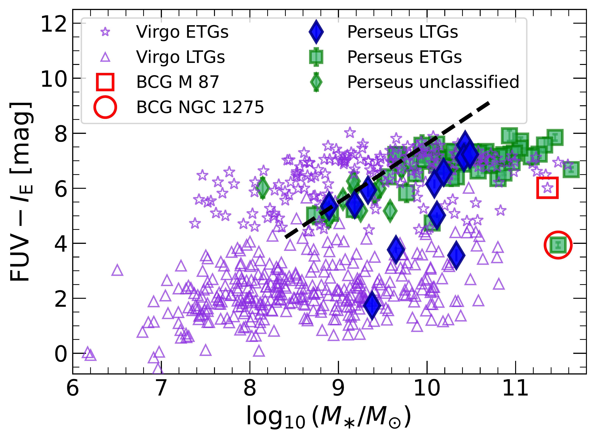
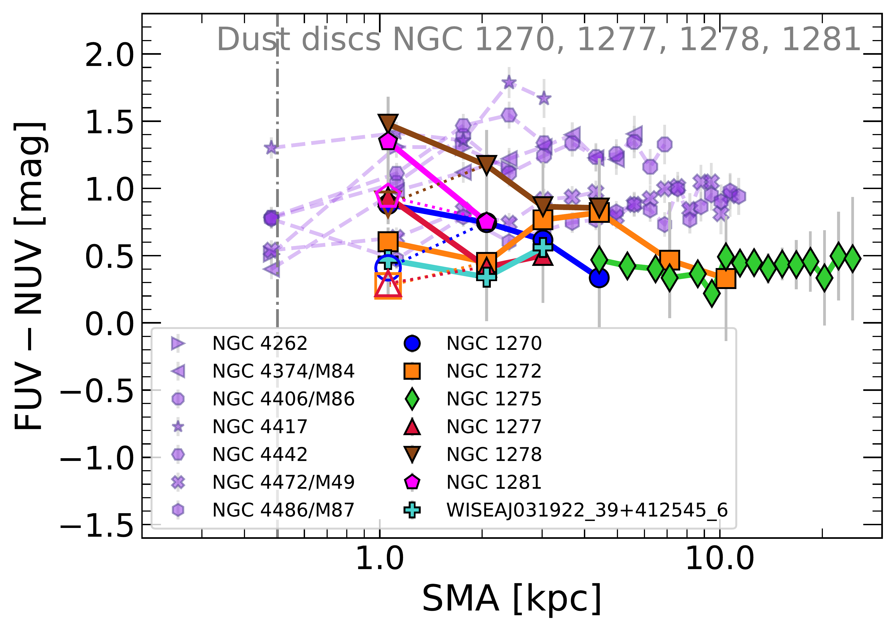
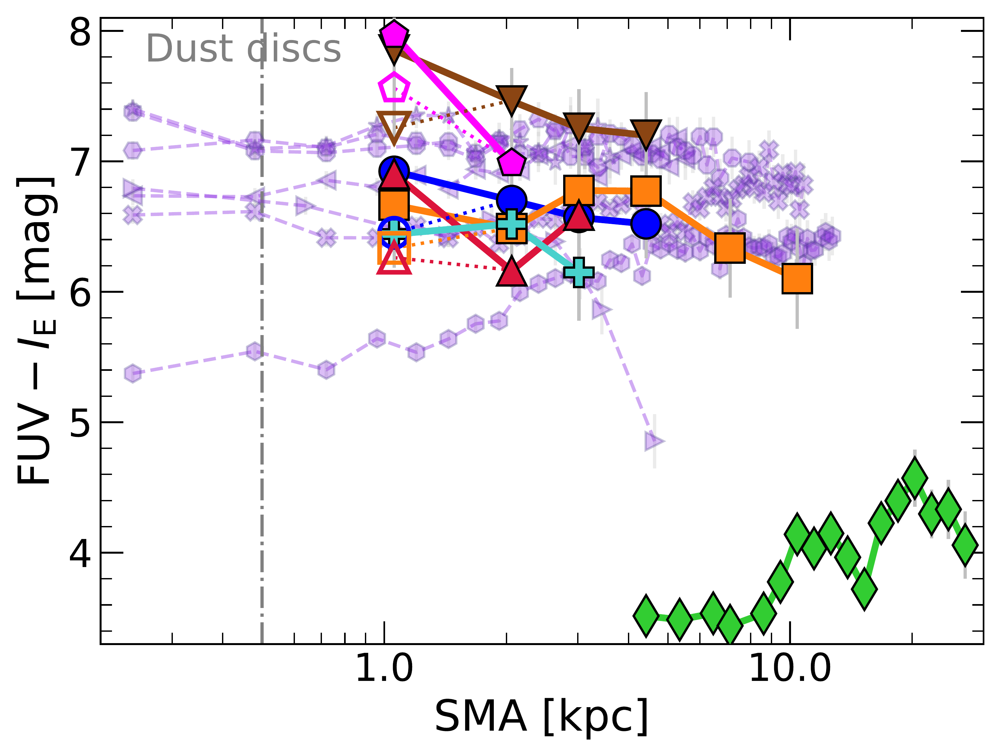
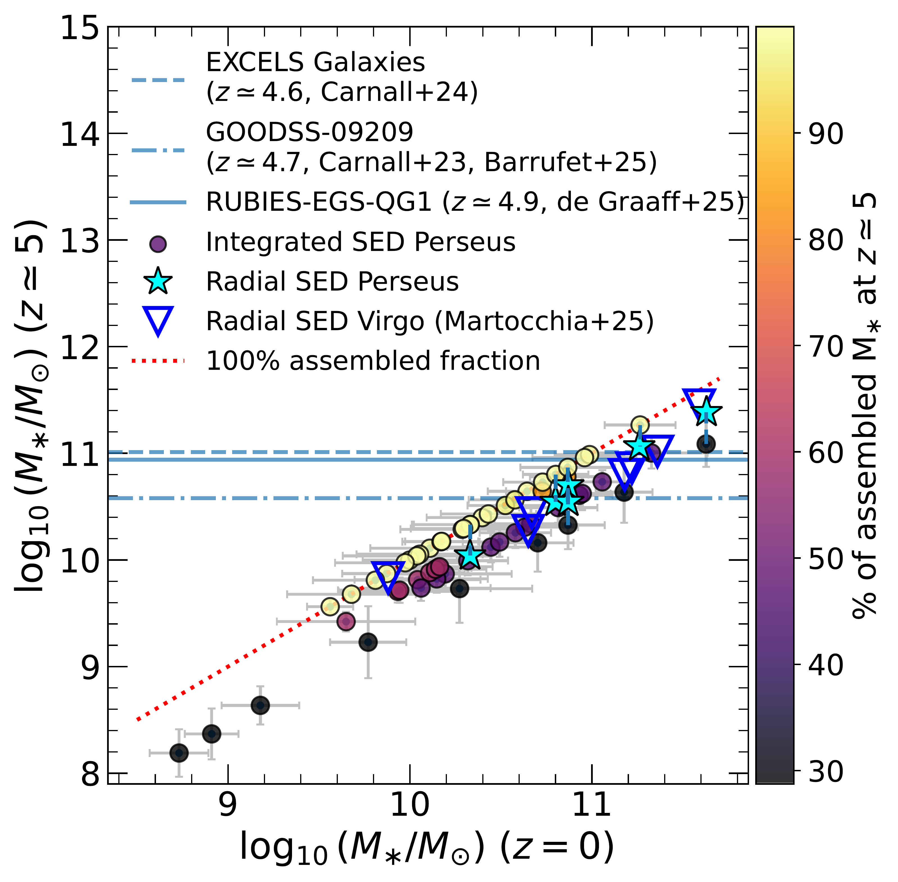

$\newcommand{\ensuremath}{}$
$\newcommand{\xspace}{}$
$\newcommand{\object}[1]{\texttt{#1}}$
$\newcommand{\farcs}{{.}''}$
$\newcommand{\farcm}{{.}'}$
$\newcommand{\arcsec}{''}$
$\newcommand{\arcmin}{'}$
$\newcommand{\ion}[2]{#1#2}$
$\newcommand{\textsc}[1]{\textrm{#1}}$
$\newcommand{\hl}[1]{\textrm{#1}}$
$\newcommand{\footnote}[1]{}$
$\newcommand{\red}[1]{\textcolor{red}{#1}}$
$\newcommand{\green}[1]{\textcolor{teal}{#1}}$
$\newcommand{\purple}[1]{\textcolor{violet}{#1}}$
$\newcommand{\orcid}[1]$
$\newcommand{\msun}{\ensuremath{M_\odot}\xspace}$
$\newcommand{\Ha}{{\ensuremath{\mathrm{H}\alpha}}\xspace}$
$\newcommand{\reff}{\ensuremath{R_{\rm eff}}\xspace}$

# $\Euclid$: Early Release Observations $-$ The star-formation history of massive early-type galaxies in the Perseus cluster$\thanks{This paper is published on behalf of the Euclid Consortium.}$

<mark>Appeared on: 2026-01-30</mark> -  _21 pages, 8 figures, accepted for publication in A&A_

S. Martocchia, et al. -- incl., <mark>K. Jahnke</mark>

**Abstract:** The $\Euclid$ Early Release Observations (ERO) programme targeted the Perseus galaxy cluster in its central region over 0.7 deg $^2$ . We combined the exceptional image quality and depth of the ERO-Perseus with FUV and NUV observations from GALEX and AstroSat/UVIT, as well as $ugriz\Ha$ data from MegaCam at the CFHT, to deliver FUV-to-NIR magnitudes of the 87 brightest galaxies within the Perseus cluster. We reconstructed the star-formation history (SFH) of 59 early-type galaxies (ETGs) within the sample, through the spectral energy distribution (SED) fitting code \texttt{CIGALE} and state-of-the-art stellar population (SP) models to reproduce the galactic UV emission from hot, old, low-mass stars (i.e. the UV upturn). In addition, for the six most massive ETGs in Perseus [ stellar masses $\log_{10}(\Mstellar/\msun) \geq 10.3$ ] , we analysed their spatially resolved SP and SFH through a radial SED fitting.  In agreement with our previous work on Virgo ETGs, we found that (i) the majority of the analysed galaxies needs the presence of an UV upturn component to explain their FUV emission, with average temperatures $\langle T_{\rm UV}\rangle \simeq 33 800$ K; (ii) the ETGs of Perseus have grown their stellar masses quickly, with star-formation timescales $\tau\lesssim 1500$ Myr.  We found that all ETGs in the sample have formed more than about 30 \% of their stellar masses at $z\simeq5$ , up to extreme fractions of $\simeq$ 100 \% . At $z\simeq5$ , the stellar masses of the most massive nearby ETGs, which have present-day stellar masses $\log_{10}(\Mstellar/\msun)\gtrsim 10.8$ , are then found to be comparable to those of the red quiescent galaxies observed by JWST at similar redshifts ( $z>4.6$ ).  This study can be extended to ETGs in the 14 000 deg $^2$ extragalactic sky that will soon be observed by $\Euclid$ , in combination with those from other major upcoming surveys (e.g. _Rubin_ /LSST), and UV observations, to ultimately assess whether the massive ETGs that we observe today represent the progeny of the massive high- $z$ JWST red quiescent galaxies.

**Figure 5. -** ${\rm FUV-NUV}$(*left*) and ${\rm FUV}-\IE$(*right*) colours as a function of stellar mass for the Perseus galaxies studied in this work and for the Virgo galaxies from the GUViCS data \citep{voyer14,boselli14}. Filled green squares (diamonds) indicate Perseus ETGs (unclassified) sources from \cite{meusinger20}. Filled blue diamonds are Perseus LTGs, while the open red circle represents the central galaxy of Perseus, namely NGC 1275. Purple open triangles indicate Virgo LTGs, while Virgo ETGs are represented by purple open stars. M87, the central of Virgo, is also highlighted with an open red square. Black dashed lines are the magnitude limit curves for each corresponding colour for the Perseus observations. Circular apertures are defined in the FUV band starting with a radius equal to the $\reff$ in \IE by \cite{EROPerseusOverview}. Apertures were adjusted when needed to fully encompass the FUV emission, and checked against the $\IE$ images to avoid contamination, as in \cite{voyer14}. We refer to Sect. \ref{subsec:integr} for more details. (*fig:fuv_nuv_integr*)

**Figure 6. -** ${\rm FUV-NUV}$(*left*) and ${\rm FUV}-\IE$(*right*) colours as a function of the semimajor axis in kpc. Empty symbols indicate the values of the central colours calculated when a mask is not applied. The dotted lines connect the central unmasked regions to the successive regions. See Sect. \ref{subsec:rad_analys} for more details. Perseus ETGs are indicated with solid lines, while Virgo ETGs from \cite{martocchia25} are represented by dashed lines and purple colours. The grey dash-dotted vertical line indicates the projected radius within which a disc of dust is observed in the $\IE$ images of NGC 1270, NGC 1277, NGC 1278 and NGC 1281, see Sect. \ref{subsec:dust}. (*fig:rad_UV*)

**Figure 1. -** Stellar mass at $z=0$ as a function of the estimated stellar mass at $z\simeq5$. Data are colour-coded by the fraction of assembled stellar mass by $z\simeq5$. The Perseus integrated sample is connected by vertical dashed blue lines to the results of the radial analysis (cyan stars). Open blue upside-down triangles indicate the radial results on Virgo massive ETGs by \cite{martocchia25}.
The red dotted line represents assembled fractions of 100\%, while the solid, dashed, and dot-dashed blue lines indicate the stellar masses found for red quiescent galaxies with JWST at $z>4.6$ by \cite{carnall23, carnall25}, \cite{degraaff25}, and \cite{barrufet25}. Compilation from \cite{antwi-danso23}. (*fig:integr_results*)

