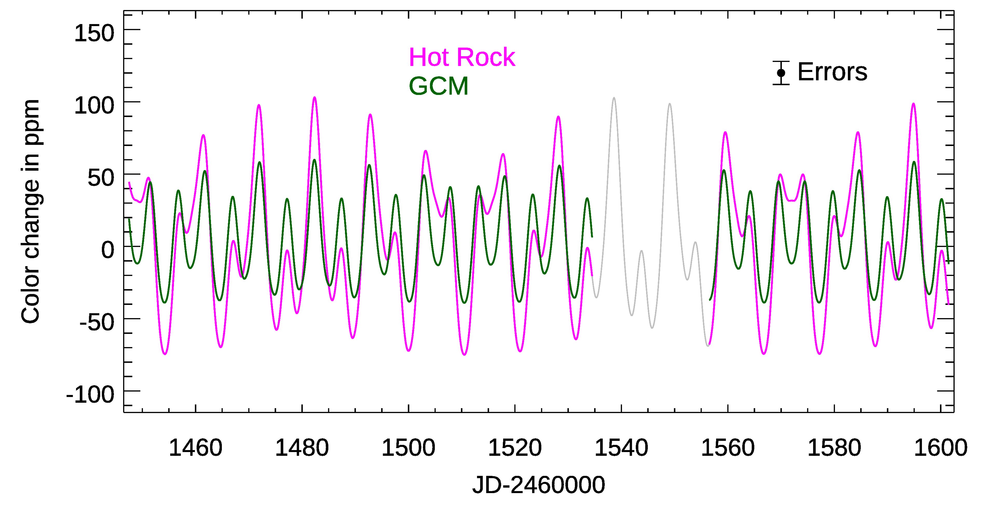
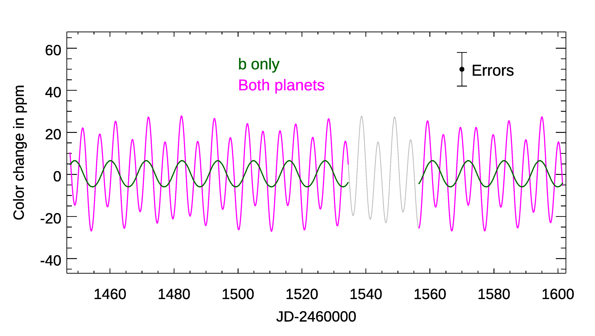
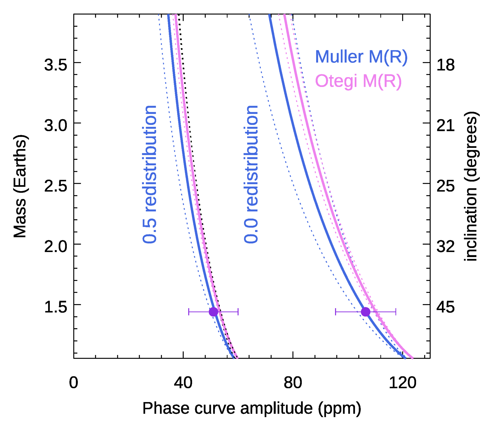

$\newcommand{\ensuremath}{}$
$\newcommand{\xspace}{}$
$\newcommand{\object}[1]{\texttt{#1}}$
$\newcommand{\farcs}{{.}''}$
$\newcommand{\farcm}{{.}'}$
$\newcommand{\arcsec}{''}$
$\newcommand{\arcmin}{'}$
$\newcommand{\ion}[2]{#1#2}$
$\newcommand{\textsc}[1]{\textrm{#1}}$
$\newcommand{\hl}[1]{\textrm{#1}}$
$\newcommand{\footnote}[1]{}$

# The Third Option: Color Phase Curves to Characterize the Atmospheres of Temperate Rocky Exoplanets

<mark>Appeared on: 2026-01-30</mark> -  _14 pages, 6 figures, submission to The Open Journal of Astrophysics_

D. Deming, et al. -- incl., <mark>L. Kreidberg</mark>

**Abstract:** Detecting and characterizing the atmospheres of rocky exoplanets has proven to be challenging for JWST.  Transit spectroscopy of the TRAPPIST-1 planets has been impacted by the effects of spots and faculae on the host star.  Secondary eclipses have detected hot rocks, but evidence for atmospheres has been difficult to obtain.  However, there is a third option that we call color phase curves.  This method will apply to synchronously rotating non-transiting planets as well as transiting planets.  A color phase curve uses photometry at a long-IR wavelength near the peak of the planetary thermal emission (e.g., 21 microns) divided by photometry at a shorter wavelength where the star dominates more strongly (e.g., 12 microns).  We avoid wavelengths having potentially strong molecular absorption (e.g., 15 microns) to minimize degeneracies in the color phase curve, and we aim to detect and characterize the planetary atmosphere via its longitudinal heat transfer.  The ratio of two wavelengths observed nearly simultaneously is designed to isolate thermal emission from the planet, discriminate against the star, and largely cancel instrumental systematic effects.  Moreover, we show that invoking mass-radius relations, and using self-consistent physical models, will permit the longitudinal heat transfer to be measured independent of the orbital inclination.  Radial velocity surveys are detecting many new exoplanets, including temperate rocky worlds with Earth-like masses. Most of those planets will not transit, but color phase curves have the potential to detect and characterize their atmospheres. \ \

**Figure 1. -** Color phase curves (CPCs) for the sum of planets 'b' and 'd' in the Proxima Centauri system.  The CPC is the ratio of the flux in the 21 $\mu$m to 12.8 $\mu$m JWST/MIRI filters, normalized to the stellar flux, with the median value subtracted from the normalized ratio. The CPCs are the sum of both planets, and are shown here for the 2027 visibility period for JWST (lighter when not visible).  Two cases are shown: using a hot rock model for 'b', and a GCM (see text).  Planet 'd' is modeled as a hot rock in both cases.   (*fig: curves1*)

**Figure 2. -** Color phase curves (CPCs) for planets 'b' and 'd' in the Proxima Centauri system, as in Figure \ref{fig: curves1}, except that the CPC for the 'b' planet is here also plotted separately, in addition to being summed with 'd'. Both planets are represented by the two-column model of \citet{lincowski_2023}(see text for description). (*fig: curves2*)

**Figure 5. -** Possible mass and orbital inclination of Proxima Centauri b as a function of the amplitude of the CPC (21- vs. 12.8 $\mu$m), where each curve is constrained by a mass radius relation.  The phase curve amplitudes (X-axis) are based on the toy models from \citet{kreidberg_2016}(see text). We adopt M(R) relations from \citet{otegi_2020} and \citet{muller_2024} in order to show that the result is not critically dependent on the exact form of M(R). Dotted lines show the $\pm1\sigma$ error ranges due to imprecision in M(R). Because the curves for different values of heat redistribution are nearly vertical, an observed CPC amplitude will intersect only a small range of heat redistribution values (see text).  (*fig: MRplot*)

