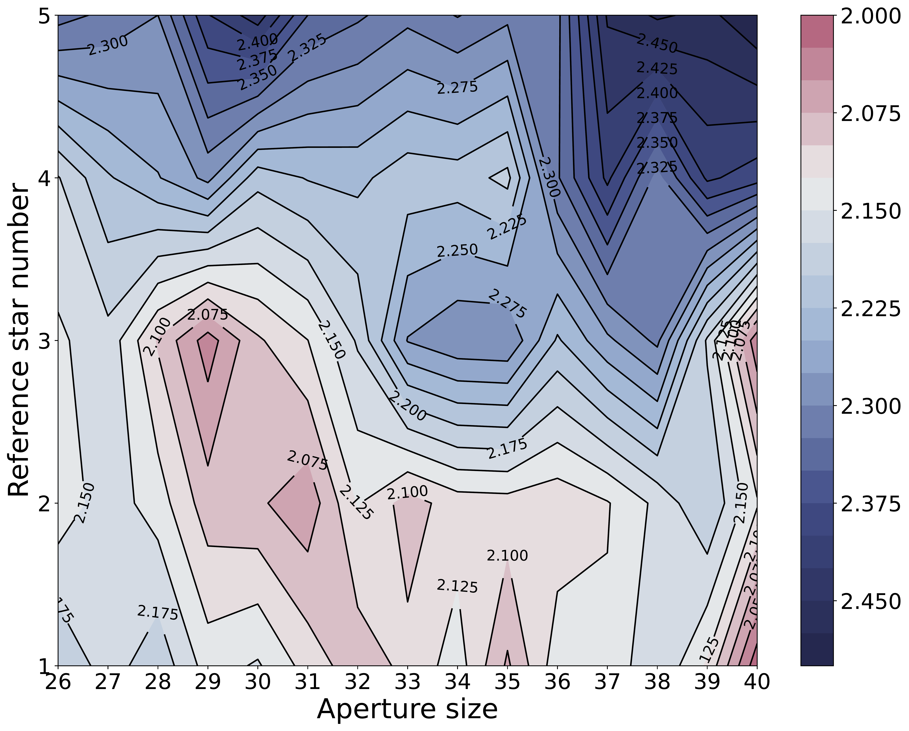

$\newcommand{\ensuremath}{}$
$\newcommand{\xspace}{}$
$\newcommand{\object}[1]{\texttt{#1}}$
$\newcommand{\farcs}{{.}''}$
$\newcommand{\farcm}{{.}'}$
$\newcommand{\arcsec}{''}$
$\newcommand{\arcmin}{'}$
$\newcommand{\ion}[2]{#1#2}$
$\newcommand{\textsc}[1]{\textrm{#1}}$
$\newcommand{\hl}[1]{\textrm{#1}}$
$\newcommand{\footnote}[1]{}$
$\newcommand{\namecn}[1]{\begin{CJK*}{UTF8}{gbsn}({#1})\end{CJK*}}$
$\newcommand$
$\newcommand$
$\newcommand$
$\newcommand$
$\newcommand$

# Thermal emission spectra of the ultra-hot Jupiter WASP-33 b

<mark>Appeared on: 2026-01-30</mark> -  _Accepted for publication in Astronomy and Astrophysics(12 pages, 16 figures, 5 tables)_

Q. Zou, et al. -- incl., <mark>T. Henning</mark>

**Abstract:** Observations of exoplanetary atmospheres provide critical insights into their chemical composition, formation and evolution history. Ultra-hot Jupiters serve as excellent targets for atmospheric characterization; studies of these planets may yield key understanding of gas giant's formation and evolution history. We present a thermal emission study of WASP-33 b's dayside atmosphere, based on two secondary eclipse observations with CFHT/WIRCam in two specific narrow band filters, namely the CO and CH4 $_{\rm on}$ filters, and archival data with HST/WFC3 and Spitzer. Stellar pulsations of the host star induce some quasi-periodic photometric variations, particularly in the CH4 $_{\rm on}$ band, which are modelled and corrected in the high-precision differential light curves. An eclipse depth of $1565.2^{+228.6}_{-237.5}$ ppm  and $914.3^{+56.1}_{-57.0}$ ppm is determined  for the CO and CH4 $_{\rm on}$ bands, respectively. Combined with HST/WFC3 and Spitzer data, our joint retrieval of WASP-33 b's dayside atmosphere reveals a high metallicity ( [ Fe/H ] $= 1.52^{+0.35}_{-0.52}$ ), high C/O ratio (C/O $= 0.78^{+0.03}_{-0.04}$ ), and a thermal inversion layer, suggesting a formation history involving metal-rich gas accretion. We confirm the presence of the molecules H $_{2}$ O, H $^{-}$ and CO, and report a tentative detection of TiO in the dayside atmosphere of WASP-33 b. Future higher precision observations with JWST may provide better understand constraints on the chemical abundances of oxygen and refractory element abundances to better WASP-33 b's formation and evolutionary pathway.

**Figure 3. -** The CO filter reduced full-frame WIRCam image of WSAP-33 taken on 25 October 2015. The target star is marked as the white square and the final chosen reference stars are marked as the grey circles. (*fig:image*)

**Figure 4. -** Normalized light curves of target star and the candidate reference stars.  (*fig:lc*)

**Figure 5. -** Contour maps of the normalized rms$*\beta^2$ distribution are superimposed on the two-dimensional parameter space defined by $D$ and $N_{\rm RSG}$ in the CO filter data. The pixel scale is 0.306 arcsec $\rm pixel^{-1}$. The minimum value of rms$*\beta^2$ is reached with $D=29$ and $N_{\rm RSG}=3$. (*fig:rmsbeta_CO*)

