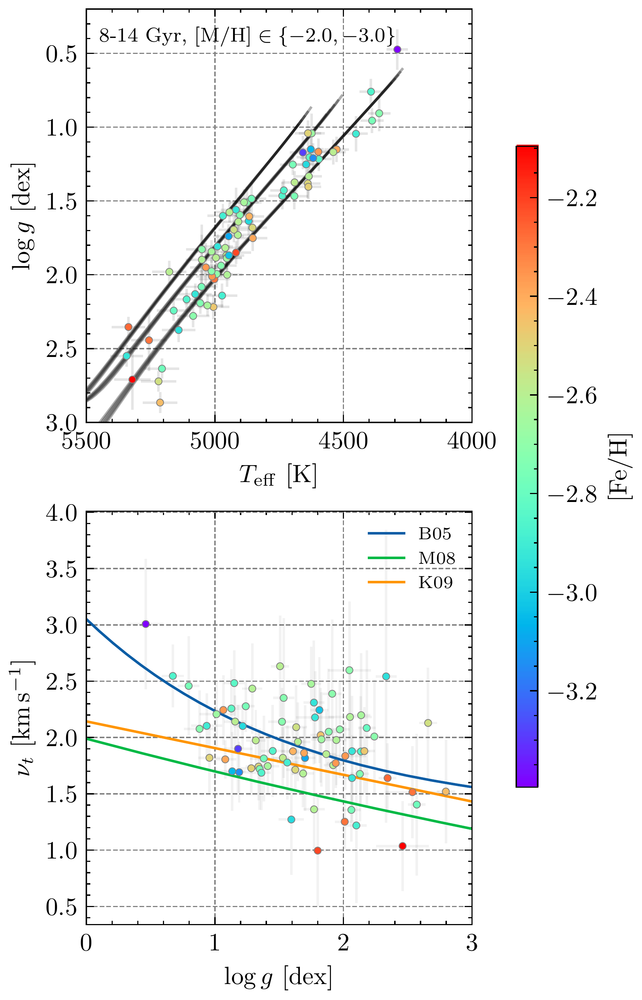
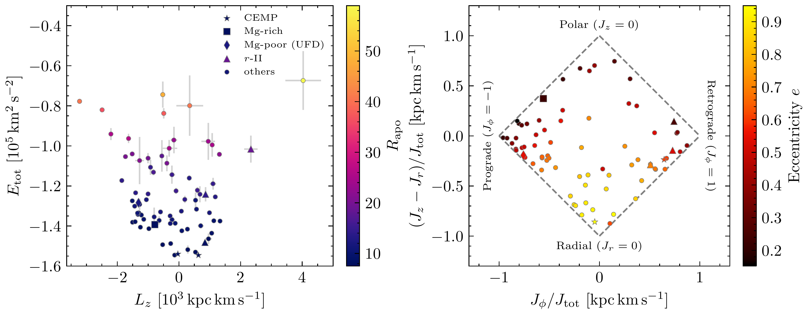

$\newcommand{\ensuremath}{}$
$\newcommand{\xspace}{}$
$\newcommand{\object}[1]{\texttt{#1}}$
$\newcommand{\farcs}{{.}''}$
$\newcommand{\farcm}{{.}'}$
$\newcommand{\arcsec}{''}$
$\newcommand{\arcmin}{'}$
$\newcommand{\ion}[2]{#1#2}$
$\newcommand{\textsc}[1]{\textrm{#1}}$
$\newcommand{\hl}[1]{\textrm{#1}}$
$\newcommand{\footnote}[1]{}$
$\newcommand{\documentname}{\textsl{Article}}$
$\newcommand{\sectionname}{Section}$
$\newcommand{\teff}{T_\mathrm{eff}}$
$\newcommand{\logg}{\log(g)}$
$\newcommand{\vt}{\nu_t}$
$\newcommand{\feh}{[\mathrm{Fe/H}]}$
$\newcommand{\mh}{[\mathrm{M/H}]}$
$\newcommand{\afe}{[\mathrm{\alpha/Fe}]}$
$\newcommand{\mgfe}{\([\mathrm{Mg/Fe}]\)}$
$\newcommand{\cafe}{\([\mathrm{Ca/Fe}]\)}$
$\newcommand{\sife}{\([\mathrm{Si/Fe}]\)}$
$\newcommand{\tife}{\([\mathrm{Ti/Fe}]\)}$

# Evaluating classifications of extremely metal-poor candidates selected from Gaia XP spectra

<mark>Appeared on: 2026-01-30</mark> -  _26 pages, 12 figures. Submitted to AJ_

R. Thai, et al. -- incl., <mark>H.-W. Rix</mark>

**Abstract:** $\noindent$ Extremely metal-poor stars are intrinsically rare, but emerging methods exist to accurately classify them from all-sky Gaia XP low-resolution spectra.	To assess their overall accuracy for targeting metal-poor stars, we present a high-resolution spectroscopic followup of 75 very metal-poor candidates selected from the catalog by R. Andrae, V. Chandra, and H. W. Rix.	We discover 2 new extremely metal-poor ( $\rm{[Fe / H]}<-3$ ) stars and 20 new very metal-poor ( $\rm{[Fe/H]} < -2$ ) stars.	Abundances of up to 22 elements are derived from 1D local thermodynamic equilibrium analysis and kinematic parameters are derived using Gaia astrometry and spectroscopic radial velocities.	The chemodynamical properties are mostly consistent with expectations for halo stars, but we discover an Mg-enhanced CEMP star ( $\mathrm{[Mg/Fe]} = 0.89$ ) and an Mg-poor star from an accreted ultra-faint dwarf galaxy.	The Gaia XP metallicity estimates are consistent with our $\rm{[Fe/H]}$ measurements down to $\rm{[Fe/H]}\sim -3.0$ , but estimates worsen in highly extincted regions.	We find that 4 other XP-based metallicity catalogs succeed in mitigating contaminants and can also classify metal-poor stars robustly to $\rm{[Fe/H]}\sim -3.0$ .	Our results demonstrate the utility of Gaia XP spectra for identifying the most metal-poor stars across the Galaxy.

**Figure 1. -** Stellar parameters for all analyzed compared to scaling relations. Top: effective temperature \( $\teff$ \) versus surface gravity \( \log g \) compared to MIST isochrones  (choiMesaIsochronesStellar2016)  of three different metallicities (\( $\feh$ = -2.0, -2.5, -3.0 \)). We generally recover slightly higher or lower \( $\teff$ \) and \( $\logg$ \) values than expected from the isochrones. Bottom: surface gravity \( \log g \) vs microturbulence \( \nu_{t} \) compared to the empirical scaling relations given in \citet[][B05]{barklemHamburgESORprocess2005}, \citet[][M08]{marinoSpectroscopicPhotometricEvidence2008}, and \citet[][K09]{kirbyMultielementAbundanceMeasurements2009}. (*fig:params*)

**Figure 2. -** Dark current is visible in the reduced data. An example master bias image overplotted with the echelle spectrograph order traces on the CCD detector for the FEROS spectrograph. Note the vertical streaks visible in orange. While the bias frame shows only an instantaneous read of the electron noise, the structure of the vertical streaks is consistent with dark current in both shape and magnitude. We find that these manifest in the emission-like features at the Eu II absorption line at 4129 Å  and across subsequent orders in matching positions along the wavelength solution of our reduced spectra. (*fig:dark*)

**Figure 3. -** Orbital and kinematic properties for our stars. Left: total energy versus angular momentum, colored by apastron distance \( R_{\mathrm{apo}} \). Right: action space, \( (J_{z} - J_{r}) / J_{\mathrm{tot}}\) against angular momentum fraction \( J_{\phi} / J_{\mathrm{tot}} \). Our orbital properties are consistent with expectations for halo VMP stars. CEMP stars, \( r \)-process enhanced stars, and magnesium unusual stars are highlighted per the legend. (*fig:kinematics*)

