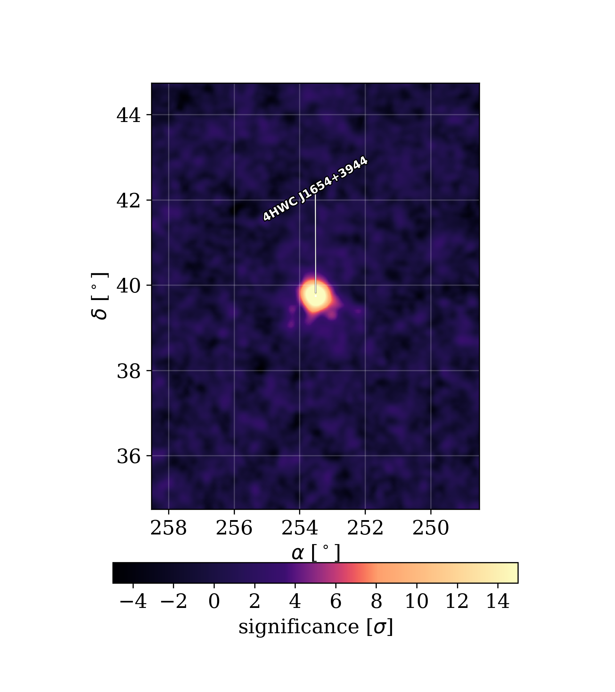
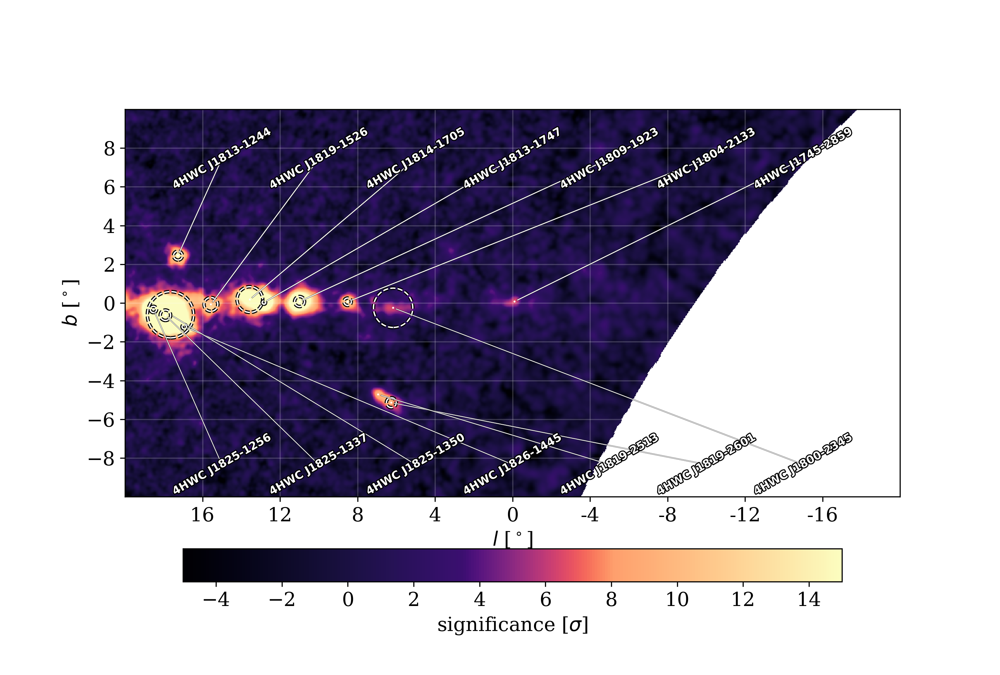
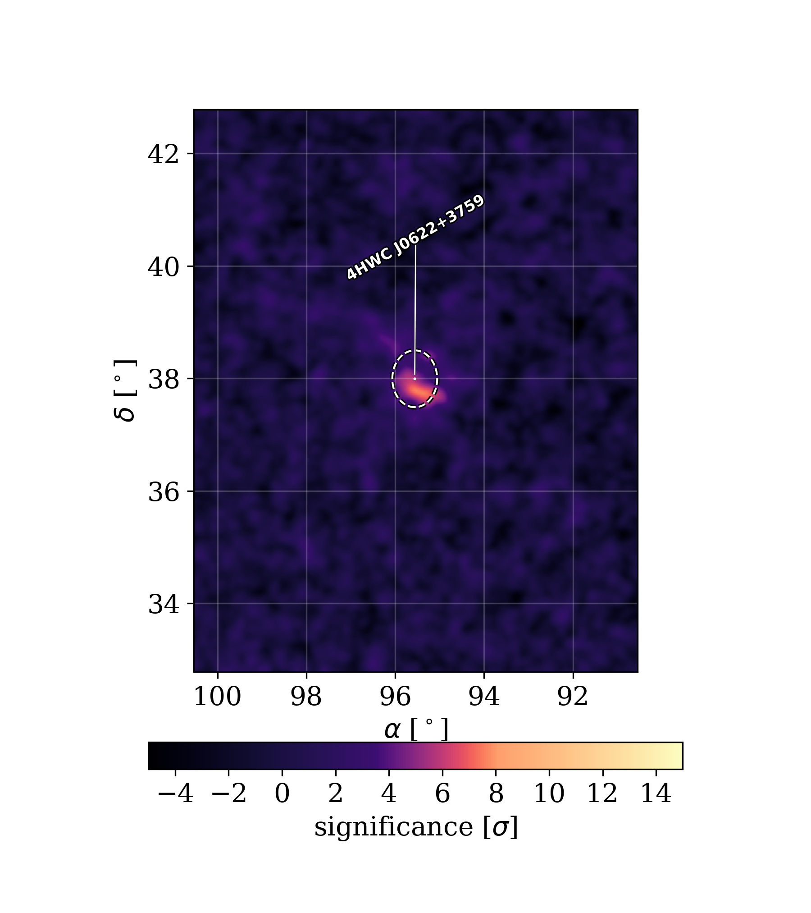

$\newcommand{\ensuremath}{}$
$\newcommand{\xspace}{}$
$\newcommand{\object}[1]{\texttt{#1}}$
$\newcommand{\farcs}{{.}''}$
$\newcommand{\farcm}{{.}'}$
$\newcommand{\arcsec}{''}$
$\newcommand{\arcmin}{'}$
$\newcommand{\ion}[2]{#1#2}$
$\newcommand{\textsc}[1]{\textrm{#1}}$
$\newcommand{\hl}[1]{\textrm{#1}}$
$\newcommand{\footnote}[1]{}$
$\newcommand{\vdag}{(v)^\dagger}$
$\newcommand$
$\newcommand$
$\newcommand{\Like}{\mathcal{L}}$
$\newcommand{\LogLike}[1]{\log{\left(\Like_{#1}\right)}}$

# The Fourth HAWC Catalog of Very-High-Energy Gamma-Ray Sources

<mark>Appeared on: 2026-02-03</mark> -  _27 pages, 21 figures, pending submission to The Astrophysical Journal_

R.~Alfaro, et al.

**Abstract:** We present an updated catalog of TeV gamma-ray sources based on the fifth pass of data from the High-Altitude Water Cherenkov (HAWC) Observatory. This release benefits from improved event reconstruction and nearly three additional years of observations. It also incorporates a systematic multi-source fitting framework, enabling more flexible and accurate modeling of the gamma-ray sky. This fitting procedure was modeled after the manual approach used in HAWC analyses of individual sources and regions as well as other gamma-ray catalogs, like the 4FGL. In addition to more varied modeling of source morphology and spectral parameters compared to previous HAWC catalogs, this catalog uses a robust modeling of Galactic diffuse TeV emission. The fitting procedure uses both point-like and symmetric Gaussian spatial templates to model the source morphology. The spectral shape of the emission is modeled with either a simple power-law or log-parabola to explore curvature in the spectral energy distribution. We report 85 sources at the 4 $\sigma$ level, including 11 sources not associated with any TeVCat source using a distance-based association criterion. Distance-based association with the 1LHAASO catalog results in 22 4HWC sources without a counterpart. Additionally, there are 12 sources not associated with any physical counterpart in the Low- or High-Mass X-Ray Binary, the ATNF, or _Fermi_ Pulsar, or SNR catalogs of sources. Five of the aforementioned sources have no counterpart in any of the catalogs searched and represent an opportunity for follow-up observations.

**Figure 6. -** HAWC significance map of region R.A. = 253.52◦ee \space and Dec. = 39.74◦ee \space with the 4HWC source overlaid as a dashed circle with radius equal to the extension parameter. A small dot represents the center of the source model emission. Map generated using a point-source assumption with a $-2.6$ power-law index. (*fig:Offplane7*)

**Figure 13. -** HAWC significance map of region $l$ = $-20$◦ee \space to $l$ = 20◦ee, $\lvert b \rvert <$ 10◦ee \space with the 4HWC sources overlaid as dashed circles with radius equal to the extension parameter. A small dot represents the center of the source model emission. Map generated using a point-source assumption with a $-2.6$ power-law index. The white or transparent portion of the map represents empty portions of the sky beyond the zenith cut of the data set. (*fig:Galplot1*)

**Figure 1. -** HAWC significance map of region R.A. = 95.54◦ee \space and Dec. = 37.78◦ee \space with the 4HWC source overlaid as a dashed circle with radius equal to the extension parameter. A small dot represents the center of the source model emission. Map generated using a point-source assumption with a $-2.6$ power-law index. (*fig:Offplane1*)

