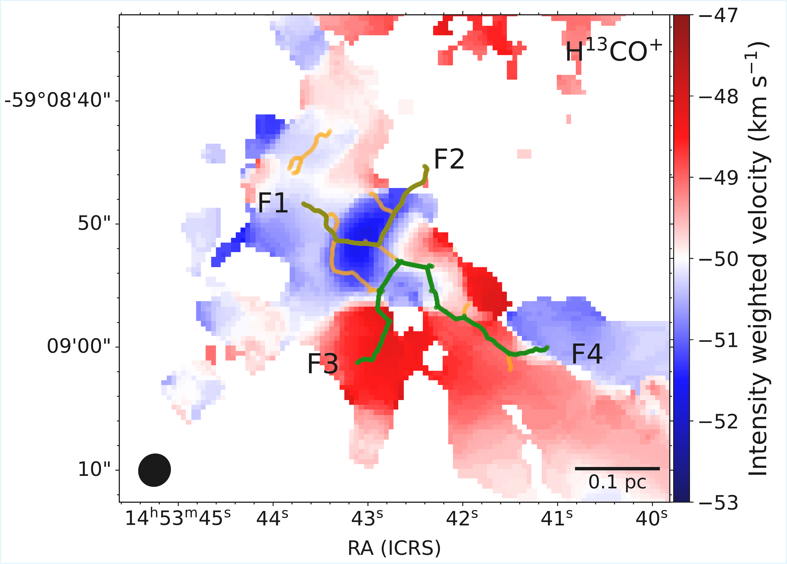

$\newcommand{\ensuremath}{}$
$\newcommand{\xspace}{}$
$\newcommand{\object}[1]{\texttt{#1}}$
$\newcommand{\farcs}{{.}''}$
$\newcommand{\farcm}{{.}'}$
$\newcommand{\arcsec}{''}$
$\newcommand{\arcmin}{'}$
$\newcommand{\ion}[2]{#1#2}$
$\newcommand{\textsc}[1]{\textrm{#1}}$
$\newcommand{\hl}[1]{\textrm{#1}}$
$\newcommand{\footnote}[1]{}$
$\newcommand{\vdag}{(v)^\dagger}$
$\newcommand$
$\newcommand$
$\newcommand{\thefigure}{A.\arabic{figure}}$
$\newcommand{\thetable}{A.\arabic{table}}$

# ATOMS-QUARKS survey: Inflow and infall in massive protocluster G318.049+00.086: Evidence of competitive accretion

<mark>Appeared on: 2026-02-03</mark> -  _22 pages, 15 figures, and 3 tables, accepted for publication in ApJ_

S. Gupta, et al. -- incl., <mark>F. Xu</mark>

**Abstract:** We present a gas kinematic study of the massive protocluster G318.049+00.086. The protocluster is reported to contain 12 prestellar core candidates and 4 protostellar cores. Filamentary structures are identified using the 1.3 mm dust continuum map, with four of them converge into a dense central region, forming a hub-filament system (HFS). High velocity gradients (10 - 20 km s $^{-1}$ pc $^{-1}$ ) derived from PV analysis of H $^{13}$ CO $^{+}$ emission along three of those filaments are suggestive of mass inflow onto the central hub. A mass inflow rate higher than $10^{3}$ M $_{\odot}$ Myr $^{-1}$ along the filaments is indicating that the central hub is capable of forming massive star(s). Investigation of H $^{13}$ CO $^{+}$ and CCH spectral profiles revealed the majority of the cores having the characteristic blue asymmetric line profiles, typical signature of gravitational collapse. The remaining few cores showed red asymmetric profiles, indicative of gas expansion. Also, the derived mass infall rates for the protostellar cores in hub-region is significantly higher in comparison to those located along the filaments. The mass-radius relationship of the cores revealed that the cores with red profiles reside in the massive star formation regime. However, the global velocity gradient along the filaments suggests that these particular cores are losing material to the hub. Our results are supporting a competitive accretion scenario of massive star formation where gas is expected to be funnelled from less gravitationally dominant cores to the cores located at the gravitationally favorable position.

**Figure 4. -** The upper panel shows the PV diagram along the filament path F1 and F2, and the lower panel shows the PV along F3 and F4. The PV diagrams are uniformly sampled along the filament skeletons with a step size of 0.016 pc, corresponding to half of the synthesized beam size at the source distance. The velocity error bars represent the standard deviation of the velocities within each sampled bin along the offset. The vertical-dashed line in each panel marks the position of the hub. The orange, purple and red lines indicate the least squares fit to F1, F3 and F4 segments of the PV diagrams in both the panels, respectively. (*fig:vel_grad*)

**Figure 1. -** (a) The identified H$^{13}$CO$^{+}$ filaments overlaid on the moment 0 map of H$^{13}$CO$^{+}$ above the $5\sigma$ level. The red colored filament marks the longest filament and the green shows other filaments present in the region. (b) Displays the filaments (orange lines) identified in the 1.3 mm continuum emission overlaid on the 1.3 mm dust continuum map of the protocluster. The primary filaments are also labeled as F1, F2, F3, and F4. (c) Overlay of H$^{13}$CO$^{+}$  and 1.3 mm  filaments on H$^{13}$CO$^{+}$ moment 0. In all the panels, the identified cores by \citet{2024ApJS..270....9X} are shown and labeled. (*fig:filament*)

**Figure 3. -** Filaments identified in the 1.3 mm continuum emission overlaid on the moment 1 map of H$^{13}$CO$^{+}$(1--0). The olive and green colors mark the primary filament paths (i.e., F1-F2 and F3-F4, respectively) used to derive the PV diagrams. (*fig:moment1*)

