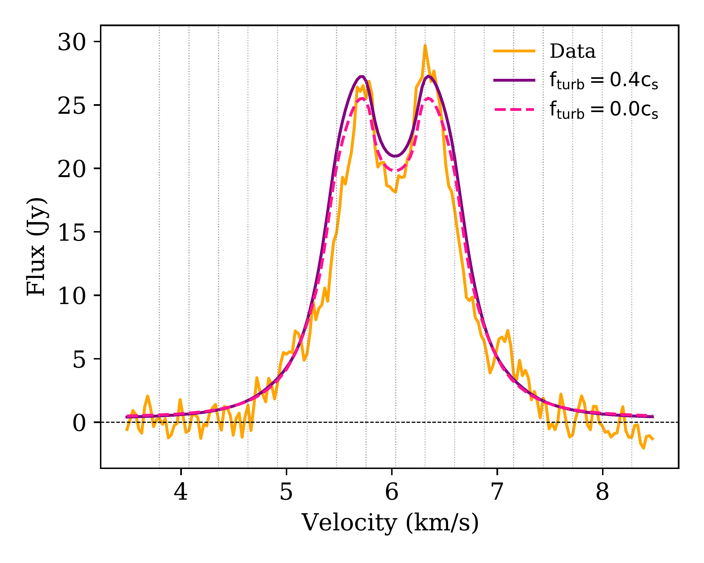
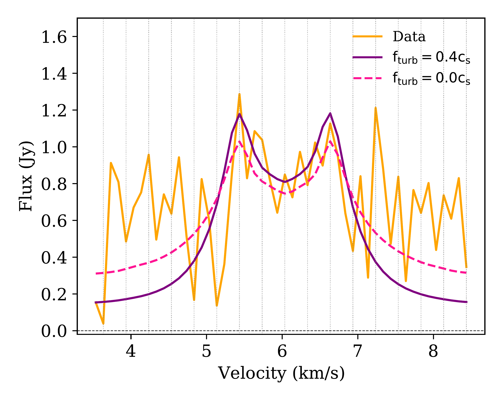

$\newcommand{\ensuremath}{}$
$\newcommand{\xspace}{}$
$\newcommand{\object}[1]{\texttt{#1}}$
$\newcommand{\farcs}{{.}''}$
$\newcommand{\farcm}{{.}'}$
$\newcommand{\arcsec}{''}$
$\newcommand{\arcmin}{'}$
$\newcommand{\ion}[2]{#1#2}$
$\newcommand{\textsc}[1]{\textrm{#1}}$
$\newcommand{\hl}[1]{\textrm{#1}}$
$\newcommand{\footnote}[1]{}$
$\newcommand{\vdag}{(v)^\dagger}$
$\newcommand$
$\newcommand$
$\newcommand{\Msun}{\ensuremath{{M}_{\odot}}}$
$\newcommand{\Lsun}{\ensuremath{{\rm L_{\odot}}}}$
$\newcommand{\Rsun}{\ensuremath{{\rm R_{\odot}}}}$
$\newcommand{\Mjup}{{\rm M}_{\rm Jup}}$
$\newcommand{\ih}[1]{\textcolor{blue}{\textbf{IH:} #1}}$
$\newcommand{\ch}[1]{\textcolor{purple}{\textbf{CH:} #1}}$
$\newcommand{\cass}[1]{\textcolor{teal}{\textbf{Cass:} #1}}$
$\newcommand{\td}[1]{\textcolor{cyan}{\textbf{TD:} #1}}$
$\newcommand{\tom}[1]{\textcolor{magenta}{\textbf{TH:} #1}}$
$\newcommand{\cp}[1]{\textcolor{red}{\textbf{CP:} #1}}$
$\newcommand{\red}[1]{\textcolor{red}{#1}}$

# exoALMA XIX: Confirmation of non-thermal line broadening in the DM Tau protoplanetary disk

<mark>Appeared on: 2026-02-03</mark> -  _18 pages, 11 figures, published in ApJ Letters_

C. Hardiman, et al. -- incl., <mark>I. Hammond</mark>, <mark>M. Flock</mark>, <mark>M. Benisty</mark>, <mark>D. Fasano</mark>

**Abstract:** Turbulence is expected to transport angular momentum and drive mass accretion in protoplanetary disks. One way to directly measure turbulent motion in disks is through molecular line broadening.DM Tau is one of only a few disks with claimed detection of non-thermal line broadening of 0.25--0.33 $c_{\rm s}$ , where $c_{\rm s}$ is the sound speed.Using the radiative transfer code ${\sc mcfost}$ within a Bayesian inference framework that evaluates over five million disk models to efficiently sample the parameter space, we fit high-resolution ( $0\farcs15$ , 28 m s $^{-1}$ ) $^{12}$ CO $J = 3 - 2$ observations of DM Tau from the exoALMA Large Program.This approach enables us to simultaneously constrain the disk structure and kinematics, revealing a significant non-thermal contribution to the line width of $\sim$ 0.4 $c_{\rm s}$ , inconsistent with purely thermal motions.Using the CO-based disk structure as a starting point, we reproduce the CS $J = 7 - 6$ emission well, demonstrating that the CS (which is more sensitive to non-thermal motions than CO) agrees with the turbulence inferred from the CO fit.Establishing a well-constrained background disk model further allows us to identify residual structures in the moment maps that deviate from the expected emission, revealing localized perturbations that may trace forming planets.This framework provides a powerful general approach for extracting disk structure and non-thermal broadening directly from molecular line data, and can be applied to other disks with high-quality observations.

**Figure 3. -** Comparison of observed and modeled integrated line profiles for DM Tau. _Left_: CO $J$=3–2 line profile. _Right_: CS $J$=7–6 line profile. The vertical dotted lines on each panel mark the velocity channels included in the fit. The agreement for CS demonstrates that the CO-derived disk structure can be directly applied to other molecular tracers, allowing differences in emission to be interpreted primarily in terms of chemistry and excitation rather than large-scale structural variations. (*fig: lineprofiles*)

**Figure 2. -** Channel maps of DM Tau in $^{12}$CO $J$=3–2 at 0$\farcs$15 resolution. The top row shows the observed data, the second row our best-fit model with non-zero turbulence, and the third row the residuals from subtracting this model from the data. The fourth and fifth rows show the model and residuals for the best fit zero-turbulence model for comparison. Each residual color bar spans $\pm3\sigma$ flux for the data cube. (*fig:image best CO*)

**Figure 4. -** CO number density in DM Tau. The cyan and magenta dashed lines show the exoALMA-derived emission heights from \citet{Galloway-Sprietsma_exoALMA} using DiscMiner and \texttt{disksurf}. _Left_: $J=2-1$ model from \citet{flaherty20}. _Right_: Our $J=3-2$ model. (*fig:emitting layers co*)

