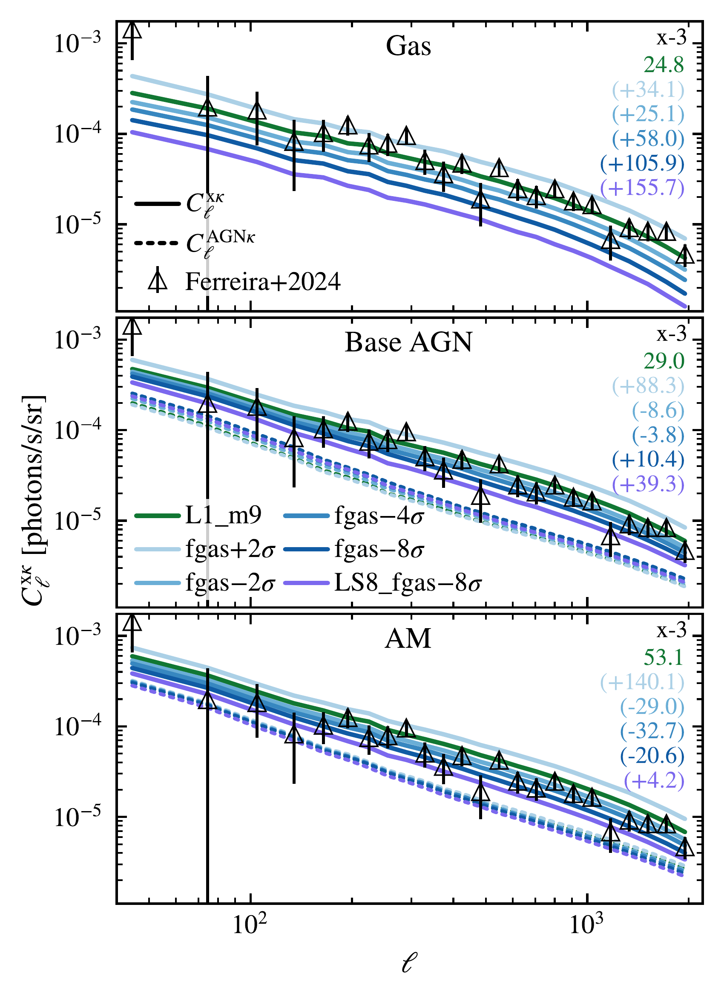
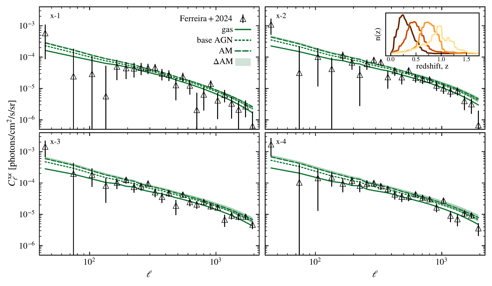

$\newcommand{\ensuremath}{}$
$\newcommand{\xspace}{}$
$\newcommand{\object}[1]{\texttt{#1}}$
$\newcommand{\farcs}{{.}''}$
$\newcommand{\farcm}{{.}'}$
$\newcommand{\arcsec}{''}$
$\newcommand{\arcmin}{'}$
$\newcommand{\ion}[2]{#1#2}$
$\newcommand{\textsc}[1]{\textrm{#1}}$
$\newcommand{\hl}[1]{\textrm{#1}}$
$\newcommand{\footnote}[1]{}$
$\newcommand{\arraystretch}{1.4}$
$\newcommand{\arraystretch}{1.3}$
$\newcommand{\thebibliography}{\DeclareRobustCommand{\VAN}[3]{##3}\VANthebibliography}$

# The FLAMINGO Project: Exploring the X-ray--cosmic-shear cross-correlation as a probe of large-scale structure

<mark>Appeared on: 2026-02-03</mark> - 

W. McDonald, et al. -- incl., <mark>J. Braspenning</mark>

**Abstract:** Baryonic feedback processes associated with galaxy formation directly influence the large-scale structure by redistributing gas. Recent measurements of the kinetic Sunyaev-Zel’dovich effect and stacks of X-ray emission from optically selected galaxy clusters suggest that feedback from Active Galactic Nuclei (AGN) is more efficient at expelling gas from low-mass clusters than previously thought. The measurement of the cross-correlation between cosmic shear and diffuse X-ray emission provides a new probe of the distribution of gas in groups and clusters. We use the FLAMINGO cosmological, hydrodynamical simulations to examine the X-ray--cosmic-shear cross-correlation. The cross-correlation is most sensitive to the distribution of gas in haloes with masses $10^{14}\leq M_{200\mathrm{c}}/\mathrm{M}_{\odot}\leq10^{15}$ . It is sensitive to the strength of feedback, but the effects of variations in cosmology and baryonic physics are largely degenerate. We compare the FLAMINGO predictions with the cross-correlation between cosmic shear from the Dark Energy Survey and ROSAT all-sky X-ray maps.  We find that, if we neglect the X-ray emission from AGN that would remain unresolved by ROSAT, then the fiducial FLAMINGO model is in excellent agreement with the data, while models with stronger or weaker feedback are ruled out. However, if we account for unresolved AGN, either using the direct FLAMINGO predictions or by abundance matching to the observed (extrapolated) AGN luminosity function, then models with stronger feedback are preferred. We conclude that to exploit the potential of the X-ray--lensing cross-correlation, it will be necessary to resolve fainter AGN, and to use external constraints to break the degeneracy between baryonic feedback and cosmology.

**Figure 4. -** 
    The predicted ROSAT--DES-Y3 X-ray–lensing cross-correlation, in the third tomographic bin (x-3), for the gas fraction variations (fgas$\pm N\sigma$) and fiducial L1$\_$m9 simulation (solid curves) compared to the measurements of \citet[][]{Ferreira_2024}(black points and error bars). All X-ray emission is convolved with the ROSAT response matrix. _Top_: The predicted cross-correlation when only the X-ray emission from hot gas is included._Centre_: We include the X-ray emission from both hot gas and unresolved AGN given by the base BHs. _Bottom_: The same as the centre panel, but the AGN contamination is given by the AM BHs. The base BHs and AM BHs are described in \S\ref{sec:BH_luminosities_and_selection}. The dotted curves give the cross-correlation of the X-ray emission from each set of unresolved AGN and DES-Y3 all-sky maps ($C_{\ell}^{\mathrm{AGN} \kappa}$) for the simulation of the corresponding colour. The $\chi^2$ value of the cross-correlation, in the third tomographic bin, for the fiducial L1$\_$m9 simulation (dark green) and the observational data is printed on the right hand side of each panel. The values in parentheses are the $\Delta \chi^2$(see text) for each cluster gas fraction (indicated by colour).The inclusion of unresolved AGN increases the power of the cross-correlation and more so for the AM BHs.  (*figure:convolved_native_agn_example*)

**Figure 21. -** 
    The cosmology and baryonic feedback dependence of the predicted X-ray--lensing cross-correlation.
    In each main panel, the coloured curves correspond to the predicted cross-correlations in the third tomographic bin (x-3) for the different L1$\_$m9  simulations as indicated by the legend (see \S\ref{sec:flamingo_overview} and Table \ref{tab:cosmo_table}). The lower sub-panels compare the variations
    to the fiducial L1$\_$m9 (dark green) simulation (i.e. $C_{\ell}^{\mathrm{x} \kappa }/\mathrm{L1}\_\mathrm{m9}$).
    Note we only consider the X-ray emission from hot gas and do not convolve the X-ray emission with the response matrix of any telescope.
    _Left_: The dependence on the cluster gas fraction ($\mathrm{fgas}$) that the model has been calibrated to.
    Reducing the cluster gas fraction (mainly by increasing the strength of AGN feedback) suppresses the power of the cross-correlation over all angular scales considered.
    _Centre_: The predicted cross-correlations for the remaining baryonic feedback variations.
    Reducing the stellar mass function suppresses the signal on all scales, however this effect is secondary to varying the cluster gas fraction.
    The choice of AGN feedback model (jet or thermal mode of feedback) has a very minor scale-dependent effect.
    _Right_: The dependence on cosmology and neutrino mass.
    The cross-correlation for the LS8 cosmology is suppressed relative to the fiducial model over all scales shown. Reducing the cluster gas fraction for the LS8 cosmology (LS8$\_\mathrm{fgas}-8\sigma$) further suppresses the signal.
    Increasing the summed neutrino mass relative to the fiducial value ($0.06$ eV) reduces the power over all scales shown.
    Comparing between the three panels, it is clear that the effects of varying the cosmology and baryonic feedback are largely degenerate.
     (*figure:normalised_diffuse_gas_example*)

**Figure 20. -** The predicted ROSAT--DES-Y3 X-ray--lensing cross-correlation from the L1$\_$m9 fiducial FLAMINGO simulation (green curves) compared to the observational data points of \citet[][]{Ferreira_2024}(black points and error bars). The numbers in the upper left corner of each panel indicate the DES-Y3 tomographic bin of the shown cross-correlations (e.g. x-1, indicates the cross-correlation of the X-ray signal with the first tomographic bin of the lensing data). Here, the X-ray emission of the L1$\_$m9 simulation is convolved with the ROSAT response matrix (see \S\ref{sec:Xray_diffuse_gas_lightcone_methods}). The solid curves correspond to the predicted cross-correlation if only the X-ray emission from hot gas is included, i.e. it is contamination free. The dotted curves include the X-ray emission from unresolved AGN given by the base FLAMINGO BHs. The dashed curves (AM) depict the AGN contaminated cross-correlations when the unresolved AGN are given by the AM BHs. The shaded regions ($\Delta{\mathrm{AM}}$) indicate the full range of possible cross-correlations from minimising and maximising the AGN contamination given by the $\Delta{\mathrm{AM}}$ BHs as described in the text. All sets of BHs (base, AM and $\Delta\mathrm{AM}$) are described in \S\ref{sec:BH_luminosities_and_selection}). The inset in the top right panel depicts the normalised DES-Y3 source distribution, given by figure 2. of \citet[][]{Doux_2022}, and each tomographic bin (1 through 4, moving left to right) is individually coloured. Without the inclusion of unresolved AGN the simulation reproduces the measurements. However, AGN contamination increases the power of the cross-correlation over all angular scales considered, reducing the agreement with the data. (*figure:plot_1*)

