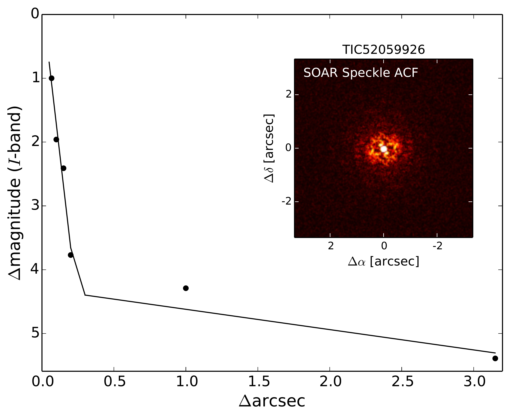

$\newcommand{\ensuremath}{}$
$\newcommand{\xspace}{}$
$\newcommand{\object}[1]{\texttt{#1}}$
$\newcommand{\farcs}{{.}''}$
$\newcommand{\farcm}{{.}'}$
$\newcommand{\arcsec}{''}$
$\newcommand{\arcmin}{'}$
$\newcommand{\ion}[2]{#1#2}$
$\newcommand{\textsc}[1]{\textrm{#1}}$
$\newcommand{\hl}[1]{\textrm{#1}}$
$\newcommand{\footnote}[1]{}$
$\newcommand{\bjdtdb}{\ensuremath{\rm{BJD_{TDB}}}}$
$\newcommand{\feh}{\ensuremath{\left[{\rm Fe}/{\rm H}\right]}}$
$\newcommand{\teff}{\ensuremath{T_{\rm eff}}}$
$\newcommand{\ecosw}{\ensuremath{e\cos{\omega_\star}}}$
$\newcommand{\esinw}{\ensuremath{e\sin{\omega_\star}}}$
$\newcommand{\msun}{\ensuremath{ M_\Sun}}$
$\newcommand{\rsun}{\ensuremath{ R_\Sun}}$
$\newcommand{\lsun}{\ensuremath{ L_\Sun}}$
$\newcommand{\mbd}{\ensuremath{ {\rm M_{BD}}}}$
$\newcommand{\mj}{\ensuremath{ {\rm M_{Jup}}}}$
$\newcommand{\rj}{\ensuremath{ {\rm R_{Jup}}}}$
$\newcommand{\me}{\ensuremath{ {\rm M_E}}}$
$\newcommand{\re}{\ensuremath{ {\rm R_E}}}$
$\newcommand{\mst}{\ensuremath{ {\rm M_\odot}}}$
$\newcommand{\rst}{\ensuremath{ {\rm R_\odot}}}$
$\newcommand{\lst}{\ensuremath{ {\rm L_\odot}}}$
$\newcommand{\fave}{\langle F \rangle}$
$\newcommand{\fluxcgs}{10^9 erg s^{-1} cm^{-2}}$
$\newcommand{\arcsec}{^{\prime \prime}}$
$\newcommand{\tess}{\textit{TESS}}$
$\newcommand{\pytransit}{\texttt{PyTransit}}$
$\newcommand{\ldtk}{\texttt{LDTK}}$
$\newcommand{\celerite}{\texttt{Celerite}}$
$\newcommand{\rebound}{\texttt{REBOUND}}$
$\newcommand{\whfast}{\texttt{WHFAST}}$
$\newcommand{\ias}{\texttt{IAS15}}$

# Unraveling the Brown Dwarf Desert: Four New Discoveries and a Unifying, Period-Coded Picture$\thanks$ 

<mark>Appeared on: 2026-02-04</mark> -  _17 pages, 14 figures, submitted to Astronomy & Astrophysics_

J. Šubjak, et al. -- incl., <mark>T. Henning</mark>

**Abstract:** We present four newly validated transiting brown dwarfs identified through _TESS_ photometry and confirmed with high-precision radial velocity measurements obtained from the FEROS and PLATOSpec spectrographs. Notably, three of these companions exhibit orbital periods exceeding 100 days, thereby expanding the sample of long-period transiting brown dwarfs from two to five systems. The host stars of long-period brown dwarfs show mild subsolar metallicity. These discoveries highlight the expansion of the metal-poor, long-period distribution and help us better understand the brown dwarf desert. In our comparative analysis of eccentricity and metallicity demographics, we utilize catalogues of long-period giant planets, brown dwarfs, and low-mass stellar companions. After accounting for tidal influences, the eccentricity distribution aligns with that of low-mass stellar binaries, presenting a different profile than that observed within the giant planet population. Additionally, the metallicity of the host stars reveals a noteworthy trend: short-period transiting brown dwarfs are predominantly associated with metal-rich stars, whereas long-period brown dwarfs are more often found around metal-poor stars, demonstrating statistical similarities to low-mass stellar hosts. This trend has also been previously observed in studies of hot and cold Jupiters and points to a period-coded mixture of channels. A natural explanation is that most brown dwarfs originate from fragmentation at wider separations, with long-period systems retaining this stellar-like imprint, while only those embedded in massive, long-lived, metal-rich protoplanetary discs are efficiently delivered and stabilised to short orbits.

**Figure 9. -** The population of known transiting brown dwarfs. We filtered out objects with large uncertainties in mass or radius. Star symbols highlight the positions of our systems. The plot is color-coded by orbital period. The mass-radius tracks from ... are utilized. (*fig:mr*)

**Figure 12. -** Generalized Lomb-Scargle periodograms of FEROS RVs of stars in our sample from top to bottom: (a) TIC 9344899 RVs, (b) TIC 9344899 RVs minus transiting planet signal, (c) TIC 52059926 RVs, (d) TIC 52059926 RVs minus planet signal, (e) TIC 13344668 RVs, (f) TIC 13344668 RVs minus planet signal. The vertical red lines highlight the orbital period of the companions. Horizontal dashed lines show the theoretical FAP levels of 10\%, 1\%, and 0.1\% for each panel. (*fig:per*)

**Figure 1. -** SOAR contrast curve for Cousins $I$ band with a $6$\arcsec$ \times 6$\arcsec$$ reconstructed image of the field. (*fig:speckle_image*)

