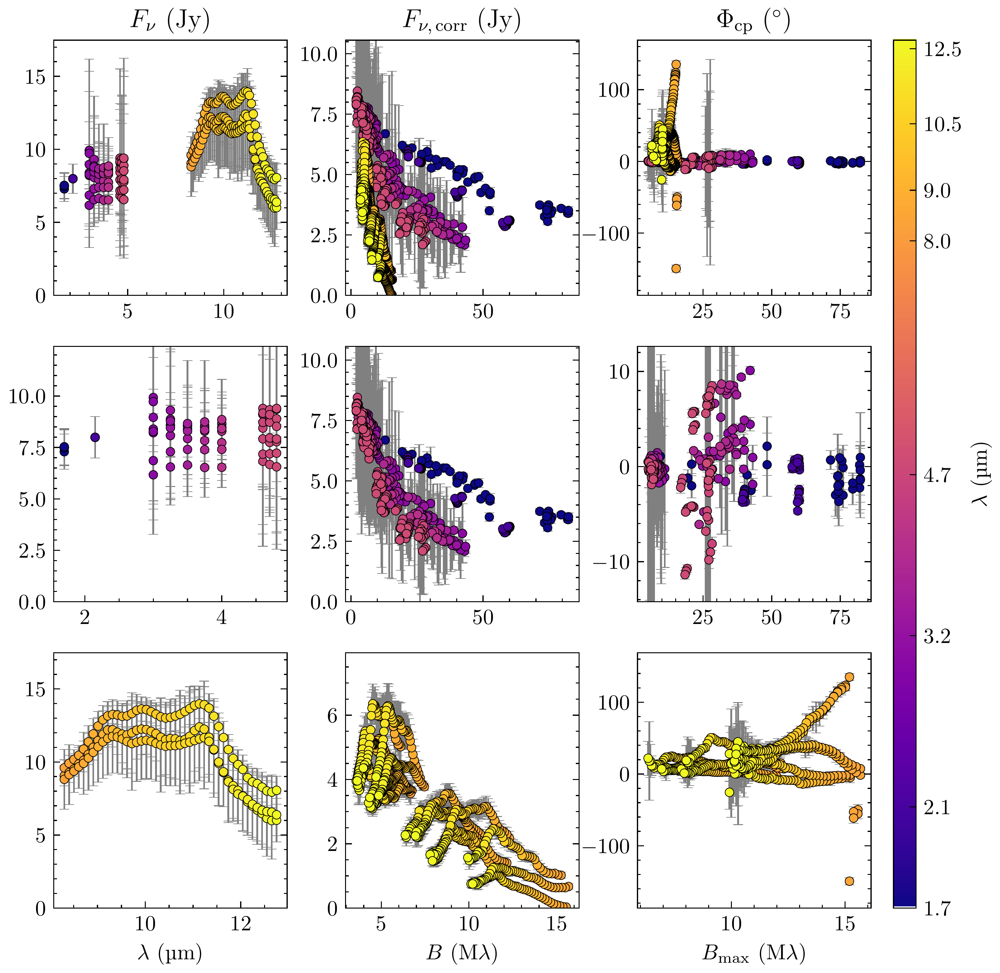
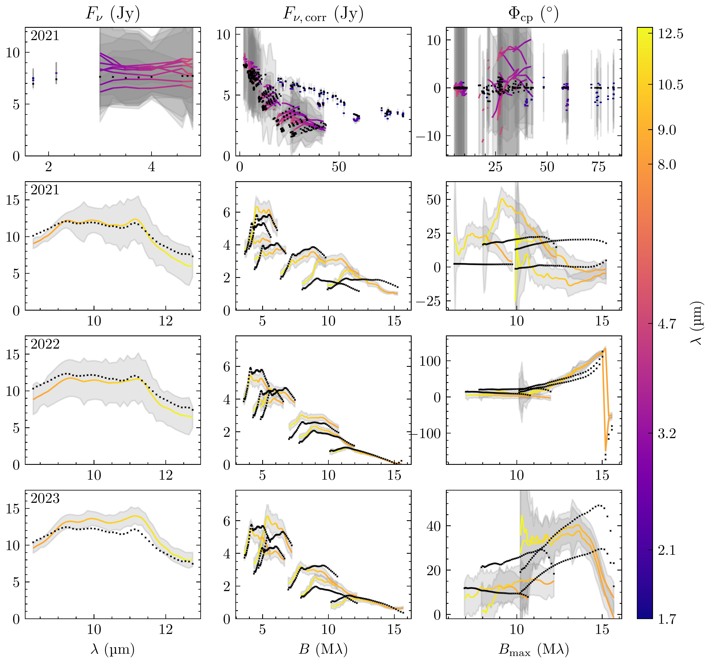
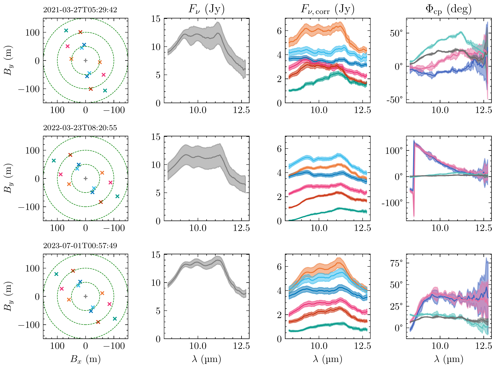

$\newcommand{\ensuremath}{}$
$\newcommand{\xspace}{}$
$\newcommand{\object}[1]{\texttt{#1}}$
$\newcommand{\farcs}{{.}''}$
$\newcommand{\farcm}{{.}'}$
$\newcommand{\arcsec}{''}$
$\newcommand{\arcmin}{'}$
$\newcommand{\ion}[2]{#1#2}$
$\newcommand{\textsc}[1]{\textrm{#1}}$
$\newcommand{\hl}[1]{\textrm{#1}}$
$\newcommand{\footnote}[1]{}$
$\newcommand{\acffont}$
$\newcommand{\arraystretch}{1.2}$
$\newcommand{\arraystretch}{1.2}$
$\newcommand{\arraystretch}{1.2}$
$\newcommand{\arraystretch}{1.3}$
$\newcommand{\arraystretch}{1.25}$
$\newcommand{\arraystretch}{1.2}$
$\newcommand{\arraystretch}{1.15}$

# The asymmetric structure of the inner disc around HD 142527 A with $\acs{vlti}$/$\acs{matisse}$

<mark>Appeared on: 2026-02-04</mark> - 

M. B. Scheuck, et al. -- incl., <mark>R. v. Boekel</mark>, <mark>T. Henning</mark>

**Abstract:** Circumstellar discs, and especially their inner regions, covering ranges from $\qty{<1}{\astronomicalunit}$ to a few astronomical units, are the birthplaces of terrestrial planets. The inner regions are thought to be similarly diverse in structure as the well-observed outer regions probed by ALMA. Combining data and results from previous studies of the $\acs{vlti}$ / $\acs{pionier}$ and $\acs{vlti}$ / $\acs{gravity}$ instruments with new, multi-epoch $\acs{vlti}$ / $\acs{matisse}$ observations, we aim to provide a comprehensive picture of the structure of the inner regions of the circumstellar disc around the F-type Herbig Ae/Be star HD 142527 A, the primary of a binary star system. We model the multi-wavelength interferometric data using a parametrised, geometrically thin disc model, allowing for azimuthal asymmetry, exploring a first-order disc modulation and an off-centre Gaussian component. We find time-variable structures in the _N_ -band observables, which we reproduce with time-dependent models.This variability manifests as azimuthally asymmetric emission, evidenced by strong, non-zero closure phases in the _N_ -band data.Fits to individual epochs of the _N_ -band observations yield better $ \chi^2_\text{r} $ values than fits to all epochs simultaneously.This suggests substantial changes in the geometry of the inner disc emission from $\qty{\sim1}{\astronomicalunit}$ up to a few astronomical-unit scales from one year to the next. Moreover, our models produce a very close-in inner disc rim $R_\text{rim}\approx\qty{0.1}{\astronomicalunit}$ .All together, we find a very complex, substantially non-point symmetric and temporally-variable disc ( $r_\text{out}\lesssim\qty{6}{\astronomicalunit}$ ) around the primary. The very close-in inner rim indicates the presence of material inside the typical wall-like sublimation radius $R_\text{rim,literature}\approx\qty{0.3}{\astronomicalunit}$ .The complex, temporally variable inner-disc geometry is likely affected or even caused by the close passing ( $\qty{\sim5}{\astronomicalunit}$ ) and short orbit ( $P\approx\qty{24}{\year}$ ) of the companion HD 142527 B.

**Figure 10. -** 
            Overview of binned data used for model-fitting. _Left to right_: the three observables, the total spectrum, the correlated fluxes, and the closure phases. _Top to bottom_: the data from all bands (_H_, _K_, _L_, _M_, and _N_), a zoom-in to the bands of shorter wavelengths (_H_, _K_, _L_, and _M_), and a zoom-in to the _N_ band.
         (*fig:allDataSpatial*)

**Figure 5. -** 
        Fit to data for the best-fit, one-zone disc model with an off-centre Gaussian asymmetry.
        The data (colored line) is overlaid with the model (black cross). The residuals of the plots are presented in Fig. \ref{fig:bestFitResiduals}.
        _Left_: the total spectrum $F_\nu$. _Middle_: the correlated fluxes $F_{\nu,\text{corr}}$. _Right_: the closure phases $\Phi_{\nu,\text{cp}}$.
        _Top_: the \ac{pionier}(_H_ band), \acs{gravity}(_K_ band), and \ac{matisse}(_L_ and _M_ band) data.
        This data is fitted with all _N_-band data sets and shown, as an example, is the fit with the first _N_-band epoch.
        _Second row to bottom_: the first to third _N_-band epoch (2021, 2022, 2023).
     (*fig:bestFit*)

**Figure 7. -** \ac{matisse}_N_-band observations of HD 142527 (Table \ref{tab:observations}). _Left to right_: the baseline distribution, the single dish spectra, the correlated fluxes, and the closure phases.
             (*fig:nbandData*)

