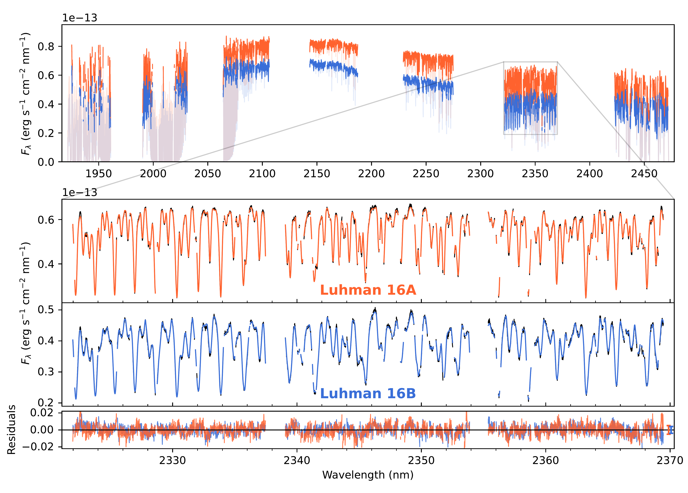
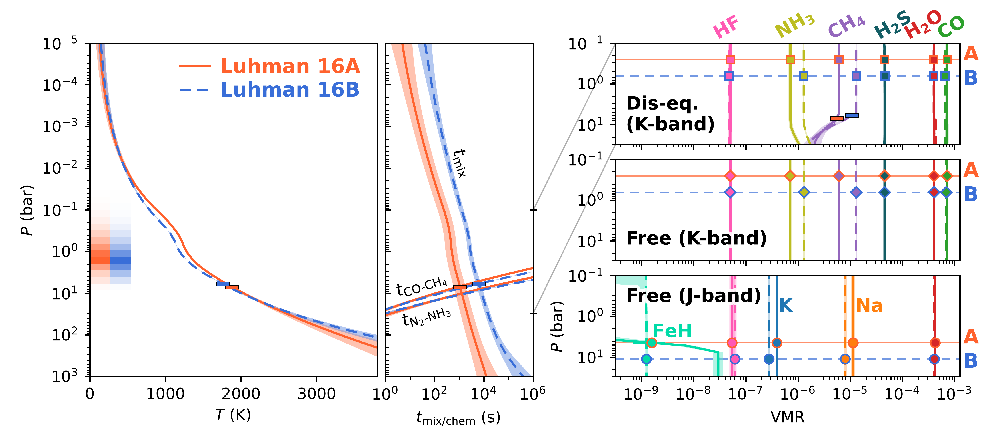
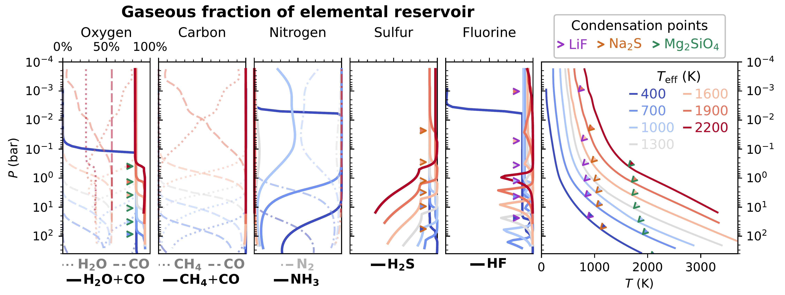

$\newcommand{\ensuremath}{}$
$\newcommand{\xspace}{}$
$\newcommand{\object}[1]{\texttt{#1}}$
$\newcommand{\farcs}{{.}''}$
$\newcommand{\farcm}{{.}'}$
$\newcommand{\arcsec}{''}$
$\newcommand{\arcmin}{'}$
$\newcommand{\ion}[2]{#1#2}$
$\newcommand{\textsc}[1]{\textrm{#1}}$
$\newcommand{\hl}[1]{\textrm{#1}}$
$\newcommand{\footnote}[1]{}$
$\newcommand{\twoentries}[2]{\begin{tabular}{@ r@ }#1\\\big[{\footnotesize #2}\big]\end{tabular}}$
$\newcommand{\arraystretch}{1.3}$

# The ESO SupJup Survey: IX. Isotopic evidence of a recent formation for Luhman 16AB

<mark>Appeared on: 2026-02-04</mark> -  _Accepted for publication in A&A_

S. d. Regt, et al. -- incl., <mark>P. Mollière</mark>

**Abstract:** The distinct formation pathways proposed for directly imaged exoplanets and isolated brown dwarfs might leave imprints in the inherited chemical composition. Elemental and isotopic tracers could help inform the suspected histories, but this requires a careful characterisation of the sub-stellar atmospheres. In particular, objects at the L-T transition exhibit signs of dynamics that can drive their atmospheres out of chemical equilibrium. In this work, we studied the nearest L-T brown dwarfs, Luhman 16A and B, to assess the chemical disequilibrium in their atmospheres. We also investigated the elemental and isotopic compositions in the context of their probable formation history within the Oceanus moving group. As part of the ESO SupJup Survey, we obtained spatially resolved CRIRES $^+$ K-band spectra of the binary. These high-resolution observations were analysed using an atmospheric retrieval framework that couples the radiative transfer code \texttt{petitRADTRANS} to the \texttt{MultiNest} sampling algorithm. We detect and retrieve the abundances of $^{12}$ CO, $H_2$ O, $CH_4$ , $NH_3$ , $H_2$ S, HF, and the $^{13}$ CO isotopologue. We find that both atmospheres are in chemical disequilibrium with somewhat stronger vertical mixing in Luhman 16A compared to B ( $K_\mathrm{zz,A}\sim$ $10^{8.7}$ vs $K_\mathrm{zz,B}\sim$ $10^{8.2} \mathrm{cm^2 s^{-1}}$ ). The tested chemical models, free-equilibrium and disequilibrium chemistry, yield consistent mixing ratios and agree with earlier work at shorter wavelengths. The free-chemistry gaseous $\mathrm{C/O}$ ratios show evidence of oxygen trapping in silicate-oxide clouds. While the $\mathrm{C/O}$ ratios are consistent with the solar composition, the metallicities are modestly enhanced with $\mathrm{[C/H]}\sim$ $0.15$ . The carbon isotope ratios are measured at $\mathrm{^{12}C/^{13}C_A}=74^{+2}_{-2}$ and $\mathrm{^{12}C/^{13}C_B}=74^{+3}_{-3}$ . The coincident constraints of metallicities and isotopes across the binary provide further evidence in favour of a common formation. The $\mathrm{^{12}C/^{13}C}$ ratios are aligned with the present-day interstellar medium but lower than the Solar System value. This suggests a recent inheritance and corroborates the relatively young age ( $\sim$ $500 \mathrm{Myr}$ ) of Luhman 16A and B as members of the Oceanus moving group.

**Figure 6. -** CRIRES$^+$ K-band spectra of Luhman 16A and B in orange and blue, respectively. _Top panel_: Seven spectral orders covered in the K2166 wavelength setting. The telluric absorption is shown as transparent lines. _Lower panels_: Zoom-in of the sixth order. The black observed spectra are overlaid with the best-fitting free-chemistry models in orange and blue. The mean scaled uncertainties are displayed to the right of the residuals in the bottom panel. The fits to the other spectral orders can be found in Appendix \ref{app:best_fitting_spectra}. (*fig:spectrum*)

**Figure 7. -** Comparison of temperature and abundance constraints. _Left panel_: Temperature profiles of Luhman 16A and B, retrieved with the chemical disequilibrium model described in Sect. \ref{sect:meth_chem}. Luhman 16A displays a heating of $\sim$$100 \mathrm{K}$ near the photosphere, which is indicated by the shaded regions in the left side of the panel. _Middle panel_: Mixing and chemical reaction timescales as functions of pressure. The intersection where vertical mixing becomes more efficient than the CO-$CH_4$ reaction is indicated by a horizontal bar. The higher $K_\mathrm{zz}$ for Luhman 16A is visible from its reduced mixing timescale. _Right panels_: Cutouts of the chemical abundance profiles between $0.06$ and $30 \mathrm{bar}$. _From top to bottom_: Chemical disequilibrium and free-chemistry abundances from the K-band analysis of this work, and the CRIRES$^+$ J-band constraints presented in [de Regt, et. al (2025)](https://ui.adsabs.harvard.edu/abs/2025A&A...696A.225D). The envelopes and error bars in all panels show the $68\%$ credible region. (*fig:eqchem_VMRs*)

**Figure 8. -** Abundance profiles of gases as a fraction of the total elemental reservoir of oxygen, carbon, nitrogen, sulphur, and fluorine. The abundances are calculated with \texttt{FastChem Cond} ([Kitzmann, Stock and Patzer 2024](https://ui.adsabs.harvard.edu/abs/2024MNRAS.527.7263K)) , using SONORA Elf Owl temperature structures (shown in the right panel;  ([Mukherjee, et. al 2024](https://ui.adsabs.harvard.edu/abs/2024ApJ...963...73M)) ) that are representative of Y-, T-, L- and late M-type dwarfs. Oxygen and carbon are carried by multiple gaseous molecules ($H_2$O, CO, and $CH_4$), which are shown as their separate and summed profiles. The condensation points of important cloud species are indicated as arrowheads for reference. (*fig:gas_fraction*)

