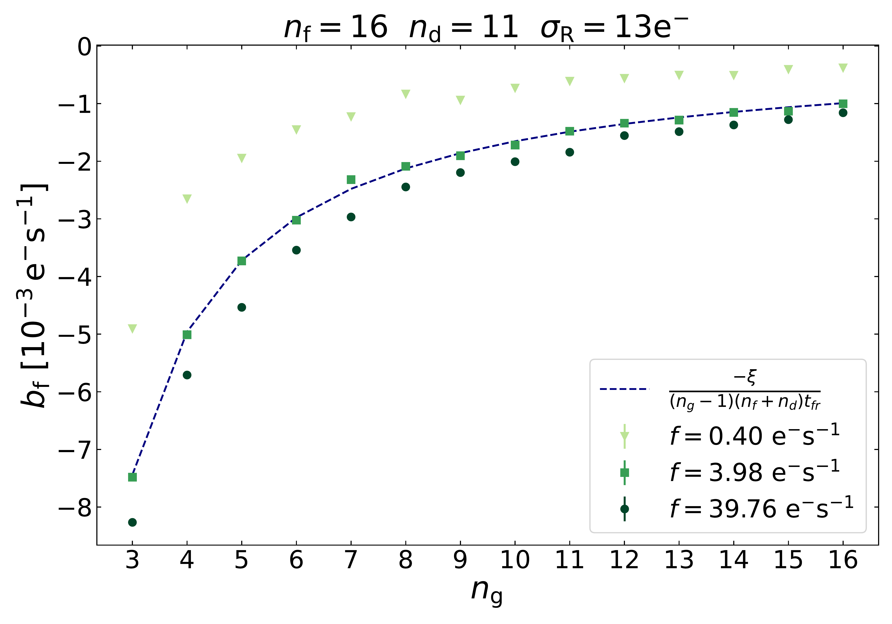
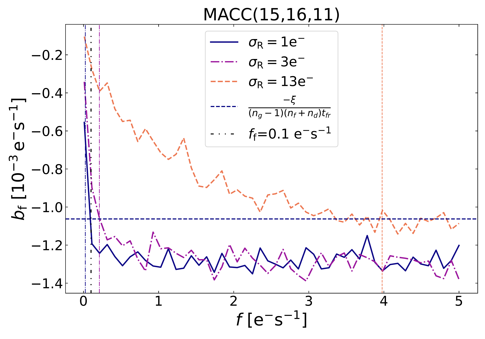
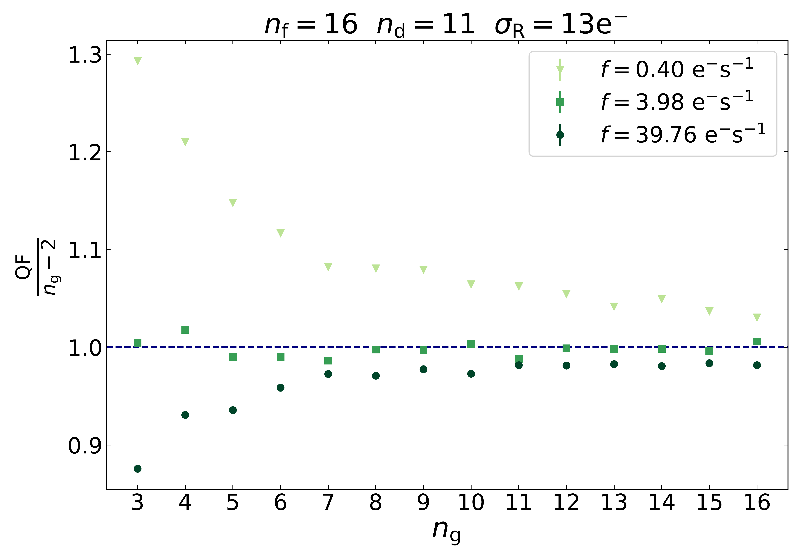
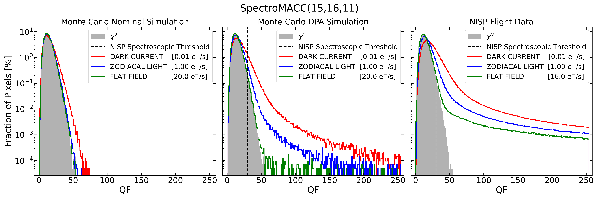
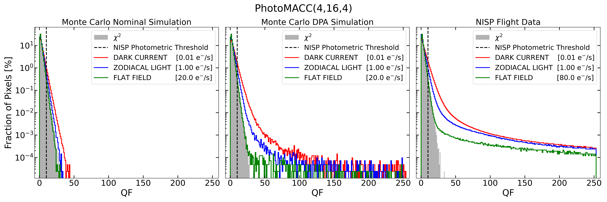
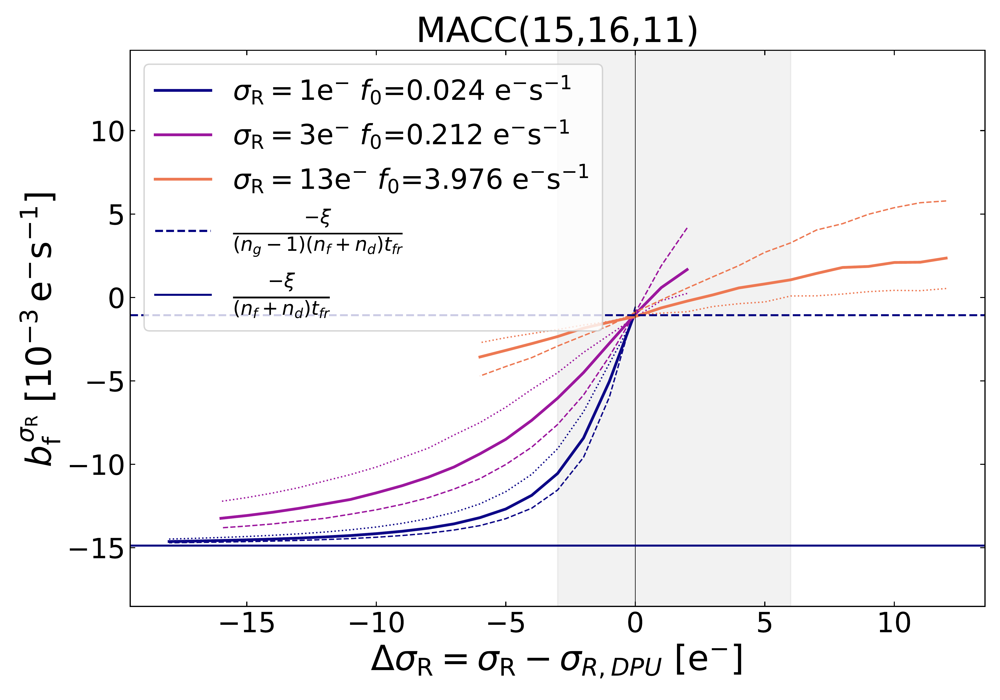
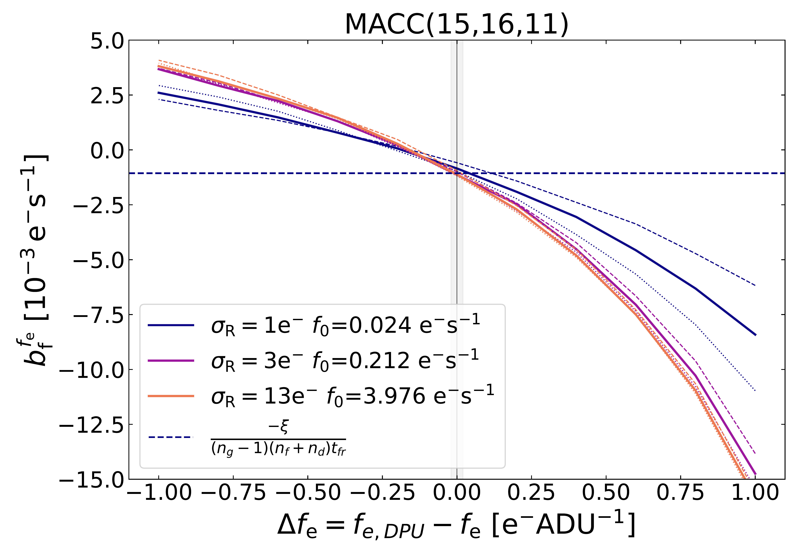
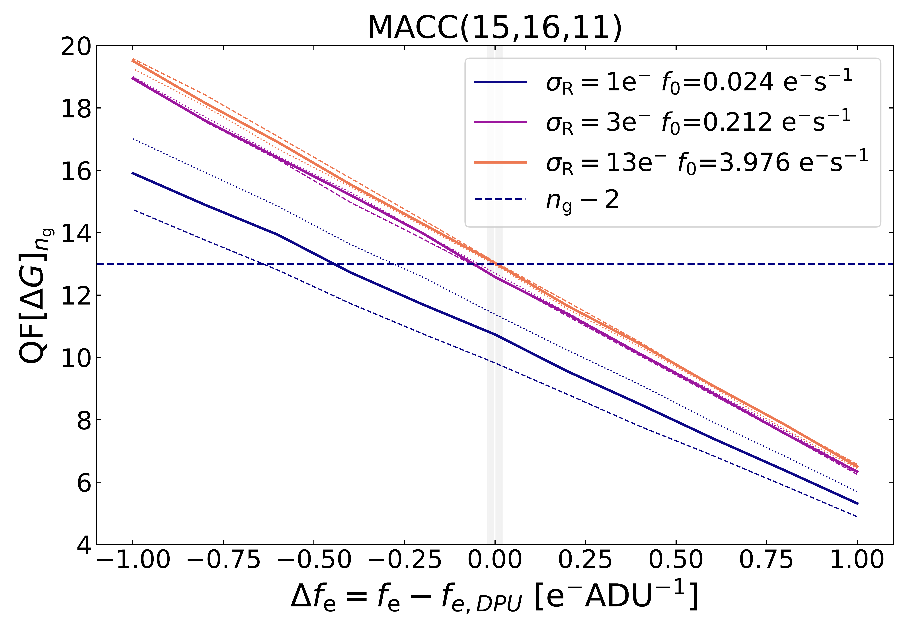

$\newcommand{\ensuremath}{}$
$\newcommand{\xspace}{}$
$\newcommand{\object}[1]{\texttt{#1}}$
$\newcommand{\farcs}{{.}''}$
$\newcommand{\farcm}{{.}'}$
$\newcommand{\arcsec}{''}$
$\newcommand{\arcmin}{'}$
$\newcommand{\ion}[2]{#1#2}$
$\newcommand{\textsc}[1]{\textrm{#1}}$
$\newcommand{\hl}[1]{\textrm{#1}}$
$\newcommand{\footnote}[1]{}$
$\newcommand{\orcid}[1]$
$\newcommand{\arraystretch}{1.3}$

# $\Euclid$: Properties and performance of the NISP signal estimator

<mark>Appeared on: 2026-02-04</mark> - 

E. Collaboration, et al. -- incl., <mark>K. Jahnke</mark>

**Abstract:** The $\Euclid$ spacecraft, located at the second Lagrangian point of the Sun-Earth system, hosts the Near-Infrared Spectrometer and Photometer (NISP) instrument. NISP is equipped with a mosaic of 16 HgCdTe-based detectors (Teledyne's H2RG) to acquire near-infrared photometric and spectroscopic data. To meet the spacecraft's constraints on computational resources and telemetry bandwidth, the near-infrared signal is processed onboard via a dedicated hardware-software architecture designed to fulfil the stringent _Euclid_ 's data-quality requirements. A custom application software, running on the two NISP data processing units, implements the NISP signal estimator: an ad-hoc algorithm which delivers accurate flux measurements and simultaneously estimates the quality of signal estimation through the quality factor (QF) parameter.  This paper further investigates the properties of the NISP signal estimator by evaluating its performance during the early flight operations of the NISP instrument. First, we revisit the assumptions on which the inference of the near-infrared signal is based and investigate the origin of the main systematics of the signal estimator through Monte Carlo simulations. Then, we test the flight performance of the NISP signal estimator. Results indicate a systematic bias lower than $0.01 {\rm e}^{-} {\rm s}^{-1}$ for $99\%$ of the NISP pixel array, well within the noise budget of the estimated signal. We also derive an analytical expression for the variance of the NISP signal estimator, demonstrating its validity, particularly when the covariance matrix is not pre-computed. Finally, we provide a robust statistical framework to interpret the QF parameter, analyse its dependence on the signal estimator bias, and show its sensitivity to cosmic ray hits on NISP detectors. Our findings corroborate previous results on the NISP signal estimator and suggest a leading-order correction based on the agreement between flight data and simulations.

**Figure 3. -** *Top panels:*  Bias of the signal estimator. *Bottom panel:* QF values. *Left panels:* Bias as function of $n_{\rm g}$ for $n_{\rm f}=16$, $n_{\rm d}=11$, and $\sigma_R=13 {\rm e}^{-}$ in the case where $f_{\rm 0} > f_{\rm f}$(no folding effect). For $f = f_{\rm 0}$(green squares) for which the off-diagonal entries of the variance matrix are null, the bias is perfectly predicted by the analytical formula (dashed lines) from Eq. (\ref{eq:bias}) for the signal, and Eq. (\ref{eq:QFbias}) for the QF. For $f<f_{\rm 0}$(light green triangles), the theoretical prediction underestimates the bias. For $f>f_{\rm 0}$(dark green dots) the theoretical prediction overestimates the bias. *Right panels:* bias of the signal estimator as a function of flux in spectroscopic readout mode. The flux values $f_{\rm 0}$ are indicated by vertical lines for each of the readout noise values. The $f_{\rm f}=0.1 {\rm e}^{-} {\rm s}^{-1}$ flux value, above which the folding contribution is negligible, is indicated by a grey dash-dot-dotted vertical line. Positive contribution of the $D_{ij}$ to the covariance matrix for $f > f_{\rm 0}$ translates in the measured signal bias lower than the analytical formula, while negative contribution of the $D_{ij}$ translates in the measured signal bias higher than the analytical formula. For $f \gg f_{\rm 0}$ and $f \gg f_{\rm f}$, the bias does not depend on flux. Similar results are obtained in photometric readout mode. (*fig:S_bias_fcn_ng*)

**Figure 9. -** Example (DET 11, SCA 18453) of the performance of the NISP QF from simulated and early flight data. Each distribution reports the QF distribution related to a single photometric or spectroscopic exposure. The grey shaded histograms represent the $\chi^2(n_g-2)$ distribution, corresponding to the expected behaviour of the NISP QF in the absence of anomalies during the signal integration. The red, blue, and green histograms show the QF distributions for three distinct flux regimes: $0.01 {\rm e}^{-} {\rm s}^{-1}$(dark current), $1 {\rm e}^{-} {\rm s}^{-1}$(zodiacal light), and $>10 {\rm e}^{-} {\rm s}^{-1}$(flat field), respectively. Flat field simulations were performed at $20 {\rm e}^{-} {\rm s}^{-1}$ for both NISP channels, while spectroscopic and photometric flight data were acquired at $16 {\rm e}^{-} {\rm s}^{-1}$ and $80 {\rm e}^{-} {\rm s}^{-1}$, respectively. Black dashed vertical lines show the threshold values applied to the NISP QF distributions in the spectroscopic (QF = 50) and photometric (QF = 10) channels.
*Top panels:* Spectroscopic MACC(15,16,11) mode.
*Bottom panels:* Photometric MACC(4,16,4) mode.
*Left panels:* Synthetic QF distributions obtained by processing the simulated data with the per-pixel readout noise map -- labelled as Nominal. At high flux ($20 {\rm e}^{-} {\rm s}^{-1}$, green histogram) the QF distribution perfectly matches the expected $\chi^2_{\nu}$ distribution. As the flux decreases, the QF distributions progressively deviate from the $\chi^2_{\nu}$, as expected from the analysis reported in Sect. \ref{sec:QF}.
*Centre panels:* Synthetic QF distributions obtained by processing the simulated data with the detector-average readout noise value -- labelled as DPA.
At high flux ($20 {\rm e}^{-} {\rm s}^{-1}$, green histogram) the QF distribution closely follows the expected $\chi^2_{\nu}$ distribution, aside from a few outliers. As the flux decreases, the QF distributions progressively deviate from the $\chi^2_{\nu}$ due to the superimposition of the intrinsic bias of the NISP signal estimator and the DPA effect.
*Right panels:*
Early flight data matching MC simulations (DPA case), if space weather effects are accounted for. The NISP QF follows the $\chi^2_{\nu}$ distribution at high flux (green histograms) while increasingly deviates from it as the flux decreases (red and blue diagrams). The outlier tail in the NISP flight data mainly results from the impact of solar energetic particles on the NISP detectors.
 (*fig:QF_MCvsDATA*)

**Figure 6. -** DPA induced bias to the signal estimator $\hat{g}[\Delta \vec{G}]_{n_{\rm g}}$(top panels) and to the QF (bottom panels). For each value of the pixel simulated readout noise $\sigma_{\sfont R}$, we have chosen the specific flux value $f=f_{\rm0}$ for which the off-diagonal terms in the covariance matrix vanish and the theoretical bias model conforms to the simulated values (thick solid lines). Additionally, for each $\sigma_{\sfont R}$ we perform simulations for $f=\frac{f_{\rm0}}{2}$(dashed lines) and $f=2f_0$(dotted lines). *Left panels:* Bias due to $\Delta \sigma_{\sfont R}$. The shaded areas correspond to the typical \Euclid case of possible values of $-3 < \Delta \sigma_{\sfont R}<6$ as 99\% of pixels are in this range of $\Delta \sigma_{\sfont R}$ -- see Sect. \ref{sec:flight_performance_sig}. Typical \Euclid pixel has a readout noise $\sigma_{\sfont R}\approx 13 {\rm e}^{-}$ and is represented by orange lines. *Right panels:* Bias due to $\Delta f_{\rm e}$. The shaded area corresponds to the typical \Euclid dispersion of gain values. (*fig:DPU_bias*)

