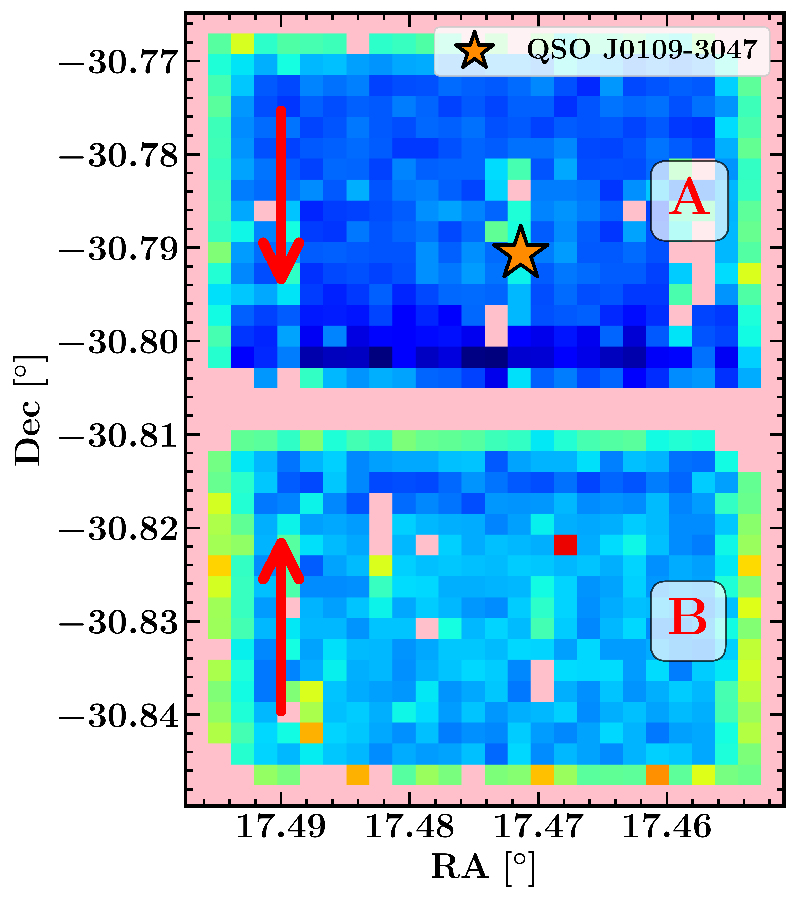
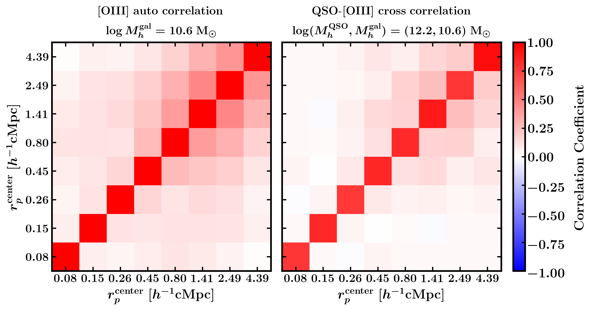
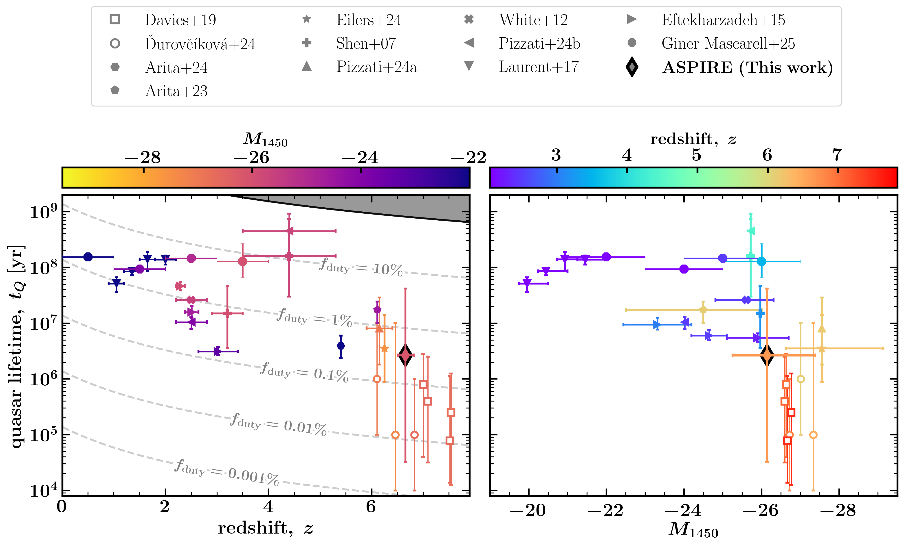

$\newcommand{\ensuremath}{}$
$\newcommand{\xspace}{}$
$\newcommand{\object}[1]{\texttt{#1}}$
$\newcommand{\farcs}{{.}''}$
$\newcommand{\farcm}{{.}'}$
$\newcommand{\arcsec}{''}$
$\newcommand{\arcmin}{'}$
$\newcommand{\ion}[2]{#1#2}$
$\newcommand{\textsc}[1]{\textrm{#1}}$
$\newcommand{\hl}[1]{\textrm{#1}}$
$\newcommand{\footnote}[1]{}$
$\newcommand{\orcid}[1]{\ifthenelse{\equal{#1} }{\relax}{ \orcidlink{#1}}}$
$\newcommand{\thebibliography}{\DeclareRobustCommand{\VAN}[3]{##3}\VANthebibliography}$
$\newcommand{\oiii}{[O \textsc{iii}]}$
$\newcommand{\FeII}{Fe~{\sevenrm II}}$
$\newcommand{\FeIIf}{[Fe~{\sevenrm II}]}$
$\newcommand{\SIII}{[S~{\sevenrm III}]}$
$\newcommand{\HeI}{He~{\sevenrm I}}$
$\newcommand{\HeII}{He~{\sevenrm II}}$
$\newcommand{\NeV}{[Ne~{\sevenrm V}]}$
$\newcommand{\OIV}{[O~{\sevenrm IV}]}$
$\newcommand{\mpch}{~\mathrm{cMpc}~h^{-1}}$
$\newcommand{\rp}{r_{\rm p}}$
$\newcommand{\msun}{{\rm{M_{\odot}}}}$
$\newcommand{\mminq}{M^{\rm QSO}_{h, \rm min}}$
$\newcommand{\mming}{M^{\rm \oiii}_{h, \rm min}}$

# Clustering of $z\sim6.6$ Quasars and [O III] Emitters Constrains Host Halo Masses and Duty Cycles in 25 ASPIRE Fields

<mark>Appeared on: 2026-02-06</mark> -  _23 pages, 10 figures, submitted to MNRAS_

J. Huang, et al. -- incl., <mark>E. Bañados</mark>, <mark>Y. Wu</mark>

**Abstract:** We use data from the JWST ASPIRE Wide Field Slitless Spectroscopy (WFSS) program to measure the auto-correlation function of $\oiii$ -emitters at $5.3<z<7.0$ and the quasar-- $\oiii$ -emitter cross-correlation function around 25 ASPIRE quasars ( $6.51 < z < 6.82$ ; $\langle z\rangle = 6.6$ ).We use synthetic source injection to calibrate the selection function, which we combine with the large-volume cosmological simulation FLAMINGO-10k (2.8 cGpc box) to construct realistic mock observations. Our simulation-based approach offers two key advantages: (1) the clustering models capture nonlinear structure growth and scale-dependent bias on small scales beyond analytic prescriptions, and (2) covariance matrices from mock realizations account for cosmic variance and correlated uncertainties across radial bins.Our clustering measurements yield a correlation length of $r_0^{\rm GG} = 4.7^{+0.5}_{-0.6} \mpch$ for the $\oiii$ -emitter auto-correlation with a fixed power-law slope $\gamma_{\rm GG}=1.8$ ,and $r_0^{\rm QG} = 8.9^{+0.9}_{-1.0} \mpch$ for the quasar-- $\oiii$ -emitter cross-correlation with $\gamma_{\rm QG}=2.0$ .We jointly estimate the halo masses by assuming a step-function halo occupation distribution (HOD) with mass-dependent covariance matrices. Our analysis yields $\log (M_{h, \mathrm{min}}^{\mathrm{[OIII]}}/\msun) = 10.55^{+0.11}_{-0.12}$ for $\oiii$ -emitter host halos and $\log (M_{h, \mathrm{min}}^{\mathrm{QSO}}/\msun) = 12.13^{+0.31}_{-0.38}$ for quasar host halos. Based on these minimum halo masses, we estimate duty cycles of $2.5^{+1.3}_{-0.8}\%$ for $\oiii$ -emitters,and $0.3^{+4.8}_{-0.3}\%$ for quasars. The low quasar duty cycle implies UV-bright lifetimes of only $t_{\rm Q} =2.64^{+39.15}_{-2.61} \rm Myr$ , representing $\lesssim 10\%$ of a Salpeter $e$ -folding time. This indicates that the observed UV-luminous phase contributes minimally to total SMBH mass assembly, placing tight constraints on early black hole growth models.

**Figure 7. -** Two examples of the sensitivity map for quasar field J0109-3047 and J0224-4711, the orange stars mark the location of the quasars. Each pixel value (\texttt{Flim}) on the sensitivity map is computed from the S/N of the injected source. The inject mock grid has size 40 rows $\times$ 25 columns, and the direction of the columns follows the direction of the dispersion. Grid points with no detection (i.e.,
    the redshift of the mock source is misidentified with $|z-z_{\rm true}|>0.01$), where $z_{\rm true}=6.5$ for the injected mocks, are shown in pink.
    In the left panel, we mark the dispersion direction of Grism R (dispersion across detector rows) as red arrows for modules A and B. The color bars correspond to the $5\sigma$ flux limit, where deeper bluer color means more sensitive to the faint sources. The vertical stripes of non-detection within the FOV correspond to the contamination due to the dispersed foreground bright sources. (*fig:sensitivity*)

**Figure 8. -** 
Correlation matrices of the volume-averaged correlation functions, normalized by their diagonal elements.
The left panel shows the auto-correlation function of [O iii] emitters, $\chi_{\rm GG}$, and the right panel shows the quasar–[O iii] cross-correlation function, $\chi_{\rm QG}$.
Both are computed using Eq. \ref{eq:covariance} based on 1{,}000 mock realizations generated for the minimum-mass model with
$\log(M_h^{\rm gal}/M_\odot)=10.6$ and $\log(M_h^{\rm QSO}/M_\odot)=12.2$, where one mock realization computes the correlation functions based on the total number counts across all 25 ASPIRE-like quasar fields.
The tick labels on each axis indicate the bin centers for the projected-radius, $r_p^{\rm center}$.
The off-diagonal structure reflects correlated uncertainties arising from pair-count covariance and large-scale structure modes coupling across bins.
 (*fig:covar_sim*)

**Figure 11. -** **_Left:**_ Redshift evolution of the quasar lifetime. The dashed curves show the lifetime with fixed quasar duty cycle, and the gray shaded region shows the forbidden region where $t_{\rm Q}>t_{\rm H}$ or, equivalently, $n_{\rm Q}>n_{\rm halo}$ where $n_{\rm halo}$ is the number density of quasar host halos.  The color bar shows the $M_{1450}$ magnitude of the quasar sample, with darker colors indicating lower luminosity.
    Our result for the ASPIRE sample is marked as the diamond data point. The measurement from $\rm Ly\alpha$ damping wings for individual quasars at $z>6$ are shown as the round  ([\vDurov\vc\'\ikov\'a, et. al 2024](https://ui.adsabs.harvard.edu/abs/2024ApJ...969..162D))  and square open makers  ([Davies, Hennawi and Eilers 2019](https://ui.adsabs.harvard.edu/abs/2019ApJ...884L..19D), [Wang, et. al 2020](https://ui.adsabs.harvard.edu/abs/2020ApJ...896...23W), [Yang, et. al 2020](https://ui.adsabs.harvard.edu/abs/2020ApJ...897L..14Y)) . For $z\gtrsim6$ quasars, we include the EIGER measurement, which uses $\oiii$-emitters as tracers to measure the quasar cross-correlation by putting together four quasar fields (shown as the star data point,   ([Eilers, et. al 2024](https://ui.adsabs.harvard.edu/abs/2024arXiv240307986E)) ). We also include measurements from [Pizzati, et. al (2024)](https://ui.adsabs.harvard.edu/abs/2024MNRAS.534.3155P) and [Arita, et. al (2024)](https://ui.adsabs.harvard.edu/abs/2024MNRAS.tmp.2641A). For lower redshift quasars, we include the clustering measurement from [Shen, et. al (2007)](https://ui.adsabs.harvard.edu/abs/2007AJ....133.2222S), [White, et. al (2012)](https://ui.adsabs.harvard.edu/abs/2012MNRAS.424..933W), [Eftekharzadeh, et. al (2015)](https://ui.adsabs.harvard.edu/abs/2015MNRAS.453.2779E), [Laurent, et. al (2017)](https://ui.adsabs.harvard.edu/abs/2017JCAP...07..017L), [Pizzati, et. al (2024)](https://ui.adsabs.harvard.edu/abs/2024MNRAS.528.4466P), [Giner Mascarell, Eilers and Storey-Fisher (2025)](https://ui.adsabs.harvard.edu/abs/2025arXiv251117413G). **_Right:**_ luminosity dependence of the quasar lifetime. The color bar shows the mean redshift of each sample.
     (*fig:fduty_z_m1450*)

