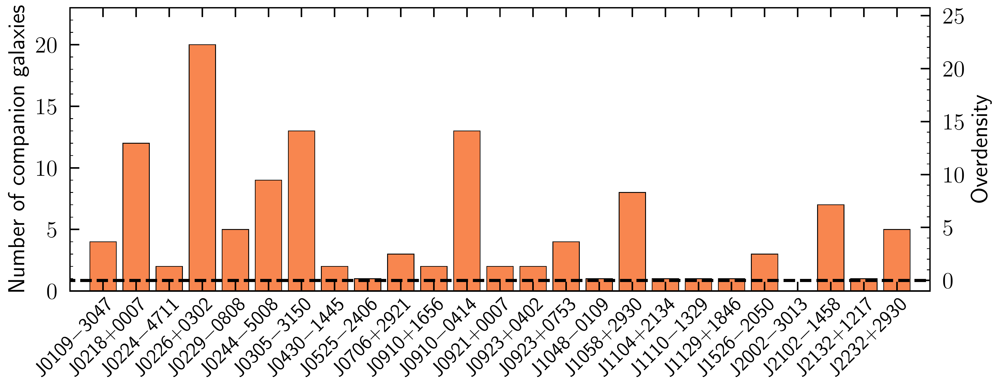
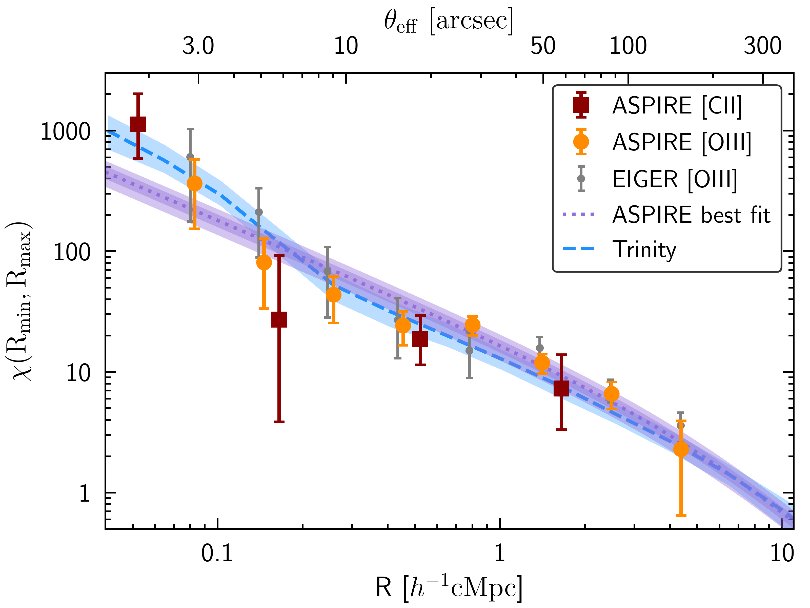
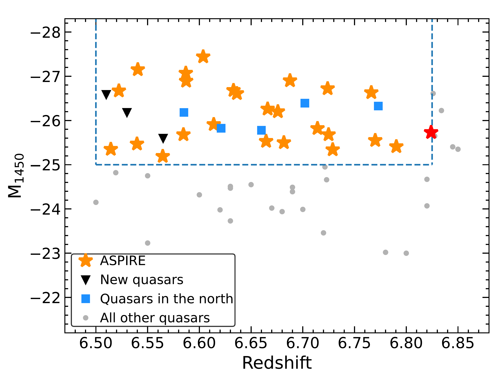

$\newcommand{\ensuremath}{}$
$\newcommand{\xspace}{}$
$\newcommand{\object}[1]{\texttt{#1}}$
$\newcommand{\farcs}{{.}''}$
$\newcommand{\farcm}{{.}'}$
$\newcommand{\arcsec}{''}$
$\newcommand{\arcmin}{'}$
$\newcommand{\ion}[2]{#1#2}$
$\newcommand{\textsc}[1]{\textrm{#1}}$
$\newcommand{\hl}[1]{\textrm{#1}}$
$\newcommand{\footnote}[1]{}$
$\newcommand{\url}[1]{\href{#1}{#1}}$
$\newcommand{\dodoi}[1]{doi:~\href{http://doi.org/#1}{\nolinkurl{#1}}}$
$\newcommand{\doeprint}[1]{\href{http://ascl.net/#1}{\nolinkurl{http://ascl.net/#1}}}$
$\newcommand{\doarXiv}[1]{\href{https://arxiv.org/abs/#1}{\nolinkurl{https://arxiv.org/abs/#1}}}$
$\newcommand{\rqg}{r_0^{\rm QG} = 8.68^{+0.51}_{-0.55}~h^{-1}~\mathrm{cMpc}}$
$\newcommand{\mhalo}{M_{\rm halo} = 10^{12.27^{+0.21}_{-0.26}}~M_\odot}$
$\newcommand\natexlab{#1}$

# ASPIRE: The Environments and Dark Matter Halos of Luminous Quasars in the Epoch of Reionization

<mark>Appeared on: 2026-02-06</mark> -  _submitted to AAS journal in Nov. 2025_

F. Wang, et al. -- incl., <mark>E. Bañados</mark>, <mark>Y. Wu</mark>, <mark>S. Belladitta</mark>, <mark>F. Walter</mark>

**Abstract:** We present a systematic study of the environments of 25 luminous quasars at $z > 6.5$ from the ASPIRE program. Using JWST/NIRCam WFSS data, we identified 487 galaxies at $5.3 \lesssim z \lesssim 7.0$ exhibiting [ $\ion{O}{3}$ ] emission. Among these, 122 [ $\ion{O}{3}$ ] emitters lie within $|\Delta v_{\rm los}| < 1000 \mathrm{km s^{-1}}$ of the quasars, corresponding to a $\sim9.4$ -fold enhancement relative to the average galaxy density at other redshifts. Furthermore, we identified 16 [ $\ion{C}{2}$ ] -emitting galaxies at the quasar redshifts from ALMA mosaic observations. A cross-correlation function (CCF) analysis between quasars and [ $\ion{O}{3}$ ] + [ $\ion{C}{2}$ ] emitters yields a cross-correlation length of $r_0^{\rm QG} = 8.68^{+0.51}_{-0.55} h^{-1} \mathrm{cMpc}$ and a auto-correlation of $r_0^{\rm{QQ}}=15.76^{+2.48}_{-2.70} h^{-1} {\rm cMpc}$ , indicating that $z \sim 7$ quasars reside in dark matter halos with $M_{\rm halo} = 10^{12.27^{+0.21}_{-0.26}} M_\odot$ . Notably, the number of [ $\ion{O}{3}$ ] -emitting galaxies at quasar redshifts varies significantly from field to field, ranging from zero to twenty, highlighting a diverse quasar environment. Remarkably, seven quasars trace significant galaxy overdensities (i.e., protoclusters), with $\delta_{\rm gal} > 5$ within a volume of $V \sim 500 {\rm cMpc^3}$ . We also find that $|\Delta v_{\rm los}|$ increases rapidly toward smaller galaxy-quasar separations in protocluster fields, consistent with galaxy kinematics around extremely massive halos in cosmological simulations. By combining JWST and ALMA data, we reveal the complex and diverse environments of these early quasars, providing robust evidence that the earliest luminous quasars are effective tracers of galaxy overdensities, albeit with substantial field-to-field variation.

**Figure 14. -** ** Large variance of the number of quasar companion galaxies.**
 Galaxy numbers are determined by counting [$\ion${O}{3}] emitters within $\Delta |v_{\rm los}| < 1000 \mathrm{km s^{-1}}$ relative to the central quasars. The number of companion galaxies varies significantly from field to field, ranging from zero (lower than expected) to 20 (corresponding to $\delta_{\rm gal} \simeq 22$).
 (*fig:ngal*)

**Figure 6. -** **  Quasar-galaxy cross-correlation function.**
The orange points represent the measured quasar-galaxy cross-correlation function based on [$\ion${O}{3}] emitters while the dark red points denote the cross-correlation function from [$\ion${C}{2}] emitters.
The purple dashed line and dark (shallow) shaded region show the power-law fit when fixing the slope $\gamma_{\rm{QG}} = 2.0$ and its associated $1\sigma$($2\sigma$) posterior range. The blue dashed line show the predictions based on \texttt{Trinity} model. The gray dots are quasar-galaxy cross-correlation function measured by the EIGER program using only four quasars at $z\sim6$\citep{Eilers24}.
 (*fig:ccf*)

**Figure 1. -** ** The redshift and absolute magnitude distribution of ASPIRE quasars.**
We selected a flux-limited sample of 25 quasars at $6.5<z\lesssim6.8$ with $M_{1450}<-25.0$(orange asterisks). To ensure all ASPIRE quasars can be observed with ALMA, we excluded known quasars with $\rm Decl. > 30^\circ$. This sample also includes a radio-loud quasar (red asterisk, $z=6.82$). The triangles denote three quasars satisfy our luminosity cut but were published after JWST Cycle 1 proposal deadline and therefore were not included in ASPIRE.
 (*fig:sample*)

