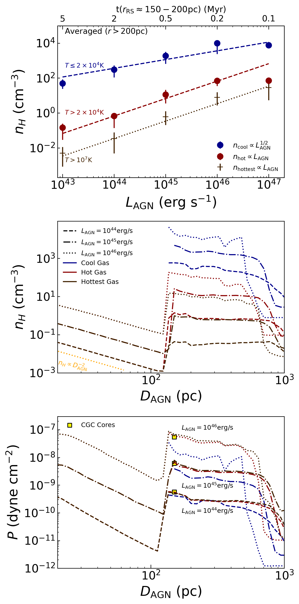
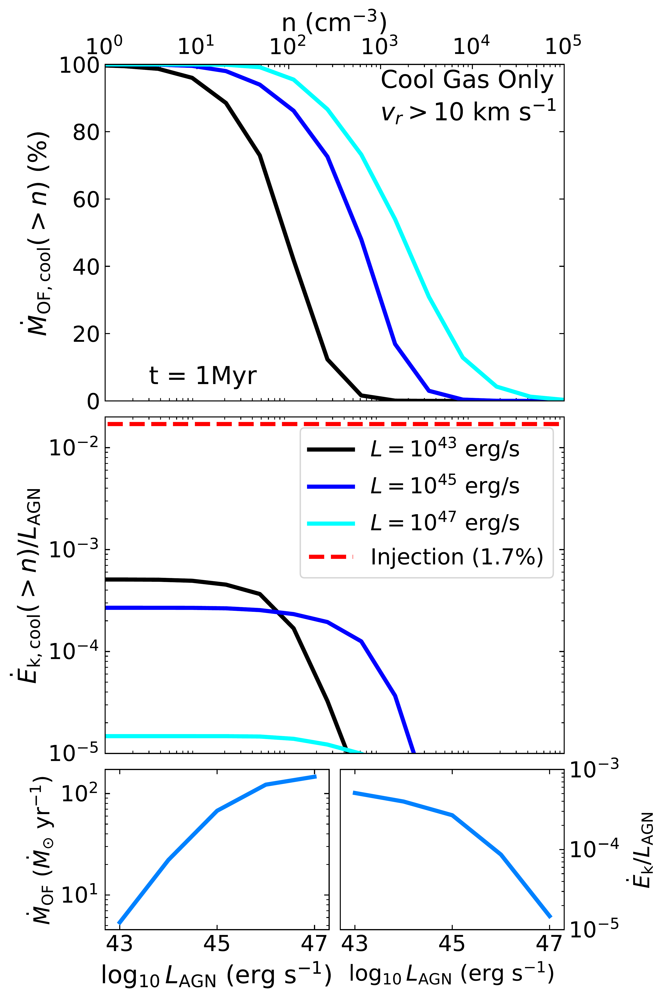

$\newcommand{\ensuremath}{}$
$\newcommand{\xspace}{}$
$\newcommand{\object}[1]{\texttt{#1}}$
$\newcommand{\farcs}{{.}''}$
$\newcommand{\farcm}{{.}'}$
$\newcommand{\arcsec}{''}$
$\newcommand{\arcmin}{'}$
$\newcommand{\ion}[2]{#1#2}$
$\newcommand{\textsc}[1]{\textrm{#1}}$
$\newcommand{\hl}[1]{\textrm{#1}}$
$\newcommand{\footnote}[1]{}$
$\newcommand{\working}{$
$\begin{wrapfigure}{l}{0.25\textwidth}$
$\vspace{-20pt}$
$\begin{center}$
$\includegraphics[width=0.25\textwidth]{figures/working-animal.jpg}$
$\end{center}$
$\vspace{-10pt}$
$\end{wrapfigure}$
$}$
$\newcommand{\continue}{\todo[inline,color=Orange]{$
$\centerline{ \textbf{\Large CONTINUE} }$
$} }$
$\newcommand{\fermi}{\emph{Fermi}}$
$\newcommand{\xmark}{\ding{56}}$
$\newcommand{\ok}{\ding{52}}$
$\newcommand{\grt}{GM/c^3}$
$\newcommand{\eg}[1]{(e.g. \citealt{#1})}$
$\newcommand{\orcid}[1]{\href{#1}{\includegraphics[scale=0.04]{figures/orcid.png}}}$
$\newcommand{\lagn}{L_{\rm AGN}}$
$\newcommand{\ledd}{L_{\rm Edd}}$
$\newcommand{\medd}{\dot{M}_{\rm Edd}}$
$\newcommand{\msun}{{\rm M_\odot}}$
$\newcommand{\harm}{\texttt{harm }}$
$\newcommand{\hamr}{\texttt{H-AMR }}$
$\newcommand{\arepo}{\texttt{AREPO }}$
$\newcommand{\mbh}{M_{\rm BH}}$
$\newcommand{\kms}{km s^{-1} }$
$\newcommand{\ergs}{erg s^{-1} }$
$\newcommand{\dens}{g cm^{-3} }$
$\newcommand{\numberdens}{cm^{-3} }$
$\newcommand{\mach}{\mathcal{M}}$
$\newcommand{\Ward}{\textit{W24} }$
$\newcommand{\Wardf}{\textit{W24}}$
$\newcommand\code{#1}$
$\newcommand\todoi{#1}$
$\newcommand\ivan{#1}$
$\newcommand\tiago{#1}$
$\newcommand\chris{#1}$
$\newcommand\rst{#1}$

# Tracing AGN Feedback Power with Cool/Warm Outflow Densities: Predictions and Observational Implications

<mark>Appeared on: 2026-02-06</mark> -  _24 pages, 18 figures. Accepted for publication in MNRAS_

<mark>I. Almeida</mark>, T. Costa, C. M. Harrison, S. R. Ward

**Abstract:** Winds launched at the scale of the accretion disc or dusty torus in Active Galactic Nuclei (AGN) are thought to drive energy-conserving outflows that shape galaxy evolution.The key signature of such outflows, the presence of a hot ( $T \gtrsim 10^9   \rm K$ ), shocked wind component, is hard to detect directly. Observations of AGN outflows typically probe a separate outflow phase: cool/warm gas with $T \lesssim 10^5   \rm K$ .Here, we show that the density of cool outflowing gas scales with AGN luminosity, serving as an indirect diagnostic of the elusive hot, shocked wind.We use hydrodynamic simulations with the moving-mesh code \texttt{AREPO} to target the interaction between a small-scale AGN wind of speed $\approx 10^4   \rm km   s^{-1}$ and galactic discs containing an idealised, clumpy interstellar medium (ISM). Through a new refinement scheme targeting rapidly-cooling, fast-moving gas, our simulations reach a resolution of $\lesssim 0.1   \rm pc$ in the cool, outflowing phase.We extract an ensemble of cool clouds from the AGN-driven outflows produced in our simulations, finding that their densities increase systematically with AGN wind power and AGN luminosity. Moreover, the mass distribution and internal properties of these cloudlets appear to be insensitive to the initial properties of the ISM, and shaped mainly by the dynamics of radiative, turbulent mixing layers.The increase in cool outflow density with kinetic wind power and AGN luminosity has profound implications for observational estimates of outflow rates and their scaling with AGN luminosity. Depending on the available outflow and density tracers, observationally-derived outflow rates may be overestimated by orders of magnitude.

**Figure 18. -** Examining the impact of AGN luminosity on the main characteristics of the outflowing CGCs. (_Top panel_) The density distributions from our highest resolution simulations for $\lagn  = 10^{43},  10^{45}, \text{ and } 10^{47}$ erg s$^{-1}$ at 1 Myr, showing a shift to higher values with increasing AGN power. The lower panels illustrate the average density of CGCs (left) and the average size of the clouds (right), as a function of the AGN bolometric luminosity for a range of simulations investigated in this work at $t = 1$ Myr (except for the simulations with metal-line cooling, which the time is the maximum simulation time shown in Table \ref{tab:simulations-params}). The main results, showed as the dark blue stars and black squares, refer to the highest resolution simulations group --with resolution boost factor $\beta = 64$.
    The shaded grey areas highlight the full range of values across all of the simulations (see Table \ref{tab:simulations-params}), plus an 1$\sigma$ error range from the main run. The average values from the different simulations are shown as individual horizontal lines as described in the legend. In the lower left panel, average density values for the CGC cores from the main simulations are also displayed. (_Lower Left Panel_): We can see the CGC's density increasing with $L_{\rm AGN}^{1/2}$, up to the breakpoint for $\lagn \geq 10^{46}$ erg s$^{-1}$. This trend is consistent across all our simulations. However, this breakpoint is not observed when only the high density cores are analyzed (see secion \ref{subsec:Impact-LAGN}). (_Lower Right Panel_): The average CGC sizes follow $L_{\rm AGN}^{-1/6}$.
    Our simulations set can be divided into Middle Resolution ($M_{\rm target} = 100  $\msun$$) and High Resolution ($M_{\rm target} = \lesssim 10  $\msun$$). The change in resolution did not affect the density results but did show a reduction in the average cloud size, up to the break at $\lagn = 10^{46}$ erg s$^{-1}$. Our results indicate that brighter AGNs result in smaller denser cool outflowing clouds. (*fig:L-hist*)

**Figure 7. -** This figure includes all gas with $v_r > 10$ km s$^{-1}$, without applying the cloud selection process. The gas is divided into cool ($T \leq 2 \times 10^4$ K, blue), hot ($T > 2 \times 10^4$ K, dark red), and the "hottest" ($T > 10^7$ K, brown) --which is a subset of the hot phase-- phases. All simulations are analysed at the time when the reverse shock radius is approximately $r_{\rm RS} \approx 150$–$200$ pc, the time when each simulation was analysed is shown in the top x-axis of the upper panel.
    _Upper panel:_ Average hydrogen number density ($n_{\rm H}$) of each gas phase for $D_{\rm AGN} > r_{\rm RS}$. The cool phase line follows $\lagn^{s}$, with $s=0.5$, as we found from the cloud analysis (see Figure \ref{fig:L-hist}). The lines show a linear relation between $\lagn$ and $n_\mathrm{H}$ for the hottest phase and the hot phase up to $\lagn^{s} = 10^{46}$ erg s$^{-1}$.
    _Middle panel:_ Radial profile of hydrogen number density for the different phases. Line styles correspond to different AGN luminosities: $\lagn = 10^{44}$ erg s$^{-1}$(dashed), $\lagn = 10^{45}$ erg s$^{-1}$(dash-dotted), and $\lagn = 10^{46}$ erg s$^{-1}$(dotted). A density jump is visible in the hot phase at $r_{\rm RS}$, coinciding with the appearance of the cool gas component.
    _Lower panel:_ Radial volume-weighted pressure profiles for the simulations. A corresponding pressure jump at $r_{\rm RS}$ is also observed. The plot reveals an increasing pressure gradient between the cool and hot phases with rising $\lagn$, indicating a more underpressured cool phase in the presence of more luminous AGN.
     (*fig:pressure-radius*)

**Figure 8. -** _Top Panel:_ Fraction of the mass outflow rate for gases exceeding certain density thresholds. For instance, gas with densities above $10^3$ cm$^{-3}$ accounts for approximately 30\% of the total outflowing CGC mass at $\lagn = 10^{45}$ erg s$^{-1}$ and about 60\% at $\lagn = 10^{47}$ erg s$^{-1}$. _Middle Panel:_ Kinetic coupling energy of the outflowing CGCs, where the ratio $\dot{E}_k / $\lagn$$ is low, indicating that this gas phase does not carry a significant amount of the total energy. _Bottom Panels:_$\dot{M}_{\rm OF}$ and $\dot{E}_k/$\lagn$$ as function of AGN luminosity for the cool phase. (*fig:mdot_ek*)

