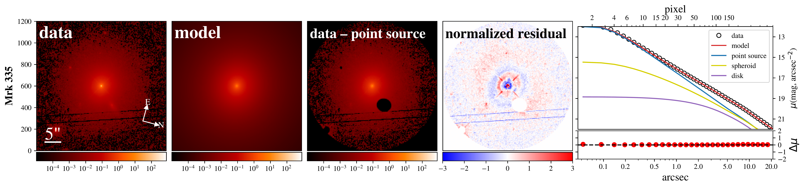
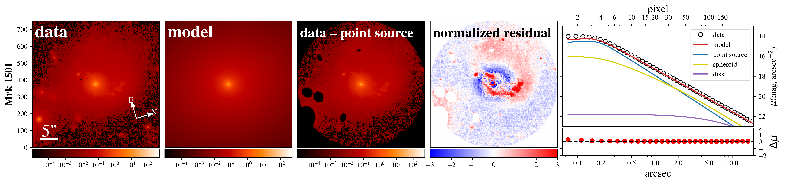
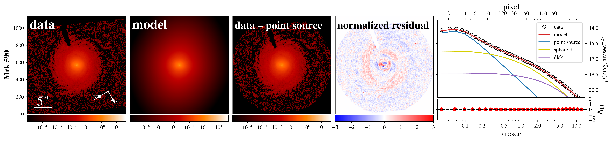
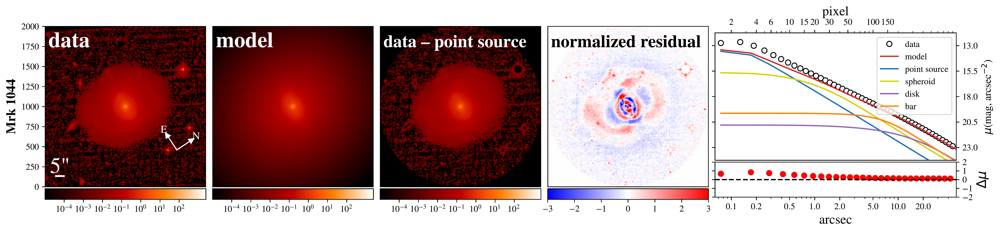
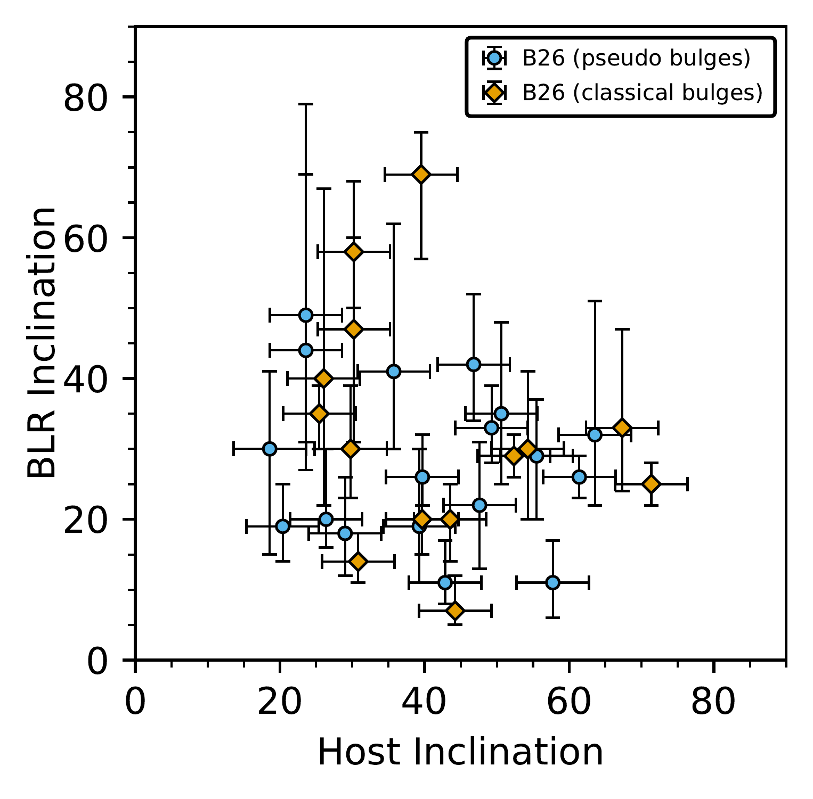
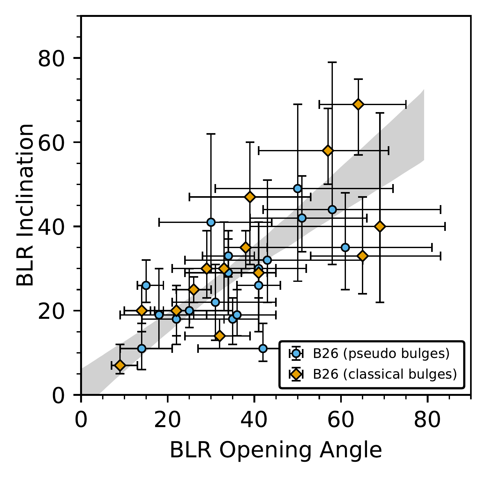

$\newcommand{\ensuremath}{}$
$\newcommand{\xspace}{}$
$\newcommand{\object}[1]{\texttt{#1}}$
$\newcommand{\farcs}{{.}''}$
$\newcommand{\farcm}{{.}'}$
$\newcommand{\arcsec}{''}$
$\newcommand{\arcmin}{'}$
$\newcommand{\ion}[2]{#1#2}$
$\newcommand{\textsc}[1]{\textrm{#1}}$
$\newcommand{\hl}[1]{\textrm{#1}}$
$\newcommand{\footnote}[1]{}$
$\newcommand{\vdag}{(v)^\dagger}$
$\newcommand$
$\newcommand$
$\newcommand{\mbh}{M_{\rm BH}}$
$\newcommand$
$\newcommand$
$\newcommand$
$\newcommand$
$\newcommand$
$\newcommand$
$\newcommand$
$\newcommand{\etal}{\textit{et al.}}$
$\newcommand{\Hz}{{\rm Hz}}$
$\newcommand{\erg}{{\rm erg}}$
$\newcommand{\yr}{{\rm yr}}$
$\newcommand{\cm}{{\rm cm}}$
$\newcommand{\s}{{\rm s}}$
$\newcommand{\Mpc}{{\rm Mpc}}$
$\newcommand{\ls}{L_{\rm sph}}$
$\newcommand{\lh}{L_{\rm host}}$
$\newcommand{\ms}{M_{\rm sph}}$
$\newcommand{\mss}{M_{\rm sph, \star}}$
$\newcommand{\mts}{M_{\rm host, \star}}$
$\newcommand{\kms}{{\rm km s}^{-1}}$
$\newcommand{\perMpc}{{\rm Mpc}^{-1}}$
$\newcommand{\hh}{H_{2}}$
$\newcommand{\um}{\mum~}$
$\newcommand{\feii}{[Fe \textsc{ii}]}$
$\newcommand{\pab}{Pa\beta}$
$\newcommand{\molhy}{H_2}$
$\newcommand{\brg}{Br\gamma}$
$\newcommand{\ha}{H\alpha}$
$\newcommand{\hb}{H\beta}$
$\newcommand{\hg}{H\gamma}$
$\newcommand{\oiii}{[O \textsc{iii}]}$
$\newcommand{\oii}{[O \textsc{ii}]}$
$\newcommand{\oi}{[O \textsc{i}]}$
$\newcommand{\nii}{[N \textsc{ii}]}$
$\newcommand{\neiii}{[Ne \textsc{iii}]}$
$\newcommand{\sii}{[S \textsc{ii}]}$
$\newcommand{\mdyn}{M_{\rm sph, dyn}}$
$\newcommand{\mstar}{M_{\star}}$
$\newcommand{\msun}{M_{\odot}}$
$\newcommand{\lsun}{L_{\odot}}$
$\newcommand{\lya}{Ly\alpha}$

# The Host Galaxies of Active Galactic Nuclei with Direct Black Hole Mass Measurements$\footnote{Based on observations made with the NASA/ESA Hubble Space Telescope,obtained at the Space Telescope Science Institute, which is operated by theAssociation of Universities for Research in Astronomy, Inc., under NASAcontract NAS5-26555.These observations are associated with programs\# 17103 and 17063.}$

<mark>Appeared on: 2026-02-09</mark> -  _31 pages, 12 figures (figures 5-9 to appear as figure set in the online version), 5 tables, accepted by the Astrophysical Journal_

Vardha~N.~Bennert, et al.

**Abstract:** Reverberation mapping (RM) determines the mass of black holes (BH) in active galactic nuclei (AGNs) byresolving the BH gravitational sphere of influence in the time domain. RecentRM campaigns yielded direct BH masses through dynamical modeling for a sample of 32 objects, spanning a widerange of AGN luminosities and BH masses. In addition,accurate BH masses have been determined by spatially resolving the broad-line region with GRAVITY for a handful of AGNs.Here, we present a detailed analysis of $_ Hubble Space Telescope_$ images using surface-brightness profile fitting with state-of-the-art programs.We derive AGN luminosity and host-galaxy properties, such as radii andluminosities for spheroid, disk, and bar (if present).The spheroid effective radiiwere used to measure stellar velocity dispersion from integral-field spectroscopy.Since the BH masses of our sample do not depend on any assumption of thevirial factor needed in single-epoch spectroscopic mass estimates, we can show that the resultingscaling relations between the mass of the supermassive BHs and their hostgalaxies match those of quiescent galaxies, naturally extending to lower massesin these (predominantly) spiral  galaxies. We find that the inner AGN orientation, as traced by the broad-line region inclination angle, is uncorrelatedwith the host-galaxy disk.Our sample has the most direct and accurate $\mbh$ measurementsof any AGN sample and provides a fundamental local benchmark for studies of theevolution of massive black holes and their host galaxies across cosmic time.

**Figure 4. -** *Surface-Photometry Fits.*
From left to right: observed HST image ("data", including
scale bar of 5 arcseconds and North-East directions); best-fit \texttt{galight}/\texttt{lenstronomy} model ("model"); PSF-subtracted image ("data—point source"); residual image after subtraction of best-fit model
from data, divided by the noise level ("normalized residual");
and surface-brightness profile
(data = black circles, model = red line, PSF = blue line,
spheroid = yellow line; if present: disk = purple line, bar = orange line).
The surface-brightness profile is shown for illustration only, as the fits were performed on the 2D image.
Surface-brightness values are given in the plane of the sky (total light within circular aperture; the x-axis is based on a circularized radius).
Note that all images
are displayed as observed with HST (see Table \ref{tab:hst}) and fitted by \texttt{lenstronomy}.
Each row of images corresponds to one object (as labeled on the y-axis of
the leftmost panel).
  (*fig:lenstronomy1*)

**Figure 2. -** _ Left:_*BLR Inclination vs. Host Inclination.*
        Comparison between inclination of the BLR, based on
        \texttt{CARAMEL} and GRAVITY modeling, and host-galaxy disk inclination, for our sample of 34 RM AGNs (classical bulges in yellow, pseudo-bulges in blue).
        There is no correlation between the inclination
        of the central AGN and the large-scale host-galaxy disk;
        if at all, there is an indication of a weak anti-correlation
(Pearson correlation coefficient of $-0.16$).
        _ Right:_*BLR Inclination vs. BLR Opening Angle.*
        Similar to the left panel, but now comparing
 inclination and opening angle of the BLR, based on
        \texttt{CARAMEL} and GRAVITY modeling.
Both parameters are correlated (Pearson correlation coefficient of
0.71). The fitted relation is shown as a shaded gray stripe
corresponding to the  68\%(1-sigma) confidence
interval of the linear regression.
The correlation is
driven by the absence of double-peaked lines in the sample.
In other words, in modeling the data, the opening angle of the BLR cannot be much smaller than the
inclination angle, while still reproducing the observed single-peaked lines. (*fig:inclination*)

**Figure 1. -** *$\mbh$--Spheroid Luminosity Relation.*
In the left panel, the relation between $\mbh$ and spheroid luminosity
in the $I$-band is shown, in the right panel, the same but in the $V$-band.
Grey data points are quiescent galaxies
\citep[ellipticals or spirals/S0 with classical bulges;][]{Kormendy_Ho:2013};
colored data points are our sample (classical bulges in yellow, pseudo-bulges in blue).
The fitted relation is shown as a shaded gray stripe
corresponding to the  68\%(1-sigma) confidence
interval of the linear regression.
Since our sample consists of local AGNs with directly measured $\mbh$ through dynamical modeling which is free of assumptions
of the virial factor, we can show that
AGNs follow the same scaling relations as those
of quiescent galaxies. (*fig:relation*)

