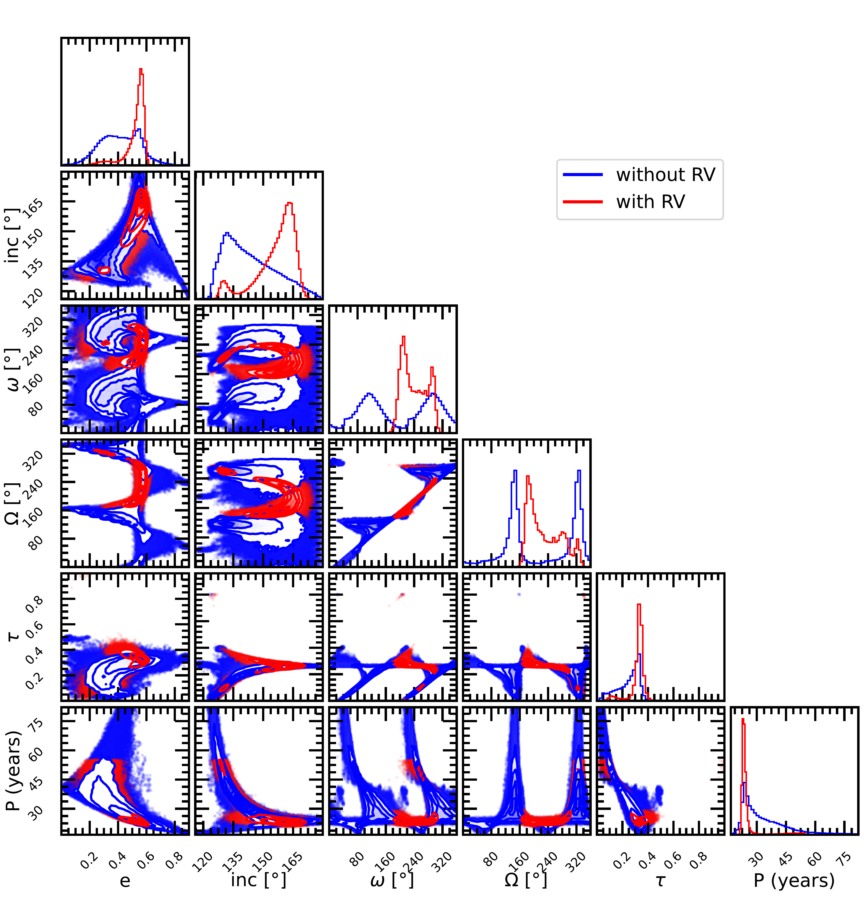
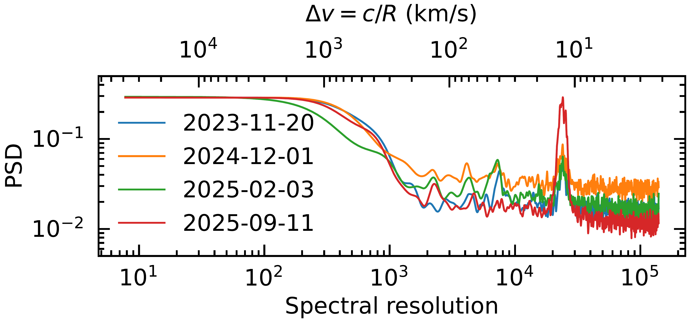

$\newcommand{\ensuremath}{}$
$\newcommand{\xspace}{}$
$\newcommand{\object}[1]{\texttt{#1}}$
$\newcommand{\farcs}{{.}''}$
$\newcommand{\farcm}{{.}'}$
$\newcommand{\arcsec}{''}$
$\newcommand{\arcmin}{'}$
$\newcommand{\ion}[2]{#1#2}$
$\newcommand{\textsc}[1]{\textrm{#1}}$
$\newcommand{\hl}[1]{\textrm{#1}}$
$\newcommand{\footnote}[1]{}$
$\newcommand{\rev}[1]{\textcolor{\textbf{purple}}{#1}}$
$\newcommand{\MSun}{\ensuremath{M_{\odot}}\xspace}$
$\newcommand{\MJup}{\ensuremath{M_{\mathrm{Jup}}}\xspace}$
$\newcommand{\RJup}{\ensuremath{R_{\mathrm{Jup}}}\xspace}$
$\newcommand{\Teff}{\ensuremath{T_{\mathrm{e\!f\!f}}}\xspace}$
$\newcommand{\logg}{\ensuremath{\log g}\xspace}$
$\newcommand{\met}{\ensuremath{\mathrm{[Fe/H]}}\xspace}$
$\newcommand{\co}{\ensuremath{\mathrm{C/O}}\xspace}$
$\newcommand{\mic}{\ensuremath{\upmu\mathrm{m}}\xspace}$
$\newcommand{\as}{\hbox{^{\prime\prime}}\xspace}$
$\newcommand{\vsini}{\hbox{v \sin i}\xspace}$
$\newcommand{\loD}{\hbox{\lambda/D}\xspace}$
$\newcommand{◦e}{◦ee\xspace}$
$\newcommand{◦eC}{◦ee C\xspace}$
$\newcommand{\microrad}{\ensuremath{\upmu\mathrm{rad}}\xspace}$
$\newcommand{\kms}{\ensuremath{\mathrm{km} \mathrm{s}^{-1}}\xspace}$
$\newcommand{\crires}{CRIRES\xspace}$
$\newcommand{\hirise}{HiRISE\xspace}$
$\newcommand{\ms}{\ensuremath{\mathrm{m} \mathrm{s}^{-1}}\xspace}$
$\newcommand{\formosa}{\texttt{ForMoSA}\xspace}$
$\newcommand{\uves}{UVES\xspace}$
$\newcommand{\jwst}{\textit{James Webb} Space Telescope\xspace}$
$\newcommand{\arraystretch}{1.5}$
$\newcommand{\arraystretch}{1.2}$

# Eccentric and cool: a high-spectral resolution view of\\51 Eri b with VLT/HiRISE$\footnote{Based on observations made with ESO Telescopes at the La Silla Paranal Observatory under programmes ID 112.25FU, 114.2712, and 115.284P}$

<mark>Appeared on: 2026-02-12</mark> -  _9 pages, 8 figures, Accepted for publication in A&A_

A. Denis, et al. -- incl., <mark>G. Chauvin</mark>, <mark>M. Ravet</mark>, <mark>B. Rajpoot</mark>

**Abstract:** Discovered almost 10 years ago, the giant planet 51 Eridani b is one of the least separated ( $\approx$ 0.2 $\as$ ) and faintest (J $\approx$ 19.74 mag) directly imaged exoplanets known to date.  Its atmospheric properties have been thoroughly investigated through low- and medium-resolution spectroscopic observations, enabling robust characterization of the planet’s bulk parameters. However, the planet’s intrinsically high contrast renders high-resolution spectroscopic observations difficult, despite their potential to yield key measurements essential for a more comprehensive characterization. This study seeks to constrain the planet’s radial velocity, enabling a full 3D orbital solution when integrated with previous measurements. We have obtained 4 high-contrast high-resolution (R $\approx$ 140 000) spectroscopic datasets of the planet, collected over a two-year interval with the HiRISE visitor instrument at the VLT to derive the planet's radial velocity. Using self-consistent models of atmosphere, we were able to derive the radial velocity of the planet at each of the 4 epochs. These radial velocity measurements were then used in combination with all existing relative astrometry in order to constrain the orbit of the planet.Our radial velocity measurements allow us to break the degeneracy along the line of sight, making it now possible the unambiguous interpretation of the phase curve of the companion. We further constrain the orbital parameters, particularly the eccentricity, for which we derive e = $0.55_{-0.07}^{+0.03}$ . The relatively high eccentricity indicates that the system has experienced dynamical interactions induced by an external perturber. We place constraints on the mass and semi-major axis of a hypothetical, unseen outer planet capable of producing the observed high eccentricities.

**Figure 4. -** Orbit of 51 Eri b. The left panel shows the predicted RV of the planet as a function of time. The HiRISE RV measurements are overplotted as red dots, along with the rejected orbits in grey from the addition of the RV measurements. The middle panel is a zoomed-in version of the left panel around our RV measurements. In particular, we see that a future RV measurement at the end of 2026 should enable us to reject the last low-eccentric orbital populations. This is illustrated by the dashed vertical line overplotted at the end of 2026. The right panel displays the astrometric orbit of the planet inferred, including the line of nodes and the phase of the planet. The red crosses represent the estimate of the position of the planet during the $\hirise$ observations. (*fig:astrometry*)

**Figure 6. -** Posterior distribution of the inferred parameters of 51 Eri b. The posterior distribution in red was obtained including all available relative astrometry measurements. The posterior distribution in blue includes the HiRISE RV measurements. (*fig:corner*)

**Figure 2. -** Power-spectral density (PSD) of the data filtered from the stellar speckles estimate of our four epochs. The PSD was lowpass filtered in order to focus on its low-frequency content. A secondary axis is displayed at the top, which corresponds to an equivalent velocity. A peak is visible around a resolution of 25 000 for each epoch, which corresponds to $\sim$12 $\kms$. This peak is particularly prominent in the data from the last epoch, when the planet was closer to the host star. (*fig:fringes*)

