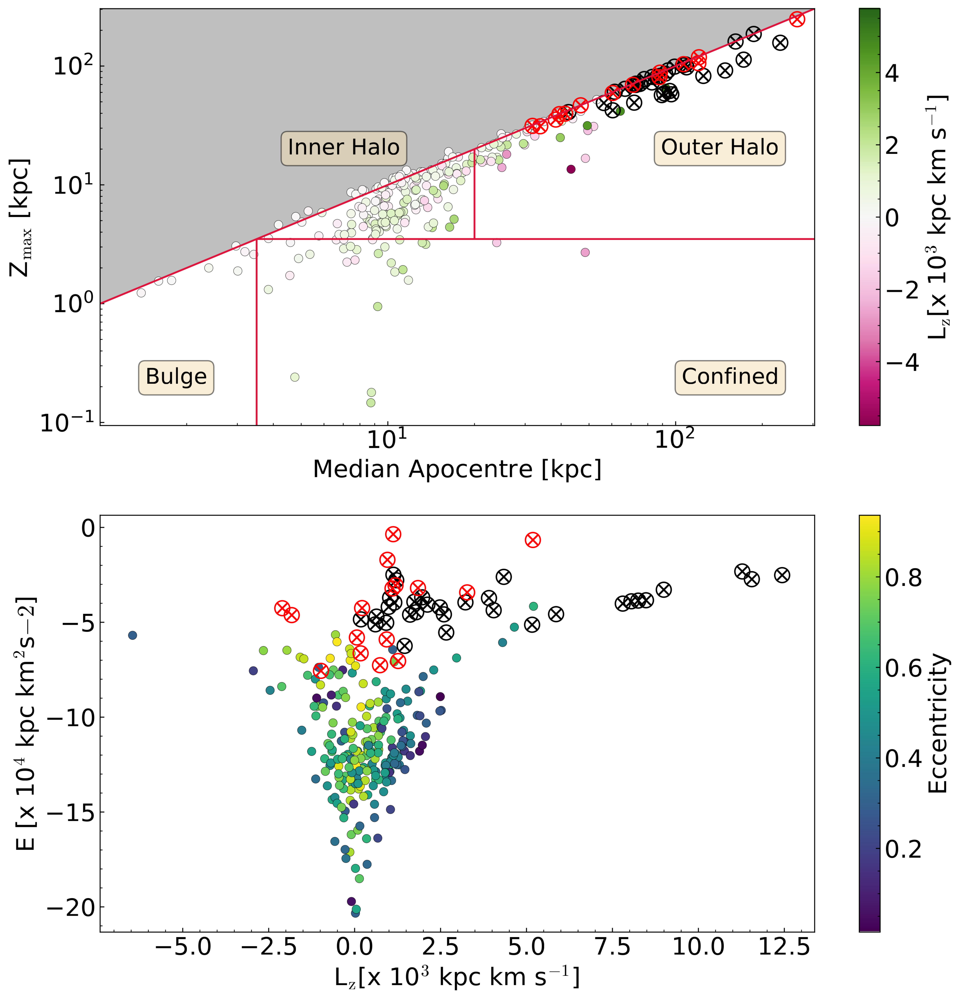

$\newcommand{\ensuremath}{}$
$\newcommand{\xspace}{}$
$\newcommand{\object}[1]{\texttt{#1}}$
$\newcommand{\farcs}{{.}''}$
$\newcommand{\farcm}{{.}'}$
$\newcommand{\arcsec}{''}$
$\newcommand{\arcmin}{'}$
$\newcommand{\ion}[2]{#1#2}$
$\newcommand{\textsc}[1]{\textrm{#1}}$
$\newcommand{\hl}[1]{\textrm{#1}}$
$\newcommand{\footnote}[1]{}$
$\newcommand{\change}[1]{\textbf{#1}}$
$\newcommand{\teff}{\rm T_{eff}}$
$\newcommand{\logg}{\log(g)}$
$\newcommand{\feh}{\rm[Fe/H]}$
$\newcommand{\mh}{\rm[M/H]}$
$\newcommand{\micro}{\xi_{\rm micro}}$
$\newcommand{\macro}{\xi_{\rm macro}}$
$\newcommand{\micron}{\mu}$
$\newcommand{\loggf}{\log(gf)}$
$\newcommand{\exc}{E_{\rm low}}$
$\newcommand{\apoteff}{\textsc{TEFF}}$
$\newcommand{\apologg}{\textsc{LOGG}}$
$\newcommand{\apofeh}{\textsc{FE\_H}}$
$\newcommand{\apomh}{\textsc{M\_H}}$
$\newcommand{\apomhuncal}{\textsc{M\_H}_{\rm unc.}}$
$\newcommand{\apoalpha}{\textsc{ALPHA\_M}}$
$\newcommand{\apoparam}{\textsc{PARAM}}$
$\newcommand{\apofparam}{\textsc{FPARAM}}$
$\newcommand{\starbad}{\textsc{STAR\_BAD}}$
$\newcommand{\chibad}{\textsc{CHI2\_BAD}}$
$\newcommand{\metalsbad}{\textsc{METALS\_BAD}}$
$\newcommand{\metalswarn}{\textsc{METALS\_WARN}}$
$\newcommand{\RCG}{\rm R_{GC}}$

# The metal-poor tail of the APOGEE survey: I. Uncovering $\feh < -2.5$  stars from the inner Galaxy to the Magellanic Clouds 

<mark>Appeared on: 2026-02-12</mark> - 

M. Montelius, et al. -- incl., <mark>N. Martin</mark>

**Abstract:** The most metal-poor stars in our Galaxy contain important clues of its earliest history, particularly those occupying the inner regions of the Galaxy. In the search for such metal-poor stars, large spectroscopic surveys are an invaluable tool. However, the spectra of metal-poor stars can be difficult to analyse because of the relative lack of available lines, which can also lead to misclassification. We aim to identify the stars observed by the APOGEE survey that are below the metallicity limit of APOGEE's analysis. For the highest confidence candidates, we classify the orbital properties of the stars to investigate whether their orbital distribution matches what we would expect for stars that are this metal poor and to select especially interesting targets for spectroscopic follow-up purposes. We examined the properties derived by APOGEE for metal-poor stars from the literature to find signatures of stars with a metallicity below the range of the grid used for spectral analysis. Once identified within APOGEE, we computed the orbits of our metal-poor candidates using AGAMA. The calibrated APOGEE stellar parameters provide a clear signature of the most metal-poor stars in the survey, indicated by null values for their metallicities while having effective temperatures and surface gravities determined by the pipeline. From comparison with the literature, we find that, within a temperature range of 3700 - 6700 K and above a threshold of S/N > 30, the vast majority of APOGEE stars without calibrated metallicities are very metal poor. Additional cleaning by visual inspection of the spectra improved the purity of the sample further. The radial velocities provided by APOGEE, Gaia DR3 positions and astrometry along with spectrophotometric distances derived in this work allowed for the computation of their orbits. In this work, we carefully selected 289 very metal-poor red giant stars (likely below $\feh$ = -2.5) from the APOGEE results. Our sample contains 16 very metal-poor member candidates of the Magellanic Clouds, 14 very metal-poor stars with orbits confined to the inner Galaxy, and 13 inner Galaxy halo interlopers. These samples significantly add to the very metal-poor stars known in these regions and allow for a more detailed picture of early chemical evolution across different environments.

**Figure 13. -** 
    Left panel: Kiel diagram showing a BASTI isochrone corresponding to $\mh = -2.5$ and an age of 10 Gyr in black. Stars from the high confidence sample with $\frac{\pi}{\Delta\pi}>5$ to which distances have been determined are shown colour-coded by their offset from the distance determined by parallax. Right panel: Plot of the difference between our distances and the parallax distances plotted against parallax distance for the same stars as the left panel.  (*fig:AV_dist_comp*)

**Figure 7. -** Above: Dynamical groupings following [Viswanathan, et. al (2025)](https://ui.adsabs.harvard.edu/abs/2025A&A...695A.112V). We note that we used the median apocentres, which (due to the propagated uncertainties in the orbit integration) causes a bit of scatter around the diagonal line.
    Below: Energy versus the z component of the angular momentum. Likely members of a dwarf galaxies based on classifications from [Battaglia, et. al (2022)](https://ui.adsabs.harvard.edu/abs/2022A&A...657A..54B) have been marked with crossed out circles (red for Magellanic Cloud members, black for other satellite galaxies) as their orbits in a Milky Way potential cannot be trusted.  (*fig:dyn_group*)

**Figure 14. -** Same comparisons as in Figure \ref{fig:AV_dist_comp} but for the _StarHorse_ distances instead of our work. The reduction in sample size is due to stars lacking _StarHorse_ distances. (*fig:SH_dist_comp*)

