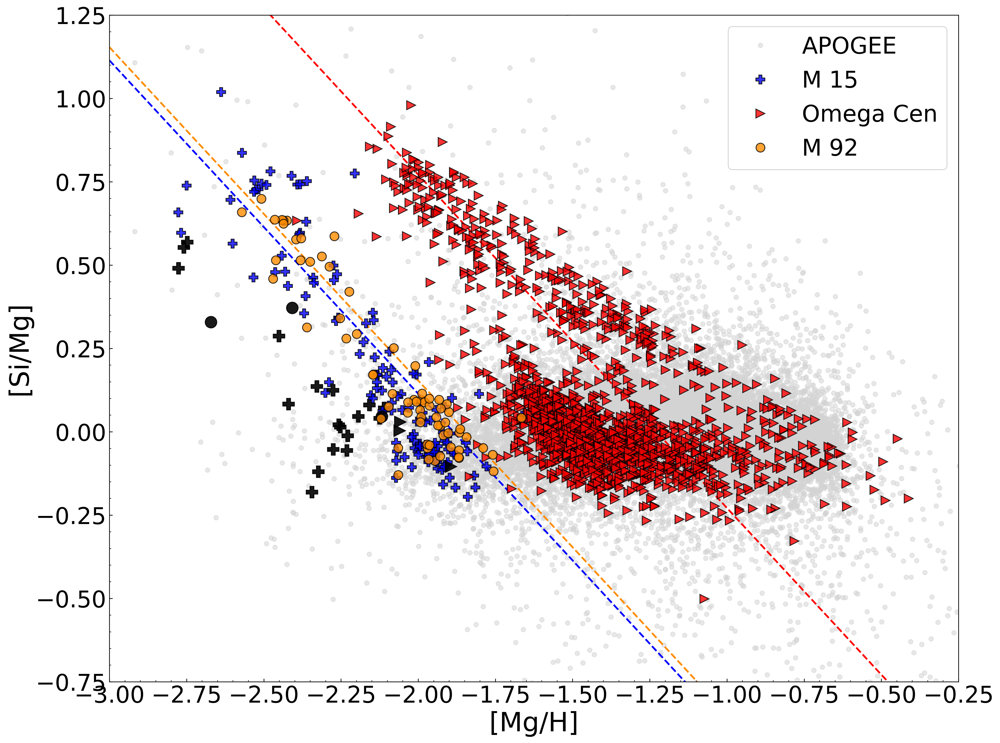
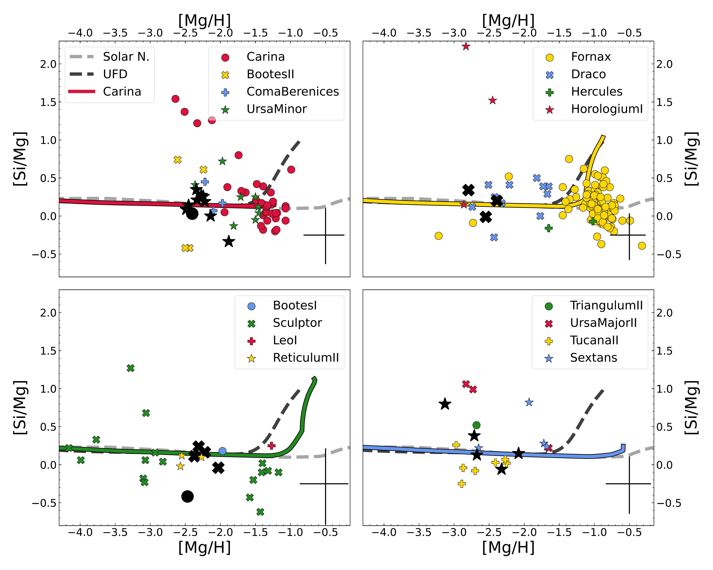
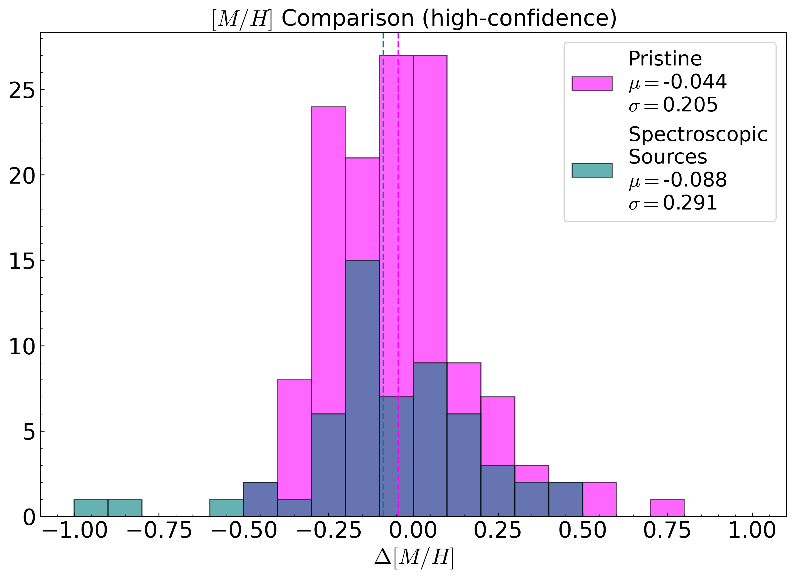

$\newcommand{\ensuremath}{}$
$\newcommand{\xspace}{}$
$\newcommand{\object}[1]{\texttt{#1}}$
$\newcommand{\farcs}{{.}''}$
$\newcommand{\farcm}{{.}'}$
$\newcommand{\arcsec}{''}$
$\newcommand{\arcmin}{'}$
$\newcommand{\ion}[2]{#1#2}$
$\newcommand{\textsc}[1]{\textrm{#1}}$
$\newcommand{\hl}[1]{\textrm{#1}}$
$\newcommand{\footnote}[1]{}$
$\newcommand{\change}[1]{\textbf{#1}}$
$\newcommand{\teff}{\rm T_{eff}}$
$\newcommand{\logg}{\log(g)}$
$\newcommand{\feh}{\rm[Fe/H]}$
$\newcommand{\mh}{\rm[M/H]}$
$\newcommand{\micro}{\xi_{\rm micro}}$
$\newcommand{\macro}{\xi_{\rm macro}}$
$\newcommand{\micron}{\mu}$
$\newcommand{\loggf}{\log(gf)}$
$\newcommand{\exc}{E_{\rm low}}$
$\newcommand{\apoteff}{\textsc{TEFF}}$
$\newcommand{\apologg}{\textsc{LOGG}}$
$\newcommand{\apofeh}{\textsc{FE\_H}}$
$\newcommand{\apomh}{\textsc{M\_H}}$
$\newcommand{\apomhuncal}{\textsc{M\_H}_{unc.}}$
$\newcommand{\apoalpha}{\textsc{ALPHA\_M}}$
$\newcommand{\apoparam}{\textsc{PARAM}}$
$\newcommand{\apofparam}{\textsc{FPARAM}}$
$\newcommand{\starbad}{\textsc{STAR\_BAD}}$
$\newcommand{\chibad}{\textsc{CHI2\_BAD}}$
$\newcommand{\metalsbad}{\textsc{METALS\_BAD}}$
$\newcommand{\metalswarn}{\textsc{METALS\_WARN}}$

# The metal-poor tail of the APOGEE survey: II. Spectral analysis of Mg and Si in very metal-poor APOGEE spectra

<mark>Appeared on: 2026-02-12</mark> -  _Accepted for publication in A&A_

M. Montelius, et al. -- incl., <mark>N. Martin</mark>

**Abstract:** Very metal-poor stars are important tracers of the early chemical evolution history of the Milky Way. Infrared H-band spectroscopic surveys, such as APOGEE, are less affected by extinction in the more dust-obscured environments of our Galaxy. However, H-band spectra contain very limited spectral information for stars at the most metal-poor tail ( [ Fe/H ] < -2.5) because the available Fe lines in FGK stars in this wavelength range are weak. The first paper in this series successfully identified a sample of 327 very metal-poor stars (with [ Fe/H ] $< -2$ ) from the APOGEE database, 289 of which are on the red giant branch. The spectra of these stars were not properly analysed by the APOGEE main pipeline because they are very metal poor. In this work, we measure metallicities for these stars using the abundances of the elements Mg and Si. We demonstrate that the absorption lines of the elements Mg and Si are of good quality despite the challenging combination of (low) metallicity, wavelength regime, spectral resolution, and signal-to-noise ratios available for these spectra. A specialised pipeline was designed to measure the abundance of Mg and Si in APOGEE spectra and  yielded a robust estimate of the overall metallicity. In order to provide reliable measurements, we tested three different sets of assumptions for Mg and Si enhancement. We present Mg and Si abundances as well as overall metallicities for 327 stars, all of which had previously gotten null values from the main APOGEE pipeline for either the calibrated [ M/H ] or [ Fe/H ] . The typical uncertainties for our measurements are 0.2 dex. We found five stars in our sample with unusual [ Si/Mg ] abundances higher than 0.5, and we connect this signature to globular cluster stars, and this might be related to specific supernova events. Our data suggest a concentration of high [ Si/Mg ] stars in the Sextans dwarf galaxy. Other dwarf galaxies are found to agree well with results in the literature. Our derived metallicities range between $-3.1\leq[M/H]\leq-2.25$ , thereby pushing the metal-poor tail of APOGEE results down by 0.6 dex.

**Figure 4. -** [Si/Mg] vs. [Mg/H] for the GC stars in our sample (shown in black), along with APOGEE abundances for the same GCs (shown with the same symbols as our measurements). The dotted lines indicate y=x lines for each cluster that match the cluster stars at high [Si/Mg] values. (*fig:GlobCluster*)

**Figure 5. -** [Si/Mg] for stars from our sample in various dwarf galaxies (as identified by the criteria of \cite{Battaglia2022DG}; black symbols) supplemented with SAGA dwarf galaxy members according to the same criteria. Only measurements from high-resolution spectra are shown. Chemical evolution models for the Solar neighbourhood and a UFD are shown in all panels, with dedicated models for Carina, Fornax, Sculptor and Sextans shown in their respective panels. (*fig:SAGA_Si_Mg*)

**Figure 2. -** Residual plot for estimated metallicities against photometric and spectroscopic metallicities, shown as a histogram. The means are shown as dashed lines, and given along with the standard deviations.  (*fig:comparisons*)

