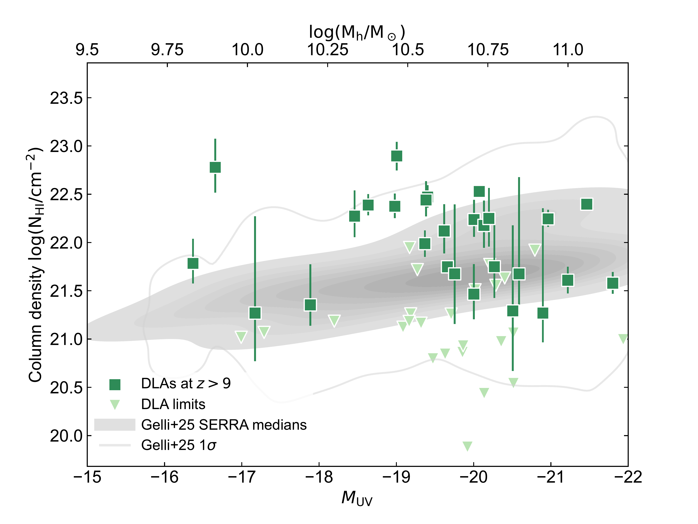
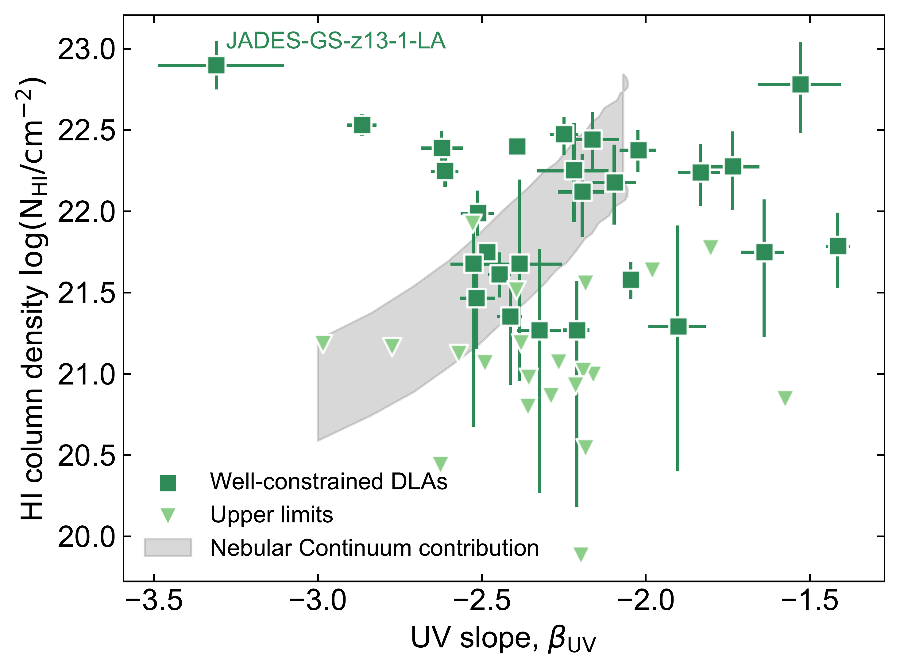

$\newcommand{\ensuremath}{}$
$\newcommand{\xspace}{}$
$\newcommand{\object}[1]{\texttt{#1}}$
$\newcommand{\farcs}{{.}''}$
$\newcommand{\farcm}{{.}'}$
$\newcommand{\arcsec}{''}$
$\newcommand{\arcmin}{'}$
$\newcommand{\ion}[2]{#1#2}$
$\newcommand{\textsc}[1]{\textrm{#1}}$
$\newcommand{\hl}[1]{\textrm{#1}}$
$\newcommand{\footnote}[1]{}$
$\newcommand{\hi}{H {\textsc{i}}}$
$\newcommand{\hii}{H {\textsc{ii}}}$
$\newcommand{\nii}{N {\textsc{ii}}}$
$\newcommand{\oiii}{O {\textsc{iii}}}$
$\newcommand{\oii}{O {\textsc{ii}}}$
$\newcommand{\cii}{C {\textsc{ii}}}$
$\newcommand{\neiii}{Ne {\textsc{iii}}}$
$\newcommand{\niv}{N {\textsc{iv}}}$
$\newcommand{\civ}{C {\textsc{iv}}}$
$\newcommand{\heii}{He {\textsc{ii}}}$
$\newcommand{\niii}{N {\textsc{iii}}}$
$\newcommand{\ciii}{C {\textsc{iii}}}$
$\newcommand{\lya}{Ly\alpha}$
$\newcommand{\jwst}{{\em JWST}}$
$\newcommand{\alma}{{\em ALMA}}$

# Characterising Ly$\alpha$ damping wings at the onset of reionisation: Evidence for highly efficient star formation driven by dense, neutral gas in UV-bright galaxies at $z>9$

<mark>Appeared on: 2026-02-13</mark> -  _Submitted to A&A_

C. L. Pollock, et al. -- incl., <mark>F. Walter</mark>

**Abstract:** One of the major conundrums in contemporary extragalactic astrophysics is the apparent overabundance of a remarkable population of UV-bright galaxies at redshifts $z\gtrsim 9$ .  We analyse  galaxies spectroscopically observed by $\jwst$ /NIRSpec Prism and confirmed to lie at $z>9$ , with sufficient signal-to-noise to carefully model their rest-frame UV to optical continua and line emission. In particular, we model the damped Lyman- $\alpha$ (Ly $\alpha$ ) absorption (DLA) features of each galaxy to place observational constraints on the gas assembly of neutral atomic hydrogen ( $\hi$ ) onto the galaxy halos at the onset of cosmic reionisation.  Based on the derived $\hi$ column densities and star-formation rate (SFR) surface densities, we show that all galaxies are highly efficient at forming stars on rapid $\sim 10-100 $ Myr depletion timescales, greatly in excess compared to the canonical local universe Kennicutt-Schmidt relation and predictions from state-of-the-art galaxy formation simulations. The dense $\hi$ gas appears to also drive the offset from the fundamental-metallicity relation of these galaxies though its dust-to-gas ratio is seemingly consistent with values derived for local galaxies except for the lowest metallicity sight-lines.  Our results provide the first robust observational constraints on the impact of pristine $\hi$ gas on early galaxy assembly, and imply that a combination of highly efficient star formation and low dust obscuration can likely explain the UV-brightness of galaxies at cosmic dawn.

**Figure 5. -** _Left:_ Example of UV emission line and DLA fitting for JADES-GS-z13-0 (DJA ID 3215\_20128771) at $z=12.85$. The NIRSpec/Prism spectrum and associated error are shown in green. The marked UV emission lines were modelled and then superimposed on the intrinsic spectrum before modelling the DLA (solid black line). In the inset, we show a zoom on the Ly$\alpha$ region, with the DLA+IGM model as a solid line, and with 100\% neutral IGM only ($\mathrm{x_{\rm HI}}=1.0$) as a dashed line. _Right:_ Corner plot of the posterior distributions for the DLA+IGM model, with median, 16th and 84th percentiles marked. (*fig:DLAex*)

**Figure 3. -** Measured UV magnitude and column density. Halo masses for our objects are derived from UV magnitudes \citep[][no dust model]{Mason23}. The well-constrained column densities of our sample are consistent with results from _SERRA_ simulations  ([Gelli, et. al 2025](https://ui.adsabs.harvard.edu/abs/2025arXiv251001315G)) . The grey contours represent the average column density of 100 galaxies over random sight-lines, with the 1$\sigma$ error region also shown, representing the scatter across sightlines in simulations. (*fig:Mhalo*)

**Figure 1. -** Measured $\beta_{UV}$ slope and column density $\mathrm{log}(N_{\rm HI}/ \rm cm^{-2})$ for the galaxy sample. The green squares and triangles again represent the well-constrained and upper limits for column density respectively, with the grey shaded region representing possible high nebular continuum where two-photon emission may be masquerading as a DLA  ([Katz, et. al 2025](https://ui.adsabs.harvard.edu/abs/2025OJAp....8E.104K)) . (*fig:beta_NHI*)

