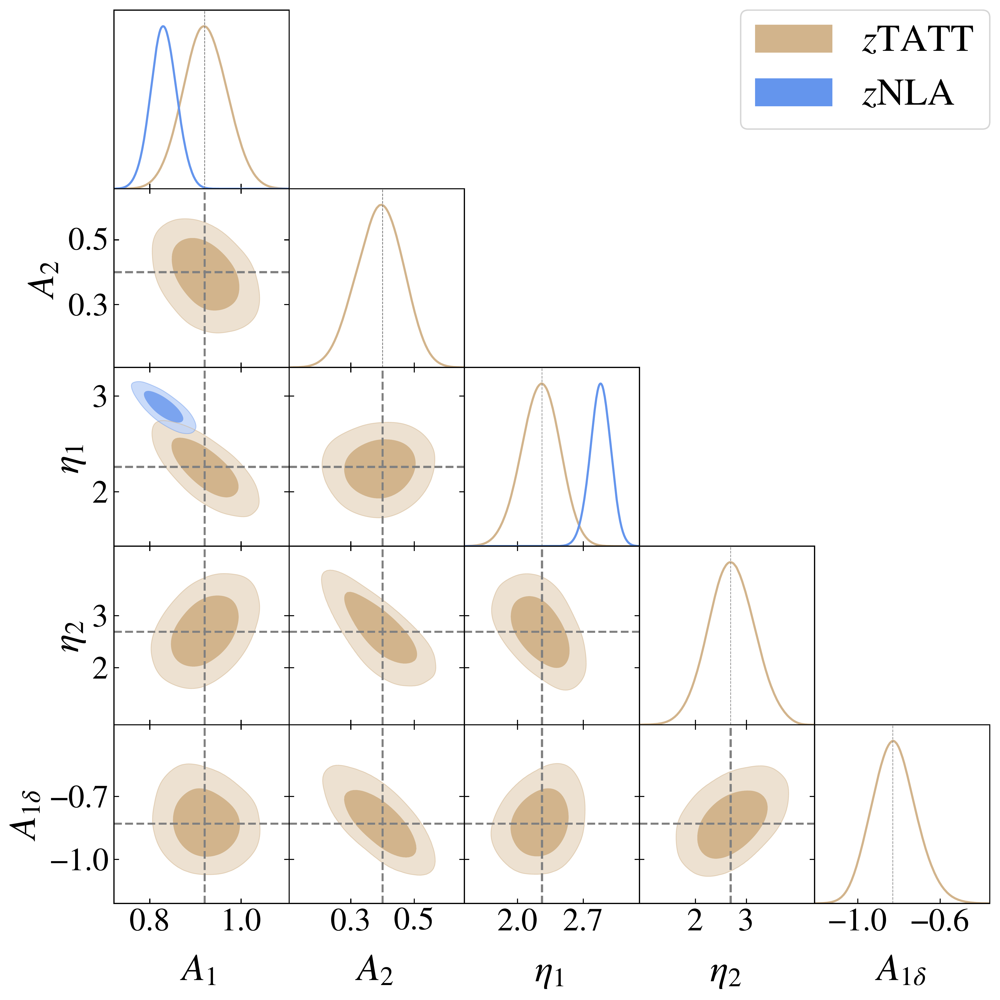
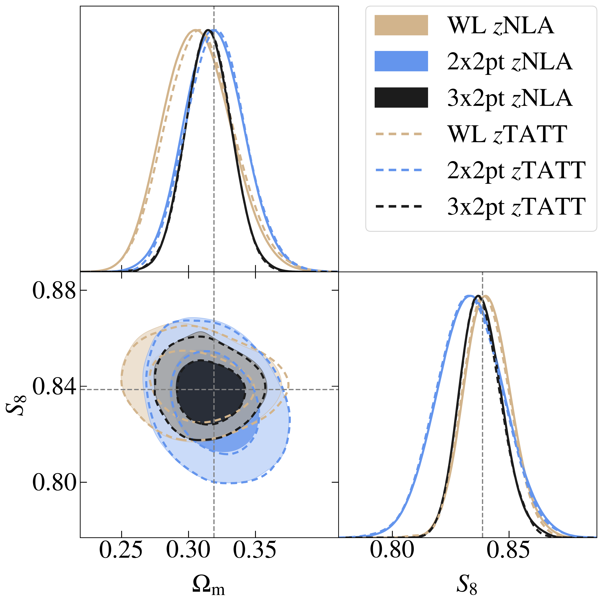

$\newcommand{\ensuremath}{}$
$\newcommand{\xspace}{}$
$\newcommand{\object}[1]{\texttt{#1}}$
$\newcommand{\farcs}{{.}''}$
$\newcommand{\farcm}{{.}'}$
$\newcommand{\arcsec}{''}$
$\newcommand{\arcmin}{'}$
$\newcommand{\ion}[2]{#1#2}$
$\newcommand{\textsc}[1]{\textrm{#1}}$
$\newcommand{\hl}[1]{\textrm{#1}}$
$\newcommand{\footnote}[1]{}$
$\newcommand{\todo}[1]{{\sffamily\itshape\tiny[\ignorespaces #1]}}$
$\newcommand{\orcid}[1]$
$\newcommand\itt{#1}$
$\newcommand\itc{#1}$
$\newcommand\dnt{#1}$

# $\Euclid$ preparation: Impact of galaxy intrinsic alignment modelling choices on $\Euclid$ $3\times 2$ pt cosmology

<mark>Appeared on: 2026-02-19</mark> -  _23 pages, 16 figures, submitted to A&A_

E. Collaboration, et al. -- incl., <mark>K. Jahnke</mark>

**Abstract:** The $\Euclid$ galaxy survey will provide unprecedented constraints on cosmology, but achieving unbiased results will require an optimal characterisation and mitigation of systematic effects. Among these, the $\gls{ia}$ of galaxies are one of the dominant contaminants of the $\gls{wl}$ and $\gls{ggl}$ probes. In this work, we assess $\gls{ia}$ modelling choices for $\Euclid$ DR1 $3\times 2$ pt analyses by comparing the performance of the two most commonly used $\gls{ia}$ models, $\gls{nla}$ and $\gls{tatt}$ , along with several variations. Our analyses combine three perspectives: i) the constraining power on the $\gls{ia}$ and cosmological parameters for each $\gls{ia}$ model, ii) the bias that results when the $\gls{ia}$ analysis model differs from the model used to generate the synthetic data vector, and iii) the degeneracies between $\gls{ia}$ and $\gls{photo-z}$ nuisance parameters. Among the $\gls{ia}$ models analysed, the redshift-dependent TATT model ( $\tattz$ ) provides the most flexible description of $\gls{ia}$ , with a similar constraining power compared to simpler $\gls{ia}$ models, making it a well-motivated choice for $\Euclid$ DR1 $3\times 2$ pt analyses.

**Figure 3. -** \gls{ia} constraints for the measured Flagship $C_{\ell}$ described in Sect. \ref{sec:IA_values_FS} when using the \tattz(tan) and the \nlaz(blue) \gls{ia} models. The dashed lines correspond to the maximum of the posterior distributions of the \tattz parameters, which are used to generate the synthetic \glspl{dv} in Sect. \ref{sec:generation_synt_DVs}. (*fig:IA_values_FS*)

**Figure 9. -** \gls{ia}*(left)* and cosmological parameters *(right)* constraints for \nlaz(blue) and \tattz(tan) at different scale cuts in the \gls{wl}$C_{\ell}$, $k_{\rm{max}}=1 h\rm{Mpc}^{-1}$(unfilled) and $k_{\rm{max}}=3 h\rm{Mpc}^{-1}$(filled). The dashed lines indicate the fiducial values of the parameters. The tan contours on the right plot are not well distinguished because they overlap with the blue ones. (*fig:TATT_NLA_scale_cuts*)

**Figure 4. -** Constraints on $S_{8}$ and $\Omega_{\rm{m}}$ for \nlaz(filled contours) and \tattz(unfilled contours), and for different combinations of cosmological probes: WL (tan), $2\times 2$ pt (blue), and $3\times 2$ pt (black). The dashed lines indicate the fiducial values of the parameters. (*fig:constraining_power_different_probes*)

