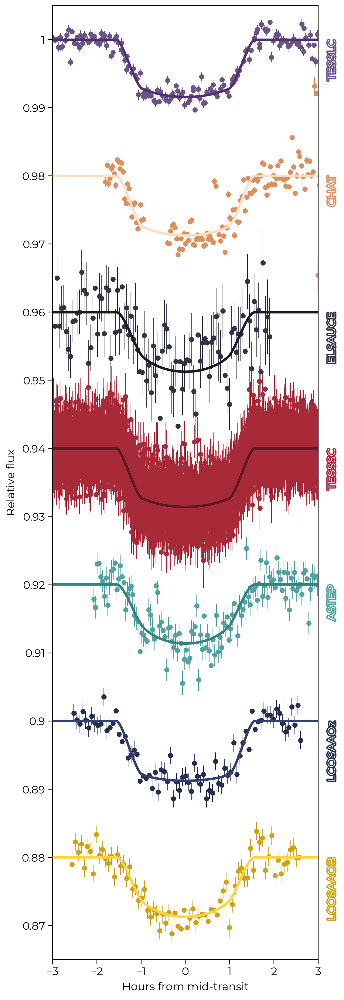
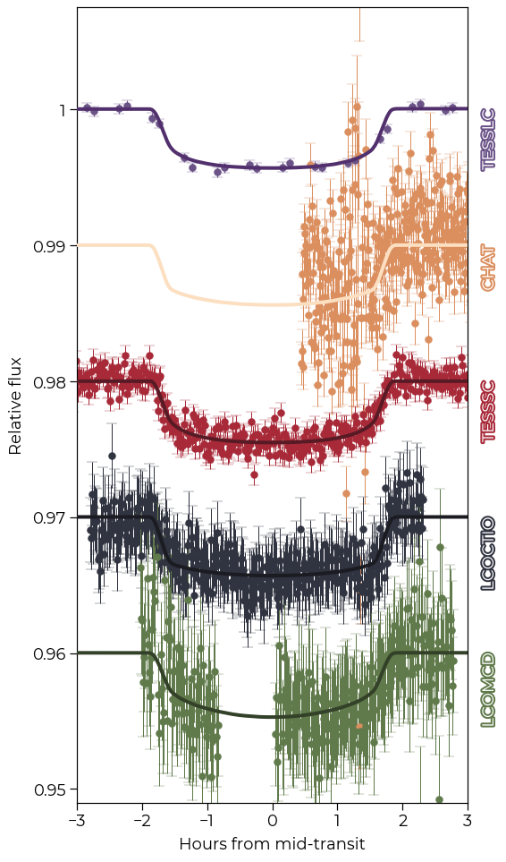

$\newcommand{\ensuremath}{}$
$\newcommand{\xspace}{}$
$\newcommand{\object}[1]{\texttt{#1}}$
$\newcommand{\farcs}{{.}''}$
$\newcommand{\farcm}{{.}'}$
$\newcommand{\arcsec}{''}$
$\newcommand{\arcmin}{'}$
$\newcommand{\ion}[2]{#1#2}$
$\newcommand{\textsc}[1]{\textrm{#1}}$
$\newcommand{\hl}[1]{\textrm{#1}}$
$\newcommand{\footnote}[1]{}$
$\newcommand{\feh}{\ensuremath{{\rm[Fe/H]}}}$
$\newcommand{\teff}{\ensuremath{T_{\rm eff}}}$
$\newcommand{\teq}{\ensuremath{T_{\rm eq}}}$
$\newcommand{\logg}{\ensuremath{\log{g}}}$
$\newcommand{\lightkurve}{\texttt{lightkurve}}$
$\newcommand{\astrocut}{\texttt{astrocut}}$
$\newcommand{\astroquery}{\texttt{astrocut}}$
$\newcommand{\tesseract}{\texttt{tesseract}}$
$\newcommand{\juliet}{\texttt{juliet}}$
$\newcommand{\zaspe}{\texttt{ZASPE}}$
$\newcommand{\ceres}{\texttt{CERES}}$
$\newcommand{\tess}{\textit{TESS}}$
$\newcommand{\vsini}{\ensuremath{v \sin{i}}}$
$\newcommand{\kms}{\ensuremath{{\rm km s^{-1}}}}$
$\newcommand{\mjup}{\ensuremath{{\rm M_{J}}}}$
$\newcommand{\mearth}{\ensuremath{{\rm M}_{\oplus}}}$
$\newcommand{\mplanet}{\ensuremath{{\rm M_P}}}$
$\newcommand{\rjup}{\ensuremath{{\rm R_J}}}$
$\newcommand{\rplanet}{\ensuremath{{\rm R_P}}}$
$\newcommand{\rstar}{\ensuremath{{\rm R}_{\star}}}$
$\newcommand{\mstar}{\ensuremath{{\rm M}_{\star}}}$
$\newcommand{\lstar}{\ensuremath{{\rm L}_{\star}}}$
$\newcommand{\rsun}{\ensuremath{{\rm R}_{\odot}}}$
$\newcommand{\msun}{\ensuremath{{\rm M}_{\odot}}}$
$\newcommand{\lsun}{\ensuremath{{\rm L}_{\odot}}}$
$\newcommand{\rhoplanet}{\ensuremath{{\rm \rho_P}}}$
$\newcommand{\gccm}{\ensuremath{\mathrm{g} \mathrm{cm}^{-3}}}$
$\newcommand{\PpA}{\ensuremath{10.057716 	 	 ^{+0.000016} 	  _{-0.000016}}}$
$\newcommand{\tcpA}{\ensuremath{2458466.4743	 ^{+0.0017} 	  _{-0.0018}}}$
$\newcommand{\muHARPSA}{\ensuremath{16.6492 	 	 ^{+0.0009} 	  _{-0.0009}}}$
$\newcommand{\muFEROSA}{\ensuremath{16.6149 	 	 ^{+0.0022} 	  _{-0.0023}}}$
$\newcommand{\sigmawrvFEROSA}{\ensuremath{0.0100 	 	 ^{+0.0023} 	  _{-0.0019}}}$
$\newcommand{\sigmawrvHARPSA}{\ensuremath{0.0030 	 	 ^{+0.0009} 	  _{-0.0007}}}$
$\newcommand{\apA}{\ensuremath{19.54 	 	 ^{+0.23} 	  _{-0.32}}}$
$\newcommand{\rhoA}{\ensuremath{1394 	 	 ^{+50} 	  _{-67}}}$
$\newcommand{\qaTESSA}{\ensuremath{0.66 	 	 ^{+0.24} 	  _{-0.34}}}$
$\newcommand{\GPrhoTESSLCA}{\ensuremath{0.100 	 	 ^{+0.026} 	  _{-0.023}}}$
$\newcommand{\GPsigmaTESSLCA}{\ensuremath{269 	 	 ^{+27} 	  _{-26}}}$
$\newcommand{\KpA}{\ensuremath{0.0124 	 	 ^{+0.0005} 	  _{-0.0005}}}$
$\newcommand{\sigmawTESSA}{\ensuremath{487 	 	 ^{+15} 	  _{-15}}}$
$\newcommand{\mfluxTESSA}{\ensuremath{-0.000010 	 	 ^{+0.000032} 	  _{-0.000032}}}$
$\newcommand{\rapA}{\ensuremath{0.593 	 	 ^{+0.083} 	  _{-0.168}}}$
$\newcommand{\rbpA}{\ensuremath{0.119 	 	 ^{+0.005} 	_{-0.008}}}$
$\newcommand{\qapA}{\ensuremath{0.71 	 	 ^{+0.21} 	  _{-0.39}}}$
$\newcommand{\qbpA}{\ensuremath{0.41 	 	 ^{+0.36} 	_{-0.29}}}$
$\newcommand{\ppA}{\ensuremath{0.0597 	 	 ^{+0.0027} 	  _{-0.0040}}}$
$\newcommand{\bpA}{\ensuremath{0.4919 	 	 ^{+0.1034} 	  _{-0.2095}}}$
$\newcommand{\epA}{\ensuremath{0}}$
$\newcommand{\incpA}{\ensuremath{88.66 	 	 ^{+0.56} 	  _{-0.27}}}$
$\newcommand{\mstA}{\ensuremath{0.956 _{-0.051}^{+0.054}}}$
$\newcommand{\rstA}{\ensuremath{0.988 _{-0.012}^{+0.012}}}$
$\newcommand{\rhostA}{\ensuremath{1.40   _{-0.14}^{+0.15}}}$
$\newcommand{\lstA}{\ensuremath{0.934 _{-0.031}^{+0.043}}}$
$\newcommand{\ageA}{\ensuremath{6.5   _{-2.1}^{+2.0}}}$
$\newcommand{\AvA}{\ensuremath{0.075   _{-0.049}^{+0.064}}}$
$\newcommand{\aA}{\ensuremath{0.0895_{-0.0021}^{+0.0022}}}$
$\newcommand{\mplA}{\ensuremath{0.123\pm 0.012}}$
$\newcommand{\rplA}{\ensuremath{0.604\pm 0.028}}$
$\newcommand{\teqA}{\ensuremath{1086\pm 19}}$
$\newcommand{\PpB}{\ensuremath{12.846185	 	 ^{+0.000008} 	  _{-0.000008}}}$
$\newcommand{\mstB}{\ensuremath{0.972 _{-0.053}^{+0.054}}}$
$\newcommand{\rstB}{\ensuremath{1.086 _{-0.012}^{+0.013}}}$
$\newcommand{\rhostB}{\ensuremath{1.07   _{-0.10}^{+0.11}}}$
$\newcommand{\lstB}{\ensuremath{1.113 _{-0.052}^{+0.054}}}$
$\newcommand{\ageB}{\ensuremath{8.4   _{-2.0}^{+2.0}}}$
$\newcommand{\AvB}{\ensuremath{0.176  _{-0.069}^{+0.073}}}$
$\newcommand{\aB}{\ensuremath{0.1063\pm 0.0026}}$
$\newcommand{\mplB}{\ensuremath{0.213\pm 0.024}}$
$\newcommand{\rplB}{\ensuremath{0.991\pm 0.044}}$
$\newcommand{\teqB}{\ensuremath{1040\pm 19}}$
$\newcommand{\teffA}{\ensuremath{5697 \pm 80}}$
$\newcommand{\loggA}{\ensuremath{4.429 \pm 0.022}}$
$\newcommand{\fehA}{\ensuremath{0.02 \pm 0.04}}$
$\newcommand{\vsiniA}{\ensuremath{2.53 \pm 0.30}}$
$\newcommand{\teffB}{\ensuremath{5696 \pm 80}}$
$\newcommand{\loggB}{\ensuremath{4.355 \pm 0.022}}$
$\newcommand{\fehB}{\ensuremath{0.10 \pm 0.04}}$
$\newcommand{\vsiniB}{\ensuremath{3.65 \pm 0.30}}$
$\newcommand{\plnameA}{TOI-883b}$
$\newcommand{\stnameA}{TOI-883}$
$\newcommand{\plnameB}{TOI-899b}$
$\newcommand{\stnameB}{TOI-899}$
$\newcommand{\rhopkep}{\ensuremath{1.154 \pm 0.045 }}$

# Two warm sub-Saturn mass planets identified from the TESS FullFrame Images$\thanks{This paper includes data gathered with the 6.5 meter Magellan Telescopes located at Las Campanas Observatory, Chile}$

<mark>Appeared on: 2026-02-19</mark> -  _18 pages, 15 figures. Submitted to A&A_

F. I. Rojas, et al. -- incl., <mark>T. Henning</mark>

**Abstract:** Characterization of warm giants is crucial to constrain giant planet formation and evolution. Measuring the mass and radius of these planets, combined with their moderated irradiation, allows us to estimate their planetary bulk composition, which is a key quantity to comprehend giant planet formation and structure. We present the discovery of two transiting warm giant planets orbiting solar-type stars from theTransiting Exoplanet Survey Satellite (TESS), which were characterized by further spectroscopic and photometric ground-based observations. We performed a joint analysis of photometric data with radial velocities to confirm and characterize $\plnameA$ and $\plnameB$ , two sub-Saturns orbiting solar-like stars. $\plnameA$ and $\plnameB$ have masses of $\mplA$ $\mjup$ and $\mplB$ $\mjup$ , radius of $\rplA$ $\rjup$ and $\rplB$ $\rjup$ , periods of 10.06 d and 12.85 d and equilibrium temperature of $\teqA$ K and $\teqB$ , respectively. While having similar masses, orbital periods and stellar host properties, these planets seem to have different internal compositions, which could point to distinct formation histories. Both planets are suitable targets for atmospheric studies to further constrain formation scenarios of planets in the Neptune-Saturn mass range.

**Figure 5. -** Vibrational stability equation of state
               $S_{\mathrm{vib}}(\lg e, \lg \rho)$.
               $>0$ means vibrational stability.
              Vibrational stability equation of state
               $S_{\mathrm{vib}}(\lg e, \lg \rho)$.
               $>0$ means vibrational stability.
              Nonlinear Model ResultsNonlinear Model ResultsSpectral types and photometry for stars in the
  region.Spectral types and photometry for stars in the
  region.List of nearby SNe used in this work.Summary for ISOCAM sources with mid-IR excess
(YSO candidates).Summary for ISOCAM sources with mid-IR excess
(YSO candidates). Sample stars with absolute magnitudecontinued. Sample stars with absolute magnitudecontinued.Complexes characterisation.Line data and abundances ...Continued. (*FigVibStab*)

**Figure 7. -** Transit data observed for $\plnameB$. The phase folded transit is plotted for both TESS long and short cadence. For CHAT and El Sauce, a single transit event is plotted. (*fig:phasedB*)

**Figure 6. -** Photometric observations and transits for $\plnameA$. In the case of TESS, both light curves are phase folded. CHAT and both from Las Cumbres Observatory are follow-up data that observed a single transit. (*fig:phasedA*)

